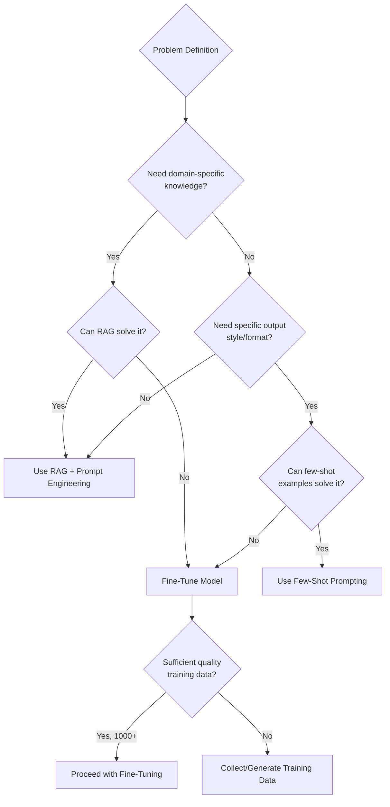

# Fine-Tuning

Fine-tuning adapts a pre-trained language model to a specific domain or task. In banking, fine-tuning is a strategic decision that can improve quality, reduce costs, and ensure data residency — but it introduces significant operational complexity.

## When to Fine-Tune vs. When Not To

### Decision Framework



### When to Fine-Tune

| Scenario | Fine-Tune? | Alternative |
|----------|-----------|-------------|
| Model needs to know bank-specific policies | No | RAG with policy documents |
| Model needs current regulatory information | No | RAG with regulatory database |
| Model must produce outputs in specific format | Maybe | Structured output / few-shot |
| Model needs to adopt bank's writing style | Yes | Fine-tune on style examples |
| Latency requirements too strict for API models | Yes | Fine-tune smaller model |
| Data cannot leave premises (residency) | Yes | Self-hosted fine-tuned model |
| Task is narrow and repetitive | Yes | Fine-tune for specialization |
| Model needs to understand internal jargon | Maybe | Fine-tune OR add to RAG context |

### Banking Use Cases Where Fine-Tuning Excels

1. **Code completion** on internal frameworks and libraries
2. **Email classification** for customer correspondence routing
3. **Transaction categorization** using bank-specific taxonomies
4. **Document classification** for internal document management
5. **Tone adaptation** for consistent customer communications
6. **Regulatory summarization** — learning to condense complex regulations

## Fine-Tuning Methods

### Full Fine-Tuning

```python
# Full fine-tuning: Update ALL model parameters
# Pros: Maximum quality improvement possible
# Cons: Extremely expensive, risk of catastrophic forgetting

# Requirements:
# - Compute: 8x A100 80GB GPUs (minimum)
# - Data: 10,000+ high-quality examples
# - Time: Days to weeks of training
# - Cost: $10,000-$100,000+ per run

# Rarely justified for banking use cases
# Prefer parameter-efficient methods below
```

### LoRA (Low-Rank Adaptation)

```python
# LoRA: Add small trainable adapter matrices
# Pros: 10-100x less compute, can swap adapters, no catastrophic forgetting
# Cons: Slightly lower quality than full fine-tuning

from peft import LoraConfig, get_peft_model
from transformers import AutoModelForCausalLM, TrainingArguments, Trainer

# Configure LoRA
lora_config = LoraConfig(
    r=16,                    # Rank — higher = more capacity but more params
    lora_alpha=32,           # LoRA scaling factor
    target_modules=["q_proj", "v_proj"],  # Which layers to adapt
    lora_dropout=0.05,       # Regularization
    bias="none",
    task_type="CAUSAL_LM",
)

# Load base model
base_model = AutoModelForCausalLM.from_pretrained(
    "meta-llama/Llama-3-8B",
    torch_dtype=torch.bfloat16,
    device_map="auto",
)

# Apply LoRA
model = get_peft_model(base_model, lora_config)
model.print_trainable_parameters()
# "trainable params: 4,194,304 || all params: 8,034,304,000 || trainable%: 0.0522"
# Only 0.05% of parameters are trainable — massive efficiency gain
```

### QLoRA (Quantized LoRA)

```python
# QLoRA: LoRA on 4-bit quantized model
# Pros: Fits on single GPU, near-LoRA quality
# Cons: Slightly slower inference, quality trade-off

from transformers import BitsAndBytesConfig
from peft import prepare_model_for_kbit_training

# 4-bit quantization config
bnb_config = BitsAndBytesConfig(
    load_in_4bit=True,
    bnb_4bit_use_double_quant=True,    # Nested quantization for efficiency
    bnb_4bit_quant_type="nf4",         # Normal Float 4-bit
    bnb_4bit_compute_dtype=torch.bfloat16,  # Compute in bfloat16
)

model = AutoModelForCausalLM.from_pretrained(
    "meta-llama/Llama-3-8B",
    quantization_config=bnb_config,
    device_map="auto",
)

model = prepare_model_for_kbit_training(model)
model = get_peft_model(model, lora_config)
# Now fits on single 24GB GPU (e.g., RTX 4090) instead of 8x A100
```

## Training Data Requirements

### Data Format

```jsonl
// Each line is one training example
{"messages": [
    {"role": "system", "content": "You are a banking assistant that categorizes transactions."},
    {"role": "user", "content": "Transaction: 'POS Purchase AMAZON.COM*AB12 Seattle WA' for $47.83"},
    {"role": "assistant", "content": "Category: Online Shopping | Subcategory: Retail | Merchant: Amazon"}
]}
{"messages": [
    {"role": "system", "content": "You are a banking assistant that categorizes transactions."},
    {"role": "user", "content": "Transaction: 'FPS Incoming Transfer from John Smith Ref: Rent payment'"},
    {"role": "assistant", "content": "Category: Income | Subcategory: Personal Transfer | Reference: Rent payment"}
]}
```

### Data Quantity Guidelines

| Method | Minimum Examples | Recommended | Optimal |
|--------|-----------------|-------------|---------|
| LoRA (simple task) | 100 | 500 | 2,000+ |
| LoRA (complex task) | 500 | 2,000 | 10,000+ |
| QLoRA | 200 | 1,000 | 5,000+ |
| Full fine-tuning | 5,000 | 20,000 | 100,000+ |

### Banking Data Considerations

```python
# CRITICAL: Training data must be representative
# but cannot contain real customer data

class TrainingDataPipeline:
    """Generate compliant training data for fine-tuning."""

    def __init__(self):
        self.pii_detector = PIIDetector()
        self.data_validator = DataValidator()

    def prepare_training_data(self, raw_examples: list) -> list:
        """Prepare training data from bank examples."""
        cleaned = []
        for example in raw_examples:
            # 1. Strip all PII
            anonymized = self._anonymize(example)

            # 2. Validate quality
            if not self.data_validator.is_valid(anonymized):
                continue

            # 3. Format for training
            formatted = self._format_for_training(anonymized)
            cleaned.append(formatted)

        # 4. Check for class balance
        self._check_balance(cleaned)

        # 5. Split train/validation/test
        return self._split(cleaned, train=0.8, val=0.1, test=0.1)

    def _anonymize(self, example: dict) -> dict:
        """Remove all PII from training example."""
        text = example["text"]
        # Replace names with placeholders
        text = self.pii_detector.replace_names(text, "[NAME]")
        # Replace account numbers
        text = self.pii_detector.replace_accounts(text, "[ACCOUNT]")
        # Replace amounts with ranges
        text = self.pii_detector.replace_amounts(text, "[AMOUNT]")
        # Replace dates
        text = self.pii_detector.replace_dates(text, "[DATE]")
        example["text"] = text
        return example
```

### Synthetic Data Generation

```python
# When real data is insufficient, generate synthetic examples

SYNTHETIC_GENERATION_PROMPT = """
Generate realistic banking transaction categorization examples.

The bank uses the following category taxonomy:
- Income: Salary, Benefits, Pension, Investment Income
- Spending: Groceries, Dining, Transport, Shopping, Bills
- Transfers: Own Account, Third Party, International
- Cash: ATM Withdrawal, Cash Deposit

Generate 20 diverse examples covering:
1. Common everyday transactions
2. Edge cases (ambiguous merchants)
3. International transactions
4. Cash transactions
5. Unusual amounts (very large, very small)

Format each as:
Transaction: "..."
Category: "..." | Subcategory: "..."
"""
```

## Training Process

### Training Loop with Evaluation

```python
from transformers import TrainingArguments, Trainer, DataCollatorForSeq2Seq

training_args = TrainingArguments(
    output_dir="./lora-banking-classifier",
    num_train_epochs=3,
    per_device_train_batch_size=4,
    gradient_accumulation_steps=4,     # Effective batch size = 16
    learning_rate=2e-4,                # LoRA uses higher LR than full FT
    lr_scheduler_type="cosine",
    warmup_ratio=0.05,
    weight_decay=0.01,
    fp16=True,
    logging_steps=10,
    eval_strategy="epoch",
    save_strategy="epoch",
    load_best_model_at_end=True,
    metric_for_best_model="eval_loss",
    save_total_limit=3,               # Keep only 3 checkpoints
)

trainer = Trainer(
    model=model,
    args=training_args,
    train_dataset=train_dataset,
    eval_dataset=val_dataset,
    data_collator=DataCollatorForSeq2Seq(tokenizer),
)

# Train
trainer.train()

# Evaluate on held-out test set
test_results = trainer.evaluate(test_dataset)
print(f"Test loss: {test_results['eval_loss']:.4f}")
```

### Monitoring Training

```python
# Key metrics to monitor during training:
# 1. Training loss: Should decrease steadily
# 2. Validation loss: Should decrease, then plateau
# 3. If validation loss increases: Overfitting — stop early

# Overfitting detection
class EarlyStoppingWithDelta:
    """Stop training if validation loss increases for N epochs."""

    def __init__(self, patience: int = 2, min_delta: float = 0.01):
        self.patience = patience
        self.min_delta = min_delta
        self.counter = 0
        self.best_loss = None

    def __call__(self, val_loss: float) -> bool:
        if self.best_loss is None:
            self.best_loss = val_loss
            return False

        if val_loss > self.best_loss + self.min_delta:
            self.counter += 1
            if self.counter >= self.patience:
                return True  # Stop training
        else:
            self.best_loss = val_loss
            self.counter = 0

        return False
```

## Model Evaluation

### Task-Specific Evaluation Metrics

```python
def evaluate_classifier(model, tokenizer, test_data: list) -> dict:
    """Evaluate fine-tuned classifier on test set."""
    predictions = []
    actuals = []

    for example in test_data:
        input_text = example["input"]
        expected = example["expected_category"]

        # Generate prediction
        inputs = tokenizer(input_text, return_tensors="pt").to("cuda")
        outputs = model.generate(**inputs, max_new_tokens=20)
        predicted = tokenizer.decode(outputs[0], skip_special_tokens=True)
        predicted = extract_category(predicted)

        predictions.append(predicted)
        actuals.append(expected)

    # Calculate metrics
    accuracy = accuracy_score(actuals, predictions)
    precision = precision_score(actuals, predictions, average="weighted")
    recall = recall_score(actuals, predictions, average="weighted")
    f1 = f1_score(actuals, predictions, average="weighted")

    # Per-category analysis
    report = classification_report(actuals, predictions, output_dict=True)

    return {
        "accuracy": accuracy,
        "precision": precision,
        "recall": recall,
        "f1": f1,
        "per_category": report,
        "confusion_matrix": confusion_matrix(actuals, predictions).tolist(),
    }
```

### Banking Acceptance Criteria

| Metric | Minimum | Target | Stretch |
|--------|---------|--------|---------|
| Accuracy | 90% | 95% | 98% |
| F1 Score | 0.88 | 0.93 | 0.96 |
| Hallucination Rate | < 5% | < 2% | < 0.5% |
| Latency (p95) | < 2s | < 1s | < 500ms |

## Deployment

### Serving Fine-Tuned Models

```python
# Option 1: vLLM (recommended for production)
# pip install vllm

from vllm import LLM, SamplingParams

llm = LLM(
    model="meta-llama/Llama-3-8B",
    adapter_path="./lora-banking-classifier",  # LoRA adapter
    tensor_parallel_size=1,
    dtype="bfloat16",
)

sampling_params = SamplingParams(
    temperature=0.0,      # Deterministic for classification
    max_tokens=50,
)

outputs = llm.generate(["Transaction: ..."], sampling_params)
```

### Adapter Swapping

```python
# Key advantage of LoRA: swap adapters without reloading base model

class MultiAdapterServer:
    """Serve multiple LoRA adapters on the same base model."""

    def __init__(self, base_model: str):
        self.llm = LLM(model=base_model, tensor_parallel_size=2)
        self.adapters = {}

    def load_adapter(self, name: str, adapter_path: str):
        """Load a LoRA adapter."""
        self.llm.load_lora_adapter(adapter_path, adapter_name=name)
        self.adapters[name] = adapter_path

    def generate(self, prompt: str, adapter: str, **kwargs) -> str:
        """Generate using specific adapter."""
        sampling_params = SamplingParams(**kwargs)
        outputs = self.llm.generate(
            prompt,
            sampling_params,
            lora_request=LoRARequest(adapter, 1, self.adapters[adapter]),
        )
        return outputs[0].outputs[0].text

# Usage
server = MultiAdapterServer("meta-llama/Llama-3-8B")
server.load_adapter("transaction-classifier", "./lora-classifier")
server.load_adapter("email-router", "./lora-email")
server.load_adapter("compliance-analyst", "./lora-compliance")

# Route to appropriate adapter based on request
result = server.generate(prompt, adapter="transaction-classifier", temperature=0.0)
```

## Common Mistakes and Anti-Patterns

### Anti-Pattern 1: Fine-Tuning to Add Knowledge

```python
# WRONG: Fine-tuning so the model "knows" bank policies
# Fine-tuning modifies behavior/style, not factual knowledge
# Policies change — you'd need to retrain constantly

# RIGHT: Use RAG for knowledge
# Fine-tune for style/format, use RAG for facts
# The model learns HOW to analyze, not WHAT the policies say
```

### Anti-Pattern 2: Training on Low-Quality Data

```python
# WRONG: Using 10,000 examples with inconsistent labels
# Garbage in, garbage out — the model learns your mistakes

# RIGHT: 500 high-quality examples > 10,000 noisy ones
# Invest in data quality: expert review, consistent labeling
# Start small, validate, then scale
```

### Anti-Pattern 3: No Baseline Comparison

```python
# WRONG: Fine-tuning without comparing to prompt engineering
# You may spend $50K fine-tuning to get 2% improvement
# that few-shot prompting would have achieved for free

# RIGHT: Always establish baseline with:
# 1. Zero-shot prompting
# 2. Few-shot prompting
# 3. RAG + prompting
# Only fine-tune if these are insufficient
```

### Anti-Pattern 4: Ignoring Model Drift

```python
# WRONG: Fine-tune once and deploy forever
# Data distributions change, quality degrades

# RIGHT: Continuous evaluation
# - Weekly evaluation on held-out test set
# - Alert if accuracy drops below threshold
# - Retrain schedule: monthly or when drift detected
```

## Interview Questions

1. When would you choose fine-tuning over RAG? Give a concrete banking example.
2. Explain the trade-off between LoRA rank and model quality.
3. How much training data do you need for a production fine-tuning project?
4. A fine-tuned model's accuracy has degraded by 5% over 3 months. What do you do?
5. How do you ensure fine-tuned models comply with data residency requirements?

## Cross-References

- [llm-fundamentals.md](./llm-fundamentals.md) — How LLMs work and training phases
- [cost-optimization.md](./cost-optimization.md) — Fine-tuning cost vs. API cost analysis
- [open-source-models/](./open-source-models/) — Self-hosted models for fine-tuning
- [model-observability.md](./model-observability.md) — Monitoring fine-tuned model drift
- [../rag-and-search/](../rag-and-search/) — RAG as alternative to fine-tuning
