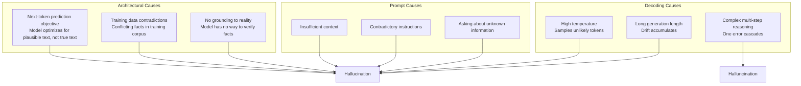

# Hallucinations

Hallucination is when a language model generates information that is factually incorrect, fabricated, or contradicts the provided context. In banking, hallucinations can lead to regulatory violations, financial losses, and reputational damage.

## Why Hallucinations Happen

### Root Causes



### The Fundamental Tension

LLMs are trained to produce **plausible** text, not **true** text. The model has no inherent concept of truth — it optimizes for text that looks like it was written by a knowledgeable person. This is why hallucinations are not a bug but an architectural property.

### Hallucination Categories

| Type | Description | Banking Example |
|------|-------------|----------------|
| **Factual** | States incorrect facts | "Basel III requires a 15% CET1 ratio" (actual: 4.5% minimum) |
| **Fabrication** | Invents non-existent entities | "Per FCA Handbook section GENPRU 2.4.7..." (does not exist) |
| **Contradiction** | Contradicts provided context | Context says rate is 5.25%, model says 4.75% |
| **Attribution** | Attributes information to wrong source | "According to PRA Policy Book 3..." when it was from a different document |
| **Temporal** | Uses outdated information | References repealed regulations as current |
| **Numerical** | Incorrect numbers or calculations | "The customer's total exposure is £2.3M" when it is £3.2M |

## Detection Strategies

### Automated Detection

```python
class HallucinationDetector:
    """Multi-strategy hallucination detection."""

    def __init__(self):
        self.strategies = [
            NLIBasedDetector(),      # Natural Language Inference
            FactCheckingDetector(),   # Extract and verify claims
            ConsistencyChecker(),     # Internal consistency
            CitationVerifier(),       # Verify citations exist
        ]

    def detect(self, context: str, response: str) -> dict:
        """Check response for hallucinations against context."""
        results = {}
        for strategy in self.strategies:
            result = strategy.check(context, response)
            results[strategy.name] = result

        # Aggregate results
        hallucination_scores = [r["hallucination_score"] for r in results.values()]
        avg_score = sum(hallucination_scores) / len(hallucination_scores)
        max_score = max(hallucination_scores)

        return {
            "hallucination_detected": max_score > 0.7,
            "confidence": avg_score,
            "max_risk_score": max_score,
            "by_strategy": results,
            "recommendation": self._recommendation(max_score),
        }

    def _recommendation(self, score: float) -> str:
        if score < 0.3:
            return "PASS — Low hallucination risk"
        elif score < 0.5:
            return "REVIEW — Moderate risk, consider human review"
        elif score < 0.7:
            return "FLAG — High risk, require human review"
        else:
            return "BLOCK — Very high risk, do not show to user"
```

### NLI-Based Detection

```python
from transformers import pipeline

class NLIBasedDetector:
    """Use Natural Language Inference to detect contradictions."""

    name = "nli_detector"

    def __init__(self):
        self.nli = pipeline(
            "textual-entailment",
            model="MoritzLaurer/deberta-v3-large-xnli",
            device=0,
        )

    def check(self, context: str, response: str) -> dict:
        """Check if response contradicts context."""
        # Extract claims from response
        claims = self._extract_claims(response)

        contradictions = []
        supports = []

        for claim in claims:
            result = self.nli({
                "premise": context,
                "hypothesis": claim,
            })

            if result["label"] == "contradiction":
                contradictions.append({
                    "claim": claim,
                    "confidence": result["score"],
                })
            elif result["label"] == "entailment":
                supports.append({
                    "claim": claim,
                    "confidence": result["score"],
                })

        hallucination_score = (
            len(contradictions) / max(len(claims), 1)
        )

        return {
            "hallucination_score": hallucination_score,
            "contradictions": contradictions,
            "supports": supports,
            "n_claims_checked": len(claims),
        }

    def _extract_claims(self, text: str) -> list[str]:
        """Extract factual claims from text using LLM."""
        # Use an LLM to extract individual claims
        prompt = f"""Extract each factual claim from this text as a separate statement.
One claim per line. Only extract claims that are specific factual statements,
not opinions or recommendations.

Text: {text}

Claims:"""
        # ... LLM call to extract claims
        return claims
```

### Citation Verification

```python
class CitationVerifier:
    """Verify that cited regulations, sections, and documents actually exist."""

    name = "citation_verifier"

    def __init__(self, regulation_db):
        self.regulation_db = regulation_db  # Database of valid regulations

    def check(self, context: str, response: str) -> dict:
        """Find and verify all citations in response."""
        citations = self._extract_citations(response)
        results = []

        for citation in citations:
            exists = self._verify_citation(citation)
            results.append({
                "citation": citation,
                "exists": exists,
                "in_context": citation in context,
            })

        fabricated = [r for r in results if not r["exists"]]
        hallucination_score = len(fabricated) / max(len(citations), 1)

        return {
            "hallucination_score": hallucination_score,
            "citations_checked": len(citations),
            "fabricated_citations": fabricated,
        }

    def _extract_citations(self, text: str) -> list[str]:
        """Extract regulation/policy citations using regex."""
        import re
        patterns = [
            r'(?:Section|Article|Clause)\s+[\d.]+(?:\([a-z]\))?',  # "Section 3.2(a)"
            r'(?:FCA|PRA|OCC|ECB)\s+(?:Handbook|Rule|Regulation)\s+[\w.]+',  # "FCA Handbook GENPRU"
            r'(?:Basel|MiFID|GDPR|AML)[\s\d]+',  # "Basel III"
            r'\[\d+\]',  # "[1]" numbered references
        ]
        citations = []
        for pattern in patterns:
            citations.extend(re.findall(pattern, text, re.IGNORECASE))
        return list(set(citations))

    def _verify_citation(self, citation: str) -> bool:
        """Check if citation exists in regulation database."""
        return self.regulation_db.exists(citation)
```

## Mitigation Strategies

### Strategy 1: Ground with RAG

```python
# Most effective anti-hallucination strategy

def grounded_response_prompt(query: str, retrieved_docs: list[dict]) -> str:
    return f"""
Answer the following question using ONLY the information provided in the \
reference documents below. Do not use any external knowledge or make up \
information.

If the reference documents do not contain sufficient information to answer \
the question, say: "I cannot answer this question based on the available \
information. Please consult [specific team/resource] for guidance."

Reference Documents:
{format_documents(retrieved_docs)}

Question: {query}

Answer based only on the reference documents:"""
```

### Strategy 2: Constrained Decoding

```python
# For structured outputs, constrain the model to valid formats only

from outlines import generate, models

# Define the exact output structure
from pydantic import BaseModel

class ComplianceResponse(BaseModel):
    risk_level: Literal["LOW", "MEDIUM", "HIGH"]
    reasoning: str
    references: list[str]

# Constrained generation guarantees valid output
model = models.transformers("meta-llama/Llama-3-8B")
generator = generate.json(model, ComplianceResponse)
result = generator(prompt)  # Always returns valid ComplianceResponse

# If model tries to generate invalid JSON, it is forced to retry
```

### Strategy 3: Temperature Control

```python
# Lower temperature reduces hallucination risk

HALLUCINATION_RISK_BY_TEMPERATURE = {
    0.0: {
        "risk": "Lowest",
        "behavior": "Always picks most likely token",
        "use_case": "Data extraction, classification",
    },
    0.2: {
        "risk": "Low",
        "behavior": "Minimal variation between runs",
        "use_case": "Compliance analysis, report generation",
    },
    0.5: {
        "risk": "Moderate",
        "behavior": "Some variation, generally faithful",
        "use_case": "Summarization, general assistance",
    },
    0.7: {
        "risk": "Moderate-High",
        "behavior": "Noticeable variation, some fabrication risk",
        "use_case": "Brainstorming, content creation",
    },
    1.0: {
        "risk": "High",
        "behavior": "Creative but unreliable for factual tasks",
        "use_case": "Not recommended for banking",
    },
}
```

### Strategy 4: Self-Verification

```python
async def self_verify_response(
    context: str,
    response: str,
    llm_client,
) -> dict:
    """Ask the model to verify its own response against context."""

    verification_prompt = f"""
Given the following context and response, identify any statements in the \
response that are NOT supported by the context.

Context:
{context}

Response:
{response}

List each unsupported claim verbatim, or say "All claims are supported" \
if every statement is supported by the context.
"""

    verification = await llm_client.complete(verification_prompt, temperature=0.0)

    has_unsupported = "unsupported" in verification.lower() or "not supported" in verification.lower()

    return {
        "self_verification_text": verification,
        "has_unsupported_claims": has_unsupported,
        "confidence": "LOW" if has_unsupported else "HIGH",
    }
```

### Strategy 5: Consensus Checking

```python
async def consensus_check(
    query: str,
    context: str,
    llm_client,
    n_models: int = 3,
) -> dict:
    """Get responses from multiple models and check for agreement."""
    models = ["gpt-4o", "claude-3-5-sonnet", "gemini-1.5-pro"]

    responses = []
    for model in models[:n_models]:
        response = await llm_client.complete(
            model=model,
            prompt=build_prompt(query, context),
            temperature=0.0,
        )
        responses.append({"model": model, "response": response})

    # Check for agreement on key facts
    key_facts = []
    for r in responses:
        facts = await _extract_key_facts(r["response"])
        key_facts.append(facts)

    # Calculate agreement
    agreement = _calculate_fact_agreement(key_facts)

    return {
        "responses": responses,
        "agreement_score": agreement,  # 0.0-1.0
        "consensus_facts": _find_common_facts(key_facts),
        "disputed_facts": _find_disputed_facts(key_facts),
    }
```

## Banking-Specific Hallucination Risks

### High-Risk Scenarios

| Scenario | Risk Level | Mitigation |
|----------|-----------|------------|
| Citing specific regulation sections | CRITICAL | Citation verification against regulation DB |
| Quoting interest rates or fees | CRITICAL | Never generate — always retrieve from system |
| Interpreting ambiguous regulations | HIGH | Human review required, multi-model consensus |
| Customer account information | CRITICAL | Never from model — always from database |
| Policy interpretation | HIGH | RAG-grounded, human review for edge cases |
| General banking knowledge | MEDIUM | Acceptable with disclaimer, RAG preferred |
| Summarizing known documents | LOW | RAG-grounded, verify against source |

### Real-World Hallucination Incidents

**Incident 1: Fabricated Regulation**
- A compliance assistant cited "FCA Rule 8.3.2R" which does not exist
- Impact: Compliance team spent 2 hours looking for non-existent rule
- Fix: Citation verification layer added before response delivery

**Incident 2: Incorrect Interest Rate**
- Customer assistant quoted mortgage rate of 4.2% when current rate was 5.1%
- Impact: Customer complaint, regulatory concern
- Fix: Rates are never generated by model — always retrieved from pricing system

**Incident 3: Contradicted Context**
- Model analyzed transaction but contradicted the provided risk policy
- Policy stated "flag transactions > £10,000" but model said "threshold is £15,000"
- Fix: NLI-based contradiction detection added to output pipeline

## Monitoring Hallucination Rates

```python
class HallucinationMonitor:
    """Track hallucination rates in production."""

    def __init__(self, statsd_client):
        self.statsd = statsd_client
        self.hallucination_detector = HallucinationDetector()

    async def check_and_record(self, context: str, response: str,
                               request_id: str):
        """Check response and record hallucination metrics."""
        result = self.hallucination_detector.detect(context, response)

        # Record metrics
        self.statsd.gauge(
            "genai.hallucination_score",
            result["max_risk_score"],
            tags={"request_id": request_id},
        )

        if result["hallucination_detected"]:
            self.statsd.increment(
                "genai.hallucinations.total",
                tags={"severity": result["recommendation"]},
            )

        return result

    def get_hallucination_rate(self, window: str = "24h") -> dict:
        """Get hallucination rate over time window."""
        # Query from monitoring system
        total_requests = get_request_count(window)
        hallucinated = get_hallucination_count(window)

        return {
            "hallucination_rate": hallucinated / total_requests,
            "total_requests": total_requests,
            "hallucinated_requests": hallucinated,
            "window": window,
        }
```

## Interview Questions

1. Why do hallucinations happen from an architectural perspective?
2. How would you design a hallucination detection system for a compliance assistant?
3. A model consistently hallucinates a specific type of information. How do you debug?
4. What is the most effective anti-hallucination strategy for banking applications?
5. How do you set an acceptable hallucination rate threshold for a customer-facing application?

## Cross-References

- [llm-fundamentals.md](./llm-fundamentals.md) — Why LLMs produce plausible but incorrect text
- [prompt-engineering.md](./prompt-engineering.md) — Prompt patterns to reduce hallucination
- [ai-safety.md](./ai-safety.md) — Safety layers and guardrails
- [human-in-the-loop.md](./human-in-the-loop.md) — Human review for hallucination prevention
- [evaluation-frameworks/](./evaluation-frameworks/) — Measuring hallucination rates
- [../rag-and-search/](../rag-and-search/) — RAG as primary anti-hallucination strategy
