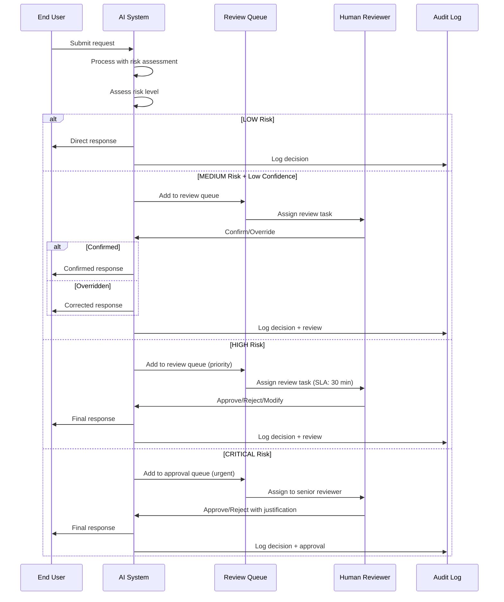

# Human-in-the-Loop

Human-in-the-loop (HITL) design ensures that AI systems in banking have appropriate human oversight for high-stakes decisions. This guide covers when, how, and why to involve humans in AI workflows.

## When Humans Are Required

### Decision Framework

```mermaid
graph TD
    Start{AI Output Risk Assessment} --> Risk{Risk Level?}

    Risk -->|LOW: General info,<br/>formatting, summaries| Auto[AUTO: No human review needed]
    Risk -->|MEDIUM: Analysis,<br/>categorization, scoring| Flag[FLAG: Review if<br/>low confidence]
    Risk -->|HIGH: Compliance<br/>determination| Review[REVIEW: Human review<br/>before action]
    Risk -->|CRITICAL: Customer-<br/>impacting decisions| Approve[APPROVE: Human approval<br/>required before execution|

    Auto --> Log[Log for audit]
    Flag --> Confidence{Model<br/>confidence?}
    Confidence -->|HIGH| Auto
    Confidence -->|LOW/MEDIUM| Review
    Review --> HumanDecision[Human: Confirm/Override/Escalate]
    Approve --> SeniorApproval[Senior human approval required]

    HumanDecision --> Log
    SeniorApproval --> Log
```

### Risk Classification Matrix

| Risk Level | Definition | Examples | Human Involvement |
|-----------|-----------|----------|------------------|
| **LOW** | Informational, no customer impact | Internal search, document summarization, formatting | None — log only |
| **MEDIUM** | Advisory, indirect customer impact | Transaction categorization, email routing, risk scoring | Review if low confidence |
| **HIGH** | Direct customer or compliance impact | Compliance analysis, SAR recommendation, customer communications | Review before sending |
| **CRITICAL** | Financial or regulatory consequence | Fund transfers, account closure, loan decisions, regulatory filings | Senior approval required |

## HITL Architecture



## Review Queue Implementation

```python
from enum import Enum
from typing import Optional
from datetime import datetime, timedelta

class ReviewPriority(Enum):
    LOW = 1
    MEDIUM = 2
    HIGH = 3
    URGENT = 4

class ReviewStatus(Enum):
    PENDING = "pending"
    IN_REVIEW = "in_review"
    CONFIRMED = "confirmed"
    OVERRIDDEN = "overridden"
    ESCALATED = "escalated"
    EXPIRED = "expired"

class ReviewItem:
    """A single item in the human review queue."""

    def __init__(
        self,
        request_id: str,
        ai_output: dict,
        risk_level: str,
        confidence: str,
        user_context: dict,
        sla_minutes: int = 60,
    ):
        self.request_id = request_id
        self.ai_output = ai_output
        self.risk_level = risk_level
        self.confidence = confidence
        self.user_context = user_context
        self.created_at = datetime.utcnow()
        self.sla_deadline = self.created_at + timedelta(minutes=sla_minutes)
        self.status = ReviewStatus.PENDING
        self.assigned_to: Optional[str] = None
        self.review_result: Optional[dict] = None
        self.review_notes: Optional[str] = None
        self.reviewed_at: Optional[datetime] = None

    def is_sla_breached(self) -> bool:
        return datetime.utcnow() > self.sla_deadline and self.status == ReviewStatus.PENDING

    @property
    def priority(self) -> ReviewPriority:
        if self.risk_level == "CRITICAL":
            return ReviewPriority.URGENT
        elif self.risk_level == "HIGH":
            return ReviewPriority.HIGH
        elif self.risk_level == "MEDIUM":
            return ReviewPriority.MEDIUM
        return ReviewPriority.LOW
```

### Review Queue Service

```python
class ReviewQueueService:
    """Manage the human review queue."""

    def __init__(self, redis_client, notification_service):
        self.redis = redis_client
        self.notifications = notification_service

    async def enqueue(self, item: ReviewItem) -> str:
        """Add item to review queue."""
        queue_key = f"review_queue:{item.priority.name}"

        # Serialize and add to priority queue
        item_data = item.__dict__.copy()
        item_data["created_at"] = item.created_at.isoformat()
        item_data["sla_deadline"] = item.sla_deadline.isoformat()

        await self.redis.zadd(
            queue_key,
            {json.dumps(item_data): time.time()},
        )

        # Notify available reviewers
        await self._notify_reviewers(item)

        return item.request_id

    async def assign_review(self, reviewer_id: str) -> Optional[ReviewItem]:
        """Assign next pending item to a reviewer."""
        # Check all priority queues, highest priority first
        for priority in ["URGENT", "HIGH", "MEDIUM", "LOW"]:
            queue_key = f"review_queue:{priority}"
            next_item = await self.redis.zpopmin(queue_key, count=1)

            if next_item:
                item_data = json.loads(next_item[0][0])
                item = ReviewItem(**item_data)
                item.status = ReviewStatus.IN_REVIEW
                item.assigned_to = reviewer_id
                item.reviewed_at = datetime.utcnow()

                # Save to audit log
                await self._save_audit_trail(item)

                return item

        return None

    async def submit_review(self, item: ReviewItem, decision: dict) -> str:
        """Submit a review decision."""
        item.status = ReviewStatus(decision["action"])
        item.review_result = decision.get("result")
        item.review_notes = decision.get("notes")
        item.reviewed_at = datetime.utcnow()

        # Save to audit log
        await self._save_audit_trail(item)

        # Notify original requester if applicable
        if item.status in (ReviewStatus.CONFIRMED, ReviewStatus.OVERRIDDEN):
            await self._notify_completion(item)

        return item.request_id

    async def _notify_reviewers(self, item: ReviewItem):
        """Notify available reviewers."""
        # Find online reviewers with appropriate permissions
        reviewers = await self._get_available_reviewers(item.risk_level)

        for reviewer in reviewers[:3]:  # Notify up to 3
            await self.notifications.send(
                user_id=reviewer,
                channel="review_queue",
                message={
                    "type": "new_review_item",
                    "priority": item.priority.name,
                    "risk_level": item.risk_level,
                    "request_id": item.request_id,
                    "sla_deadline": item.sla_deadline.isoformat(),
                },
            )
```

## Review UI Design

```python
# Frontend review interface (conceptual)

REVIEW_UI_TEMPLATE = """
## Review Item: {request_id}

### Context
- User: {user_role}
- Request: {request_summary}
- Risk Level: {risk_level}
- AI Confidence: {confidence}

### AI Output
{ai_output_formatted}

### Supporting Information
- Retrieved documents: {n_documents}
- Tools called: {tool_calls}
- Processing time: {latency}ms

---

### Your Decision
[ ] CONFIRM — AI output is accurate and appropriate
[ ] OVERRIDE — Modify the AI output before sending
[ ] ESCALATE — Escalate to senior reviewer / subject matter expert

### Override Text (if overriding)
{override_text_area}

### Notes (optional)
{notes_area}

---
SLA: {time_remaining} remaining
"""
```

## Approval Flows

### Multi-Level Approval

```python
class ApprovalFlow:
    """Multi-level approval for critical AI actions."""

    APPROVAL_CHAINS = {
        "fund_transfer_over_100k": {
            "level_1": {"role": "senior_teller", "action": "verify_details"},
            "level_2": {"role": "branch_manager", "action": "approve_transfer"},
            "level_3": {"role": "compliance", "action": "clear_for_aml"},
        },
        "sar_filing": {
            "level_1": {"role": "compliance_analyst", "action": "prepare_sar"},
            "level_2": {"role": "mlro", "action": "approve_sar"},  # Money Laundering Reporting Officer
        },
        "account_closure": {
            "level_1": {"role": "customer_service_manager", "action": "verify_reason"},
            "level_2": {"role": "compliance", "action": "check_regulatory_holds"},
        },
    }

    async def initiate(self, action_type: str, context: dict) -> str:
        """Initiate approval chain."""
        chain = self.APPROVAL_CHAINS.get(action_type)
        if not chain:
            raise ValueError(f"Unknown approval chain: {action_type}")

        approval_id = generate_approval_id()

        # Create approval record
        record = {
            "approval_id": approval_id,
            "action_type": action_type,
            "context": context,
            "chain": chain,
            "current_level": 1,
            "status": "pending",
            "created_at": datetime.utcnow().isoformat(),
            "decisions": [],
        }

        await self.db.insert("approvals", record)

        # Notify first approver
        await self._notify_approver(chain["level_1"], approval_id)

        return approval_id

    async def approve(self, approval_id: str, approver_role: str,
                      decision: str, notes: str) -> dict:
        """Record an approval decision."""
        record = await self.db.get("approvals", approval_id)

        # Verify approver has correct role
        current_level = record["chain"][f"level_{record['current_level']}"]
        if current_level["role"] != approver_role:
            raise PermissionError("Incorrect approver role")

        # Record decision
        record["decisions"].append({
            "level": record["current_level"],
            "role": approver_role,
            "decision": decision,
            "notes": notes,
            "timestamp": datetime.utcnow().isoformat(),
        })

        if decision == "rejected":
            record["status"] = "rejected"
            await self._notify_requester(approval_id, "rejected")
            return record

        # Move to next level
        record["current_level"] += 1
        next_level = record["chain"].get(f"level_{record['current_level']}")

        if next_level:
            # Still more approvals needed
            await self._notify_approver(next_level, approval_id)
            record["status"] = f"pending_level_{record['current_level']}"
        else:
            # All approvals complete
            record["status"] = "approved"
            await self._notify_requester(approval_id, "approved")
            await self._execute_action(record)

        await self.db.update("approvals", approval_id, record)
        return record
```

## Escalation Policies

```python
ESCALATION_POLICIES = {
    "compliance_analysis": {
        "auto_decide_if": {
            "risk_level": "LOW",
            "confidence": "HIGH",
        },
        "escalate_if": {
            "risk_level__in": ["HIGH", "CRITICAL"],
            "confidence__in": ["LOW", "MEDIUM"],
        },
        "sla": {
            "MEDIUM": timedelta(hours=4),
            "HIGH": timedelta(minutes=30),
            "CRITICAL": timedelta(minutes=15),
        },
        "escalation_path": [
            "compliance_analyst",
            "senior_compliance_analyst",
            "compliance_manager",
            "chief_compliance_officer",
        ],
    },
    "customer_communication": {
        "auto_decide_if": {
            "risk_level": "LOW",
            "is_template": True,
        },
        "escalate_if": {
            "risk_level__in": ["MEDIUM", "HIGH", "CRITICAL"],
        },
        "sla": {
            "MEDIUM": timedelta(hours=2),
            "HIGH": timedelta(minutes=30),
        },
        "escalation_path": [
            "customer_service_agent",
            "customer_service_manager",
            "head_of_customer_service",
        ],
    },
}
```

## Measuring HITL Effectiveness

```python
class HITLMetrics:
    """Track human-in-the-loop effectiveness."""

    async def get_metrics(self, period: str = "7d") -> dict:
        """Get HITL performance metrics."""
        data = await self.query_review_data(period)

        total_reviews = data["total_reviews"]
        confirmed = data["confirmed"]
        overridden = data["overridden"]
        escalated = data["escalated"]

        return {
            "total_reviews": total_reviews,
            "confirmation_rate": confirmed / total_reviews if total_reviews else 0,
            "override_rate": overridden / total_reviews if total_reviews else 0,
            "escalation_rate": escalated / total_reviews if total_reviews else 0,
            "avg_review_time_seconds": data["avg_review_time"],
            "sla_breach_rate": data["sla_breaches"] / total_reviews if total_reviews else 0,
            "reviewer_workload": data["reviews_per_reviewer"],
            "by_risk_level": {
                "LOW": {"count": data["low_count"], "confirm_rate": data["low_confirm_rate"]},
                "MEDIUM": {"count": data["medium_count"], "confirm_rate": data["medium_confirm_rate"]},
                "HIGH": {"count": data["high_count"], "confirm_rate": data["high_confirm_rate"]},
                "CRITICAL": {"count": data["critical_count"], "confirm_rate": data["critical_confirm_rate"]},
            },
        }

    def get_ai_quality_trend(self, days: int = 30) -> list[dict]:
        """Track AI quality over time via human confirmation rates."""
        # If confirmation rate is increasing, AI is improving
        # If override rate is increasing, AI is degrading
        daily_rates = self.query_daily_confirmation_rates(days)
        return daily_rates
```

## Common Mistakes and Anti-Patterns

### Anti-Pattern 1: Reviewing Everything

```python
# WRONG: Send all AI outputs for human review
# Creates bottleneck, defeats the purpose of AI automation

# RIGHT: Risk-based review
if risk_level == "LOW" and confidence == "HIGH":
    return ai_output  # No review needed
elif risk_level == "MEDIUM":
    if confidence == "LOW":
        send_for_review(ai_output)
    else:
        return ai_output
else:
    send_for_review(ai_output)
```

### Anti-Pattern 2: No SLA on Reviews

```python
# WRONG: Review items sit in queue indefinitely
# "The AI flagged this 3 days ago and nobody reviewed it"

# RIGHT: SLA-based escalation
SLA_THRESHOLDS = {
    "CRITICAL": timedelta(minutes=15),
    "HIGH": timedelta(minutes=30),
    "MEDIUM": timedelta(hours=4),
    "LOW": timedelta(hours=24),
}

if item.age > SLA_THRESHOLDS[item.risk_level]:
    escalate_to_next_level(item)
```

### Anti-Pattern 3: Not Learning from Overrides

```python
# WRONG: Human overrides are discarded after correction
# The AI never learns from its mistakes

# RIGHT: Feed overrides back to improvement pipeline
# 1. Log override as training data
# 2. Analyze patterns: what does the AI get wrong?
# 3. Update prompts, add examples, or fine-tune
# 4. Measure improvement: override rate should decrease
```

## Interview Questions

1. How do you decide which AI outputs need human review?
2. A compliance review queue has a 4-hour SLA but items are backing up. What do you do?
3. How do you measure whether human review is improving AI quality over time?
4. Design a multi-level approval flow for filing a Suspicious Activity Report.
5. The human override rate for an AI system jumped from 5% to 25% overnight. What happened?

## Cross-References

- [ai-safety.md](./ai-safety.md) — Safety layers and guardrails
- [agents.md](./agents.md) — Agent architectures with human oversight
- [evaluation-frameworks/](./evaluation-frameworks/) — Measuring AI quality through human feedback
- [model-observability.md](./model-observability.md) — Monitoring AI performance drift
- [../incident-management/](../incident-management/) — Incident response for safety failures
