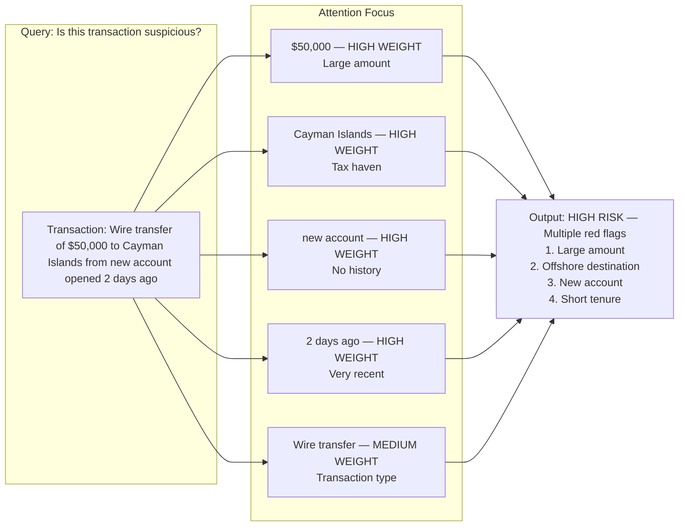

# LLM Fundamentals

Understanding how Large Language Models work is foundational for any engineer building GenAI systems in a banking environment. This guide covers the mechanics of LLMs from first principles, with emphasis on implications for production systems.

## What Is an LLM?

A Large Language Model is a neural network trained on vast amounts of text to predict the next token in a sequence. Despite the simplicity of this objective, scaling this approach produces emergent capabilities: reasoning, translation, summarization, code generation, and more.

### The Training Pipeline

```mermaid
graph LR
    subgraph "Phase 1: Pre-training"
        RawData[Raw Text Data<br/>Trillions of tokens] --> Tokenizer[Tokenization]
        Tokenizer --> Model[Transformer Model<br/>100B+ parameters]
        Model --> Pretrained[Base Model<br/>Next-token prediction]
    end

    subgraph "Phase 2: Alignment"
        Pretrained --> SFT[Supervised Fine-Tuning<br/>Instruction following]
        SFT --> RLHF[RLHF / DPO<br/>Preference alignment]
        RLHF --> Aligned[Aligned Model<br/>Helpful & harmless]
    end

    subgraph "Phase 3: Deployment"
        Aligned --> Quantization[Quantization<br/>FP8 / INT8 / INT4]
        Quantization --> Serving[Model Serving<br/>vLLM / TGI / TRT-LLM]
        Serving --> API[API Endpoint]
    end
```



### Pre-training

Pre-training involves training on a diverse corpus of text data. The model learns:
- **Grammar and syntax** from books and articles
- **Factual knowledge** from encyclopedias and reference material
- **Reasoning patterns** from mathematical and logical text
- **Programming** from GitHub repositories and documentation
- **Multilingual capability** from text in many languages

**Banking implication**: The pre-training data cutoff determines what the model knows. A model trained on data through 2023 will not know about regulations enacted in 2024. This is why RAG (Retrieval-Augmented Generation) is essential — see [../rag-and-search/](../rag-and-search/).

### Alignment

Base models produce text continuation, not helpful responses. Alignment transforms them into usable assistants:

**Supervised Fine-Tuning (SFT)**: The model is fine-tuned on high-quality instruction-response pairs. For banking, this might include:
- Policy interpretation examples
- Compliance analysis examples
- Customer service dialogue examples

**RLHF (Reinforcement Learning from Human Feedback)**: Human annotators rank model outputs, and a reward model is trained to predict preferences. The base model is then optimized against this reward model.

**DPO (Direct Preference Optimization)**: A simpler alternative to RLHF that directly optimizes the model on preference pairs without training a separate reward model.

## Token Mechanics

### What Is a Token?

Tokens are subword units that the model processes. They are NOT words, characters, or bytes. A single token is typically 3-4 characters in English, but this varies:

```
"The" → 1 token
"quickly" → 2 tokens ("quick", "ly")
"uncharacteristically" → 4 tokens
"£1,000,000.00" → 5 tokens ("£", "1", ",", "000", ",", "000", ".", "00") — varies by tokenizer
"SELECT * FROM accounts WHERE balance > 1000" → ~12 tokens
```

### Token vs. Character Relationship

| Language | Characters per Token (approx.) |
|----------|-------------------------------|
| English | 3.5-4.0 |
| Chinese | 1.5-2.0 |
| Arabic | 2.5-3.0 |
| Code (Python) | 3.0-3.5 |
| Code (Java) | 2.5-3.0 |

**Cost implication**: Token costs are calculated per token, not per character. Multilingual banks serving APAC or MENA regions may see 2x higher token costs for the same character count.

### Bidirectional Tokenizers

Different models use different tokenizers, which means the same text produces different token counts:

```python
import tiktoken  # OpenAI's tokenizer

# OpenAI tokenizer
enc = tiktoken.get_encoding("cl100k_base")  # GPT-4 / GPT-3.5
text = "The quick brown fox jumps over the lazy dog"
print(f"OpenAI tokens: {len(enc.encode(text))}")  # 9 tokens

# Claude uses a different tokenizer
# The same text might tokenize differently
```

**Production lesson**: Always measure token counts with the actual model's tokenizer. Estimates based on word count are off by 20-40%.

## Attention Mechanism

### How Attention Works (Conceptual)

The transformer architecture uses self-attention to weigh the importance of different tokens in the input. Each token can "attend" to every other token, creating a weighted representation:

```
Input: "The bank approved the loan because the customer had good credit"

When generating "good", the model attends to:
- "customer" (high weight) — whose credit?
- "credit" (high weight) — what is good?
- "approved" (medium weight) — what was the outcome?
- "bank" (low weight) — less relevant here
- "because" (medium weight) — causal connector
```

### Attention Patterns in Banking Contexts



### Context Window Limitations

| Model | Context Window | Approximate Capacity |
|-------|---------------|---------------------|
| GPT-4o | 128K tokens | ~96,000 words / 300 pages |
| Claude 3.5 Sonnet | 200K tokens | ~150,000 words / 500 pages |
| Gemini 1.5 Pro | 1M tokens | ~750,000 words / 2,500 pages |
| GPT-4o-mini | 128K tokens | ~96,000 words / 300 pages |
| Llama 3 70B | 8K-128K tokens | Configurable |

**Critical limitation**: Models do NOT use all context equally well. Research shows:
- **Lost-in-the-middle phenomenon**: Information in the middle of long contexts is less reliably retrieved than information at the beginning or end
- **Needle-in-a-haystack degradation**: As context grows, the model's ability to find specific facts degrades
- **Banking implication**: For compliance document analysis, RAG with chunking is more reliable than dumping entire documents into context

## Model Capabilities and Limitations

### What LLMs Are Good At

1. **Text transformation**: Rewriting, formatting, translating between formats
2. **Summarization**: Condensing long documents while preserving key facts
3. **Extraction**: Pulling structured data from unstructured text
4. **Classification**: Categorizing text into predefined buckets
5. **Reasoning from provided context**: Applying rules to specific cases (when rules are in context)
6. **Code generation**: Writing, explaining, and debugging code

### What LLMs Are NOT Good At

1. **Factual recall without grounding**: Will confabulate facts not in training data
2. **Mathematical computation**: Arithmetic errors on complex calculations
3. **Temporal reasoning**: Struggles with dates, durations, and time-based logic
4. **Counting**: Systematic errors in counting objects, words, characters
5. **Negation handling**: "not suspicious" can be misread as "suspicious"
6. **Consistency**: May give different answers to the same question on different runs

### The Knowledge Cutoff Problem

```python
# WRONG: Assuming the model knows current regulations
prompt = """
What are the current Basel III capital requirements?
"""
# Model may give outdated or incorrect answer

# RIGHT: Retrieve current regulations and provide as context
regulations = retrieve_from_vector("Basel III capital requirements")
prompt = f"""
Based on the following regulatory documents, what are the current
Basel III capital requirements?

{regulations}
"""
```

**Banking lesson**: Never rely on parametric knowledge (what the model "knows") for regulations, policies, or procedures that change over time. Always use RAG. See [../rag-and-search/](../rag-and-search/).

## Probability and Temperature

### How Generation Works

At each step, the model produces a probability distribution over its vocabulary:

```
Context: "The customer's account balance is"

Model output (top probabilities):
  "$10,000"   — 15%
  "$5,000"    — 12%
  "positive"  — 10%
  "$1,000"    — 8%
  "negative"  — 7%
  ...
```

### Temperature Control

Temperature adjusts the shape of the probability distribution:

| Temperature | Behavior | Use Case |
|-------------|----------|----------|
| 0.0 | Always picks highest probability (deterministic) | Data extraction, classification |
| 0.1-0.3 | Nearly deterministic, minor variation | Compliance analysis, report generation |
| 0.5-0.7 | Balanced creativity and consistency | General assistant, summarization |
| 0.8-1.0 | More creative, more variation | Brainstorming, content generation |
| 1.0+ | Highly creative, risk of incoherence | Not recommended for banking |

**Production recommendation**: Use temperature 0 for any task requiring consistency:
- Data extraction from documents
- Classification of transactions
- Compliance rule evaluation
- Form filling

### Top-p (Nucleus Sampling)

Alternative to temperature: only sample from the smallest set of tokens whose cumulative probability exceeds p.

```python
# OpenAI API example
response = client.chat.completions.create(
    model="gpt-4o",
    messages=[...],
    temperature=0.2,
    top_p=0.9,  # Only sample from tokens accounting for 90% of probability
    # ...
)
```

## Logprobs and Confidence

Understanding model confidence is critical for banking applications where incorrect outputs can have regulatory consequences.

```python
response = client.chat.completions.create(
    model="gpt-4o",
    messages=[...],
    logprobs=True,
    top_logprobs=3,
)

# Check confidence of key tokens
for token_logprob in response.choices[0].logprobs.content:
    token = token_logprob.token
    logprob = token_logprob.logprob
    confidence = math.exp(logprob)  # Convert logprob to probability
    if confidence < 0.5:
        logger.warning(f"Low confidence on token: {token} ({confidence:.2f})")
```

**Banking application**: Use logprobs to flag low-confidence outputs for human review. If the model is uncertain about a compliance classification, escalate to a human analyst.

## Common Mistakes and Anti-Patterns

### Anti-Pattern 1: Treating LLMs as Databases

```python
# WRONG: Asking the model to recall specific facts
prompt = "What was the interest rate on account #12345 last month?"
# The model has never seen this data and will hallucinate

# RIGHT: Query the database, use LLM to format
rate = database.query("SELECT rate FROM accounts WHERE id = 12345")
prompt = f"Format this interest rate for the customer: {rate}"
```

### Anti-Pattern 2: Assuming Deterministic Output

```python
# WRONG: Comparing exact strings
assert response == "APPROVED"

# RIGHT: Normalize and check semantics
assert response.strip().upper() in ("APPROVED", "APPROVE", "YES")

# BETTER: Use structured output
response = client.beta.chat.completions.parse(
    model="gpt-4o",
    messages=[...],
    response_format=DecisionModel,  # Pydantic model
)
assert response.decision == Decision.APPROVED
```

### Anti-Pattern 3: Ignoring Token Limits

```python
# WRONG: No token count check
messages = [{"role": "user", "content": huge_document}]
response = client.chat.completions.create(messages=messages)
# May fail with context_length_exceeded error

# RIGHT: Count tokens before sending
import tiktoken
enc = tiktoken.get_encoding("cl100k_base")
total_tokens = sum(len(enc.encode(m["content"])) for m in messages)
if total_tokens > 100000:  # Leave buffer
    raise ValueError(f"Input too large: {total_tokens} tokens")
```

### Anti-Pattern 4: Mixing Languages Without Testing

```python
# A compliance document may contain multiple languages
# Token counts and model behavior differ across languages
# Always test multilingual inputs with your specific model
```

## Banking-Specific Considerations

### Regulatory Language Understanding

LLMs are trained on general internet text, not banking regulations. Key challenges:

1. **Regulatory jargon**: Terms like "tier 1 capital," "LCR," "NSFR" may be underrepresented in training data
2. **Jurisdiction-specific rules**: UK FCA rules differ from US OCC rules
3. **Temporal accuracy**: Regulations change; model knowledge is frozen at training cutoff
4. **Interpretation vs. recitation**: Models can recite regulations but may misinterpret edge cases

### Financial Number Handling

LLMs are not calculators. For any computation:

```python
# WRONG: Let the model calculate
prompt = "What is 15% of £2,456,789.32?"

# RIGHT: Calculate externally, use model to explain
result = 2456789.32 * 0.15
prompt = f"Explain this calculation to the customer: 15% of £2,456,789.32 = £{result:.2f}"
```

### Multilingual Banking

Global banks serve customers in dozens of languages. LLM capabilities vary significantly:

| Language | Quality | Notes |
|----------|---------|-------|
| English | Excellent | Primary training language |
| Spanish | Very Good | Well-represented in training data |
| French | Very Good | Well-represented |
| German | Good | Good but may have grammar issues |
| Mandarin | Good | Tokenization inefficient |
| Arabic | Fair | Right-to-left, complex morphology |
| Hindi | Fair | Underrepresented in training |

**Recommendation**: Test each language independently. Do not assume English quality transfers to other languages.

## Interview Questions

### Conceptual
1. Explain the transformer attention mechanism to a non-technical stakeholder
2. Why do LLMs hallucinate? What architectural properties cause this?
3. How does temperature affect model output? When would you use 0 vs. 0.7?
4. What is the "lost in the middle" phenomenon and how does it affect RAG design?
5. Why can't LLMs reliably perform arithmetic?

### Production Engineering
1. How would you design a system to detect low-confidence model outputs?
2. A compliance team reports that the AI assistant gave incorrect regulatory information. How do you debug?
3. How do you estimate token costs before deploying a new feature?
4. Your model's response quality degraded after a context window increase. Why?
5. How do you handle multilingual inputs in a globally deployed GenAI system?

### Banking-Specific
1. Why is RAG essential for banking applications? What are the limitations of relying on parametric knowledge?
2. How would you ensure that a GenAI system does not hallucinate financial regulations?
3. A customer service assistant needs to look up account information. How do you design the system architecture?

## Cross-References

- [tokenization.md](./tokenization.md) — Deep dive into token counting and optimization
- [embeddings.md](./embeddings.md) — How models represent text as vectors
- [hallucinations.md](./hallucinations.md) — Understanding and preventing hallucinations
- [prompt-engineering.md](./prompt-engineering.md) — Systematic prompt design
- [../rag-and-search/](../rag-and-search/) — Retrieval-augmented generation
- [../observability/](../observability/) — Monitoring model quality in production

## Further Reading

- "Attention Is All You Need" (Vaswani et al., 2017) — Original transformer paper
- "Language Models are Few-Shot Learners" (Brown et al., 2020) — GPT-3 paper
- "Constitutional AI" (Bai et al., 2022) — RLHF and alignment
- "Lost in the Middle" (Liu et al., 2023) — Context window limitations
- "Needle in a Haystack" — Pressure testing LLM context windows
