# Model Observability

Model observability ensures that GenAI applications are monitored for quality, performance, cost, and safety in production. Without observability, model degradation goes undetected until users complain.

## Observability Dimensions

```mermaid
graph TB
    subgraph "Quality Metrics"
        Q1[Response Quality<br/>Human eval scores]
        Q2[Hallucination Rate<br/>NLI-based detection]
        Q3[Groundedness<br/>Citation accuracy]
        Q4[Task Success Rate<br/>Did the task succeed?]
    end

    subgraph "Performance Metrics"
        P1[Latency p50/p95/p99<br/>Response time]
        P2[Token Throughput<br/>Tokens/second]
        P3[Error Rate<br/>API failures]
        P4[Cache Hit Rate<br/>Cache effectiveness]
    end

    subgraph "Cost Metrics"
        C1[Cost per Request<br/>Average/median]
        C2[Monthly Spend<br/>Total token costs]
        C3[Cost by Model<br/>Per-model spending]
        C4[Cost by Team<br/>Budget attribution]
    end

    subgraph "Safety Metrics"
        S1[Safety Violations<br/>Content filter triggers]
        S2[Injection Attempts<br/>Prompt attacks detected]
        S3[PII Leaks<br/>Data leakage events]
        S4[Human Override Rate<br/>Review corrections]
    end

    Q1 --> Dashboard[Unified Dashboard]
    Q2 --> Dashboard
    Q3 --> Dashboard
    Q4 --> Dashboard
    P1 --> Dashboard
    P2 --> Dashboard
    P3 --> Dashboard
    P4 --> Dashboard
    C1 --> Dashboard
    C2 --> Dashboard
    C3 --> Dashboard
    C4 --> Dashboard
    S1 --> Dashboard
    S2 --> Dashboard
    S3 --> Dashboard
    S4 --> Dashboard
```



## Quality Monitoring

### Human Evaluation Tracking

```python
class QualityTracker:
    """Track model quality via human evaluations."""

    def __init__(self, db_client):
        self.db = db_client

    def record_evaluation(self, evaluation: dict):
        """Record a human evaluation."""
        self.db.insert("quality_evaluations", {
            "request_id": evaluation["request_id"],
            "model": evaluation["model"],
            "model_version": evaluation["model_version"],
            "prompt_version": evaluation["prompt_version"],
            "task_type": evaluation["task_type"],
            "evaluator_id": evaluation["evaluator_id"],
            # Quality scores (1-5)
            "relevance_score": evaluation["relevance_score"],
            "accuracy_score": evaluation["accuracy_score"],
            "completeness_score": evaluation["completeness_score"],
            "helpfulness_score": evaluation["helpfulness_score"],
            # Binary assessments
            "contains_hallucination": evaluation.get("hallucination", False),
            "contains_errors": evaluation.get("errors", False),
            "is_safe": evaluation.get("safe", True),
            # Overall
            "overall_score": evaluation.get("overall_score"),
            "feedback": evaluation.get("feedback"),
            "evaluated_at": datetime.utcnow().isoformat(),
        })

    def get_quality_report(self, model: str, period: str = "7d") -> dict:
        """Get quality report for a model."""
        evaluations = self.db.query("""
            SELECT
                COUNT(*) as total_evaluations,
                AVG(relevance_score) as avg_relevance,
                AVG(accuracy_score) as avg_accuracy,
                AVG(completeness_score) as avg_completeness,
                AVG(helpfulness_score) as avg_helpfulness,
                AVG(overall_score) as avg_overall,
                SUM(CASE WHEN contains_hallucination THEN 1 ELSE 0 END)::float /
                    COUNT(*) as hallucination_rate,
                SUM(CASE WHEN contains_errors THEN 1 ELSE 0 END)::float /
                    COUNT(*) as error_rate
            FROM quality_evaluations
            WHERE model = %s
            AND evaluated_at > NOW() - INTERVAL %s
        """, (model, period))

        return evaluations

    def detect_quality_degradation(self, model: str, window: str = "24h") -> bool:
        """Detect if model quality has significantly degraded."""
        # Compare current window to previous window
        current = self._get_avg_quality(model, window)
        previous = self._get_avg_quality(model, f"2*{window}")

        if not current or not previous:
            return False

        # Check for significant drop (e.g., > 0.3 point drop in overall score)
        quality_drop = previous["avg_overall"] - current["avg_overall"]
        hallucination_increase = (
            current["hallucination_rate"] - previous["hallucination_rate"]
        )

        return quality_drop > 0.3 or hallucination_increase > 0.05
```

### Automated Quality Metrics

```python
class AutomatedQualityMonitor:
    """Automated quality metrics without human evaluation."""

    def __init__(self, llm_client, stats_client):
        self.llm = llm_client
        self.stats = stats_client

    async def assess_response_quality(self, request: dict, response: ModelResponse):
        """Automatically assess response quality."""
        # 1. Response length analysis
        too_short = len(response.content) < 20
        too_long = len(response.content) > 5000

        # 2. Repetition detection
        repetition_rate = self._calculate_repetition_rate(response.content)

        # 3. Coherence check (perplexity via small model)
        perplexity = await self._estimate_perplexity(response.content)

        # 4. Groundedness check (if context was provided)
        groundedness = None
        if request.get("context"):
            groundedness = await self._check_groundedness(
                request["context"], response.content
            )

        # 5. Format compliance (if structured output expected)
        format_compliant = self._check_format(response.content, request)

        # Record metrics
        self.stats.gauge("genai.quality.repetition_rate", repetition_rate, tags=[
            f"model:{response.model}", f"task:{request.get('task_type', 'unknown')}"
        ])
        self.stats.gauge("genai.quality.perplexity", perplexity, tags=[
            f"model:{response.model}"
        ])
        if groundedness:
            self.stats.gauge("genai.quality.groundedness", groundedness["score"], tags=[
                f"model:{response.model}"
            ])

        return {
            "too_short": too_short,
            "too_long": too_long,
            "repetition_rate": repetition_rate,
            "perplexity": perplexity,
            "groundedness": groundedness,
            "format_compliant": format_compliant,
        }

    async def _check_groundedness(self, context: str, response: str) -> dict:
        """Check if response is grounded in context."""
        # Use NLI model to check if response is entailed by context
        nli_result = await self.nli_model.check(
            premise=context,
            hypothesis=response,
        )

        return {
            "score": nli_result["entailment_score"],
            "contradictions": nli_result.get("contradictions", []),
        }
```

## Latency Monitoring

```python
class LatencyMonitor:
    """Monitor and alert on latency SLOs."""

    SLOs = {
        "gpt-4o": {"p50": 2000, "p95": 5000, "p99": 10000},  # milliseconds
        "gpt-4o-mini": {"p50": 1000, "p95": 3000, "p99": 5000},
        "claude-3-5-sonnet": {"p50": 3000, "p95": 8000, "p99": 15000},
        "claude-3-5-haiku": {"p50": 1500, "p95": 4000, "p99": 8000},
    }

    def record_latency(self, model: str, latency_ms: float, task_type: str):
        """Record a latency measurement."""
        self.stats.histogram("genai.latency", latency_ms, tags=[
            f"model:{model}", f"task:{task_type}"
        ])

    def check_slo_breach(self, model: str, window: str = "1h") -> dict:
        """Check if latency SLOs are being breached."""
        slo = self.SLOs.get(model, {})
        if not slo:
            return {"status": "no_slo_defined"}

        # Get actual percentiles
        p50 = self.stats.percentile("genai.latency", 50, window=window,
                                    tags=[f"model:{model}"])
        p95 = self.stats.percentile("genai.latency", 95, window=window,
                                    tags=[f"model:{model}"])
        p99 = self.stats.percentile("genai.latency", 99, window=window,
                                    tags=[f"model:{model}"])

        breaches = []
        if p50 > slo["p50"]:
            breaches.append({
                "metric": "p50",
                "actual": p50,
                "target": slo["p50"],
                "breach_ms": p50 - slo["p50"],
            })
        if p95 > slo["p95"]:
            breaches.append({
                "metric": "p95",
                "actual": p95,
                "target": slo["p95"],
                "breach_ms": p95 - slo["p95"],
            })

        return {
            "status": "breached" if breaches else "healthy",
            "p50": p50,
            "p95": p95,
            "p99": p99,
            "breaches": breaches,
        }
```

## Drift Detection

```python
class ModelDriftDetector:
    """Detect when model behavior drifts from baseline."""

    def __init__(self, baseline_data):
        self.baseline = baseline_data
        self.baseline_response_distribution = self._analyze_responses(baseline_data)

    def detect_drift(self, recent_data) -> dict:
        """Detect drift in model responses."""
        current = self._analyze_responses(recent_data)

        drift_signals = {}

        # 1. Response length drift
        length_drift = self._compare_distributions(
            self.baseline["response_lengths"],
            current["response_lengths"],
        )
        drift_signals["response_length"] = length_drift

        # 2. Vocabulary drift (new/rare words appearing)
        vocab_drift = self._compare_vocabulary(
            self.baseline["vocab_distribution"],
            current["vocab_distribution"],
        )
        drift_signals["vocabulary"] = vocab_drift

        # 3. Topic drift (distribution of topics discussed)
        topic_drift = self._compare_topics(
            self.baseline["topic_distribution"],
            current["topic_distribution"],
        )
        drift_signals["topic"] = topic_drift

        # 4. Sentiment drift
        sentiment_drift = self._compare_distributions(
            self.baseline["sentiment_scores"],
            current["sentiment_scores"],
        )
        drift_signals["sentiment"] = sentiment_drift

        # Overall drift score
        max_drift = max(d["kl_divergence"] for d in drift_signals.values())

        return {
            "drift_detected": max_drift > 0.1,
            "max_drift_score": max_drift,
            "by_signal": drift_signals,
        }

    def _compare_distributions(self, baseline: list, current: list) -> dict:
        """Compare two distributions using KL divergence."""
        from scipy.stats import entropy
        # ... calculate KL divergence
        return {"kl_divergence": kl_div, "baseline_mean": np.mean(baseline),
                "current_mean": np.mean(current)}
```

## Alerting Rules

```yaml
# Alerting configuration
alerts:
  quality:
    - name: "quality_degradation"
      metric: "genai.quality.overall_score"
      condition: "avg < 3.5 for 1h"
      severity: "warning"
      channels: ["#genai-alerts", "team-lead"]

    - name: "hallucination_spike"
      metric: "genai.quality.hallucination_rate"
      condition: "rate > 0.05 for 30m"
      severity: "critical"
      channels: ["#genai-alerts", "oncall", "security"]

  performance:
    - name: "latency_slo_breach"
      metric: "genai.latency.p95"
      condition: "p95 > 8000ms for 15m"
      severity: "warning"
      channels: ["#genai-alerts", "platform-team"]

    - name: "error_rate_spike"
      metric: "genai.errors.rate"
      condition: "rate > 0.01 for 5m"
      severity: "critical"
      channels: ["#genai-alerts", "oncall"]

  cost:
    - name: "budget_exceeded"
      metric: "genai.cost.monthly_spend"
      condition: "spend > budget * 0.9"
      severity: "warning"
      channels: ["#genai-costs", "finance"]

  safety:
    - name: "safety_violation"
      metric: "genai.safety.violations"
      condition: "count > 0 for any 1m window"
      severity: "critical"
      channels: ["#genai-alerts", "security", "compliance"]

    - name: "injection_attempt"
      metric: "genai.safety.injection_attempts"
      condition: "rate > 10 per hour"
      severity: "warning"
      channels: ["#genai-alerts", "security"]
```

## Interview Questions

1. What metrics would you monitor for a production GenAI application?
2. How do you detect that a model's quality has degraded in production?
3. A model's latency p95 has doubled overnight. How do you investigate?
4. How do you set up alerting for hallucination detection?
5. Design a dashboard for tracking GenAI platform health.

## Cross-References

- [cost-optimization.md](./cost-optimization.md) — Cost monitoring
- [hallucinations.md](./hallucinations.md) — Hallucination rate tracking
- [ai-safety.md](./ai-safety.md) — Safety metric monitoring
- [../observability/](../observability/) — General observability infrastructure
- [evaluation-frameworks/](./evaluation-frameworks/) — Quality evaluation pipelines
