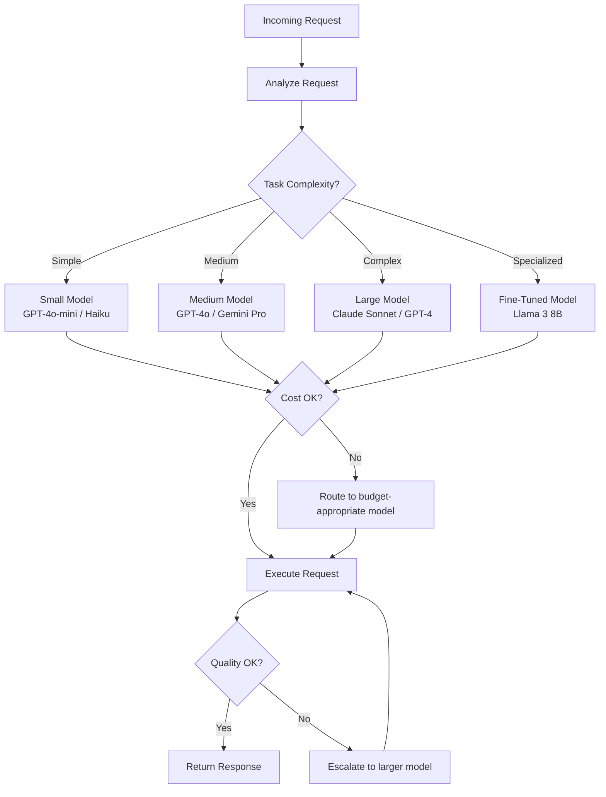

# Model Routing

Model routing intelligently selects the best model for each request based on task complexity, cost constraints, latency requirements, and quality thresholds. It is the single most impactful cost optimization strategy in an enterprise GenAI platform.

## Why Model Routing?



## Routing Strategies

### Strategy 1: Rule-Based Routing

```python
class RuleBasedRouter:
    """Route requests based on predefined rules."""

    ROUTING_RULES = [
        {
            "name": "transaction_classification",
            "condition": lambda req: req.task_type == "classification" and req.complexity == "simple",
            "model": "gpt-4o-mini",
            "reason": "Simple classification — small model sufficient",
        },
        {
            "name": "compliance_analysis",
            "condition": lambda req: req.task_type == "compliance_analysis",
            "model": "claude-3-5-sonnet",
            "reason": "Complex reasoning required — use best reasoning model",
        },
        {
            "name": "document_summarization",
            "condition": lambda req: req.task_type == "summarization" and req.document_length < 10000,
            "model": "gpt-4o",
            "reason": "Medium-length summary — GPT-4o quality and cost balance",
        },
        {
            "name": "long_document_summarization",
            "condition": lambda req: req.task_type == "summarization" and req.document_length >= 10000,
            "model": "gemini-1.5-pro",
            "reason": "Long document — Gemini has 1M token context window",
        },
        {
            "name": "code_generation",
            "condition": lambda req: req.task_type == "code_generation",
            "model": "claude-3-5-sonnet",
            "reason": "Best code generation quality",
        },
        {
            "name": "internal_search",
            "condition": lambda req: req.task_type == "search" and req.is_internal,
            "model": "llama-3-70b",
            "reason": "Internal use — self-hosted for data residency and cost",
        },
    ]

    def route(self, request: dict) -> dict:
        """Route request to appropriate model."""
        for rule in self.ROUTING_RULES:
            if rule["condition"](request):
                return {
                    "model": rule["model"],
                    "rule": rule["name"],
                    "reason": rule["reason"],
                }

        # Default: use medium model
        return {
            "model": "gpt-4o",
            "rule": "default",
            "reason": "No matching rule — default to medium model",
        }
```

### Strategy 2: Confidence-Based Escalation

```python
class ConfidenceBasedRouter:
    """Start with small model, escalate if confidence is low."""

    def __init__(self):
        self.model_hierarchy = [
            "gpt-4o-mini",       # Cheapest, try first
            "gpt-4o",            # Medium cost, medium quality
            "claude-3-5-sonnet", # Most expensive, highest quality
        ]
        self.confidence_threshold = 0.85

    async def route_with_escalation(self, request: dict) -> dict:
        """Try cheapest model, escalate if confidence is insufficient."""
        for i, model in enumerate(self.model_hierarchy):
            response = await self._call_model(model, request)

            # Check confidence
            confidence = self._assess_confidence(response, request)

            if confidence >= self.confidence_threshold:
                return {
                    "response": response,
                    "model": model,
                    "confidence": confidence,
                    "escalations": i,
                    "total_cost": self._calculate_cost(model, request),
                }

            # Not confident enough, try next model up
            if i < len(self.model_hierarchy) - 1:
                logger.info(
                    f"Low confidence ({confidence:.2f}) with {model}, "
                    f"escalating to {self.model_hierarchy[i+1]}"
                )

        # Last resort: return best model's response regardless of confidence
        return {
            "response": response,
            "model": self.model_hierarchy[-1],
            "confidence": confidence,
            "escalations": len(self.model_hierarchy) - 1,
            "total_cost": self._calculate_cost(self.model_hierarchy[-1], request),
            "warning": "Low confidence even with best model — flag for human review",
        }

    def _assess_confidence(self, response: dict, request: dict) -> float:
        """Assess response confidence."""
        # Multiple signals:
        # 1. Model's own logprobs
        logprob_confidence = self._get_logprob_confidence(response)

        # 2. Self-consistency (run prompt again, check agreement)
        # consistency = self._check_self_consistency(response, request)

        # 3. Output structure compliance
        structure_score = self._check_structure_compliance(response)

        # 4. Hallucination detection
        hallucination_score = 1.0 - self._detect_hallucinations(response, request)

        # Weighted combination
        return (
            0.4 * logprob_confidence +
            # 0.3 * consistency +
            0.3 * structure_score +
            0.3 * hallucination_score
        )
```

### Strategy 3: Task-Specific Model Selection

```python
class TaskAwareRouter:
    """Select model based on task-specific performance data."""

    def __init__(self, performance_db):
        self.performance_db = performance_db  # Historical performance data

    def select_model(self, task_type: str, constraints: dict = None) -> str:
        """Select best model for task type based on historical performance."""
        constraints = constraints or {}

        # Get historical performance for this task type
        performance = self.performance_db.get_task_performance(task_type)

        # Filter by constraints
        if "max_cost_per_request" in constraints:
            performance = [
                p for p in performance
                if p["avg_cost_per_request"] <= constraints["max_cost_per_request"]
            ]

        if "max_latency_ms" in constraints:
            performance = [
                p for p in performance
                if p["p95_latency_ms"] <= constraints["max_latency_ms"]
            ]

        if not performance:
            return "gpt-4o"  # Fallback

        # Score models: weighted combination of quality, cost, and latency
        best_model = max(
            performance,
            key=lambda p: self._score_model(p, constraints),
        )

        return best_model["model"]

    def _score_model(self, perf: dict, constraints: dict) -> float:
        """Score a model for this task."""
        # Quality is most important (weight: 0.5)
        quality_score = perf["quality_score"]  # 0-1

        # Cost matters (weight: 0.3)
        # Lower cost = higher score
        cost_score = 1.0 - min(perf["avg_cost_per_request"] / 0.01, 1.0)

        # Latency matters (weight: 0.2)
        latency_score = 1.0 - min(perf["p95_latency_ms"] / 5000, 1.0)

        return 0.5 * quality_score + 0.3 * cost_score + 0.2 * latency_score
```

## Fallback Chains

### Multi-Provider Fallback

```python
class FallbackChain:
    """Try models/providers in order, falling back on failure."""

    FALLBACK_ORDER = [
        {
            "model": "gpt-4o",
            "provider": "openai",
            "timeout": 30,
            "reason": "Primary model — best overall quality",
        },
        {
            "model": "claude-3-5-sonnet",
            "provider": "anthropic",
            "timeout": 30,
            "reason": "Fallback 1 — comparable quality",
        },
        {
            "model": "gemini-1.5-pro",
            "provider": "google",
            "timeout": 30,
            "reason": "Fallback 2 — good quality, large context",
        },
        {
            "model": "llama-3-70b",
            "provider": "self-hosted",
            "timeout": 60,
            "reason": "Last resort — self-hosted, always available",
        },
    ]

    async def execute(self, prompt: dict) -> dict:
        """Execute with fallback chain."""
        last_error = None

        for fallback in self.FALLBACK_ORDER:
            try:
                response = await asyncio.wait_for(
                    self._call_provider(
                        provider=fallback["provider"],
                        model=fallback["model"],
                        prompt=prompt,
                    ),
                    timeout=fallback["timeout"],
                )

                return {
                    "response": response,
                    "model": fallback["model"],
                    "provider": fallback["provider"],
                    "fallback_used": fallback != self.FALLBACK_ORDER[0],
                    "fallback_level": self.FALLBACK_ORDER.index(fallback),
                }

            except asyncio.TimeoutError:
                last_error = TimeoutError(f"{fallback['provider']} timed out")
                logger.warning(f"Timeout with {fallback['provider']}, trying fallback")

            except Exception as e:
                last_error = e
                logger.warning(f"Error with {fallback['provider']}: {e}, trying fallback")

        # All providers failed
        raise FallbackChainExhaustedError(
            f"All {len(self.FALLBACK_ORDER)} providers failed. Last error: {last_error}"
        )
```

## Routing Observability

```python
class RoutingMetrics:
    """Track routing decisions and their outcomes."""

    def __init__(self, statsd_client):
        self.statsd = statsd_client

    def record_routing_decision(self, decision: dict):
        """Record a routing decision."""
        tags = [
            f"model:{decision['model']}",
            f"task_type:{decision.get('task_type', 'unknown')}",
            f"fallback_used:{decision.get('fallback_used', False)}",
        ]

        self.statsd.increment("genai.routing.decision", tags=tags)

        if decision.get("fallback_used"):
            self.statsd.increment("genai.routing.fallback", tags=tags)

    def record_escalation(self, from_model: str, to_model: str,
                          reason: str, confidence: float):
        """Record a model escalation."""
        self.statsd.increment("genai.routing.escalation", tags=[
            f"from:{from_model}",
            f"to:{to_model}",
            f"reason:{reason}",
        ])

        self.statsd.gauge("genai.routing.escalation_confidence", confidence, tags=[
            f"from:{from_model}",
            f"to:{to_model}",
        ])

    def get_routing_report(self, period: str = "24h") -> dict:
        """Get routing performance report."""
        return {
            "total_requests": self.statsd.count("genai.routing.decision", period),
            "fallback_rate": self.statsd.rate("genai.routing.fallback", period),
            "escalation_rate": self.statsd.rate("genai.routing.escalation", period),
            "model_distribution": self.statsd.breakdown("genai.routing.decision",
                                                       by="model", period=period),
            "avg_cost_by_model": self.statsd.avg("genai.cost.per_request",
                                                  by="model", period=period),
            "quality_by_model": self.statsd.avg("genai.quality.score",
                                                 by="model", period=period),
        }
```

## Common Mistakes and Anti-Patterns

### Anti-Pattern 1: Static Model Assignment

```python
# WRONG: Hardcoded model for all requests
model = "gpt-4o"  # Every request uses GPT-4o — expensive

# RIGHT: Route based on task
model = router.select_model(task_type, complexity, constraints)
```

### Anti-Pattern 2: No Fallback

```python
# WRONG: Single provider, no fallback
response = openai_client.complete(prompt)
# If OpenAI is down, entire feature is down

# RIGHT: Fallback chain
response = await fallback_chain.execute(prompt)
```

### Anti-Pattern 3: Escalating Too Eagerly

```python
# WRONG: Escalate on any uncertainty
if confidence < 0.99:  # Almost never met
    escalate_to_larger_model()
# Result: Almost everything uses the expensive model

# RIGHT: Set appropriate thresholds
THRESHOLDS = {
    "simple_classification": 0.90,  # Need high confidence for simple tasks
    "summarization": 0.80,  # Summaries are inherently subjective
    "compliance_analysis": 0.85,  # Important but expensive
    "creative_content": None,  # Don't escalate — subjective
}
```

### Anti-Pattern 4: Not Tracking Escalation Costs

```python
# WRONG: Only tracking the final model's cost
# Ignores the cost of the failed attempt with the smaller model

# RIGHT: Track total cost including escalations
total_cost = sum(attempt.cost for attempt in all_attempts)
# This reveals the true cost of the escalation strategy
```

## Interview Questions

1. Design a model routing system that minimizes cost while maintaining quality.
2. When should you escalate from a small model to a large model?
3. How do you handle a situation where all providers in your fallback chain are down?
4. A team complains that model routing is sending their requests to the wrong model. How do you debug?
5. How do you measure the effectiveness of your routing strategy?

## Cross-References

- [cost-optimization.md](./cost-optimization.md) — Cost reduction through routing
- [multi-model-architecture.md](./multi-model-architecture.md) — Multi-provider setup
- [model-observability.md](./model-observability.md) — Monitoring model quality
- [evaluation-frameworks/](./evaluation-frameworks/) — Measuring model quality per task
- [caching.md](./caching.md) — Caching to avoid model calls entirely
