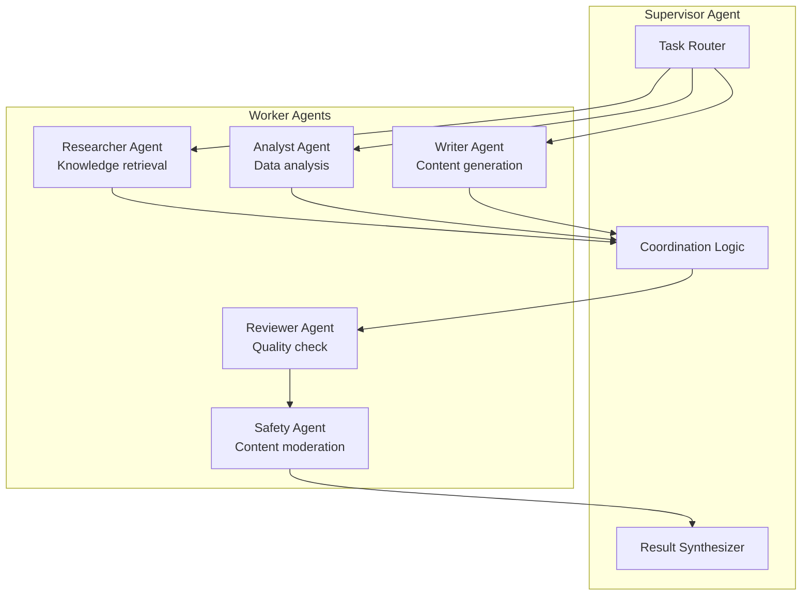

# Multi-Agent Systems

This directory covers building multi-agent architectures for GenAI applications, including orchestration, coordination, and conflict resolution patterns.

## Key Topics

- Multi-agent orchestration patterns
- Agent coordination and handoff
- Conflict resolution between agents
- Supervisor/worker architectures
- CrewAI, AutoGen, and LangGraph for multi-agent systems
- Safety controls for multi-agent systems

## Multi-Agent Architecture

## Banking Multi-Agent Use Cases

| Use Case | Agents Involved | Coordination Pattern |
|----------|----------------|---------------------|
| Compliance Investigation | Researcher → Analyst → Writer → Reviewer | Sequential pipeline |
| Customer Query | Router → Specialist Agent → Safety Check | Router to specialist |
| Fraud Analysis | Data Agent → Pattern Agent → Narrative Agent | Parallel + synthesis |
| Code Review | Security Agent → Style Agent → Logic Agent | Parallel review + merge |

## Cross-References

- [../agents.md](../agents.md) — Single agent architectures
- [../tool-calling.md](../tool-calling.md) — Tool use by agents
- [../ai-safety.md](../ai-safety.md) — Multi-agent safety controls
- [../langchain/](../langchain/) — LangGraph for agent orchestration
