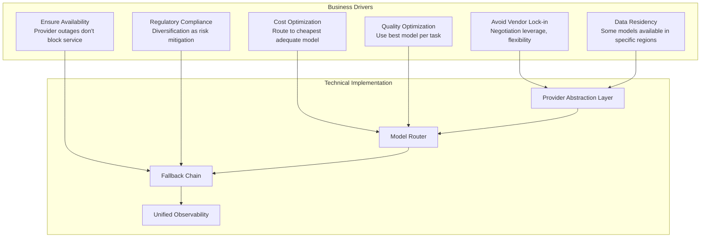

# Multi-Model Architecture

A multi-model architecture uses multiple LLM providers and models simultaneously, avoiding vendor lock-in, enabling fallback chains, optimizing costs, and ensuring availability.

## Why Multi-Model?



## Provider Abstraction Layer

```python
from abc import ABC, abstractmethod
from typing import Optional
from dataclasses import dataclass

@dataclass
class ModelResponse:
    """Unified response from any provider."""
    content: str
    model: str
    provider: str
    input_tokens: int
    output_tokens: int
    cost_usd: float
    latency_ms: float
    logprobs: Optional[dict] = None
    finish_reason: Optional[str] = None
    tool_calls: Optional[list] = None
    cache_hit: bool = False

class ModelProvider(ABC):
    """Abstract interface for model providers."""

    @abstractmethod
    async def complete(
        self,
        model: str,
        messages: list[dict],
        temperature: float = 0,
        max_tokens: Optional[int] = None,
        tools: Optional[list] = None,
        **kwargs,
    ) -> ModelResponse:
        pass

    @abstractmethod
    async def embed(self, model: str, text: str) -> list[float]:
        pass

    @abstractmethod
    def get_available_models(self) -> list[dict]:
        pass

    @abstractmethod
    def get_pricing(self, model: str) -> dict:
        pass
```

### OpenAI Provider Implementation

```python
class OpenAIProvider(ModelProvider):
    """OpenAI provider implementation."""

    def __init__(self, api_key: str, organization: Optional[str] = None):
        from openai import AsyncOpenAI
        self.client = AsyncOpenAI(
            api_key=api_key,
            organization=organization,
        )
        self.pricing = {
            "gpt-4o": {"input": 2.50, "output": 10.00},
            "gpt-4o-mini": {"input": 0.15, "output": 0.60},
            "gpt-4-turbo": {"input": 10.00, "output": 30.00},
            "text-embedding-3-small": {"per_1k": 0.02},
            "text-embedding-3-large": {"per_1k": 0.13},
        }

    async def complete(self, model, messages, temperature=0,
                       max_tokens=None, tools=None, **kwargs) -> ModelResponse:
        import time
        start = time.time()

        response = await self.client.chat.completions.create(
            model=model,
            messages=messages,
            temperature=temperature,
            max_tokens=max_tokens,
            tools=tools,
            **kwargs,
        )

        latency = (time.time() - start) * 1000

        choice = response.choices[0]
        input_tokens = response.usage.prompt_tokens
        output_tokens = response.usage.completion_tokens

        cost = self._calculate_cost(model, input_tokens, output_tokens)

        return ModelResponse(
            content=choice.message.content,
            model=model,
            provider="openai",
            input_tokens=input_tokens,
            output_tokens=output_tokens,
            cost_usd=cost,
            latency_ms=latency,
            tool_calls=choice.message.tool_calls,
            finish_reason=choice.finish_reason,
        )

    def _calculate_cost(self, model: str, input_tokens: int,
                        output_tokens: int) -> float:
        rates = self.pricing.get(model, {"input": 0, "output": 0})
        return (
            input_tokens / 1_000_000 * rates["input"] +
            output_tokens / 1_000_000 * rates["output"]
        )
```

### Anthropic Provider Implementation

```python
class AnthropicProvider(ModelProvider):
    """Anthropic (Claude) provider implementation."""

    def __init__(self, api_key: str):
        from anthropic import AsyncAnthropic
        self.client = AsyncAnthropic(api_key=api_key)
        self.pricing = {
            "claude-3-5-sonnet-20241022": {"input": 3.00, "output": 15.00},
            "claude-3-5-haiku-20241022": {"input": 0.80, "output": 4.00},
            "claude-3-opus-20240229": {"input": 15.00, "output": 75.00},
        }

    async def complete(self, model, messages, temperature=0,
                       max_tokens=None, tools=None, **kwargs) -> ModelResponse:
        import time
        start = time.time()

        # Anthropic uses different message format
        system_message = None
        anthropic_messages = []
        for msg in messages:
            if msg["role"] == "system":
                system_message = msg["content"]
            else:
                anthropic_messages.append(msg)

        response = await self.client.messages.create(
            model=model,
            messages=anthropic_messages,
            system=system_message,
            max_tokens=max_tokens or 4096,
            temperature=temperature,
            tools=tools,
            **kwargs,
        )

        latency = (time.time() - start) * 1000

        input_tokens = response.usage.input_tokens
        output_tokens = response.usage.output_tokens
        cost = self._calculate_cost(model, input_tokens, output_tokens)

        return ModelResponse(
            content=response.content[0].text,
            model=model,
            provider="anthropic",
            input_tokens=input_tokens,
            output_tokens=output_tokens,
            cost_usd=cost,
            latency_ms=latency,
            finish_reason=response.stop_reason,
        )
```

### Unified Gateway

```python
class ModelGateway:
    """Unified gateway to all model providers."""

    def __init__(self):
        self.providers = {
            "openai": OpenAIProvider(api_key=config.OPENAI_API_KEY),
            "anthropic": AnthropicProvider(api_key=config.ANTHROPIC_API_KEY),
            "google": GoogleProvider(api_key=config.GOOGLE_API_KEY),
            "self-hosted": SelfHostedProvider(base_url=config.LOCAL_MODEL_URL),
        }
        self.router = ModelRouter(self)
        self.fallback = FallbackChain(self)

    async def complete(self, request: dict) -> ModelResponse:
        """Route and execute request."""
        # Check cache first
        cached = await self.cache.get(request)
        if cached:
            return cached

        # Route to appropriate model
        routing = self.router.route(request)

        # Execute with fallback
        response = await self.fallback.execute(
            prompt=request,
            preferred_model=routing["model"],
            provider_order=routing.get("provider_order", ["openai"]),
        )

        # Cache response
        await self.cache.set(request, response)

        # Record metrics
        self.metrics.record(response)

        return response
```

## Provider Health Monitoring

```python
class ProviderHealthMonitor:
    """Monitor provider health and automatically detect issues."""

    def __init__(self, gateway):
        self.gateway = gateway
        self.health_status = {}
        self.check_interval = 60  # seconds

    async def start_monitoring(self):
        """Start continuous health monitoring."""
        while True:
            for provider_name in self.gateway.providers:
                await self._check_provider_health(provider_name)
            await asyncio.sleep(self.check_interval)

    async def _check_provider_health(self, provider_name: str):
        """Check if a provider is healthy."""
        try:
            # Send a simple test request
            test_prompt = [{"role": "user", "content": "Say 'healthy' in one word."}]
            response = await asyncio.wait_for(
                self.gateway.providers[provider_name].complete(
                    model=self._get_test_model(provider_name),
                    messages=test_prompt,
                    max_tokens=5,
                ),
                timeout=15,
            )

            # Check response
            if response and response.content:
                self._mark_healthy(provider_name)
            else:
                self._mark_unhealthy(provider_name, "Empty response")

        except asyncio.TimeoutError:
            self._mark_unhealthy(provider_name, "Request timed out")
        except Exception as e:
            self._mark_unhealthy(provider_name, str(e))

    def _mark_healthy(self, provider: str):
        self.health_status[provider] = {
            "status": "healthy",
            "last_check": datetime.utcnow().isoformat(),
            "consecutive_failures": 0,
        }

    def _mark_unhealthy(self, provider: str, error: str):
        status = self.health_status.get(provider, {"consecutive_failures": 0})
        status["consecutive_failures"] = status.get("consecutive_failures", 0) + 1
        status["status"] = "unhealthy"
        status["error"] = error
        status["last_check"] = datetime.utcnow().isoformat()
        self.health_status[provider] = status

        # After 3 consecutive failures, alert
        if status["consecutive_failures"] >= 3:
            self._alert_provider_down(provider, error)

    def get_healthy_providers(self) -> list[str]:
        """Get list of healthy providers."""
        return [
            name for name, status in self.health_status.items()
            if status.get("status") == "healthy"
        ]
```

## Migration Strategy

### Gradual Provider Migration

```python
# Scenario: Migrating from OpenAI-only to multi-provider

MIGRATION_PHASES = [
    {
        "phase": 1,
        "description": "Shadow mode — send to new provider but don't use response",
        "duration": "2 weeks",
        "traffic": {"openai": 100, "anthropic": 0},  # Percentage
        "shadow": {"anthropic": 100},  # Shadow all requests
        "goal": "Validate quality and latency without user impact",
    },
    {
        "phase": 2,
        "description": "Canary — route 5% to new provider",
        "duration": "1 week",
        "traffic": {"openai": 95, "anthropic": 5},
        "shadow": {},
        "goal": "Test in production with minimal risk",
    },
    {
        "phase": 3,
        "description": "Gradual ramp — increase to 25%",
        "duration": "1 week",
        "traffic": {"openai": 75, "anthropic": 25},
        "goal": "Increase traffic while monitoring quality",
    },
    {
        "phase": 4,
        "description": "Task-based routing — route by task type",
        "duration": "ongoing",
        "traffic": "dynamic based on router",
        "goal": "Optimize cost and quality per task",
    },
]
```

## Common Mistakes and Anti-Patterns

### Anti-Pattern 1: Tight Coupling to Provider SDK

```python
# WRONG: Code directly uses OpenAI SDK
from openai import OpenAI
client = OpenAI()
response = client.chat.completions.create(model="gpt-4o", ...)
# Now you can't switch to Anthropic without rewriting everything

# RIGHT: Use abstraction layer
response = await model_gateway.complete(request)
# Underlying provider is transparent
```

### Anti-Pattern 2: Assuming All Providers Have Same API

```python
# WRONG: Assuming all providers support identical features
# OpenAI has function calling, Anthropic has tool use
# APIs differ significantly

# RIGHT: Abstract and handle differences
class ModelGateway:
    def _normalize_tools(self, tools, provider):
        """Convert tools to provider-specific format."""
        if provider == "openai":
            return [{"type": "function", "function": t} for t in tools]
        elif provider == "anthropic":
            return tools  # Anthropic native format
        # ...
```

### Anti-Pattern 3: No Fallback Planning

```python
# WRONG: Single provider = single point of failure
# OpenAI outage = your entire GenAI platform is down

# RIGHT: Fallback chain
FALLBACK_ORDER = ["openai", "anthropic", "google", "self-hosted"]
# If primary is down, automatically fail over
```

## Interview Questions

1. How do you design a provider-agnostic GenAI platform?
2. A provider increases prices by 5x. How does your architecture handle this?
3. How do you ensure consistent quality across different providers?
4. Design a health monitoring system for multiple model providers.
5. How do you migrate from a single provider to multi-provider with zero downtime?

## Cross-References

- [model-routing.md](./model-routing.md) — Routing across providers
- [openai/](./openai/) — OpenAI provider details
- [claude/](./claude/) — Anthropic provider details
- [gemini/](./gemini/) — Google provider details
- [open-source-models/](./open-source-models/) — Self-hosted provider details
- [cost-optimization.md](./cost-optimization.md) — Multi-provider cost optimization
