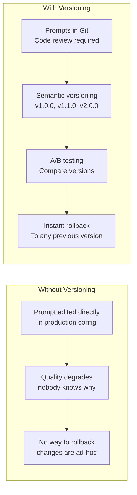

# Prompt Versioning

Prompt versioning manages the lifecycle of prompts across development, testing, and production. In enterprise GenAI platforms, prompts are critical code artifacts that require the same rigor as any other production code.

## Why Prompt Versioning Matters



## Prompt Versioning Architecture

### Prompt Registry

```python
from dataclasses import dataclass
from typing import Optional
from enum import Enum

class PromptStatus(Enum):
    DRAFT = "draft"
    TESTING = "testing"
    STAGING = "staging"
    PRODUCTION = "production"
    DEPRECATED = "deprecated"
    ARCHIVED = "archived"

@dataclass
class PromptVersion:
    """A versioned prompt."""
    prompt_id: str          # e.g., "compliance_analysis_v2"
    version: str            # e.g., "1.2.0" (semver)
    status: PromptStatus
    system_prompt: str
    user_prompt_template: str
    model: str              # Intended model
    temperature: float
    max_tokens: int
    tools: Optional[list] = None
    few_shot_examples: Optional[list] = None
    metadata: dict = None   # Author, description, changelog
    created_at: Optional[str] = None
    created_by: Optional[str] = None
    test_results: Optional[dict] = None

@dataclass
class PromptRollout:
    """Active rollout configuration."""
    prompt_id: str
    primary_version: str    # e.g., "1.2.0"
    canary_version: Optional[str] = None  # e.g., "1.3.0-rc1"
    canary_traffic_percent: float = 0.0   # 0-100
    application: str        # Which app uses this prompt
    environment: str        # prod, staging, test
    updated_at: Optional[str] = None
```

### Prompt Registry Service

```python
class PromptRegistry:
    """Manage prompt versions."""

    def __init__(self, db_client, git_integration):
        self.db = db_client
        self.git = git_integration

    def create_version(self, prompt: PromptVersion) -> str:
        """Create a new prompt version."""
        # Validate version format
        if not self._is_valid_semver(prompt.version):
            raise ValueError(f"Invalid semantic version: {prompt.version}")

        # Check for duplicate version
        existing = self.db.get_prompt_version(prompt.prompt_id, prompt.version)
        if existing:
            raise ValueError(
                f"Version {prompt.version} already exists for {prompt.prompt_id}"
            )

        # Save to database
        prompt.created_at = datetime.utcnow().isoformat()
        prompt.metadata = prompt.metadata or {}
        prompt.metadata["token_count"] = self._count_tokens(prompt)

        self.db.insert("prompt_versions", prompt)

        # Commit to Git
        self.git.commit_prompt(prompt)

        return prompt.version

    def promote(self, prompt_id: str, version: str,
                new_status: PromptStatus) -> PromptVersion:
        """Promote a prompt version to next stage."""
        prompt = self.db.get_prompt_version(prompt_id, version)
        if not prompt:
            raise ValueError(f"Prompt version not found: {prompt_id}@{version}")

        # Validate promotion path
        valid_transitions = {
            PromptStatus.DRAFT: [PromptStatus.TESTING],
            PromptStatus.TESTING: [PromptStatus.STAGING, PromptStatus.DRAFT],
            PromptStatus.STAGING: [PromptStatus.PRODUCTION, PromptStatus.TESTING],
            PromptStatus.PRODUCTION: [PromptStatus.DEPRECATED],
        }

        if new_status not in valid_transitions.get(prompt.status, []):
            raise ValueError(
                f"Cannot promote from {prompt.status.value} to {new_status.value}"
            )

        # Check test results before promoting to staging
        if new_status == PromptStatus.STAGING:
            if not prompt.test_results or prompt.test_results.get("score", 0) < 0.85:
                raise ValueError(
                    "Test results insufficient for staging (score < 0.85)"
                )

        prompt.status = new_status
        self.db.update("prompt_versions",
                      {"prompt_id": prompt_id, "version": version},
                      {"status": new_status.value})

        return prompt

    def rollback(self, prompt_id: str, target_version: str,
                 environment: str) -> PromptRollout:
        """Rollback to a previous version."""
        # Verify target version exists and is production-ready
        target = self.db.get_prompt_version(prompt_id, target_version)
        if not target:
            raise ValueError(f"Version not found: {target_version}")

        if target.status not in (PromptStatus.PRODUCTION, PromptStatus.STAGING):
            raise ValueError(
                f"Cannot rollback to {target.status.value} version"
            )

        rollout = self.db.get_active_rollout(prompt_id, environment)
        if not rollout:
            raise ValueError(f"No active rollout for {prompt_id} in {environment}")

        # Update rollout to target version
        rollout.primary_version = target_version
        rollout.canary_version = None
        rollout.canary_traffic_percent = 0
        rollout.updated_at = datetime.utcnow().isoformat()

        self.db.update_rollout(rollout)

        return rollout
```

## A/B Testing Prompts

```python
class PromptABTest:
    """Run A/B tests between prompt versions."""

    def __init__(self, db_client, stats_client):
        self.db = db_client
        self.stats = stats_client
        self.active_tests: dict[str, dict] = {}

    def start_test(self, prompt_id: str, version_a: str, version_b: str,
                   traffic_split: float = 50.0, application: str = None) -> str:
        """Start an A/B test between two prompt versions."""
        test_id = f"ab-{prompt_id}-{version_a}-{version_b}"

        test_config = {
            "test_id": test_id,
            "prompt_id": prompt_id,
            "version_a": version_a,
            "version_b": version_b,
            "traffic_split": traffic_split,
            "application": application,
            "started_at": datetime.utcnow().isoformat(),
            "status": "running",
            "metrics": {"a": {}, "b": {}},
        }

        self.db.insert("ab_tests", test_config)
        self.active_tests[test_id] = test_config

        return test_id

    def route_request(self, test_id: str, request_id: str) -> str:
        """Route request to version A or B based on traffic split."""
        test = self.active_tests[test_id]

        # Deterministic assignment based on request_id hash
        hash_value = int(hashlib.md5(request_id.encode()).hexdigest(), 16)
        assigned = "a" if (hash_value % 100) < test["traffic_split"] else "b"

        version = test[f"version_{assigned}"]

        # Record assignment
        self.db.insert("ab_test_assignments", {
            "test_id": test_id,
            "request_id": request_id,
            "assigned_version": assigned,
            "prompt_version": version,
        })

        return version

    def record_result(self, test_id: str, request_id: str,
                      metrics: dict):
        """Record result for an A/B test assignment."""
        assignment = self.db.get_ab_assignment(test_id, request_id)
        if not assignment:
            return

        self.db.insert("ab_test_results", {
            "test_id": test_id,
            "request_id": request_id,
            "assigned_version": assignment["assigned_version"],
            "prompt_version": assignment["prompt_version"],
            "metrics": metrics,
            "recorded_at": datetime.utcnow().isoformat(),
        })

    def get_results(self, test_id: str) -> dict:
        """Get A/B test results with statistical analysis."""
        results = self.db.get_test_results(test_id)

        version_a_metrics = self._aggregate([
            r["metrics"] for r in results if r["assigned_version"] == "a"
        ])
        version_b_metrics = self._aggregate([
            r["metrics"] for r in results if r["assigned_version"] == "b"
        ])

        # Statistical significance
        significance = self._calculate_significance(
            version_a_metrics, version_b_metrics,
            len([r for r in results if r["assigned_version"] == "a"]),
            len([r for r in results if r["assigned_version"] == "b"]),
        )

        return {
            "test_id": test_id,
            "version_a": {
                "version": results[0]["prompt_version"] if results else None,
                "n_requests": len([r for r in results
                                   if r["assigned_version"] == "a"]),
                "metrics": version_a_metrics,
            },
            "version_b": {
                "version": results[0]["prompt_version"] if results else None,
                "n_requests": len([r for r in results
                                   if r["assigned_version"] == "b"]),
                "metrics": version_b_metrics,
            },
            "statistical_significance": significance,
            "winner": significance.get("winner"),
            "recommendation": self._recommendation(significance),
        }
```

## Canary Rollouts for Prompt Changes

```python
class PromptCanaryDeployer:
    """Canary deployment for prompt changes."""

    def __init__(self, db_client, routing_service):
        self.db = db_client
        self.routing = routing_service

    async def deploy_canary(self, prompt_id: str, new_version: str,
                            environment: str, initial_percent: float = 5.0):
        """Deploy new version as canary."""
        rollout = self.db.get_active_rollout(prompt_id, environment)

        if not rollout:
            raise ValueError(f"No active rollout for {prompt_id}")

        rollout.canary_version = new_version
        rollout.canary_traffic_percent = initial_percent
        rollout.updated_at = datetime.utcnow().isoformat()

        self.db.update_rollout(rollout)

        # Update routing service
        await self.routing.update_weights(
            prompt_id=prompt_id,
            weights={
                rollout.primary_version: 100 - initial_percent,
                new_version: initial_percent,
            },
        )

    async def analyze_canary(self, prompt_id: str, environment: str) -> dict:
        """Analyze canary performance."""
        rollout = self.db.get_active_rollout(prompt_id, environment)
        if not rollout or not rollout.canary_version:
            return {"status": "no_canary"}

        primary_metrics = self._get_metrics(
            prompt_id, rollout.primary_version, environment
        )
        canary_metrics = self._get_metrics(
            prompt_id, rollout.canary_version, environment
        )

        # Compare
        comparison = self._compare_metrics(primary_metrics, canary_metrics)

        return {
            "status": "analyzing",
            "primary_version": rollout.primary_version,
            "canary_version": rollout.canary_version,
            "canary_traffic": rollout.canary_traffic_percent,
            "comparison": comparison,
            "recommendation": self._canary_recommendation(comparison),
        }

    async def promote_canary(self, prompt_id: str, environment: str,
                             new_percent: Optional[float] = None):
        """Increase canary traffic or fully promote."""
        rollout = self.db.get_active_rollout(prompt_id, environment)

        if new_percent and new_percent < 100:
            # Gradual increase
            rollout.canary_traffic_percent = new_percent
        else:
            # Full promotion
            rollout.primary_version = rollout.canary_version
            rollout.canary_version = None
            rollout.canary_traffic_percent = 0

        rollout.updated_at = datetime.utcnow().isoformat()
        self.db.update_rollout(rollout)

        await self.routing.update_weights(
            prompt_id=prompt_id,
            weights={
                rollout.primary_version: 100 - rollout.canary_traffic_percent,
                **({rollout.canary_version: rollout.canary_traffic_percent}
                  if rollout.canary_version else {}),
            },
        )

    async def abort_canary(self, prompt_id: str, environment: str):
        """Abort canary and rollback to primary."""
        rollout = self.db.get_active_rollout(prompt_id, environment)
        rollout.canary_version = None
        rollout.canary_traffic_percent = 0
        rollout.updated_at = datetime.utcnow().isoformat()

        self.db.update_rollout(rollout)

        await self.routing.update_weights(
            prompt_id=prompt_id,
            weights={rollout.primary_version: 100},
        )
```

## Prompt Change Management

### Git Workflow for Prompts

```yaml
# prompts/compliance_analysis.yaml
id: compliance_analysis
description: "Analyze transaction for compliance risk"
owner: compliance-engineering
model: claude-3-5-sonnet

versions:
  - version: "1.0.0"
    status: deprecated
    system_prompt: |
      You are a compliance analyst...
    changelog: "Initial version"

  - version: "1.1.0"
    status: production
    system_prompt: |
      You are a Senior Compliance Analyst...
    changelog: "Added structured output format"
    test_results:
      accuracy: 0.92
      hallucination_rate: 0.02
      human_approval_rate: 0.95

  - version: "1.2.0"
    status: staging
    system_prompt: |
      You are a Senior Compliance Analyst at a global bank...
    changelog: |
      - Added AML-specific safety rules
      - Improved risk factor extraction
      - Added regulatory citation requirements
    test_results:
      accuracy: 0.94
      hallucination_rate: 0.01
      human_approval_rate: 0.97
```

### PR Review Process

```markdown
## Prompt Change: compliance_analysis v1.2.0

### What Changed
- Added AML-specific safety rules (no tipping off)
- Improved risk factor extraction with structured output
- Added regulatory citation requirements

### Testing
- Accuracy: 0.94 (was 0.92) ✅
- Hallucination rate: 0.01 (was 0.02) ✅
- Human approval rate: 0.97 (was 0.95) ✅
- Token count: 450 (was 380) ⚠️ (+18%)
- Latency p95: 4.2s (was 3.8s) ⚠️ (+10%)

### Risk Assessment
- Risk level: MEDIUM (compliance-critical)
- Rollback plan: Revert to v1.1.0 immediately
- Monitoring: Hallucination rate, human override rate

### Reviewers
- [ ] Compliance SME: Verify accuracy of AML rules
- [ ] Security: Verify no prompt injection vulnerabilities
- [ ] Platform: Verify token and latency impact acceptable
```

## Interview Questions

1. Why is prompt versioning important for production GenAI systems?
2. How do you run an A/B test between two prompt versions?
3. A new prompt version has a 5% higher hallucination rate. What do you do?
4. Design a canary rollout process for prompt changes.
5. How do you ensure prompt changes go through proper review before production?

## Cross-References

- [prompt-engineering.md](./prompt-engineering.md) — Prompt design patterns
- [safe-rollout-strategies.md](./safe-rollout-strategies.md) — Deployment strategies
- [evaluation-frameworks/](./evaluation-frameworks/) — Prompt testing pipelines
- [prompt-libraries/](./prompt-libraries/) — Centralized prompt management
- [model-observability.md](./model-observability.md) — Monitoring prompt quality
