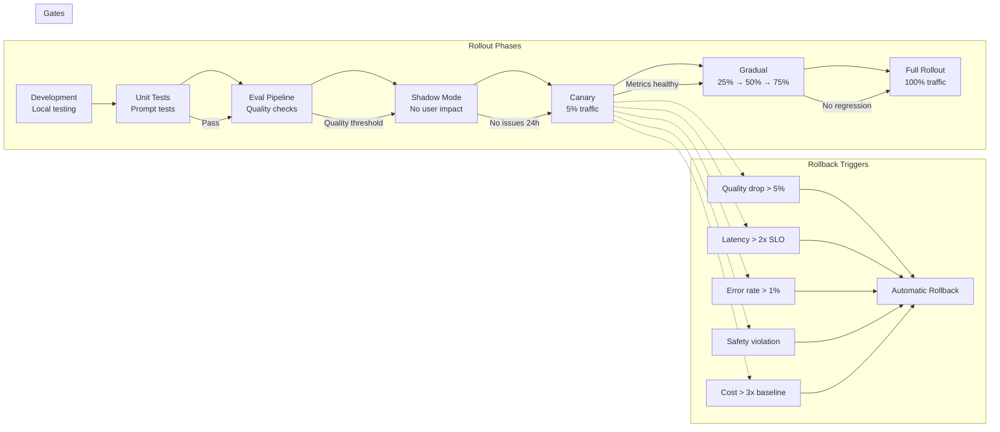

# Safe Rollout Strategies

Deploying GenAI applications to production requires careful rollout strategies to minimize risk, catch issues early, and enable rapid rollback. This guide covers phased deployment patterns for enterprise GenAI systems.

## Rollout Strategy Overview



## Phase 1: Development Testing

### Prompt Unit Tests

```yaml
# tests/prompts/compliance_analysis_v1.yaml
prompt_id: compliance_analysis
version: "1.0.0"

unit_tests:
  - name: "high_risk_transaction"
    input:
      customer_tenure_days: 3
      transaction_amount: 50000
      destination: "British Virgin Islands"
      customer_occupation: "Student"
    expected:
      risk_level: "HIGH"
      recommended_action: "ESCALATE"
      min_risk_factors: 3
    must_not_contain: ["account number", "SSN", "passport"]

  - name: "low_risk_transaction"
    input:
      customer_tenure_days: 3650
      transaction_amount: 3200
      destination: "UK Employer Ltd"
      customer_occupation: "Software Engineer"
    expected:
      risk_level: "LOW"
      recommended_action: "MONITOR"

  - name: "medium_risk_cash_deposit"
    input:
      customer_tenure_days: 730
      transaction_amount: 9500
      destination: "Cash Deposit"
      customer_occupation: "Restaurant Owner"
    expected:
      risk_level: "MEDIUM"
      recommended_action: "MONITOR"

token_budget:
  max_input_tokens: 5000
  max_output_tokens: 500
```

### Automated Test Runner

```python
class PromptTestRunner:
    """Run unit tests against prompts."""

    def __init__(self, llm_client, test_suite: dict):
        self.llm = llm_client
        self.suite = test_suite

    async def run_all(self) -> dict:
        """Run all tests in suite."""
        results = []
        for test in self.suite["unit_tests"]:
            result = await self.run_test(test)
            results.append(result)

        passed = sum(1 for r in results if r["passed"])
        failed = sum(1 for r in results if not r["passed"])

        return {
            "total": len(results),
            "passed": passed,
            "failed": failed,
            "pass_rate": passed / len(results) if results else 0,
            "results": results,
            "all_passed": failed == 0,
        }

    async def run_test(self, test: dict) -> dict:
        """Run a single test case."""
        # Build prompt from test input
        prompt = self._build_prompt(test["input"])

        # Call model
        response = await self.llm.complete(
            model=self.suite.get("model", "gpt-4o"),
            prompt=prompt,
            temperature=0,  # Deterministic for testing
        )

        # Parse output
        parsed = self._parse_output(response.content)

        # Check assertions
        checks = {}
        for key, expected in test["expected"].items():
            actual = parsed.get(key)
            checks[key] = {
                "expected": expected,
                "actual": actual,
                "passed": actual == expected,
            }

        # Check "must not contain"
        forbidden_check = True
        forbidden_found = []
        for forbidden in test.get("must_not_contain", []):
            if forbidden.lower() in response.content.lower():
                forbidden_found.append(forbidden)
                forbidden_check = False

        # Check token budget
        token_check = (
            response.input_tokens <= self.suite["token_budget"]["max_input_tokens"]
            and response.output_tokens <= self.suite["token_budget"]["max_output_tokens"]
        )

        all_passed = (
            all(c["passed"] for c in checks.values())
            and forbidden_check
            and token_check
        )

        return {
            "name": test["name"],
            "passed": all_passed,
            "checks": checks,
            "forbidden_found": forbidden_found,
            "token_usage": {
                "input": response.input_tokens,
                "output": response.output_tokens,
                "within_budget": token_check,
            },
            "raw_response": response.content,
        }
```

## Phase 2: Evaluation Pipeline

```python
class EvaluationPipeline:
    """Run comprehensive evaluation before deployment."""

    def __init__(self, test_dataset: list[dict], eval_framework):
        self.dataset = test_dataset
        self.eval = eval_framework

    async def run_evaluation(self, prompt_version: str, model: str) -> dict:
        """Run full evaluation suite."""
        results = {}

        # 1. Accuracy evaluation
        results["accuracy"] = await self.eval.accuracy(
            self.dataset, prompt_version, model
        )

        # 2. Hallucination evaluation
        results["hallucination"] = await self.eval.hallucination(
            self.dataset, prompt_version, model
        )

        # 3. Latency evaluation
        results["latency"] = await self.eval.latency(
            self.dataset, prompt_version, model
        )

        # 4. Cost evaluation
        results["cost"] = await self.eval.cost(
            self.dataset, prompt_version, model
        )

        # 5. Safety evaluation
        results["safety"] = await self.eval.safety(
            self.dataset, prompt_version, model
        )

        # Overall pass/fail
        deployment_ready = (
            results["accuracy"]["score"] >= 0.90 and
            results["hallucination"]["rate"] <= 0.03 and
            results["latency"]["p95_ms"] <= 5000 and
            results["safety"]["violations"] == 0
        )

        return {
            "prompt_version": prompt_version,
            "model": model,
            "results": results,
            "deployment_ready": deployment_ready,
            "evaluated_at": datetime.utcnow().isoformat(),
        }
```

## Phase 3: Shadow Mode

In shadow mode, requests are sent to the new version but the response is NOT shown to users. This allows comparison without risk.

```python
class ShadowModeHandler:
    """Run shadow mode for new versions."""

    def __init__(self, primary_handler, shadow_handler, metrics):
        self.primary = primary_handler
        self.shadow = shadow_handler
        self.metrics = metrics

    async def handle_request(self, request: dict) -> dict:
        """Handle request with primary + shadow."""
        # Primary response (shown to user)
        primary_response = await self.primary.handle(request)

        # Shadow response (NOT shown to user)
        try:
            shadow_response = await asyncio.wait_for(
                self.shadow.handle(request),
                timeout=30,
            )

            # Compare responses
            comparison = self._compare_responses(
                primary_response, shadow_response
            )

            # Record shadow metrics
            self.metrics.record_shadow_comparison(comparison)
            self.metrics.record_shadow_latency(shadow_response.latency_ms)

        except Exception as e:
            self.metrics.record_shadow_error(str(e))

        # Always return primary response
        return primary_response

    def _compare_responses(self, primary: dict, shadow: dict) -> dict:
        """Compare primary and shadow responses."""
        return {
            "agreement": self._calculate_agreement(primary, shadow),
            "quality_delta": self._estimate_quality_delta(primary, shadow),
            "cost_delta": shadow.cost_usd - primary.cost_usd,
            "latency_delta": shadow.latency_ms - primary.latency_ms,
        }
```

### Shadow Mode Duration

| Change Type | Minimum Shadow Duration | Key Metrics to Compare |
|------------|----------------------|----------------------|
| Prompt change | 24 hours | Quality, latency, cost, safety |
| Model change | 48 hours | Quality agreement, latency, cost |
| New feature | 24 hours | Error rate, quality, safety |
| Infrastructure change | 12 hours | Latency, error rate, availability |

## Phase 4: Canary Deployment

```python
class CanaryDeployment:
    """Manage canary deployments."""

    CANARY_STAGES = [
        {"percent": 1, "duration_hours": 2, "name": "initial"},
        {"percent": 5, "duration_hours": 4, "name": "small"},
        {"percent": 10, "duration_hours": 8, "name": "growing"},
        {"percent": 25, "duration_hours": 24, "name": "significant"},
        {"percent": 50, "duration_hours": 24, "name": "majority"},
        {"percent": 100, "duration_hours": None, "name": "full"},
    ]

    def __init__(self, routing_service, monitoring, alerting):
        self.routing = routing_service
        self.monitoring = monitoring
        self.alerting = alerting
        self.current_stage = 0
        self.deployment_id = None

    async def start_canary(self, deployment_config: dict) -> str:
        """Start a canary deployment."""
        self.deployment_id = generate_deployment_id()

        # Start at stage 0 (1%)
        stage = self.CANARY_STAGES[0]
        await self.routing.set_traffic_weights({
            deployment_config["current_version"]: 100 - stage["percent"],
            deployment_config["new_version"]: stage["percent"],
        })

        # Start monitoring
        await self.monitoring.start_canary_monitoring(
            self.deployment_id,
            deployment_config["new_version"],
        )

        return self.deployment_id

    async def check_canary_health(self) -> dict:
        """Check if canary is healthy enough to proceed."""
        metrics = await self.monitoring.get_canary_metrics(self.deployment_id)

        checks = {
            "error_rate": metrics["error_rate"] < 0.01,
            "latency_p95": metrics["latency_p95"] < metrics["baseline_p95"] * 2,
            "quality_score": metrics["quality_score"] >= metrics["baseline_quality"] - 0.05,
            "hallucination_rate": metrics["hallucination_rate"] < 0.05,
            "cost_per_request": metrics["cost_per_request"] < metrics["baseline_cost"] * 3,
            "no_safety_incidents": metrics["safety_incidents"] == 0,
        }

        return {
            "healthy": all(checks.values()),
            "checks": checks,
            "metrics": metrics,
            "current_stage": self.current_stage,
            "current_percent": self.CANARY_STAGES[self.current_stage]["percent"],
        }

    async def advance_canary(self) -> dict:
        """Advance canary to next stage."""
        health = await self.check_canary_health()

        if not health["healthy"]:
            await self.abort_canary("Health check failed")
            return {"status": "aborted", "reason": "Health check failed", "details": health}

        if self.current_stage >= len(self.CANARY_STAGES) - 1:
            return {"status": "completed", "message": "Full rollout complete"}

        self.current_stage += 1
        next_stage = self.CANARY_STAGES[self.current_stage]

        await self.routing.set_traffic_weights({
            "current_version": 100 - next_stage["percent"],
            "new_version": next_stage["percent"],
        })

        return {
            "status": "advanced",
            "stage": next_stage["name"],
            "percent": next_stage["percent"],
            "duration_hours": next_stage["duration_hours"],
        }

    async def abort_canary(self, reason: str):
        """Abort canary and rollback."""
        await self.routing.set_traffic_weights({
            "current_version": 100,
            "new_version": 0,
        })

        await self.alerting.send_alert(
            severity="critical",
            message=f"Canary deployment aborted: {reason}",
            deployment_id=self.deployment_id,
        )
```

## Phase 5: Feature Flags

```python
class FeatureFlagService:
    """Manage feature flags for GenAI features."""

    async def get_flag(self, flag_name: str, user_id: str = None,
                       context: dict = None) -> bool:
        """Get feature flag value."""
        flag = await self.db.get_flag(flag_name)

        if not flag:
            return flag.get("default_value", False)

        # Check if flag is enabled for this user
        if user_id and flag.get("user_targeting"):
            if self._user_in_target_group(user_id, flag):
                return True

        # Check percentage rollout
        if flag.get("rollout_percent", 0) < 100:
            hash_value = int(hashlib.md5(
                f"{flag_name}:{user_id}".encode()
            ).hexdigest(), 16)
            return (hash_value % 100) < flag["rollout_percent"]

        return flag.get("enabled", False)
```

## Rollback Triggers

```yaml
# Automatic rollback triggers
rollback_triggers:
  quality:
    - metric: "csat_score"
      condition: "drop > 0.5 points from baseline"
      window: "1h"
      action: "rollback"

    - metric: "hallucination_rate"
      condition: "rate > 5%"
      window: "30m"
      action: "rollback"

    - metric: "human_override_rate"
      condition: "rate > 25%"
      window: "2h"
      action: "investigate, then rollback if persists"

  performance:
    - metric: "error_rate"
      condition: "rate > 1%"
      window: "5m"
      action: "immediate_rollback"

    - metric: "latency_p95"
      condition: "> 2x baseline SLO"
      window: "15m"
      action: "rollback"

    - metric: "availability"
      condition: "< 99.5%"
      window: "5m"
      action: "immediate_rollback"

  cost:
    - metric: "cost_per_request"
      condition: "> 3x baseline"
      window: "15m"
      action: "investigate, rollback if not resolved in 30m"

  safety:
    - metric: "safety_violations"
      condition: "count > 0"
      window: "any"
      action: "immediate_rollback_and_investigate"

    - metric: "pii_leak_detected"
      condition: "count > 0"
      window: "any"
      action: "immediate_rollback_and_incident_response"
```

## Interview Questions

1. Describe the phases of a safe rollout for a new GenAI feature.
2. A canary deployment shows a 10% drop in quality but 50% cost savings. What do you do?
3. How do you set up automatic rollback triggers?
4. What is shadow mode and why is it important?
5. A new prompt version passes all tests but users report issues in production. What went wrong?

## Cross-References

- [prompt-versioning.md](./prompt-versioning.md) — Version management for rollouts
- [model-observability.md](./model-observability.md) — Metrics for rollback decisions
- [ai-product-metrics.md](./ai-product-metrics.md) — Quality thresholds
- [evaluation-frameworks/](./evaluation-frameworks/) — Evaluation before rollout
- [../cicd-devops/](../cicd-devops/) — CI/CD integration for deployments
