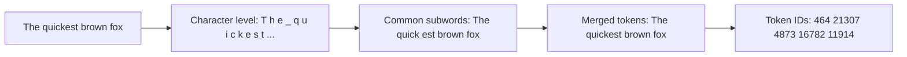

# Tokenization

Tokenization is the process of converting raw text into discrete units (tokens) that a language model can process. It is the critical bridge between human-readable text and model-computable representations. In production GenAI systems, tokenization directly impacts cost, latency, and model behavior.

## Why Tokenization Matters in Production

1. **Cost**: Model APIs charge per token. Inefficient tokenization = wasted money
2. **Latency**: More tokens = longer processing time
3. **Context limits**: Token count determines whether your input fits in the context window
4. **Model behavior**: Different tokenizers split the same text differently, affecting output
5. **Capacity planning**: Accurate token estimates are essential for infrastructure sizing

## Tokenization Algorithms

### Byte-Pair Encoding (BPE)

BPE is the most common tokenization algorithm, used by GPT models:

```
Algorithm:
1. Start with a vocabulary of all individual bytes (256 byte values)
2. Find the most frequent adjacent pair of tokens in the training data
3. Merge that pair into a new token
4. Repeat steps 2-3 until vocabulary reaches target size

Example progression:
"un" + "characteristic" → "uncharacteristic"
"uncharacteristic" + "ally" → "uncharacteristically"
```



### WordPiece

Used by BERT and some embedding models:
- Similar to BPE but uses likelihood-based merging
- Tends to produce more word-level tokens
- Marks subword tokens with `##` prefix

### SentencePiece

Used by Llama, Gemini:
- Treats input as raw bytes (no pre-tokenization)
- Works with any language without language-specific preprocessing
- Supports both BPE and unigram language model algorithms

## Tokenizer Comparison

### Same Text, Different Token Counts

```python
text = """
The Financial Conduct Authority (FCA) requires all regulated firms
to maintain adequate capital resources in accordance with the
Prudential Regulation Authority (PRA) rules.
"""

# Results across tokenizers:
tokenizer           | Tokens | Cost per 1M tokens (approx.)
--------------------|--------|------------------------------
GPT-4 (cl100k_base) | 47     | $10 input / $30 output
Claude (claude tok) | 44     | $15 input / $75 output
Llama 3 (tiktoken)  | 42     | Self-hosted, compute cost
Gemini (SentencePiece)| 45   | $3.50 input / $10.50 output
```

### Banking Text Is Harder to Tokenize

Financial and regulatory text contains many unusual patterns:

```python
test_cases = [
    "EUR/USD spot rate at 1.0847",        # Currency pairs, decimals
    "Basel III framework (2010, revised 2017)",  # Roman numerals, dates
    "SWIFT code: CHASUS33XXX",            # Alphanumeric codes
    "Article 501c of Regulation (EU) No 575/2013",  # Legal citations
    "€1.5bn notional",                    # Currency symbols, abbreviations
    "Tier 1 CET1 ratio of 14.5%",         # Banking acronyms
    "IBAN: GB29NWBK60161331926819",       # Long alphanumeric strings
]

# These often tokenize less efficiently than prose
# because they contain patterns underrepresented in training data
```

**Production lesson**: Always measure token counts on YOUR actual data, not sample text. Banking documents typically have 10-30% higher token density than prose.

## Token Counting in Production

### Accurate Token Counting

```python
import tiktoken

class TokenCounter:
    """Production-grade token counter for OpenAI models."""

    def __init__(self, model: str = "gpt-4o"):
        self.model = model
        try:
            self.encoding = tiktoken.encoding_for_model(model)
        except KeyError:
            # Fallback for newer models not yet in tiktoken
            self.encoding = tiktoken.get_encoding("cl100k_base")

    def count(self, text: str) -> int:
        return len(self.encoding.encode(text))

    def count_messages(self, messages: list[dict]) -> int:
        """Count tokens including message formatting overhead."""
        num_tokens = 0
        for message in messages:
            # OpenAI adds ~4 tokens per message for formatting
            num_tokens += 4
            for key, value in message.items():
                num_tokens += self.count(value)
                if key == "name":
                    num_tokens += 1  # name adds 1 token
        # Prime completion adds ~2 tokens
        num_tokens += 2
        return num_tokens

# Usage
counter = TokenCounter("gpt-4o")
messages = [
    {"role": "system", "content": "You are a compliance assistant."},
    {"role": "user", "content": "Review this transaction for suspicious activity."},
]
total = counter.count_messages(messages)
print(f"Total tokens: {total}")
```

### Multi-Provider Token Counting

```python
class MultiProviderTokenCounter:
    """Unified token counter across model providers."""

    PROVIDERS = {
        "openai": lambda m: tiktoken.encoding_for_model(m),
        "anthropic": lambda _: tiktoken.get_encoding("cl100k_base"),  # Approximate
        "gemini": lambda _: tiktoken.get_encoding("p50k_base"),  # Approximate
    }

    def __init__(self, provider: str, model: str):
        self.provider = provider
        self.model = model
        self.encoder = self.PROVIDERS[provider](model)

    def count(self, text: str) -> int:
        return len(self.encoder.encode(text))

    def estimate_cost(self, input_tokens: int, output_tokens: int) -> dict:
        """Estimate cost based on provider pricing."""
        pricing = {
            "openai:gpt-4o": {"input": 2.50, "output": 10.00},
            "openai:gpt-4o-mini": {"input": 0.15, "output": 0.60},
            "anthropic:claude-3-5-sonnet": {"input": 3.00, "output": 15.00},
            "anthropic:claude-3-5-haiku": {"input": 0.80, "output": 4.00},
            "gemini:gemini-1.5-pro": {"input": 3.50, "output": 10.50},
        }
        key = f"{self.provider}:{self.model}"
        rates = pricing.get(key, {"input": 0, "output": 0})
        return {
            "input_cost": (input_tokens / 1_000_000) * rates["input"],
            "output_cost": (output_tokens / 1_000_000) * rates["output"],
            "total_cost": (input_tokens / 1_000_000) * rates["input"] +
                         (output_tokens / 1_000_000) * rates["output"],
        }
```

## Token Optimization Strategies

### Strategy 1: Remove Redundant Content

```python
# BEFORE: Redundant system prompt
system_prompt = """
You are a helpful banking assistant. You help customers with their
banking questions. You should be professional and courteous.
You should always provide accurate information. You should not
make up information. If you don't know the answer, say so.
You are a helpful banking assistant. (repeated!)
"""
# ~60 tokens

# AFTER: Concise system prompt
system_prompt = """
You are a professional banking assistant. Provide accurate information
and be courteous. If unsure, say so.
"""
# ~25 tokens (58% reduction)
```

### Strategy 2: Structured Compression

```python
# BEFORE: Verbose JSON in prompt
context = """
Here is the customer information in JSON format:
{
    "customer_id": "CUST-12345",
    "name": "John Smith",
    "account_type": "Premium Current account",
    "balance": 15000.00,
    "currency": "GBP",
    "tenure_years": 8,
    "risk_rating": "Low"
}
"""
# ~70 tokens

# AFTER: Compact key-value format
context = """
Customer: CUST-12345 | John Smith
Account: Premium current | Balance: £15,000
Tenure: 8 years | Risk: Low
"""
# ~30 tokens (57% reduction, same information)
```

### Strategy 3: Truncate with Preservation

```python
def smart_truncate(text: str, max_tokens: int, tokenizer) -> str:
    """Truncate text to max tokens while preserving word boundaries."""
    tokens = tokenizer.encode(text)
    if len(tokens) <= max_tokens:
        return text

    # Truncate token list
    truncated_tokens = tokens[:max_tokens]

    # Decode and clean up (may cut mid-word)
    result = tokenizer.decode(truncated_tokens)

    # For better quality, truncate at sentence boundary
    sentences = text.split('. ')
    accumulated = ""
    for sentence in sentences:
        test = accumulated + (". " if accumulated else "") + sentence
        if tokenizer.count(test) > max_tokens:
            break
        accumulated = test

    return accumulated if accumulated else result
```

### Strategy 4: Selective Context Inclusion

```python
# WRONG: Include entire document
document = retrieve_compliance_document("AML policy")
prompt = f"Based on this policy:\n\n{document}\n\nAnswer: ..."
# Document is 50K tokens — expensive and quality degrades

# RIGHT: Retrieve relevant chunks only
chunks = retrieve_relevant_chunks("AML policy", query, top_k=5)
# Total ~3K tokens — cheaper and higher quality
prompt = f"Based on these policy excerpts:\n\n{chunks}\n\nAnswer: ..."
```

## Token Budgeting

### Per-Request Budget Allocation

```python
class TokenBudget:
    """Manage token budget for a request."""

    def __init__(self, model_max_tokens: int, safety_margin: int = 1000):
        self.max_tokens = model_max_tokens
        self.safety_margin = safety_margin
        self.available = model_max_tokens - safety_margin
        self.system_prompt = 0
        self.context = 0
        self.messages = 0
        self.reserved_output = 0

    def allocate(self, system_prompt: str, context: str,
                 messages: list, max_output: int) -> bool:
        """Check if allocation fits within budget."""
        counter = TokenCounter()
        self.system_prompt = counter.count(system_prompt)
        self.context = counter.count(context)
        self.messages = counter.count_messages(messages)
        self.reserved_output = max_output

        total = (self.system_prompt + self.context +
                 self.messages + self.reserved_output)

        return total <= self.available

    def report(self) -> str:
        return f"""
Token Budget Report:
  System prompt: {self.system_prompt:,}
  Context:       {self.context:,}
  Messages:      {self.messages:,}
  Reserved out:  {self.reserved_output:,}
  Total:         {self.system_prompt + self.context + self.messages + self.reserved_output:,}
  Available:     {self.available:,}
  Utilization:   {(self.system_prompt + self.context + self.messages + self.reserved_output) / self.available * 100:.1f}%
"""
```

### Monthly Token Budget Management

```python
class MonthlyTokenBudget:
    """Track and enforce monthly token budgets per team/project."""

    def __init__(self, redis_client):
        self.redis = redis_client

    def set_budget(self, team: str, monthly_tokens: int, monthly_usd: float):
        """Set monthly budget for a team."""
        month = datetime.now().strftime("%Y-%m")
        key = f"budget:{team}:{month}"
        self.redis.hset(key, mapping={
            "token_limit": monthly_tokens,
            "usd_limit": monthly_usd,
            "token_used": 0,
            "usd_used": 0.0,
        })
        self.redis.expire(key, 35 * 24 * 3600)  # 35 days

    def record_usage(self, team: str, tokens: int, cost_usd: float):
        """Record token usage."""
        month = datetime.now().strftime("%Y-%m")
        key = f"budget:{team}:{month}"
        self.redis.hincrby_float(key, "token_used", tokens)
        self.redis.hincrby_float(key, "usd_used", cost_usd)

        # Check budget
        budget = self.redis.hgetall(key)
        token_pct = float(budget["token_used"]) / float(budget["token_limit"])
        usd_pct = float(budget["usd_used"]) / float(budget["usd_limit"])

        alerts = []
        if token_pct >= 0.9:
            alerts.append(f"Token budget at {token_pct:.0%}")
        if usd_pct >= 0.9:
            alerts.append(f"Cost budget at {usd_pct:.0%}")

        return alerts

    def get_usage_report(self, team: str) -> dict:
        """Get current month usage report."""
        month = datetime.now().strftime("%Y-%m")
        key = f"budget:{team}:{month}"
        budget = self.redis.hgetall(key)
        return {
            "token_limit": int(budget.get("token_limit", 0)),
            "token_used": float(budget.get("token_used", 0)),
            "token_remaining": int(budget.get("token_limit", 0)) -
                              float(budget.get("token_used", 0)),
            "usd_limit": float(budget.get("usd_limit", 0)),
            "usd_used": float(budget.get("usd_used", 0)),
        }
```

## Common Mistakes and Anti-Patterns

### Anti-Pattern 1: Estimating Tokens by Word Count

```python
# WRONG: Using word count as proxy
word_count = len(text.split())
estimated_tokens = word_count * 1.3  # "Roughly correct" for English
# This is off by 20-40% for banking text

# RIGHT: Use actual tokenizer
actual_tokens = len(tokenizer.encode(text))
```

### Anti-Pattern 2: Ignoring Output Token Costs

```python
# WRONG: Only counting input tokens
input_cost = input_tokens * INPUT_RATE
# Output tokens are often 2-3x more expensive!

# RIGHT: Account for both
total_cost = input_tokens * INPUT_RATE + output_tokens * OUTPUT_RATE
# For GPT-4o: $2.50/M input, $10/M output — output is 4x more expensive
```

### Anti-Pattern 3: Not Counting Tool Call Tokens

```python
# WRONG: Forgetting tool call overhead
# OpenAI function calling adds ~100-200 tokens per call
# for function descriptions and results

# RIGHT: Include tool definitions in token count
tool_tokens = sum(
    len(tokenizer.encode(json.dumps(tool)))
    for tool in tool_definitions
)
total = input_tokens + output_tokens + tool_tokens
```

### Anti-Pattern 4: Assuming Consistent Token Counts Across Languages

```python
# Same meaning, very different token counts:
english = "Please transfer $500 to account number 12345"
chinese = "请转账500美元至账户12345"
arabic = "يرجى تحويل 500 دولار إلى الحساب 12345"

# English: ~12 tokens
# Chinese: ~15 tokens (less efficient tokenization)
# Arabic: ~14 tokens (morphological complexity)
```

## Token Counting for Cost Estimation

### Pre-Deployment Cost Estimation

```python
def estimate_monthly_cost(
    requests_per_day: int,
    avg_input_tokens: int,
    avg_output_tokens: int,
    pricing: dict,
    days_per_month: int = 30,
) -> dict:
    """Estimate monthly token costs before deployment."""
    daily_input = requests_per_day * avg_input_tokens
    daily_output = requests_per_day * avg_output_tokens

    monthly_input = daily_input * days_per_month
    monthly_output = daily_output * days_per_month

    input_cost = (monthly_input / 1_000_000) * pricing["input_per_m"]
    output_cost = (monthly_output / 1_000_000) * pricing["output_per_m"]

    return {
        "monthly_input_tokens": monthly_input,
        "monthly_output_tokens": monthly_output,
        "monthly_total_tokens": monthly_input + monthly_output,
        "monthly_input_cost_usd": input_cost,
        "monthly_output_cost_usd": output_cost,
        "monthly_total_cost_usd": input_cost + output_cost,
        "cost_per_request_usd": (input_cost + output_cost) / (requests_per_day * days_per_month),
    }

# Example: Customer service assistant
estimate = estimate_monthly_cost(
    requests_per_day=10_000,
    avg_input_tokens=2000,
    avg_output_tokens=500,
    pricing={"input_per_m": 2.50, "output_per_m": 10.00},  # GPT-4o
)
# Monthly: 750M tokens, ~$2,250/month
```

## Interview Questions

1. Why do different LLMs produce different token counts for the same text?
2. How would you design a token counting service for a multi-tenant GenAI platform?
3. A team reports their token costs are 3x higher than estimated. What could explain this?
4. How does tokenization efficiency affect model quality for code vs. prose?
5. Design a token budgeting system that prevents teams from exceeding their allocation.

## Cross-References

- [llm-fundamentals.md](./llm-fundamentals.md) — How LLMs process tokens
- [cost-optimization.md](./cost-optimization.md) — Token cost management strategies
- [prompt-engineering.md](./prompt-engineering.md) — Reducing token usage in prompts
- [caching.md](./caching.md) — Avoiding redundant token processing
- [../observability/](../observability/) — Token usage monitoring and alerting
