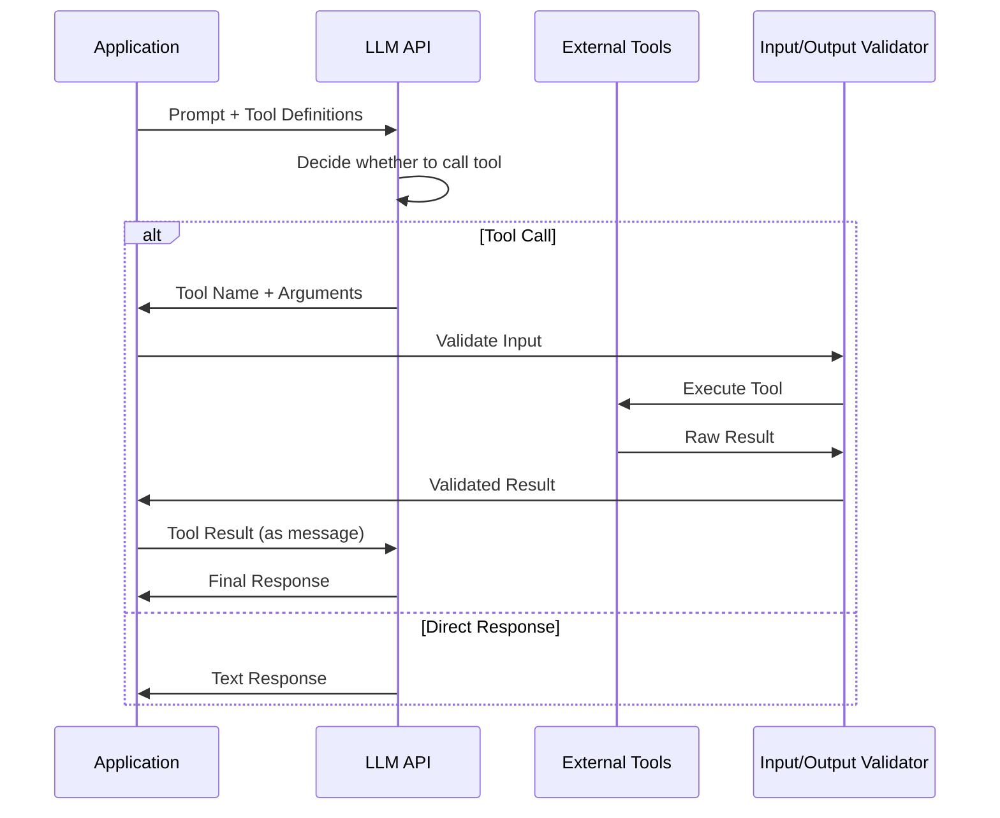

# Tool Calling

Tool calling (also known as function calling) enables LLMs to invoke external functions with structured inputs. This is the mechanism behind AI agents, assistants, and any GenAI system that interacts with external systems.

## How Tool Calling Works



## Tool Definition Patterns

### OpenAI Function Calling

```python
tools = [
    {
        "type": "function",
        "function": {
            "name": "get_customer_risk_assessment",
            "description": "Assess the risk level of a customer based on their profile, "
                           "transaction history, and KYC status.",
            "parameters": {
                "type": "object",
                "properties": {
                    "customer_id": {
                        "type": "string",
                        "description": "Customer ID in format CUST-XXXXX",
                        "pattern": "^CUST-\\d{5}$",
                    },
                    "assessment_type": {
                        "type": "string",
                        "enum": ["initial", "periodic_review", "event_triggered"],
                        "description": "Type of risk assessment to perform",
                    },
                    "include_transaction_analysis": {
                        "type": "boolean",
                        "description": "Include detailed transaction pattern analysis",
                        "default": True,
                    },
                },
                "required": ["customer_id", "assessment_type"],
                "additionalProperties": False,
            },
            "strict": True,  # Enforces strict parameter validation
        },
    }
]

response = client.chat.completions.create(
    model="gpt-4o",
    messages=[{"role": "user", "content": "What is the risk level for customer CUST-12345?"}],
    tools=tools,
    tool_choice="auto",  # Let model decide, or "required" to force tool use
)
```

### Handling Tool Calls

```python
# Available tools registry
TOOLS_REGISTRY = {
    "get_customer_risk_assessment": get_customer_risk_assessment_fn,
    "search_policies": search_policies_fn,
    "calculate_exposure": calculate_exposure_fn,
    "check_sanctions_list": check_sanctions_list_fn,
}

def handle_tool_calls(response, messages):
    """Process tool calls from LLM response."""
    for choice in response.choices:
        if not choice.message.tool_calls:
            continue

        for tool_call in choice.message.tool_calls:
            function_name = tool_call.function.name
            function_args = json.loads(tool_call.function.arguments)

            # Validate tool exists
            if function_name not in TOOLS_REGISTRY:
                tool_result = json.dumps({
                    "error": f"Unknown tool: {function_name}",
                })
            else:
                try:
                    # Validate arguments against schema
                    validated_args = validate_tool_input(function_name, function_args)

                    # Execute tool
                    result = TOOLS_REGISTRY[function_name](**validated_args)

                    # Sanitize output (remove sensitive data)
                    tool_result = sanitize_tool_output(function_name, result)

                except ValidationError as e:
                    tool_result = json.dumps({
                        "error": f"Invalid arguments: {str(e)}",
                    })
                except PermissionError as e:
                    tool_result = json.dumps({
                        "error": f"Permission denied: {str(e)}",
                    })
                except Exception as e:
                    tool_result = json.dumps({
                        "error": f"Tool execution failed: {str(e)}",
                    })

            # Add tool result as a message for the model
            messages.append({
                "role": "tool",
                "tool_call_id": tool_call.id,
                "content": tool_result,
            })

    # Send tool results back to model for final response
    final_response = client.chat.completions.create(
        model="gpt-4o",
        messages=messages,
        tools=tools,
    )

    return final_response
```

### Parallel Tool Calling

```python
# Models can call multiple tools in parallel when calls are independent

response = client.chat.completions.create(
    model="gpt-4o",
    messages=[
        {
            "role": "user",
            "content": "Check the risk profile for customers CUST-12345, CUST-67890, and CUST-11111"
        },
    ],
    tools=tools,
    parallel_tool_calls=True,  # Default in GPT-4o
)

# Model may return 3 tool calls simultaneously:
# tool_call 1: get_customer_risk_assessment(customer_id="CUST-12345", ...)
# tool_call 2: get_customer_risk_assessment(customer_id="CUST-67890", ...)
# tool_call 3: get_customer_risk_assessment(customer_id="CUST-11111", ...)

# Execute all tools in parallel
import asyncio

async def execute_parallel_tool_calls(tool_calls):
    """Execute independent tool calls concurrently."""
    tasks = []
    for tool_call in tool_calls:
        task = asyncio.create_task(execute_single_tool(tool_call))
        tasks.append(task)

    results = await asyncio.gather(*tasks, return_exceptions=True)
    return results
```

## Tool Schema Design Best Practices

### Descriptive Names and Descriptions

```python
# BAD: Vague tool definition
{
    "name": "get_data",
    "description": "Get data from the system",
    "parameters": {
        "type": "object",
        "properties": {
            "id": {"type": "string"},
            "type": {"type": "string"},
        },
    },
}

# GOOD: Specific and descriptive
{
    "name": "get_customer_account_summary",
    "description": "Retrieve a customer's account summary including current balance, "
                   "account type, opening date, and recent transaction overview. "
                   "Does NOT include detailed transaction history or PII.",
    "parameters": {
        "type": "object",
        "properties": {
            "customer_id": {
                "type": "string",
                "description": "The customer's unique identifier (format: CUST-XXXXX)",
                "pattern": "^CUST-\\d{5}$",
                "examples": ["CUST-12345", "CUST-00001"],
            },
            "include_pending_transactions": {
                "type": "boolean",
                "description": "Whether to include transactions that are pending authorization",
                "default": False,
            },
            "transaction_history_days": {
                "type": "integer",
                "description": "Number of days of transaction history to include",
                "minimum": 1,
                "maximum": 90,
                "default": 30,
            },
        },
        "required": ["customer_id"],
        "additionalProperties": False,
    },
}
```

### Using Enums for Constrained Choices

```python
# Enum parameters force the model to choose from valid options
{
    "name": "create_compliance_report",
    "parameters": {
        "type": "object",
        "properties": {
            "report_type": {
                "type": "string",
                "enum": [
                    "sar_filing",       # Suspicious Activity Report
                    "ctr_filing",       # Currency Transaction Report
                    "periodic_review",  # Scheduled customer review
                    "ad_hoc_review",    # Triggered review
                    "sanctions_check",  # Sanctions screening
                ],
                "description": "Type of compliance report to generate",
            },
            "priority": {
                "type": "string",
                "enum": ["routine", "urgent", "critical"],
                "default": "routine",
            },
        },
        "required": ["report_type"],
    },
}
```

### Nested Objects for Complex Inputs

```python
{
    "name": "submit_transaction_monitoring_rule",
    "parameters": {
        "type": "object",
        "properties": {
            "rule": {
                "type": "object",
                "description": "The monitoring rule configuration",
                "properties": {
                    "rule_name": {"type": "string"},
                    "condition": {
                        "type": "object",
                        "properties": {
                            "field": {
                                "type": "string",
                                "enum": ["amount", "frequency", "destination", "source"],
                            },
                            "operator": {
                                "type": "string",
                                "enum": [">", "<", ">=", "<=", "==", "contains", "matches"],
                            },
                            "value": {"type": "string"},
                        },
                        "required": ["field", "operator", "value"],
                    },
                    "threshold_amount": {
                        "type": "number",
                        "description": "Monetary threshold (in GBP)",
                        "minimum": 0,
                    },
                    "time_window_days": {
                        "type": "integer",
                        "description": "Monitoring window in days",
                        "minimum": 1,
                        "maximum": 365,
                    },
                    "alert_action": {
                        "type": "string",
                        "enum": ["flag", "block", "escalate", "auto_approve"],
                    },
                },
                "required": ["rule_name", "condition", "alert_action"],
            },
            "apply_to_segments": {
                "type": "array",
                "items": {
                    "type": "string",
                    "enum": ["retail", "commercial", "private_banking", "correspondent"],
                },
                "description": "Customer segments this rule applies to",
            },
        },
        "required": ["rule", "apply_to_segments"],
    },
}
```

## Security Considerations

### Tool Input Validation

```python
from pydantic import BaseModel, validator, Field
import re

class ToolInputValidator:
    """Validate all tool inputs before execution."""

    @staticmethod
    def validate_get_customer_risk(input: dict) -> dict:
        """Validate get_customer_risk_assessment inputs."""
        customer_id = input.get("customer_id", "")

        # Format validation
        if not re.match(r"^CUST-\d{5}$", customer_id):
            raise ValueError(f"Invalid customer ID format: {customer_id}")

        # Authorization check
        if not current_user.has_permission("customer_risk_read"):
            raise PermissionError("User lacks customer_risk_read permission")

        # Business validation
        assessment_type = input.get("assessment_type")
        if assessment_type not in ["initial", "periodic_review", "event_triggered"]:
            raise ValueError(f"Invalid assessment type: {assessment_type}")

        return input

    @staticmethod
    def validate_tool_input(tool_name: str, input: dict) -> dict:
        """Route to appropriate validator."""
        validators = {
            "get_customer_risk_assessment": ToolInputValidator.validate_get_customer_risk,
            # ... more validators
        }

        validator = validators.get(tool_name)
        if not validator:
            raise ValueError(f"No validator for tool: {tool_name}")

        return validator(input)
```

### Output Sanitization

```python
def sanitize_tool_output(tool_name: str, output: dict) -> dict:
    """Remove sensitive data from tool outputs before returning to LLM."""

    # Fields to always redact
    PII_FIELDS = {
        "national_insurance_number",
        "passport_number",
        "full_account_number",
        "sort_code",
        "mothers_maiden_name",
        "date_of_birth",
        "phone_number",
        "email_address",
    }

    sanitized = {}
    for key, value in output.items():
        if key in PII_FIELDS:
            sanitized[key] = "[REDACTED]"
        elif isinstance(value, str) and detect_pii(value):
            sanitized[key] = redact_pii(value)
        elif isinstance(value, dict):
            sanitized[key] = sanitize_tool_output("nested", value)
        else:
            sanitized[key] = value

    return sanitized
```

### Tool Permission Enforcement

```python
class ToolPermissionEngine:
    """Enforce tool-level access control."""

    # Role-to-tool permission mapping
    ROLE_TOOLS = {
        "banking_user": {
            "allowed": ["search_knowledge_base", "search_policies"],
            "denied": ["lookup_customer", "check_transaction", "transfer_funds"],
        },
        "customer_service": {
            "allowed": ["search_knowledge_base", "lookup_customer", "check_transaction"],
            "denied": ["transfer_funds", "close_account", "delete_record"],
        },
        "compliance_analyst": {
            "allowed": ["search_knowledge_base", "lookup_customer", "check_transaction",
                       "get_customer_risk_assessment", "create_compliance_report"],
            "denied": ["transfer_funds", "close_account"],
        },
        "senior_manager": {
            "allowed": ["search_knowledge_base", "lookup_customer", "check_transaction",
                       "get_customer_risk_assessment", "create_compliance_report",
                       "approve_transaction", "transfer_funds"],
            "denied": ["delete_record"],
        },
        "compliance_admin": {
            "allowed": "ALL",  # Full access
            "denied": [],
        },
    }

    def check_permission(self, user_role: str, tool_name: str) -> bool:
        """Check if user role has permission to use tool."""
        role_config = self.ROLE_TOOLS.get(user_role, {"allowed": [], "denied": []})

        if role_config["allowed"] == "ALL":
            return True

        if tool_name in role_config["denied"]:
            return False

        return tool_name in role_config["allowed"]
```

## Common Mistakes and Anti-Patterns

### Anti-Pattern 1: Inconsistent Tool Naming

```python
# WRONG: Inconsistent naming conventions
tools = [
    {"function": {"name": "GetCustomerData"}},    # CamelCase
    {"function": {"name": "search_policies"}},     # snake_case
    {"function": {"name": "check-transaction"}},   # kebab-case
    {"function": {"name": "risk assessment"}},     # with space (will fail)
]

# RIGHT: Consistent snake_case
tools = [
    {"function": {"name": "get_customer_data"}},
    {"function": {"name": "search_policies"}},
    {"function": {"name": "check_transaction"}},
    {"function": {"name": "risk_assessment"}},
]
```

### Anti-Pattern 2: Tools Without Descriptions

```python
# WRONG: Model cannot understand what the tool does
{
    "name": "check_risk",
    "parameters": {
        "properties": {
            "id": {"type": "string"},
        },
    },
}

# RIGHT: Detailed descriptions help model choose correctly
{
    "name": "check_risk",
    "description": "Check the risk rating for a customer. Returns a risk level "
                   "(LOW/MEDIUM/HIGH/CRITICAL) with supporting factors. Use this "
                   "when analyzing a customer's risk profile or before approving "
                   "transactions.",
    "parameters": {
        "properties": {
            "customer_id": {
                "type": "string",
                "description": "Customer ID (format: CUST-XXXXX). Example: CUST-12345",
            },
        },
        "required": ["customer_id"],
    },
}
```

### Anti-Pattern 3: Trusting Model Tool Input

```python
# WRONG: Execute tool with model-provided input directly
result = tool(**json.loads(model_arguments))
# Model may provide SQL injection, path traversal, or other malicious inputs

# RIGHT: Always validate
validated = validate_tool_input(tool_name, json.loads(model_arguments))
result = tool(**validated)
```

### Anti-Pattern 4: Leaking Tool Results to User

```python
# WRONG: Raw tool results shown to user
# Tool result: {"customer_name": "John Smith", "ssn": "123-45-6789", ...}
# User sees everything including SSN

# RIGHT: Sanitize before showing to LLM (which then shows to user)
sanitized = sanitize_tool_output(tool_name, raw_result)
# LLM only sees: {"customer_name": "John Smith", "ssn": "[REDACTED]", ...}
```

## Interview Questions

1. How do you design tool schemas so the model uses tools correctly?
2. A tool call is failing because the model provides malformed input. How do you debug?
3. How do you handle parallel vs. sequential tool calls?
4. What security risks arise from giving an LLM access to internal tools?
5. How do you version tool APIs without breaking existing GenAI applications?

## Cross-References

- [agents.md](./agents.md) — Agent architectures that use tool calling
- [prompt-engineering.md](./prompt-engineering.md) — Prompt patterns for tool use
- [ai-safety.md](./ai-safety.md) — Security and permission enforcement
- [../security/](../security/) — Input validation, injection prevention
- [../backend-engineering/](../backend-engineering/) — API design for tool backends
