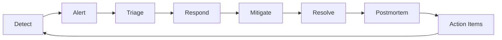

# Incident Management Philosophy

## Overview

Incident management is the disciplined practice of detecting, responding to, and learning from system failures. In a banking GenAI context, incidents are not just about uptime -- they involve data integrity, regulatory compliance, financial accuracy, and customer trust.

This document establishes the philosophy, principles, and foundational practices that guide how we manage incidents across the GenAI engineering organization.

---

## Core Principles

### 1. Incidents Are Inevitable

No matter how much you invest in reliability, incidents will occur. Complex systems fail in unpredictable ways. GenAI systems add additional failure modes: model degradation, prompt injection, hallucination, token cost explosion, and data leakage.

**Implication**: Design for failure. Assume every dependency will fail. Build systems that degrade gracefully.

### 2. Speed Matters

Every minute an incident continues:
- Customers are impacted
- Data may be exposed
- Money is lost
- Trust erodes
- Regulatory risk increases

**Implication**: Invest in detection, alerting, and response capabilities. Practice incident response regularly.

### 3. Blameless Learning

The goal of postmortems is to understand why reasonable, well-intentioned people made the decisions they made, and how the system allowed those decisions to lead to failure.

**Implication**: Focus on system and process fixes, not individual blame. Blameless postmortems produce honest, actionable insights.

### 4. Incidents Are Learning Opportunities

Every incident reveals something the team did not know about the system. Post-incident improvements make the system more resilient.

**Implication**: Track action items from postmortems with the same rigor as product features. Measure improvement over time.

### 5. Transparency Builds Trust

Stakeholders -- customers, regulators, executives -- trust teams that communicate honestly during incidents, even when the news is bad.

**Implication**: Communicate early, communicate often, and communicate honestly. Never hide incident impact.

---

## Incident Definition

An **incident** is any event that:
- Degrades or disrupts customer-facing services
- Compromises data integrity or security
- Violates regulatory or compliance requirements
- Exceeds predefined thresholds for error rate, latency, or cost
- Requires coordinated response beyond a single engineer

### What Is NOT an Incident

- Planned maintenance (handled via change management)
- Known bugs with workarounds (tracked in the backlog)
- Feature requests or enhancements
- Individual support tickets (handled by support operations)

---

## Severity Classification

| Level | Name | Description | Response Time | Example |
|-------|------|-------------|---------------|---------|
| SEV-1 | Critical | Complete service outage, data breach, or regulatory violation | Immediate (page) | GenAI assistant down, PII leaked |
| SEV-2 | High | Significant degradation or partial data loss | 15 minutes (page) | Model quality degraded, wrong advice given |
| SEV-3 | Medium | Minor degradation, localized impact | 1 hour (ticket) | Token costs 200% over budget |
| SEV-4 | Low | Minimal impact, workaround available | 4 hours (ticket) | Intermittent latency spikes |

See [incident-classification.md](incident-classification.md) for detailed criteria.

---

## Incident Lifecycle

### 1. Detect

Incidents are detected through:
- Automated monitoring (Prometheus alerts, application health checks)
- User reports (customer support tickets, social media)
- Security monitoring (SIEM, anomaly detection)
- Compliance audits
- Proactive investigation (engineer notices something wrong)

### 2. Alert

When an incident is detected:
- Classify severity
- Notify the right people (on-call, incident commander, stakeholders)
- Open incident tracking (PagerDuty, Jira incident ticket)

### 3. Triage

The first responder:
- Confirms the incident is real (not a false positive)
- Assesses scope and impact
- Declares severity and opens war room if needed
- Assigns Incident Commander (IC) for SEV-1/SEV-2

### 4. Respond

The response team:
- Investigates root cause
- Implements containment measures
- Communicates with stakeholders
- Updates status page

### 5. Mitigate

Mitigation actions:
- Rollback to last known good version
- Scale up resources
- Disable affected feature
- Failover to backup system
- Apply emergency patch

### 6. Resolve

Resolution criteria:
- Service restored to normal operation
- Root cause understood and addressed (or workarounded)
- Stakeholders notified of resolution
- Incident status updated

### 7. Postmortem

Within 5 business days (SEV-1/SEV-2) or 10 business days (SEV-3/SEV-4):
- Blameless postmortem conducted
- Root cause analysis documented
- Action items identified and assigned
- Lessons shared with organization

### 8. Action Items

- Tracked in Jira with dedicated labels
- Reviewed weekly by engineering leadership
- Escalated if overdue
- Verified complete before closing incident

---

## GenAI-Specific Incident Considerations

GenAI systems introduce unique incident patterns:

### Model-Related Incidents

- **Model degradation**: Quality declines over time due to data drift
- **Model hallucination**: AI generates incorrect or fabricated information
- **Model bias**: Output exhibits unfair or discriminatory patterns
- **Model poisoning**: Training data manipulated to affect output

### Prompt-Related Incidents

- **Prompt injection**: Malicious input overrides system instructions
- **Prompt leakage**: System prompts or context exposed in output
- **Prompt drift**: System prompt changes unintentionally over time

### Infrastructure-Related Incidents

- **Vector DB outage**: Retrieval layer unavailable
- **GPU exhaustion**: Model serving degraded due to resource constraints
- **Token cost explosion**: Uncontrolled LLM API costs
- **Embedding pipeline failure**: Vector indexing broken

### Data-Related Incidents

- **PII leakage**: Personal data exposed through AI responses
- **Cross-tenant data access**: Data isolation failure in multi-tenant RAG
- **Training data contamination**: Corrupted data in fine-tuning pipeline

### Compliance-Related Incidents

- **Missing audit logs**: Regulatory audit trail incomplete
- **Unauthorized automated decisions**: GDPR Article 22 violations
- **Incorrect compliance advice**: AI gave wrong regulatory guidance

See [genai-specific-incidents.md](genai-specific-incidents.md) for detailed playbooks.

---

## Roles and Responsibilities

| Role | Responsibility | When Active |
|------|---------------|-------------|
| **First Responder** | Acknowledges alert, performs initial triage | All incidents |
| **Incident Commander (IC)** | Coordinates response, makes decisions, communicates | SEV-1, SEV-2 |
| **Subject Matter Expert (SME)** | Provides technical expertise for investigation | All incidents |
| **Communications Lead** | Manages stakeholder updates and status page | SEV-1, SEV-2 |
| **Scribe** | Documents timeline and decisions in real-time | SEV-1, SEV-2 |
| **Postmortem Facilitator** | Leads blameless postmortem session | Post-incident |

See [incident-command.md](incident-command.md) for detailed IC responsibilities.

---

## Communication Principles

1. **Assume Good Intent**: Everyone is trying to resolve the incident.
2. **Single Source of Truth**: All updates posted in the incident channel/ticket.
3. **Regular Cadence**: Updates every 30 minutes for SEV-1, every hour for SEV-2.
4. **Audience-Appropriate**: Technical detail for engineers, impact summary for stakeholders, plain language for customers.
5. **Honest Assessment**: If you do not know the root cause, say so. If you are unsure of ETTR, say so.

See [communication-during-incidents.md](communication-during-incidents.md) for detailed procedures.

---

## Postmortem Philosophy

### Blameless by Default

The postmortem asks "what" and "how," not "who." Questions focus on:
- What happened?
- How was it detected?
- How was it resolved?
- What systemic factors contributed?
- How do we prevent it from happening again?

### Action-Oriented

Every postmortem produces actionable improvements:
- **Immediate fixes**: Things we can fix today
- **Systemic fixes**: Things that require architectural or process changes
- **Monitoring improvements**: New alerts or dashboards
- **Documentation updates**: Runbooks, playbooks, on-call guides

### Shared Learning

Postmortems are not filed and forgotten. They are:
- Published internally (blameless summaries)
- Reviewed in engineering all-hands
- Used for onboarding new engineers
- Referenced during system design reviews

See [postmortem-process.md](postmortem-process.md) for the detailed process.

---

## Metrics and Continuous Improvement

### Key Metrics

| Metric | Description | Target |
|--------|-------------|--------|
| **MTTD** (Mean Time To Detect) | Time from incident start to detection | < 5 minutes |
| **MTTA** (Mean Time To Acknowledge) | Time from detection to on-call acknowledgment | < 2 minutes |
| **MTTR** (Mean Time To Resolve) | Time from detection to resolution | SEV-1: < 4 hours |
| **Incident Frequency** | Number of incidents per month | Decreasing trend |
| **Action Item Completion** | % of postmortem actions completed within SLA | > 90% |
| **Repeat Incidents** | % of incidents with same root cause as prior incident | 0% |

See [incident-metrics.md](incident-metrics.md) for detailed tracking.

---

## Game Days and Preparedness

Regular game days ensure the team is prepared for incidents:
- **Quarterly SEV-1 simulation**: Full war room exercise
- **Monthly SEV-2/SEV-3 drill**: Focused scenario testing
- **Bi-weekly on-call scenarios**: New on-call engineers practice triage
- **GenAI-specific scenarios**: Prompt injection, model degradation, vector DB outage

See [game-days.md](game-days.md) for game day planning.

---

## Banking and Regulatory Context

As a banking GenAI platform, incidents carry additional obligations:

### Regulatory Notification

Certain incidents must be reported to regulators:
- **FCA**: Service outages affecting regulated activities
- **ICO**: Data breaches involving personal data (GDPR)
- **PRA**: Operational resilience failures
- **NCSC**: Cybersecurity incidents

See [regulatory-notification.md](regulatory-notification.md) for notification requirements.

### Customer Communication

Banking customers expect transparent, timely communication:
- **Notification timing**: Within 24 hours for SEV-1, 48 hours for SEV-2
- **Content**: What happened, what data was affected, what we are doing
- **Compensation**: SLA credits, service fee waivers where applicable

See [customer-communication.md](customer-communication.md) for templates and procedures.

---

## Cross-References

- [incident-classification.md](incident-classification.md) -- SEV levels and criteria
- [incident-command.md](incident-command.md) -- Incident commander role
- [detection-and-alerting.md](detection-and-alerting.md) -- Alert design principles
- [triage-playbooks.md](triage-playbooks.md) -- Triage decision trees
- [communication-during-incidents.md](communication-during-incidents.md) -- Stakeholder communication
- [war-room-management.md](war-room-management.md) -- War room procedures
- [incident-timeline.md](incident-timeline.md) -- Timeline management
- [mitigation-strategies.md](mitigation-strategies.md) -- Common mitigation patterns
- [postmortem-process.md](postmortem-process.md) -- Blameless postmortem process
- [action-item-tracking.md](action-item-tracking.md) -- Action item management
- [regulatory-notification.md](regulatory-notification.md) -- Regulatory obligations
- [customer-communication.md](customer-communication.md) -- Customer notification templates
- [incident-metrics.md](incident-metrics.md) -- MTTD, MTTR, trends
- [game-days.md](game-days.md) -- Game day exercises
- [on-call-best-practices.md](on-call-best-practices.md) -- On-call rotation design
- [genai-specific-incidents.md](genai-specific-incidents.md) -- GenAI-specific playbooks
- [banking-incident-requirements.md](banking-incident-requirements.md) -- Banking regulatory obligations
