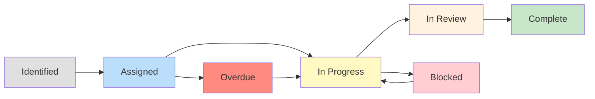

# Action Item Tracking

## Overview

Action items from postmortems are only valuable if they are completed. This document defines the process for tracking, managing, and ensuring completion of post-incident action items.

---

## Action Item Lifecycle



### States

| State | Description | SLA |
|-------|-------------|-----|
| **Identified** | Action item captured in postmortem but not yet assigned | Assign within 2 business days |
| **Assigned** | Owner and deadline set, work not yet started | Start within 1 sprint |
| **In Progress** | Work actively underway | Complete by deadline |
| **In Review** | Work complete, awaiting verification | Review within 3 business days |
| **Complete** | Verified and closed | N/A |
| **Blocked** | Cannot proceed due to external dependency | Unblock within 1 sprint or escalate |
| **Overdue** | Past deadline without completion | Escalate immediately |

---

## Action Item Creation

### Criteria for Good Action Items

Every action item must have:

1. **Clear Description**: What needs to be done (not the problem, the solution)
2. **Single Owner**: One person accountable (not a team)
3. **Specific Deadline**: A date, not "soon" or "this sprint"
4. **Measurable Outcome**: How do we know it is complete?
5. **Priority**: P0, P1, or P2

### Good vs. Bad Action Items

| Bad | Good |
|-----|------|
| "Improve monitoring" | "Add alert for vector DB latency > 200ms for 5 minutes. Owner: @alice. Deadline: 2024-04-01." |
| "Fix the RAG system" | "Implement per-customer namespace isolation in Pinecone with metadata filtering. Owner: @bob. Deadline: 2024-04-15." |
| "Better testing" | "Add cross-customer data leakage test to the RAG test suite. Owner: @carol. Deadline: 2024-03-25." |
| "Review processes" | "Create mandatory security review checklist for all RAG architecture changes. Owner: @dave. Deadline: 2024-04-10." |

### Action Item Template

```markdown
### Action Item: [Brief Title]

**Description:** [What needs to be done, including specific technical details]

**Owner:** [@person]

**Deadline:** [YYYY-MM-DD]

**Priority:** P0 / P1 / P2

**Type:** [Technical fix / Process change / Monitoring / Documentation]

**Success Criteria:** [How we verify this is complete]

**Dependencies:** [Any blocking dependencies]

**Status:** [Identified / Assigned / In Progress / In Review / Complete / Blocked / Overdue]

**Notes:** [Additional context, links to PRs, related work]
```

---

## Priority Definitions

| Priority | Definition | SLA | Examples |
|----------|-----------|-----|----------|
| **P0** | Critical fix required to prevent recurrence. Must be done in current sprint. | 1 sprint | Fix tenant isolation, patch security vulnerability |
| **P1** | Important fix required. Should be done within 2 sprints. | 2 sprints | Add critical monitoring, update runbooks |
| **P2** | Nice-to-have improvement. Should be done within the quarter. | 1 quarter | Improve documentation, add secondary monitoring |

---

## Tracking Mechanism

### Jira Integration

Action items are tracked in Jira with the following setup:

**Issue Type:** `Postmortem Action Item`

**Labels:**
- `postmortem-action`
- `incident-YYYY-MM-DD-[name]` (links to the source incident)
- `p0` / `p1` / `p2` (priority)

**Custom Fields:**
- `Postmortem Link`: URL to the postmortem document
- `Incident Severity`: SEV-1 / SEV-2 / SEV-3
- `Action Type`: Technical / Process / Monitoring / Documentation

**Board:** Dedicated "Incident Actions" column on the team board:
```
Backlog -> Assigned -> In Progress -> In Review -> Complete
```

### Dashboard

A shared dashboard tracks action item status:

```
Postmortem Action Items Dashboard
==================================

Overall:
  Total Open: 23
  P0 Overdue: 0
  P1 Overdue: 2
  P2 Overdue: 5
  Completion Rate (30 days): 87%

By Team:
  Platform:    8 open,  92% on-time
  Inference:   5 open,  80% on-time
  Data:        6 open,  85% on-time
  Frontend:    4 open,  90% on-time

By Priority:
  P0: 3 open, 0 overdue    ✓
  P1: 8 open, 2 overdue    ⚠
  P2: 12 open, 5 overdue   ⚠

Oldest Overdue:
  - [INC-2024-02-15-003] Add GPU memory monitoring (35 days overdue)
  - [INC-2024-01-20-007] Update embedding runbook (22 days overdue)
```

---

## Review Process

### Weekly Review

**Who:** Engineering lead or designated reviewer
**When:** Weekly (Monday morning)
**What:**
1. Review all open action items
2. Check for overdue items
3. Check for blocked items
4. Follow up with owners on progress
5. Update dashboard

### Escalation Rules

| Condition | Action |
|-----------|--------|
| P0 overdue by 1 day | Escalate to engineering lead |
| P0 overdue by 3 days | Escalate to VP Engineering |
| P1 overdue by 1 sprint | Escalate to engineering lead |
| P1 overdue by 2 sprints | Escalate to VP Engineering |
| P2 overdue by 1 quarter | Review necessity (close or re-prioritize) |
| Any item blocked > 2 sprints | Escalate to remove blocker |

### Monthly Report

**Who:** Engineering operations manager
**When:** Monthly
**What:**
- Action item completion rate
- Overdue trend analysis
- Repeat incident analysis (are we seeing the same root causes?)
- Recommendations for process improvement

Report format:
```
Monthly Postmortem Action Items Report - [Month Year]

SUMMARY:
- Total action items created this month: [N]
- Total action items completed this month: [N]
- Overall completion rate: [X]%
- Overdue items: [N] (trending [up/down/stable])

P0 STATUS:
- All P0 items completed on time: [Yes/No]
- If no, list overdue P0 items and escalation status

TREND ANALYSIS:
- Repeat incidents (same root cause): [N]
- Top root cause categories: [List]
- Top action item types: [List]

RECOMMENDATIONS:
- [Recommendation 1]
- [Recommendation 2]
```

---

## Verification and Closure

### Completion Criteria

An action item is complete when:

1. **Technical work is done**: Code merged, deployed, and verified
2. **Outcome is measurable**: The success criteria from the action item are met
3. **Reviewer has verified**: Someone other than the owner confirms the outcome

### Verification Process

1. Owner marks action item as "In Review"
2. Owner provides evidence of completion:
   - PR link
   - Deployment confirmation
   - Screenshot of new alert/dashboard
   - Updated document link
3. Reviewer verifies and marks as "Complete"
4. If verification fails, return to "In Progress" with notes

### Closure Checklist

- [ ] Technical work deployed to production
- [ ] Success criteria met and verified
- [ ] Reviewer approved
- [ ] Postmortem document updated with completion status
- [ ] Related alerts/dashboards updated (if applicable)
- [ ] Runbooks updated (if applicable)

---

## Accountability

### Owner Responsibilities

- Accept or reassign the action item within 2 business days
- Provide progress updates at least weekly
- Flag blockers immediately
- Complete by the deadline or negotiate a new deadline in advance
- Provide evidence of completion

### Reviewer Responsibilities

- Review overdue items weekly
- Follow up with owners
- Escalate per escalation rules
- Verify completion evidence
- Report monthly on action item status

### Engineering Lead Responsibilities

- Respond to escalations within 1 business day
- Remove blockers for their team's action items
- Ensure action items are prioritized in sprint planning
- Report completion rate in leadership meetings

---

## Handling Blocked Items

When an action item is blocked:

1. **Document the blocker**: What is blocking progress?
2. **Identify the blocker owner**: Who can resolve it?
3. **Set a blocker resolution deadline**: When does the blocker need to be resolved?
4. **Escalate if needed**: If the blocker owner is not responsive, escalate
5. **Reassess the action item**: If the blocker cannot be resolved, is there an alternative approach?

### Blocked Item Template

```markdown
**Blocked Action Item: [Title]**

**Blocker:** [Description of what is blocking progress]

**Blocker Owner:** [Who can resolve this]

**Blocker Deadline:** [When the blocker needs to be resolved]

**Impact if not resolved:** [What happens if the blocker persists]

**Alternative approaches:** [Is there a workaround?]

**Escalation status:** [Has this been escalated? To whom?]
```

---

## Metrics and Reporting

### Key Metrics

| Metric | Target | Description |
|--------|--------|-------------|
| **Completion Rate** | > 90% | % of action items completed by deadline |
| **P0 On-Time Rate** | 100% | % of P0 items completed within 1 sprint |
| **Overdue Count** | 0 | Number of overdue action items |
| **Blocked Duration** | < 1 sprint | Average time items spend in blocked state |
| **Repeat Incident Rate** | 0% | % of incidents with same root cause as prior |

### Reporting Cadence

| Report | Audience | Frequency |
|--------|----------|-----------|
| Action item dashboard | All engineers | Real-time |
| Weekly review summary | Engineering leads | Weekly |
| Monthly report | VP Engineering | Monthly |
| Quarterly trend | Engineering leadership | Quarterly |

---

## Cross-References

- [README.md](README.md) -- Incident management philosophy
- [postmortem-process.md](postmortem-process.md) -- Postmortem process
- [incident-metrics.md](incident-metrics.md) -- Incident metrics
- [incident-command.md](incident-command.md) -- Incident commander role
