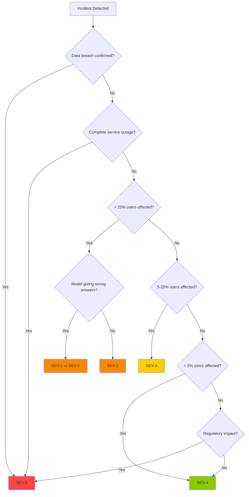

# Incident Classification

## Overview

Consistent incident classification ensures the right people are notified at the right time with the right urgency. This document defines severity levels, impact assessment criteria, and escalation procedures for all incidents in the GenAI engineering organization.

---

## Severity Levels

### SEV-1: Critical

**Definition**: Complete service outage, confirmed data breach, or active regulatory violation with immediate financial or reputational impact.

**Criteria (any one):**
- Complete unavailability of customer-facing GenAI services for > 5 minutes
- Confirmed PII or sensitive data exposure
- Unauthorized financial transactions or data modifications
- Regulatory breach requiring mandatory notification (FCA, ICO, PRA)
- Security compromise (prompt injection with successful exploitation, supply chain compromise)
- Data loss with no recovery option

**Response Requirements:**
- Page on-call engineer immediately
- Incident Commander assigned within 15 minutes
- War room opened within 30 minutes
- Executive notification within 1 hour
- Customer notification within 4 hours (if customer-facing impact)
- Regulatory notification per requirements (see [regulatory-notification.md](regulatory-notification.md))

**Examples:**
- AssistBot completely unavailable for all users
- RAG system leaking PII across customer boundaries
- Compromised dependency exfiltrating customer data
- AI making unauthorized fund transfers

### SEV-2: High

**Definition**: Significant service degradation, partial data loss, or quality issues affecting a substantial subset of users.

**Criteria (any one):**
- > 25% of requests failing or experiencing severe degradation
- Model quality degradation producing incorrect outputs for > 10% of queries
- Partial data loss with recovery option available
- Security concern with limited exploit scope
- Compliance gap identified but not yet exploited
- Cost anomaly exceeding 200% of budget

**Response Requirements:**
- Page on-call engineer (15-minute response SLA)
- Incident Commander assigned within 30 minutes
- War room opened if resolution not clear within 1 hour
- Stakeholder notification within 2 hours
- Customer notification within 24 hours (if customer-facing impact)

**Examples:**
- Vector database degraded, RAG responses slow or incomplete
- Model giving incorrect financial advice due to outdated knowledge
- GPU resource exhaustion affecting model serving
- Token costs 300% over budget

### SEV-3: Medium

**Definition**: Minor service degradation, localized impact, or operational issues with workarounds available.

**Criteria (any one):**
- 5-25% of requests affected
- Non-critical feature unavailable
- Cost anomaly 100-200% over budget
- Internal tooling degradation with workarounds
- Monitoring gap identified (not actively exploited)

**Response Requirements:**
- Ticket created, on-call notified (1-hour response SLA)
- Investigation during business hours
- Stakeholder notification within 4 hours
- Customer notification not required unless impact persists > 24 hours

**Examples:**
- SmartSearch latency elevated but functional
- ComplianceBot knowledge base update delayed
- Embedding pipeline running 4 hours behind schedule
- Token costs 150% over budget

### SEV-4: Low

**Definition**: Minimal impact, cosmetic issues, or problems with easy workarounds.

**Criteria (any one):**
- < 5% of requests affected
- Intermittent issues that self-resolve
- Documentation errors
- Non-critical bug with workaround

**Response Requirements:**
- Ticket created, triaged during next business day
- No page required
- Resolved within standard sprint cycle

**Examples:**
- Intermittent 100ms latency spikes on internal API
- Typo in chatbot welcome message
- Dashboard showing stale data (underlying system fine)

---

## Impact Assessment Matrix

When classifying an incident, evaluate these dimensions:

### Customer Impact

| Level | Criteria |
|-------|----------|
| Critical | All customers affected, complete service loss |
| High | > 25% of customers affected, significant degradation |
| Medium | 5-25% of customers affected, moderate degradation |
| Low | < 5% of customers affected, minor inconvenience |

### Data Impact

| Level | Criteria |
|-------|----------|
| Critical | Confirmed data breach, PII exposed, no recovery |
| High | Data integrity compromised, recovery possible |
| Medium | Potential data gap, audit trail incomplete |
| Low | No data impact |

### Financial Impact

| Level | Criteria |
|-------|----------|
| Critical | > £1M direct loss or regulatory fine |
| High | £100K - £1M direct loss |
| Medium | £10K - £100K direct loss |
| Low | < £10K direct loss |

### Regulatory Impact

| Level | Criteria |
|-------|----------|
| Critical | Active regulatory violation, mandatory notification required |
| High | Potential regulatory breach, investigation needed |
| Medium | Compliance gap identified, no active breach |
| Low | No regulatory impact |

### Reputational Impact

| Level | Criteria |
|-------|----------|
| Critical | National media coverage, brand damage |
| High | Social media trending, customer trust impacted |
| Medium | Customer complaints elevated, limited media |
| Low | No public visibility |

### Overall Severity

The overall severity is the **highest** of all impact dimensions. A SEV-4 customer impact with SEV-1 regulatory impact is classified as SEV-1.

---

## Escalation Criteria

### Automatic Escalation to SEV-1

The following conditions automatically trigger SEV-1 classification:

1. **Data Breach**: Confirmed unauthorized access to customer PII or financial data
2. **Complete Outage**: All customer-facing GenAI services unavailable
3. **Security Compromise**: Confirmed exploitation (prompt injection, supply chain attack)
4. **Regulatory Breach**: Active violation of FCA, ICO, or PRA requirements
5. **Financial Fraud**: Unauthorized transactions totaling > £10,000

### Escalation Path

```
First Responder
    |
    v
On-Call Engineer
    |
    +-- SEV-4: Handle during business hours
    |
    +-- SEV-3: Investigate, assign to sprint
    |
    +-- SEV-2: Page IC, open war room
    |       |
    |       v
    |   Incident Commander
    |       |
    |       v
    +-- SEV-1: Page IC immediately
            |
            v
        Incident Commander
            |
            v
        Executive Notification
            |
            v
        Regulatory Notification (if required)
```

### Escalation Triggers

An incident should be escalated when:
- Resolution is not clear within 30 minutes (SEV-3) or 15 minutes (SEV-2)
- Impact is growing (more customers affected, data exposure increasing)
- Root cause involves multiple systems or teams
- Regulatory or legal implications are identified
- Media or public attention is anticipated

---

## Downgrading and Upgrading

### Downgrading

An incident may be downgraded when:
- Impact has been contained and is decreasing
- Root cause is understood and mitigation is in progress
- No further risk of escalation

**Process:**
1. Incident Commander proposes downgrade
2. SME confirms impact assessment
3. Update incident severity and notify stakeholders
4. Document reason for downgrade in incident timeline

### Upgrading

An incident must be upgraded when:
- Impact is worse than initially assessed
- New information reveals greater scope
- Mitigation attempts have failed
- Regulatory or legal implications discovered

**Process:**
1. Incident Commander proposes upgrade
2. Notify all stakeholders immediately
3. Update incident severity and trigger additional notifications
4. Document reason for upgrade in incident timeline

---

## Banking-Specific Classification Additions

### FCA Operational Resilience Classification

Under FCA Operational Resilience policy, incidents affecting "Important Business Services" (IBS) have additional classification:

| FCA Impact | Criteria | Notification |
|------------|----------|--------------|
| IBS Breach | Service disruption exceeds impact tolerance | FCA notification within 24 hours |
| IBS Near-Miss | Approaching impact tolerance but not breached | Internal reporting only |
| Non-IBS | Service not classified as IBS | Standard classification applies |

### GDPR Data Breach Classification

Under GDPR, data breaches are classified separately:

| GDPR Severity | Criteria | ICO Notification |
|--------------|----------|-----------------|
| High Risk | Likely to result in risk to individuals' rights | Within 72 hours |
| Medium Risk | Possible risk, assessment needed | Within 72 hours if confirmed |
| Low Risk | Unlikely to result in risk | No notification required (document internally) |

---

## Classification Decision Tree



---

## Classification Examples

### Example 1: Vector Database Degradation

**Scenario**: Vector database latency increases from 80ms to 800ms. AssistBot responses are slow but correct. 40% of users experience timeouts.

**Assessment:**
- Customer Impact: High (40% affected)
- Data Impact: Low (no data loss)
- Financial Impact: Medium (SLA credits likely)
- Regulatory Impact: Low (no regulatory breach)
- Reputational Impact: Medium (customer complaints increasing)

**Classification: SEV-2** (High customer impact)

### Example 2: Model Hallucination in Compliance Advice

**Scenario**: ComplianceBot gives incorrect advice about cross-border data transfers. 3 employees have already acted on the advice.

**Assessment:**
- Customer Impact: Low (internal tool)
- Data Impact: High (potential GDPR violation)
- Financial Impact: Medium (potential fines)
- Regulatory Impact: Critical (GDPR Article 46 violation)
- Reputational Impact: Medium (internal only so far)

**Classification: SEV-1** (Critical regulatory impact)

### Example 3: Token Cost Anomaly

**Scenario**: Monthly token costs are 180% of budget. No service impact.

**Assessment:**
- Customer Impact: Low (no service impact)
- Data Impact: Low
- Financial Impact: Medium (180% overrun)
- Regulatory Impact: Low
- Reputational Impact: Low

**Classification: SEV-3** (Medium financial impact)

---

## Cross-References

- [README.md](README.md) -- Incident management philosophy
- [incident-command.md](incident-command.md) -- Incident commander role
- [regulatory-notification.md](regulatory-notification.md) -- Regulatory notification requirements
- [genai-specific-incidents.md](genai-specific-incidents.md) -- GenAI incident patterns
- [banking-incident-requirements.md](banking-incident-requirements.md) -- Banking regulatory obligations
- [incident-metrics.md](incident-metrics.md) -- MTTD, MTTR tracking
