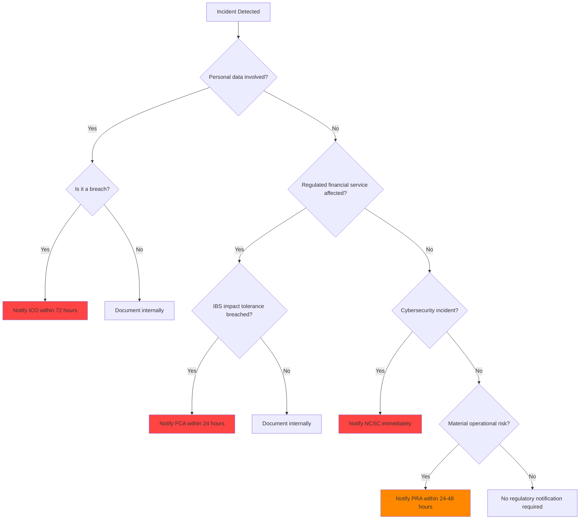

# Regulatory Notification

## Overview

Certain incidents in a banking GenAI context trigger mandatory notification to regulatory bodies. This document defines when, how, and to whom notifications must be made, along with the timelines and content requirements for each regulatory obligation.

---

## Regulatory Bodies and Triggers

### Information Commissioner's Office (ICO) -- GDPR

**Trigger:** Personal data breach as defined by GDPR Article 33.

A personal data breach includes:
- Unauthorized access to personal data
- Accidental or unlawful destruction of personal data
- Loss of personal data
- Alteration of personal data
- Unauthorized disclosure of personal data

**Examples in GenAI context:**
- RAG system leaking PII across customer boundaries
- Prompt injection resulting in data exfiltration
- Training data containing personal data exposed
- LLM output containing personal data sent to unauthorized recipients

**Timeline:** Within 72 hours of becoming aware of the breach.

**Content Requirements:**
1. Nature of the breach (categories and approximate numbers of data subjects and records)
2. Contact details of the DPO
3. Likely consequences of the breach
4. Measures taken or proposed to address the breach
5. Measures taken to mitigate possible adverse effects

**Process:**
1. Incident detected and classified as potential data breach
2. DPO notified immediately
3. Legal team assesses breach severity
4. Breach notification drafted (template below)
5. DPO reviews and approves
6. Notification submitted via ICO online portal
7. If high risk to individuals: notify affected individuals without undue delay (Article 34)

### Financial Conduct Authority (FCA)

**Trigger:** Breach of Operational Resilience requirements affecting "Important Business Services" (IBS).

**Examples in GenAI context:**
- GenAI customer service unavailable, exceeding FCA impact tolerance
- AI advisory service providing incorrect regulated financial advice
- Automated decision-making system operating outside approved parameters

**Timeline:**
- Initial notification: Within 24 hours of breaching impact tolerance
- Full report: Within 20 business days

**Content Requirements:**
1. Description of the incident and affected IBS
2. Impact assessment (number of customers affected, duration)
3. Root cause (if known)
4. Actions taken and proposed
5. Lessons learned

**Process:**
1. Incident classified as IBS breach
2. Compliance team notified
3. FCA notification drafted
4. Legal review
5. Submitted via FCA regulatory portal (RegData)
6. Ongoing updates as investigation progresses

### Prudential Regulation Authority (PRA)

**Trigger:** Material operational risk event affecting the bank's safety and soundness.

**Examples:**
- GenAI system causing significant financial loss
- Cybersecurity compromise of AI infrastructure
- Model risk event affecting credit decisions

**Timeline:** As soon as practicable, typically within 24-48 hours.

### National Cyber Security Centre (NCSC)

**Trigger:** Significant cybersecurity incident.

**Examples:**
- Supply chain compromise affecting GenAI platform
- Ransomware attack on AI infrastructure
- State-sponsored attack on banking AI systems

**Timeline:** Immediately upon confirmation of cybersecurity incident.

---

## Notification Decision Tree



---

## ICO Notification Template

```
NOTIFICATION OF PERSONAL DATA BREACH
Submitted under GDPR Article 33

Date of notification: [YYYY-MM-DD]
Time of notification: [HH:MM UTC]
Organization: [Bank Name]
DPO Contact: [Name, email, phone]

1. NATURE OF THE BREACH

Brief description:
[A factual, non-speculative description of the breach]

Categories of data subjects affected:
[e.g., retail banking customers, mortgage applicants]

Approximate number of data subjects:
[e.g., approximately 2,347 customers]

Categories of personal data involved:
[e.g., names, account numbers, SSNs, transaction data]

Approximate number of records:
[e.g., approximately 5,600 records]

2. LIKELY CONSEQUENCES

[e.g., "The exposed data includes account numbers and SSNs which
could be used for identity fraud. Affected individuals may be at
risk of financial harm."]

3. MEASURES TAKEN

Immediate containment:
[e.g., "The affected RAG system was taken offline within 14 hours
of detection. Access to the vector database was restricted."]

Mitigation measures:
[e.g., "Affected customers have been notified. Two years of credit
monitoring has been offered. The system has been redesigned with
per-customer namespace isolation."]

4. MEASURES PROPOSED

[e.g., "A comprehensive review of all GenAI systems for data
isolation vulnerabilities is underway. Red team testing of all
RAG systems will be conducted quarterly. Output PII filtering
has been implemented."]

5. CONTACT

For further information:
DPO Name: [Name]
Email: [dpo@bank.com]
Phone: [Phone number]
```

---

## FCA Notification Template

```
INCIDENT NOTIFICATION -- OPERATIONAL RESILIENCE
Important Business Service: [Service Name]

Date: [YYYY-MM-DD]
Firm Reference Number: [FRN]
Contact: [Name, title, email, phone]

1. INCIDENT SUMMARY

Description:
[A factual description of the incident and its impact on the IBS]

Time of incident start: [YYYY-MM-DD HH:MM UTC]
Time of incident detection: [YYYY-MM-DD HH:MM UTC]
Time of incident resolution: [YYYY-MM-DD HH:MM UTC]
Total duration: [X hours Y minutes]

2. IMPACT ASSESSMENT

Impact tolerance breached: [Yes/No]
If yes, which tolerance: [Specify]

Number of customers affected: [Number]
Duration of customer impact: [X hours Y minutes]

Financial impact: [Amount, if known]

3. ROOT CAUSE

[e.g., "Preliminary investigation indicates the incident was caused
by... Full root cause analysis is ongoing."]

4. ACTIONS TAKEN

Immediate actions:
[e.g., "The affected service was restored by..."]

Customer remediation:
[e.g., "Affected customers have been contacted and..."]

5. FURTHER ACTIONS PLANNED

[e.g., "A comprehensive review of... will be completed by..."]

6. LESSONS LEARNED

[e.g., "This incident has highlighted the need for..."]
```

---

## Internal Notification Process

### Who Notifies the Regulator?

1. **First Responder/IC**: Identifies potential regulatory impact during triage
2. **Compliance Team**: Assesses regulatory obligation and timeline
3. **Legal Team**: Reviews notification content for accuracy and completeness
4. **DPO** (for GDPR): Submits ICO notification
5. **Compliance Officer** (for FCA/PRA): Submits regulatory notification

### Internal Escalation for Regulatory Incidents

```
Incident Detected
    |
    v
IC identifies potential regulatory impact
    |
    v
Compliance team notified (within 1 hour for SEV-1)
    |
    v
Compliance assesses obligation and timeline
    |
    v
Legal team engaged
    |
    v
Notification drafted
    |
    v
Legal reviews and approves
    |
    v
DPO / Compliance Officer submits notification
    |
    v
Confirmation of receipt obtained
    |
    v
Ongoing updates as required
```

---

## Regulatory Notification Checklist

### For Every Regulatory Notification

- [ ] Regulatory obligation confirmed (which regulation, which trigger)
- [ ] Timeline for notification identified (72 hours, 24 hours, etc.)
- [ ] Notification deadline calculated and communicated
- [ ] DPO / Compliance Officer assigned as submitter
- [ ] Legal team engaged for review
- [ ] All required content fields completed
- [ ] Factual accuracy verified (no speculation)
- [ ] Customer impact assessment included
- [ ] Remediation actions described
- [ ] Notification submitted before deadline
- [ ] Confirmation of receipt obtained and filed
- [ ] Follow-up timeline established (if ongoing investigation)

---

## Post-Notification Obligations

### ICO Follow-Up

After initial notification:
1. ICO may request additional information
2. ICO may open an investigation
3. ICO may issue enforcement action (warning, fine, order)
4. Cooperate fully with ICO requests
5. Provide requested information within ICO deadlines

### FCA Follow-Up

After initial notification:
1. Full report within 20 business days
2. FCA may request a "lessons learned" report
3. FCA may require a remediation plan
4. Cooperate with any FCA investigation
5. Implement required remediation actions

### Ongoing Communication

- Provide regular updates to the regulator as the investigation progresses
- Do not wait for the final report to share significant findings
- Maintain a single point of contact for the regulator

---

## Banking-Specific Requirements

### FCA Operational Resilience Policy

Under the FCA's Operational Resilience policy (SS1/21), firms must:

1. **Identify Important Business Services**: GenAI services that deliver regulated activities
2. **Set Impact Tolerances**: Maximum acceptable disruption level
3. **Test Against Tolerances**: Regular testing of resilience
4. **Self-Report Breaches**: Notification within 24 hours of breaching tolerance

### Senior Managers and Certification Regime (SMCR)

Under SMCR, specific senior managers are personally accountable for incidents:

- **SMF12** (Chief Operations): Operational resilience
- **SMF16** (Chief Risk): Risk management
- **SMF17** (Chief Technology): Technology and security

These individuals may be questioned by regulators about incidents in their area of responsibility.

### MiFID II Reporting

For investment-related GenAI services:
- Article 16 requires recording of all communications and advice
- Incidents affecting recording obligations must be reported
- Algorithmic trading disruptions must be reported to the FCA

---

## Cross-References

- [README.md](README.md) -- Incident management philosophy
- [incident-classification.md](incident-classification.md) -- Severity classification
- [communication-during-incidents.md](communication-during-incidents.md) -- Communication procedures
- [customer-communication.md](customer-communication.md) -- Customer notification templates
- [banking-incident-requirements.md](banking-incident-requirements.md) -- Banking incident obligations
- [genai-specific-incidents.md](genai-specific-incidents.md) -- GenAI incident patterns
