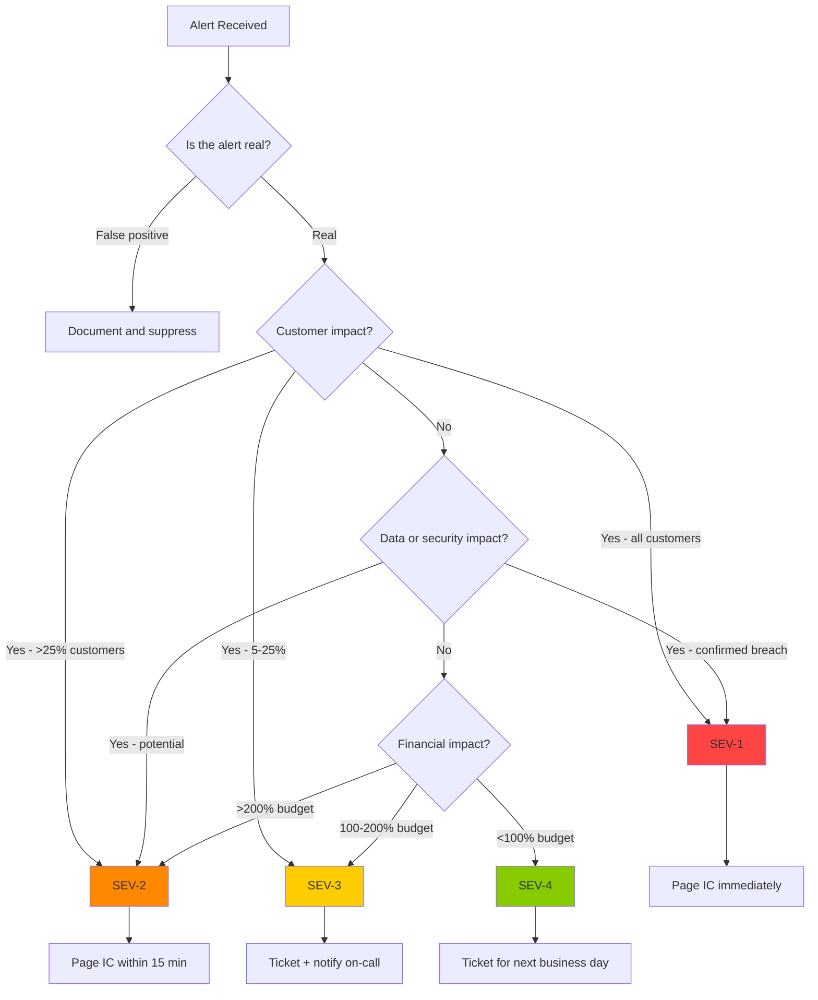

# Triage Playbooks

## Overview

Triage is the process of quickly assessing an incident to understand its scope, severity, and initial response direction. This document provides decision trees and common triage patterns for the GenAI engineering organization.

---

## Triage Decision Tree



---

## Triage Checklist (First 5 Minutes)

### 1. Confirm the Alert Is Real

- [ ] Check the monitoring dashboard for the alerted metric
- [ ] Verify it is not a monitoring artifact (Prometheus scrape failure, Grafana outage)
- [ ] Check for recent deployments, maintenance, or known changes
- [ ] Quick sanity check: does the metric value make sense?

### 2. Assess Customer Impact

- [ ] Is the service reachable by customers?
- [ ] What percentage of requests are failing or degraded?
- [ ] Which customer segments are affected (all, specific region, specific plan)?
- [ ] Is the impact growing, stable, or decreasing?

### 3. Classify Severity

- [ ] Apply classification criteria from [incident-classification.md](incident-classification.md)
- [ ] If unsure, classify higher -- it can be downgraded later
- [ ] Document the classification rationale

### 4. Initiate Response

- [ ] Page on-call engineer (if not already paged)
- [ ] For SEV-1/SEV-2: page Incident Commander
- [ ] Open incident channel/ticket
- [ ] Begin timeline documentation

---

## Common Triage Patterns

### Pattern 1: Service Down

**Symptoms**: Health check failing, all requests returning 5xx.

**Quick Checks:**
1. Is the service actually down, or is the health check broken?
   - `curl https://service/health` manually
   - Check if other endpoints respond
2. Is it a network issue or an application issue?
   - Check if the pod is running: `kubectl get pods`
   - Check pod logs: `kubectl logs <pod>`
3. Was there a recent deployment?
   - `kubectl rollout history deployment/<name>`
   - If yes, rollback is the first mitigation attempt

**Likely Causes:**
- Bad deployment (most common)
- Infrastructure failure (node failure, network partition)
- Dependency failure (database, vector DB, LLM API)
- Resource exhaustion (CPU, memory, GPU)

### Pattern 2: Elevated Error Rate

**Symptoms**: Error rate above threshold but service still partially functional.

**Quick Checks:**
1. What type of errors? (5xx, 4xx, timeouts)
2. Which endpoints are affected? (all, specific endpoint)
3. When did the error rate start increasing?
4. Correlate with recent changes (deployments, config changes, traffic spikes)

**Likely Causes:**
- Partial deployment failure
- Downstream dependency degradation
- Traffic spike exceeding capacity
- Configuration error

### Pattern 3: High Latency

**Symptoms**: P95/P99 latency above SLA threshold.

**Quick Checks:**
1. Is it all requests or specific request types?
2. Is latency increasing gradually or suddenly?
3. Check resource utilization (CPU, memory, GPU, IOPS)
4. Check downstream dependency latency

**Likely Causes:**
- Resource saturation (CPU throttling, memory pressure)
- Downstream dependency slow (database, vector DB, LLM API)
- Increased payload size (larger prompts, more context)
- Garbage collection pauses

### Pattern 4: Model Quality Degradation

**Symptoms**: Model producing incorrect or low-quality outputs.

**Quick Checks:**
1. When did quality start declining?
2. Has the model been retrained or updated recently?
3. Has the input data distribution changed?
4. Has a dependency been updated (spaCy, transformers)?
5. Check model confidence scores (are they lower than baseline?)

**Likely Causes:**
- Data drift (input distribution changed)
- Model regression (bad fine-tuning)
- Preprocessing change (tokenization, lemmatization)
- Context retrieval failure (vector DB issue)

### Pattern 5: Token Cost Anomaly

**Symptoms**: Daily/monthly token costs significantly above forecast.

**Quick Checks:**
1. Is the cost increase from more traffic or more tokens per request?
2. Which service is driving the increase?
3. Has a new feature been deployed that increases context?
4. Has the model been changed (different pricing tier)?

**Likely Causes:**
- New feature with larger context windows
- Increased traffic volume
- Model upgrade to more expensive tier
- Prompt growth (system prompt bloat over time)

### Pattern 6: Vector DB Unavailable

**Symptoms**: RAG system unable to retrieve context, errors from vector DB.

**Quick Checks:**
1. Is the vector DB process running?
2. Can you connect to the vector DB from the application?
3. Is it a managed service (Pinecone) or self-hosted (Milvus)?
   - If managed: check provider status page
   - If self-hosted: check pod status and resource utilization
4. Are queries timing out or returning errors?

**Likely Causes:**
- Managed service outage (provider-side)
- Resource exhaustion (memory, IOPS)
- Index corruption or degradation
- Network connectivity issue

### Pattern 7: PII Leakage Detected

**Symptoms**: PII detection alert on LLM output.

**Quick Checks:**
1. What PII was detected? (SSN, account number, name, address)
2. Which customer's data was leaked?
3. Was it exposed to the correct customer or a different customer?
4. How many responses contained PII?
5. Is the leakage ongoing or historical?

**Likely Causes:**
- Cross-customer data retrieval (RAG tenant isolation failure)
- Prompt injection exfiltrating data
- Insufficient output filtering
- Training data contamination

### Pattern 8: Prompt Injection Detected

**Symptoms**: Prompt injection pattern matched in user input.

**Quick Checks:**
1. What injection pattern was detected?
2. Did the injection succeed (did the model follow the malicious instructions)?
3. What was the impact? (system prompt leaked, tool calls executed, data exposed)
4. Is the attack ongoing?

**Likely Causes:**
- Malicious user input
- Indirect injection via uploaded documents
- System prompt not robust enough

---

## GenAI-Specific Triage Patterns

### Triage: RAG Retrieval Failure

```
Symptoms: LLM responses lack context, "I don't know" answers increase

1. Check embedding pipeline
   - Are new documents being embedded?
   - Is the embedding API responding?

2. Check vector database
   - Is the vector DB reachable?
   - Are queries returning results?
   - What are the retrieval scores?

3. Check retrieval configuration
   - Has top_k changed?
   - Has the similarity threshold changed?
   - Has the namespace/filter changed?

4. Check input query
   - Is the query being embedded correctly?
   - Does the query match the indexed content?
```

### Triage: LLM API Degradation

```
Symptoms: LLM API responses slow, failing, or producing poor output

1. Check LLM provider status
   - Provider status page (Azure OpenAI, Anthropic)
   - Any known incidents on the provider side?

2. Check API rate limits
   - Are we hitting rate limits?
   - Are requests being throttled?

3. Check API response quality
   - Are responses completing or truncating?
   - Are responses coherent?
   - Has the model version changed?

4. Check fallback
   - If provider is down, has failover to backup provider triggered?
   - If no failover, this is a SEV-1
```

### Triage: GPU Resource Exhaustion

```
Symptoms: Model serving pods OOM crashing, high GPU memory usage

1. Check GPU utilization
   - `nvidia-smi` on affected nodes
   - DCGM metrics: GPU memory, utilization, temperature

2. Identify the resource hog
   - Is it a training job consuming inference GPU?
   - Is it a memory leak in the inference server?

3. Check scheduling
   - Are training and inference pods co-located?
   - Has the scheduling policy changed?

4. Mitigate
   - Kill the offending pod (if training job)
   - Restart the inference server (if memory leak)
   - Redistribute pods across nodes
```

---

## Triage Runbook Template

For each alert type, maintain a runbook with this structure:

```markdown
# Runbook: [Alert Name]

## Alert Description
[What triggered this alert]

## Severity
[Default severity classification]

## Immediate Checks (First 5 minutes)
1. [Check 1] - [How to check]
2. [Check 2] - [How to check]
3. [Check 3] - [How to check]

## Likely Causes
1. [Cause 1] - [How to confirm]
2. [Cause 2] - [How to confirm]
3. [Cause 3] - [How to confirm]

## Mitigation Steps
1. [Step 1] - [Command/procedure]
2. [Step 2] - [Command/procedure]
3. [Step 3] - [Command/procedure]

## Escalation
- If not resolved in 15 minutes: escalate to [role]
- If root cause is [X]: escalate to [team]

## Related Incidents
- [Link to past incidents with similar symptoms]

## Contact
- Primary: [team/person]
- Backup: [team/person]
```

---

## Cross-References

- [README.md](README.md) -- Incident management philosophy
- [incident-classification.md](incident-classification.md) -- Severity levels
- [detection-and-alerting.md](detection-and-alerting.md) -- Alert design
- [incident-command.md](incident-command.md) -- Incident commander role
- [genai-specific-incidents.md](genai-specific-incidents.md) -- GenAI incident patterns
- [war-room-management.md](war-room-management.md) -- War room procedures
