# System Design Interview Questions — 20 Questions with Full Answers

## Overview
| Detail | Value |
|--------|-------|
| Topic | System Design (GenAI Systems, API Design, RAG Platforms, Multi-Tenant Architecture, Observability, Event-Driven, Reliability) |
| Questions | 20 (5 Must-Know, 10 Medium, 5 Advanced) |
| Source Files | system-design/ (15 files), architecture/ (23 files), genai-platforms/ (34+ files) |
| Citi Relevance | System design is the most important interview round for an AVP role at Citi. You must be able to design complete GenAI systems from scratch, showing breadth across frontend, backend, database, infrastructure, and AI components. |

---

## Difficulty Legend
- 🔵 **Must-Know** — Foundational. Every candidate should know these.
- 🟡 **Medium** — Core competency. What you'll actually be tested on.
- 🔴 **Advanced** — Differentiator. Shows principal-engineer depth.

---

### Q1: 🔵 Design an Enterprise Internal Chatbot for a bank with 500K+ employees. How do you handle scale, accuracy, and safety?

**Strong Answer:**

The enterprise chatbot is a RAG-powered internal assistant that helps bank employees find information about policies, procedures, products, and compliance requirements. At 500K+ employees across 200+ branches globally, this is a massive-scale system that demands careful architectural decisions.

The core architecture follows a layered approach. At the edge, we have a Web App (React) and MS Teams/Slack bots behind an API Gateway with OAuth2/SAML SSO authentication and per-user rate limiting. The application layer contains the Chat Service, Session Manager, and a critical PII Redaction Service that strips SSNs, account numbers, and credit card numbers from all queries before they reach any external API.

The AI pipeline is where the real complexity lives. A Query Rewriter rewrites user queries for better retrieval, then the Retrieval Engine queries pgvector with department- and clearance-level filters. Retrieved documents pass through a Re-ranker (self-hosted cross-encoder) that re-scores from 20 down to 4 documents. The LLM Gateway routes to gpt-4o-mini for most queries (best cost/performance) and escalates to gpt-4o for complex compliance queries. A Groundedness Checker validates that the response is actually supported by the retrieved context before returning it to the user.

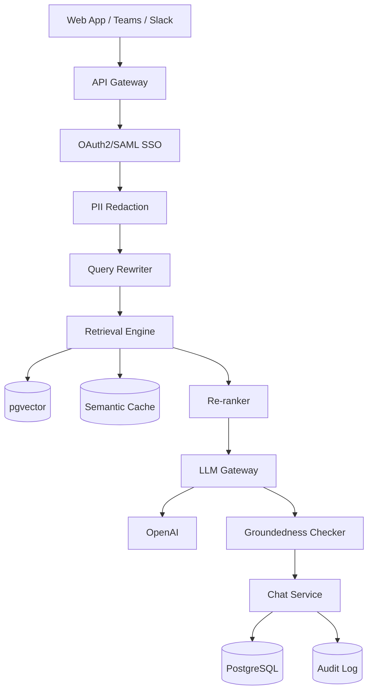
```mermaid
flowchart TB
    WEB[Web App / Teams / Slack] --> GW[API Gateway]
    GW --> AUTH[OAuth2/SAML SSO]
    AUTH --> PII[PII Redaction]
    PII --> QR[Query Rewriter]
    QR --> RET[Retrieval Engine]
    RET --> VDB[(pgvector)]
    RET --> REDIS[(Semantic Cache)]
    RET --> RER[Re-ranker]
    RER --> LLM[LLM Gateway]
    LLM --> OPENAI[OpenAI]
    LLM --> GROUND[Groundedness Checker]
    GROUND --> CHAT[Chat Service]
    CHAT --> PG[(PostgreSQL)]
    CHAT --> AUDIT[(Audit Log)]
```

For the vector database, we choose pgvector over Pinecone or Milvus because the bank already operates PostgreSQL at scale, pgvector provides SQL-level access control (mature RBAC), integrates with existing audit infrastructure, and handles our expected 5M document chunks well within its capacity. We use HNSW indexing with m=16, ef_construction=256, and GIN indexes on the metadata JSONB column for department and clearance filtering.

Caching is multi-level: exact-match cache (hash of query + department), semantic cache (embedding similarity > 0.95), and session cache (conversation history, 30-minute TTL). Successful responses with groundedness > 0.8 are cached for 1 hour, but for time-sensitive policy changes, we use a 5-minute TTL with proactive FAQ distribution.

Safety is defense-in-depth: (1) PII redaction at input, (2) access control at retrieval (SQL-level tenant and department filters), (3) groundedness validation at output (block responses below 0.7), (4) citation verification (ensure all cited sources are accessible by the user), and (5) comprehensive audit logging of every interaction.

**Key Points to Hit:**
- [ ] RAG pipeline: query rewriting, retrieval, re-ranking, generation, groundedness check
- [ ] pgvector selection rationale: existing infra, SQL-level access control, audit integration
- [ ] Multi-level caching: exact match, semantic, session with department-scoped keys
- [ ] PII redaction: pattern-based + NER-based before any external API call
- [ ] Defense-in-depth safety: input redaction, retrieval filtering, output validation, audit logging

**Follow-Up Questions:**
1. How would you handle a spike in queries during a major policy change announcement?
2. How do you ensure the chatbot doesn't leak confidential information between departments?
3. What would you do if users complain the chatbot gives outdated information?

**Source:** `system-design/internal-enterprise-chatbot.md`, `architecture/enterprise-genai-architecture.md`, `system-design/secure-rag-platform.md`

---

### Q2: 🔵 Design a Secure Multi-Tenant RAG Platform serving 10+ departments with strict data isolation. How do you guarantee zero cross-tenant data leakage?

**Strong Answer:**

Multi-tenant RAG in a regulated bank requires isolation at every layer. The core challenge is serving multiple departments (Retail Banking, Corporate Banking, Compliance, Wealth Management, etc.) from shared infrastructure while guaranteeing that no department can access another's data.

The isolation model we use is a **Pool model with logical isolation** for most departments, and a **Silo model** for the most sensitive departments (Internal Audit, M&A). In the pool model, all tenants share the same vector database, application servers, and cache, but every data operation is scoped by tenant_id.

At the database level, we implement PostgreSQL Row-Level Security (RLS). Every table (document_chunks, embeddings, audit_logs) has RLS enabled with policies that enforce tenant_id matching:

```sql
ALTER TABLE document_chunks ENABLE ROW LEVEL SECURITY;

CREATE POLICY tenant_isolation_policy ON document_chunks
    USING (tenant_id = current_setting('app.current_tenant_id')::uuid);

CREATE POLICY department_access_policy ON document_chunks
    USING (department = ANY(string_to_array(current_setting('app.user_departments'), ',')));

CREATE POLICY clearance_policy ON document_chunks
    USING ((metadata->>'min_clearance')::int <= current_setting('app.user_clearance')::int);
```

The tenant context flows through the entire request chain via contextvars in Python. A TenantMiddleware extracts the tenant_id from the JWT token on every request, validates the resource quota, and sets the tenant context. Every database query, vector search, and cache lookup automatically includes this tenant filter.

For the vector database, we use tenant-scoped collection names: `{tenant_id}-{collection_name}`. Before any search, we verify the collection exists for that specific tenant. For pgvector, we use SQL WHERE clauses with tenant_id in every query.

Cache keys always include tenant_id: `cache:{tenant_id}:{query_hash}`. This prevents serving a cached response generated from one tenant's data to another tenant.

The Response Validator is the final safety net. It checks that all cited sources in the generated response belong to the user's tenant. If any cross-tenant reference is detected, the response is blocked.

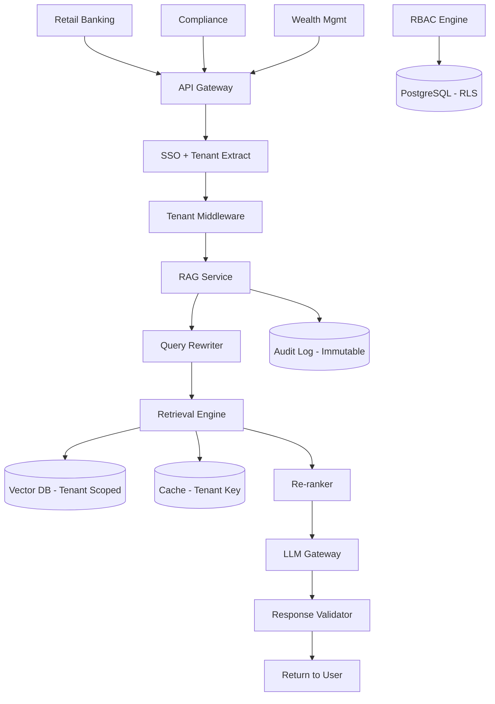
```mermaid
flowchart TB
    T1[Retail Banking] --> GW[API Gateway]
    T2[Compliance] --> GW
    T3[Wealth Mgmt] --> GW

    GW --> AUTH[SSO + Tenant Extract]
    AUTH --> TM[Tenant Middleware]
    TM --> RAG[RAG Service]

    RAG --> QR[Query Rewriter]
    QR --> RET[Retrieval Engine]
    RET --> VDB[(Vector DB - Tenant Scoped)]
    RET --> REDIS[(Cache - Tenant Key)]
    RET --> RER[Re-ranker]
    RER --> LLM[LLM Gateway]
    LLM --> VERIFY[Response Validator]
    VERIFY --> USER[Return to User]

    RBAC[RBAC Engine] --> PG[(PostgreSQL - RLS)]
    RAG --> AUDIT[(Audit Log - Immutable)]
```

To prove to an auditor that cross-tenant leakage is impossible, I demonstrate the defense-in-depth chain: (1) Database RLS policies -- even with an application bug, the database prevents cross-tenant access. (2) Application-level tenant_id filter on every retrieval query. (3) Cache keys scoped by tenant_id. (4) Response-level validation checking all citations. (5) Audit logging of every interaction with tenant_id for post-hoc verification.

**Key Points to Hit:**
- [ ] Pool vs. Silo isolation models with decision criteria
- [ ] PostgreSQL Row-Level Security as defense-in-depth
- [ ] Tenant context propagation via contextvars through entire request chain
- [ ] Tenant-scoped cache keys and vector collection names
- [ ] Response validation as final safety layer before returning to user

**Follow-Up Questions:**
1. A department head wants to share some documents with another department -- how do you handle this?
2. How do you handle a tenant migrating from pool to silo?
3. What is the performance overhead of RLS on large vector tables?

**Source:** `system-design/secure-rag-platform.md`, `architecture/multi-tenant-design.md`

---

### Q3: 🔵 Design an AI Model Gateway that provides unified access to multiple LLM providers with intelligent routing, fallback, and cost tracking.

**Strong Answer:**

The AI Model Gateway is a centralized platform that abstracts multiple LLM providers (OpenAI, Anthropic, Google, self-hosted models) behind a single unified API. Without a gateway, each team independently calls LLM APIs with no coordination, resulting in uncontrolled costs, inconsistent quality, and no fallback capability.

The gateway architecture has several critical components. The Model Router evaluates incoming requests and selects the optimal model based on a scoring system: capability match (40 points -- does the model support the required token count, context window, streaming?), quality score (30 points -- gpt-4o: 30, claude-sonnet: 28, gpt-4o-mini: 20), cost efficiency (20 points -- inverse of cost per token), and latency (10 points -- inverse of average latency). The router also checks provider health and team budget before routing.

The Semantic Cache uses both exact-match and semantic-similarity lookups. Exact match uses a hash of `{model}:{prompt}:{temperature}:{max_tokens}` for the fast path. Semantic match encodes the prompt and searches cached embeddings using cosine similarity with a 0.95 threshold. This increases cache hit rates from 20-30% (exact only) to 30-50%.

The Fallback Handler implements a fallback chain: if gpt-4o fails, try claude-sonnet, then gpt-4o-mini. If gpt-4o-mini fails, try claude-haiku, then llama-3-70b. Each fallback attempt has a 30-second timeout. Non-retriable errors (auth failures, rate limits) are raised immediately, while retriable errors (timeouts, connection errors) trigger the next fallback.

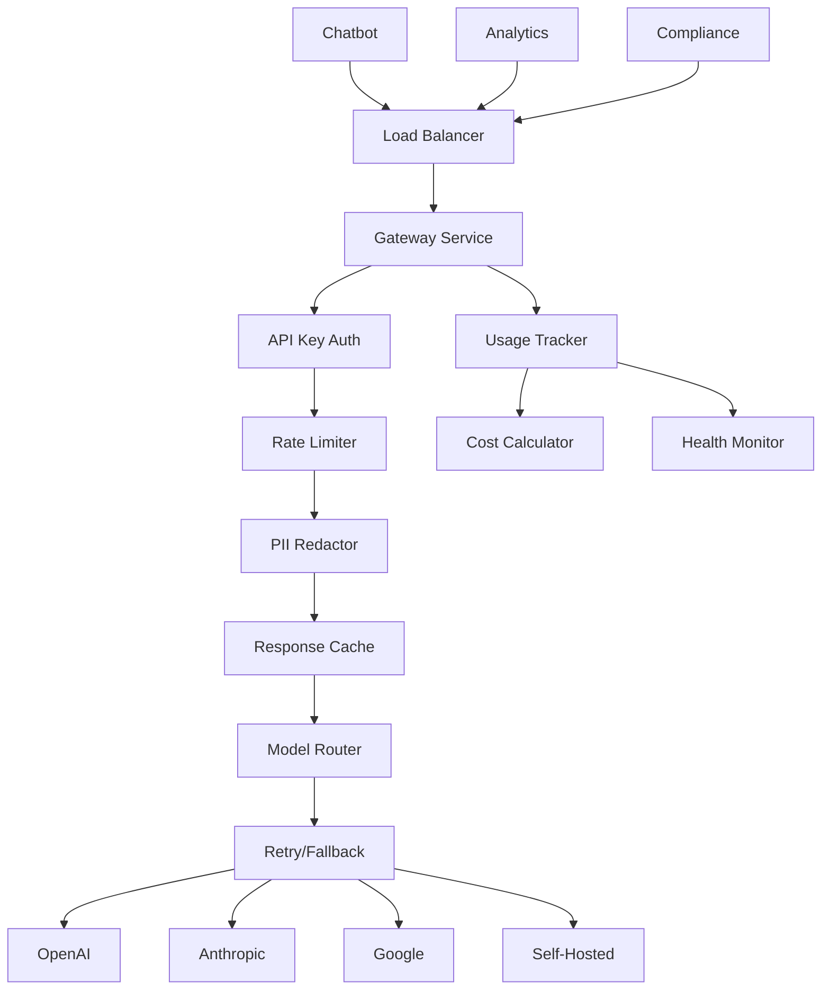
```mermaid
flowchart TB
    APP1[Chatbot] --> LB[Load Balancer]
    APP2[Analytics] --> LB
    APP3[Compliance] --> LB

    LB --> GW[Gateway Service]
    GW --> AUTH[API Key Auth]
    AUTH --> RATE[Rate Limiter]
    RATE --> PII[PII Redactor]
    PII --> CACHE[Response Cache]
    CACHE --> ROUTER[Model Router]
    ROUTER --> RETRY[Retry/Fallback]

    RETRY --> OPENAI[OpenAI]
    RETRY --> ANTHROPIC[Anthropic]
    RETRY --> GOOGLE[Google]
    RETRY --> SELFHOSTED[Self-Hosted]

    GW --> TRACKER[Usage Tracker]
    TRACKER --> COST[Cost Calculator]
    TRACKER --> MONITOR[Health Monitor]
```

Budget Management enforces per-team monthly budgets. Teams have soft limits (80% -- alerts sent) and hard limits (100% -- non-critical requests blocked). An emergency override flow allows team leads to authorize additional budget with VP approval for critical production needs. Every request is logged with team_id, model, token count, and cost.

The gateway is built as a custom service (not Kong/APISIX) because LLM-specific features -- semantic caching, model routing, cost tracking, PII redaction -- are too specialized for generic API gateways. The gateway targets < 50ms overhead (excluding LLM call time) and 99.99% availability.

**Key Points to Hit:**
- [ ] Model scoring algorithm: capability (40), quality (30), cost (20), latency (10)
- [ ] Dual-path caching: exact match (fast) + semantic similarity (broader coverage)
- [ ] Fallback chain with timeout, retriable vs non-retriable error handling
- [ ] Per-team budget management with soft/hard limits and emergency override
- [ ] Custom gateway vs. Kong decision rationale

**Follow-Up Questions:**
1. How do you handle a situation where a team's budget is exhausted but they have a critical production need?
2. How would you detect and prevent prompt injection attacks through the gateway?
3. How do you measure and reduce the gateway's latency overhead?

**Source:** `system-design/ai-gateway-platform.md`, `architecture/ai-platform-design.md`

---

### Q4: 🔵 Design a GenAI Observability Platform that tracks LLM usage, quality, cost, and security events across 20+ AI applications.

**Strong Answer:**

The GenAI Observability Platform is a centralized platform that provides end-to-end visibility into all GenAI applications. In a bank with 20+ AI applications, centralized observability is essential for cost control, quality monitoring, compliance, and debugging.

The architecture has four layers. The Ingestion Layer uses an Observability SDK embedded in every GenAI application. The SDK instruments LLM calls (model, prompt, response, tokens, cost, latency), retrieval operations (query, retrieved count, scores, latency), and quality assessments (groundedness, hallucination detection, user feedback). Events are batched (100 per flush) and sent asynchronously to collectors.

The Processing Layer uses a stream processor (Apache Flink or Kafka Streams) to handle 1M+ events/hour. An Enrichment Service adds metadata (team_id, environment, deployment version). A PII Masking Service applies regex and NER-based masking to any sensitive data in prompts and responses before storage. An Aggregation Service computes rolling metrics (averages, percentiles, counts) for efficient dashboard queries.

The Storage Layer uses a two-store approach. Elasticsearch stores raw logs for full-text search and detailed trace analysis. ClickHouse stores time-series metrics for cost, latency, and quality aggregation (excellent at large-scale time-series analytics with lower cost than Elasticsearch). Jaeger stores distributed traces. Summary tables are pre-aggregated for common dashboard queries.

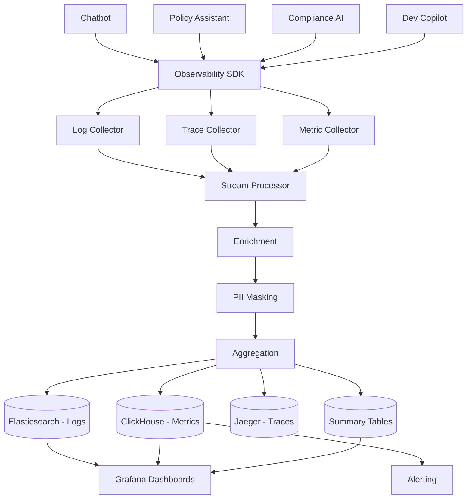
```mermaid
flowchart TB
    APP1[Chatbot] --> SDK[Observability SDK]
    APP2[Policy Assistant] --> SDK
    APP3[Compliance AI] --> SDK
    APP4[Dev Copilot] --> SDK

    SDK --> COLLECTOR[Log Collector]
    SDK --> TRACER[Trace Collector]
    SDK --> METER[Metric Collector]

    COLLECTOR --> STREAM[Stream Processor]
    TRACER --> STREAM
    METER --> STREAM

    STREAM --> ENRICH[Enrichment]
    ENRICH --> MASK[PII Masking]
    MASK --> AGG[Aggregation]

    AGG --> ES[(Elasticsearch - Logs)]
    AGG --> CH[(ClickHouse - Metrics)]
    AGG --> JAEGER[(Jaeger - Traces)]
    AGG --> SUM[(Summary Tables)]

    ES --> GRAFANA[Grafana Dashboards]
    CH --> GRAFANA
    SUM --> GRAFANA
    CH --> ALERT[Alerting]
```

Three key dashboards serve different stakeholders. The Executive Overview shows total queries, daily cost, average groundedness, hallucination rate, and daily cost trends. The Engineering Dashboard shows P50/P95/P99 latency, error rate, retrieval quality, cache hit rate, and slowest traces. The Cost Dashboard shows monthly spend, forecast, cost by team/model, budget utilization, and cost per query.

For security monitoring, we detect prompt injection attempts using pattern matching (regex for "ignore instructions," "system prompt," "you are now," etc.), PII leakage in outputs, and access violations. High-severity events trigger PagerDuty alerts.

To balance comprehensive logging with data privacy, we apply three layers: (1) SDK-level truncation to 500 characters with PII masking, (2) processing-layer NER masking for any remaining sensitive data, (3) role-based access where most users see aggregated metrics only. Full unmasked data is only accessible in application audit logs, not the observability platform.

**Key Points to Hit:**
- [ ] Three-layer architecture: SDK ingestion, stream processing, multi-store storage
- [ ] Elasticsearch for logs, ClickHouse for metrics -- optimizing for each use case
- [ ] PII masking at SDK and processing layers for privacy compliance
- [ ] Three stakeholder dashboards: executive, engineering, finance
- [ ] Security monitoring: prompt injection detection, PII leakage, access violations

**Follow-Up Questions:**
1. How do you balance comprehensive logging with data privacy requirements?
2. How would you detect a gradual degradation in response quality that doesn't trigger threshold alerts?
3. How do you handle 1M+ events/hour without the observability platform becoming a bottleneck?

**Source:** `system-design/observability-platform.md`, `architecture/ai-platform-design.md`

---

### Q5: 🔵 Design a Prompt Management Platform for versioning, A/B testing, and governance of prompts across 20+ GenAI applications.

**Strong Answer:**

The Prompt Management Platform centralizes prompt lifecycle management, replacing the current state where prompts are hardcoded in application source code with no visibility, versioning, or governance.

The core data model centers on Prompts and PromptVersions. A Prompt has an ID, name, app_id, category, description, and template variables. Each Prompt has multiple PromptVersions, each with a version number (v1, v2, etc.), the actual template text, status (draft, review, approved, deprecated), change description, and optional A/B test metadata. Prompts are rendered using Jinja2 templates with variable injection.

The API supports CRUD operations on prompts and versions. When creating a new version, the previous version is preserved, and the cache is invalidated. The promote_version method implements an approval workflow: draft -> review -> approved, with each transition logged in the audit trail. Only approved prompts can be served to production applications.

The A/B Testing Engine allows creating tests between two prompt variants with configurable traffic splits (e.g., 50/50), a defined duration (7 days), and a success metric (groundedness, user satisfaction, cost). The engine collects metrics for each variant, calculates statistical significance, and can automatically conclude the test and promote the winning variant. Results include sample size, confidence level, and winner determination.

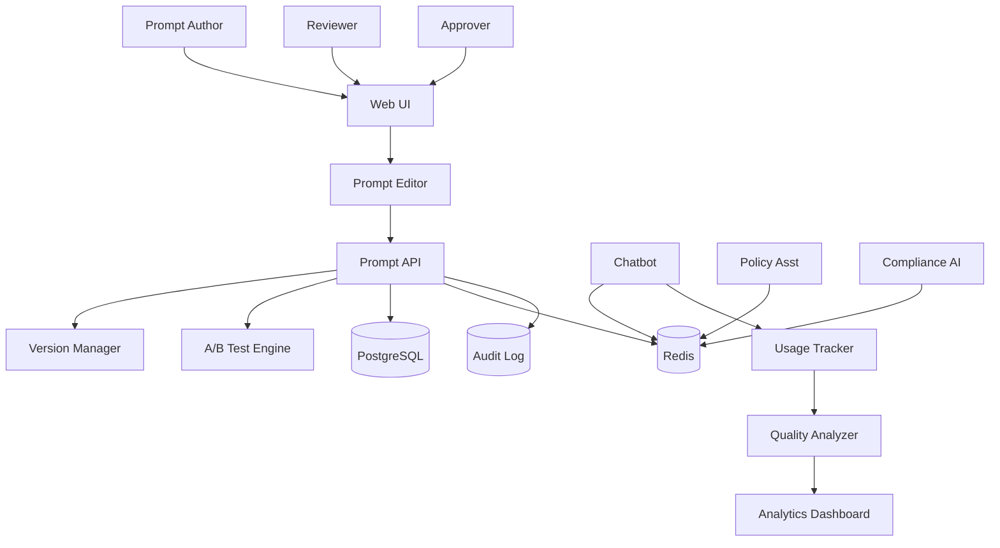
```mermaid
flowchart TB
    AUTHOR[Prompt Author] --> UI[Web UI]
    REVIEWER[Reviewer] --> UI
    APPROVER[Approver] --> UI

    UI --> EDITOR[Prompt Editor]
    EDITOR --> API[Prompt API]
    API --> VERSIONER[Version Manager]
    API --> TESTER[A/B Test Engine]

    API --> PG[(PostgreSQL)]
    API --> CACHE[(Redis)]
    API --> AUDIT[(Audit Log)]

    APP1[Chatbot] --> CACHE
    APP2[Policy Asst] --> CACHE
    APP3[Compliance AI] --> CACHE

    APP1 --> TRACKER[Usage Tracker]
    TRACKER --> ANALYZER[Quality Analyzer]
    ANALYZER --> DASH[Analytics Dashboard]
```

Application integration uses a PromptClient library with local caching. Each application fetches prompts from the management API and caches them locally with a 5-minute TTL. This ensures that even if the management API is down, applications continue serving the last known good version. The client renders the prompt template with the provided variables before returning it to the calling code.

For production resilience, we implement progressive deployment: draft -> review -> approved -> canary (5% traffic) -> full rollout. An automated rollback trigger monitors the newly promoted version's quality metrics for the first hour -- if groundedness drops below threshold, it automatically reverts to the previous version and alerts the prompt author.

For cross-application consistency, we use shared prompt components defined as reusable Jinja2 templates. Common system prompts (tone, style, safety instructions) are versioned independently, so when a shared system prompt is updated, all dependent applications get the update on their next cache refresh.

**Key Points to Hit:**
- [ ] Prompt/Version data model with status workflow: draft -> review -> approved -> deprecated
- [ ] A/B testing engine with traffic splits, statistical significance, and auto-promotion
- [ ] Application client with local caching (5-min TTL) for resilience
- [ ] Progressive deployment with canary and automated rollback on quality regression
- [ ] Shared prompt components via Jinja2 template inheritance for cross-app consistency

**Follow-Up Questions:**
1. How do you handle a situation where a prompt change causes production issues?
2. How do you ensure prompt consistency across different applications?
3. Should prompts be stored in a database or Git?

**Source:** `system-design/prompt-management-platform.md`, `architecture/ai-platform-design.md`

---

### Q6: 🟡 Design a Multi-Agent Orchestration Platform where specialized agents collaborate on complex workflows like loan application review.

**Strong Answer:**

The Multi-Agent Orchestration Platform enables complex AI workflows where specialized agents (document extraction, risk assessment, compliance checking, summarization) work together in defined sequences, with shared state, tool access, and human-in-the-loop checkpoints.

The core abstraction is a WorkflowDefinition composed of WorkflowSteps. Each step specifies an agent_id, input mapping (how workflow variables map to agent inputs), an output variable, optional condition (Jinja2 template), retry count, timeout, and human approval requirement. Steps can declare dependencies on other steps for DAG-style execution.

The Orchestrator Service executes workflows step-by-step, respecting dependency order. For each step, it resolves inputs from the shared workflow state, optionally requests human approval (blocking execution until approved), calls the agent with retry and timeout, and stores the output in the shared state. If a step fails after all retries, the workflow can be marked as failed or partially completed, with clear error reporting.

The Agent Framework implements a ReAct loop: the agent receives a system prompt and user inputs, calls the LLM with tool access, and iteratively executes tool calls (up to max_iterations=10) before producing a final output. Each agent has a specific set of registered tools from the Tool Registry.

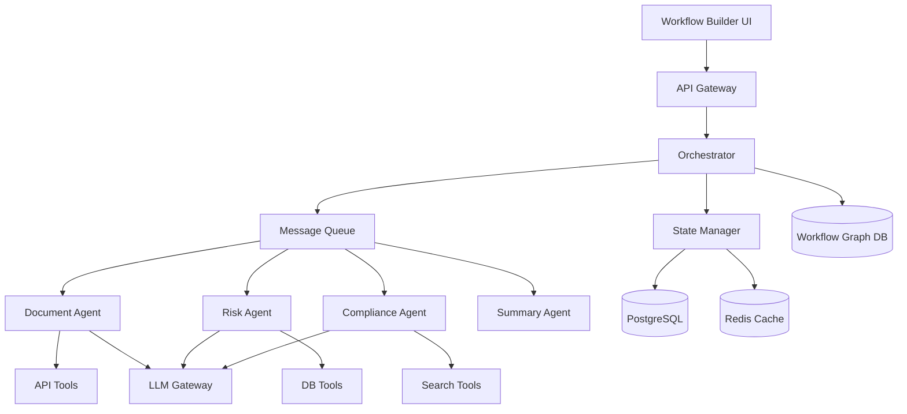
```mermaid
flowchart TB
    BUILDER[Workflow Builder UI] --> GW[API Gateway]
    GW --> ORCH[Orchestrator]
    ORCH --> STATE[State Manager]

    ORCH --> QUEUE[Message Queue]
    QUEUE --> AGENT1[Document Agent]
    QUEUE --> AGENT2[Risk Agent]
    QUEUE --> AGENT3[Compliance Agent]
    QUEUE --> AGENT4[Summary Agent]

    AGENT1 --> TOOLS1[API Tools]
    AGENT2 --> TOOLS2[DB Tools]
    AGENT3 --> TOOLS3[Search Tools]

    AGENT1 --> LLM[LLM Gateway]
    AGENT2 --> LLM
    AGENT3 --> LLM

    STATE --> PG[(PostgreSQL)]
    STATE --> REDIS[(Redis Cache)]
    ORCH --> WG[(Workflow Graph DB)]
```

For the loan application review workflow example: Step 1 extracts data from application documents using the document analyzer agent. Step 2 assesses risk using the risk analyst agent with extracted financial data. Step 3 runs a compliance check with human approval required if flagged. Step 4 generates a summary, but only if the risk score is not "high" (conditional execution).

State management uses a hybrid approach: Redis for active execution state (fast access during workflow execution), PostgreSQL for completed execution history and recovery. Workflow definitions are immutable once published -- updates create new versions, and running executions continue with their original version.

Key design decisions: We build a custom orchestrator for AI workflows rather than using Temporal or Argo because AI-native features (agent support, ReAct loop, human checkpoints, tool registry) require framework-level integration. For state, we use Redis + PostgreSQL hybrid -- Redis for speed during active execution, PostgreSQL for durability and audit.

**Key Points to Hit:**
- [ ] WorkflowDefinition with steps, dependencies, conditions, retry, timeout, human approval
- [ ] ReAct agent loop with tool access and max iteration protection
- [ ] Orchestrator with forward execution and human-in-the-loop checkpoints
- [ ] Tool Registry with schema validation and versioning
- [ ] Hybrid state: Redis for active, PostgreSQL for history and recovery

**Follow-Up Questions:**
1. How do you handle an agent producing unexpected output in the middle of a workflow?
2. How would you version workflows without breaking running executions?
3. How do you prevent infinite loops in agent tool usage?

**Source:** `system-design/multi-agent-workflow-platform.md`

---

### Q7: 🟡 Design a Rate Limiting and API Gateway system for a GenAI platform with per-tenant quotas, token-based limiting, and backpressure.

**Strong Answer:**

Rate limiting in a GenAI context is fundamentally different from traditional API rate limiting because the cost driver is tokens, not request count. A single request can consume anywhere from 100 to 100,000 tokens depending on query complexity and response length.

We implement multiple rate limiting strategies at different levels. At the API Gateway level (Kong or custom), we use a sliding window algorithm stored in Redis for request-based rate limiting. Each consumer has a limit of N requests per minute. The sliding window is more accurate than fixed window because it prevents burst traffic at window boundaries.

At the token level, we implement a TokenRateLimiter that tracks token consumption per customer using Redis counters. We maintain both a daily token limit (100K tokens per day) and a per-minute limit (10K tokens per minute). Each request estimates its token consumption (input prompt tokens + expected output tokens), and the limiter checks and atomically consumes the budget:

```python
def check_and_consume(self, customer_id, estimated_tokens):
    daily_key = f"token_daily:{customer_id}:{day_window}"
    minute_key = f"token_minute:{customer_id}:{minute_window}"

    daily_used = int(self.redis.get(daily_key) or 0)
    minute_used = int(self.redis.get(minute_key) or 0)

    if daily_used + estimated_tokens > daily_limit:
        raise TokenBudgetExceeded("Daily token limit exceeded")
    if minute_used + estimated_tokens > minute_limit:
        raise TokenBudgetExceeded("Minute token limit exceeded")

    pipe = self.redis.pipeline()
    pipe.incrby(daily_key, estimated_tokens)
    pipe.incrby(minute_key, estimated_tokens)
    pipe.execute()
```

For distributed rate limiting across multiple gateway instances, Redis serves as the shared state store. Each gateway instance checks and increments the same Redis key, ensuring consistent rate limiting regardless of which instance handles the request. For higher scale, Redis Cluster shards the counters by customer_id.

The Token Bucket algorithm is used for LLM provider-level rate limiting. Each provider connection (OpenAI, Anthropic) has a token bucket with a defined capacity and refill rate. Requests consume tokens from the bucket. When the bucket is empty, requests are queued rather than rejected, implementing backpressure. The queue has a maximum depth and timeout -- if a request waits longer than 30 seconds, it returns a 429 with Retry-After header.

For per-tenant quotas in a multi-tenant platform, we use the QuotaEnforcer which tracks daily tokens, monthly documents, max concurrent queries, storage GB, and GPU hours per month per tenant. Each tenant's quota is configurable, and the enforcer uses Redis counters with time-windowed keys to track consumption.

**Key Points to Hit:**
- [ ] Token-based rate limiting (not just request-based) -- cost is token-driven
- [ ] Sliding window algorithm in Redis for distributed request rate limiting
- [ ] Token bucket algorithm for provider-level limiting with backpressure/queuing
- [ ] Per-tenant quota management across multiple resource dimensions
- [ ] Redis as shared state for consistent distributed rate limiting

**Follow-Up Questions:**
1. How do you enforce rate limiting in a distributed gateway deployment?
2. How does token-based rate limiting differ from request-based?
3. What backpressure mechanism do you use when LLM providers are rate-limited?

**Source:** `architecture/api-gateway-design.md`, `architecture/multi-tenant-design.md`, `system-design/ai-gateway-platform.md`

---

### Q8: 🟡 Design a Payment Processing System with idempotency, distributed transactions, and failure handling.

**Strong Answer:**

Payment processing in a banking context requires strong consistency guarantees even when built on distributed, eventually consistent infrastructure. The core challenge is managing transactions that span multiple services (account debiting, ledger updates, notification sending, compliance checks) that cannot participate in traditional two-phase commit.

The Saga pattern is the primary mechanism for distributed transactions. We break each payment into a sequence of local transactions, each with a compensating action for rollback. For example, a payment saga: (1) Validate and reserve funds, (2) Update sender account balance, (3) Update receiver account balance, (4) Write to transaction ledger, (5) Send confirmation notification. If step 3 fails, we compensate steps 2 and 1 in reverse order (restore sender balance, release fund reservation).

Idempotency is the foundational requirement. Every saga step must be idempotent -- if the orchestrator retries a step due to a network timeout, running it twice must produce the same result as running it once. We implement this using unique operation IDs: each step receives a globally unique idempotency_key, and the step handler checks whether this key has already been processed before executing. If it has, it returns the cached result.

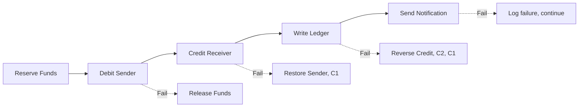
```mermaid
flowchart LR
    T1[Reserve Funds] --> T2[Debit Sender]
    T2 --> T3[Credit Receiver]
    T3 --> T4[Write Ledger]
    T4 --> T5[Send Notification]

    T2 -.Fail.-> C1[Release Funds]
    T3 -.Fail.-> C2[Restore Sender, C1]
    T4 -.Fail.-> C3[Reverse Credit, C2, C1]
    T5 -.Fail.-> LOG[Log failure, continue]
```

The Saga Orchestrator manages execution with automatic compensation. On any step failure, it runs compensating actions in reverse order for all completed steps. If a compensation action itself fails (the most dangerous scenario in banking), it alerts the on-call team and logs to an exception queue for manual resolution. In banking, failed compensation means the system is in a permanently inconsistent state requiring human intervention.

For the database layer, we use the Outbox Pattern to ensure event publishing is atomic with database writes. When a saga step updates the database, it also writes an event to an outbox table in the same transaction. A separate process (Debezium CDC or polling) reads the outbox and publishes events to the message broker. This prevents the dual-write problem where the database update succeeds but the event publication fails.

For failure handling, we implement: (1) Retry with exponential backoff and jitter for transient failures, (2) Dead Letter Queues for events that fail after maximum retries, (3) Circuit breakers on external service calls to prevent cascading failures, and (4) Timeout-based step aborts with configurable per-step timeouts.

**Key Points to Hit:**
- [ ] Saga pattern: forward execution with compensating actions in reverse on failure
- [ ] Idempotency via unique operation keys with check-before-execute pattern
- [ ] Outbox Pattern for atomic database writes + event publishing
- [ ] Compensation failure handling: the most dangerous scenario requires manual intervention
- [ ] Retry with exponential backoff, DLQs, circuit breakers for resilience

**Follow-Up Questions:**
1. What happens if a compensation action fails?
2. How do you prevent concurrent sagas from corrupting shared state?
3. When would you use choreography vs. orchestration for Sagas?

**Source:** `architecture/saga-pattern.md`, `architecture/event-driven-architecture.md`

---

### Q9: 🟡 Design a Real-Time Fraud Detection System with streaming data, ML model serving, and low-latency decisions.

**Strong Answer:**

Real-time fraud detection requires sub-second decision-making on financial transactions while maintaining high accuracy and manageable false positive rates. This is a streaming architecture problem with ML model serving at its core.

The ingestion layer uses Apache Kafka to capture transaction events in real-time. Every transaction (card swipe, wire transfer, ACH payment) publishes an event to a Kafka topic with a standardized schema: transaction_id, customer_id, amount, merchant, location, timestamp, device_info, and historical context references. Kafka's partitioning by customer_id ensures ordering of a single customer's transactions.

The stream processing layer uses Apache Flink (or Kafka Streams) to consume transaction events and enrich them with contextual features in real-time. Feature enrichment joins the transaction stream with customer profile data (from a state store), recent transaction history (from a sliding window), and merchant risk scores (from a broadcast state). This produces a feature vector for each transaction in under 100ms.

The ML inference layer serves models with strict latency requirements. Models are loaded in-memory on dedicated inference servers (TensorFlow Serving, Triton, or custom). We use a tiered model approach: a lightweight model (XGBoost, small neural net) makes an initial risk score in < 10ms, and if the score falls in a gray zone (e.g., 0.4-0.7), a heavier model (deep learning, graph-based) performs deeper analysis within the remaining latency budget. The total decision time must be under 200ms to not impact the transaction flow.

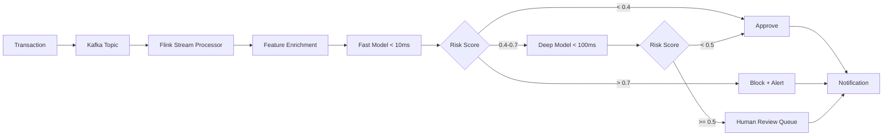
```mermaid
flowchart LR
    TX[Transaction] --> KAFKA[Kafka Topic]
    KAFKA --> FLINK[Flink Stream Processor]
    FLINK --> FEATURES[Feature Enrichment]
    FEATURES --> FAST[Fast Model < 10ms]

    FAST --> CHECK{Risk Score}
    CHECK -->|< 0.4| APPROVE[Approve]
    CHECK -->|> 0.7| BLOCK[Block + Alert]
    CHECK -->|0.4-0.7| DEEP[Deep Model < 100ms]

    DEEP --> CHECK2{Risk Score}
    CHECK2 -->|< 0.5| APPROVE
    CHECK2 -->|>= 0.5| REVIEW[Human Review Queue]

    APPROVE --> NOTIFY[Notification]
    BLOCK --> NOTIFY
    REVIEW --> NOTIFY
```

The alert pipeline routes decisions to different channels. Approved transactions pass through normally. Blocked transactions trigger immediate customer notification (SMS, push notification, app alert) and are logged for investigation. Gray-zone transactions enter a Human Review Queue where fraud analysts review the case within a defined SLA (typically 15 minutes).

False positive management is critical. We track the false positive rate as a primary KPI, with a target below 1%. High false positives erode customer trust and increase review queue costs. We use several techniques: (1) The tiered model approach allows the heavy model to correct false positives from the fast model, (2) A/B testing new model versions against the current model on a small traffic percentage before full rollout, (3) Regular model retraining on recent data to adapt to changing fraud patterns, and (4) Post-decision feedback loops where customer disputes and analyst reviews become training labels.

For observability, we track: decision latency (P99 < 200ms), model accuracy (precision, recall, F1), false positive rate, fraud detection rate, review queue wait time, and customer impact (blocked transactions per 10K transactions).

**Key Points to Hit:**
- [ ] Kafka for transaction event ingestion with customer_id partitioning for ordering
- [ ] Flink stream processing for real-time feature enrichment with sliding windows
- [ ] Tiered model serving: fast model for quick decisions, deep model for gray zones
- [ ] Three-path decision: approve, block+alert, human review queue
- [ ] False positive management: tiered models, A/B testing, feedback loops, regular retraining

**Follow-Up Questions:**
1. How do you handle model version updates without downtime?
2. What do you do when the false positive rate suddenly spikes?
3. How do you ensure the fraud detection system itself is not a single point of failure?

**Source:** `architecture/event-driven-architecture.md`, `system-design/observability-platform.md`, `architecture/ai-platform-design.md`

---

### Q10: 🟡 Design a Document Management System for a bank with storage, versioning, search, access control, audit logging, and compliance holds.

**Strong Answer:**

A banking Document Management System must handle millions of documents (policies, contracts, regulatory filings, customer communications) with strict access controls, versioning, full-text search, immutable audit trails, and regulatory compliance holds.

The storage architecture uses a multi-tier approach. Raw documents are stored in object storage (S3 or MinIO) with versioning enabled -- every update creates a new version rather than overwriting. The metadata (document title, type, author, department, clearance level, effective dates, tags) is stored in PostgreSQL. Document chunks with embeddings are stored in pgvector for semantic search. A separate Elasticsearch index provides full-text search with faceting.

The ingestion pipeline processes uploaded documents through multiple stages: (1) Document parsing extracts text from PDF, DOCX, and other formats, (2) PII detection scans the document for sensitive data and flags it, (3) Chunking splits the document into semantic segments (512-token chunks with 50-token overlap), (4) Embedding generation creates vector representations for each chunk, (5) Indexing updates both the vector database and Elasticsearch, and (6) Metadata extraction populates the PostgreSQL metadata tables. This entire pipeline is orchestrated as a Saga (see Q8) with compensating actions for rollback on failure.

Access control is multi-layered. At the application level, every document query includes the user's department, clearance level, and role in the WHERE clause. At the database level, PostgreSQL Row-Level Security enforces that users can only query documents matching their authorization. At the object storage level, presigned URLs are generated only after access control verification. At the vector database level, retrieval is scoped to tenant_id and department-filtered collections.

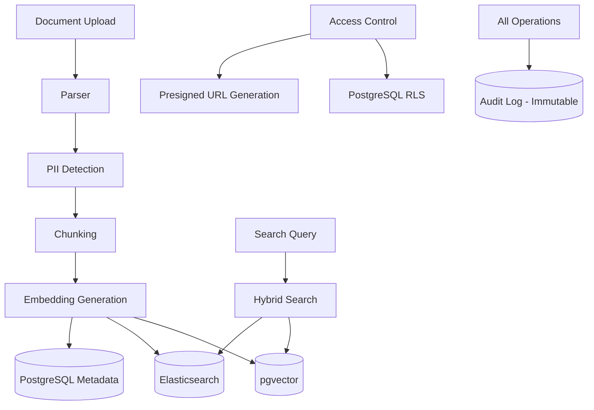
```mermaid
flowchart TB
    UPLOAD[Document Upload] --> PARSE[Parser]
    PARSE --> PII_CHECK[PII Detection]
    PII_CHECK --> CHUNK[Chunking]
    CHUNK --> EMBED[Embedding Generation]

    EMBED --> VDB[(pgvector)]
    EMBED --> ES[(Elasticsearch)]
    EMBED --> PG[(PostgreSQL Metadata)]

    SEARCH[Search Query] --> HYBRID[Hybrid Search]
    HYBRID --> VDB
    HYBRID --> ES

    ACCESS[Access Control] --> RLS[PostgreSQL RLS]
    ACCESS --> PRESIGN[Presigned URL Generation]

    ALL[All Operations] --> AUDIT[(Audit Log - Immutable)]
```

Versioning is critical for regulatory compliance. Every document has a version history accessible through the API. When a document is updated, the old version is preserved (not deleted) with a `deprecated` status and a `superseded_by` reference to the new version. Regulatory documents often require tracking of what was in effect at a specific point in time -- we implement `effective_from` and `effective_until` dates on each version.

The Audit Log is an append-only table that records every document operation (create, read, update, delete, search) with user_id, timestamp, document_id, operation type, and outcome. DELETE and UPDATE permissions are revoked on the audit log table for all users (including DBAs). For compliance holds, documents can be tagged with a `compliance_hold` flag that prevents any deletion or modification regardless of normal lifecycle rules.

Search combines semantic and keyword approaches. Hybrid search runs both a vector similarity search (for conceptual matching) and a full-text search in Elasticsearch (for exact keyword matching), then combines and re-ranks the results. Users can filter by document type, department, date range, and tags.

**Key Points to Hit:**
- [ ] Multi-tier storage: object storage (raw files), PostgreSQL (metadata), pgvector (embeddings), Elasticsearch (full-text)
- [ ] Saga-pattern ingestion pipeline with compensating actions for rollback
- [ ] Multi-layer access control: application, database RLS, object storage, vector DB
- [ ] Versioning with effective dates and compliance hold flags preventing deletion
- [ ] Immutable audit log with revoked DELETE/UPDATE permissions
- [ ] Hybrid search: vector similarity + full-text Elasticsearch with result re-ranking

**Follow-Up Questions:**
1. How do you handle a compliance hold that spans thousands of documents?
2. What happens when the read model falls behind the write model in the CQRS architecture?
3. How do you optimize ingestion throughput for bulk document uploads?

**Source:** `architecture/cqrs.md`, `architecture/event-driven-architecture.md`, `system-design/secure-rag-platform.md`

---

### Q11: 🟡 Design an API Gateway for a GenAI platform that handles authentication, authorization, model routing, streaming, and prompt governance.

**Strong Answer:**

The API Gateway is the single entry point for all client requests to the banking GenAI platform. In a regulated environment, it enforces authentication, authorization, rate limiting, request/response transformation, audit logging, and GenAI-specific controls like prompt validation and output filtering.

The gateway processes each request through a middleware chain. First, authentication validates the JWT token against the bank's identity provider (OAuth2/OIDC). Second, authorization checks RBAC policies -- does this user/role have permission to access the requested endpoint? Third, rate limiting checks both request count (sliding window in Redis) and token budget (for GenAI endpoints). Fourth, for AI endpoints, prompt validation scans the request for injection patterns, excessive length, and prohibited content.

For GenAI-specific routing, the Model Router analyzes query complexity and directs the request to the appropriate model tier. Simple queries (greetings, factual lookups) route to the fast tier (gpt-4o-mini, target 500ms). Moderate queries (account inquiries, product comparisons) route to the balanced tier (gpt-4-turbo, target 1500ms). Complex queries (regulatory advice, compliance analysis) route to the premium tier (gpt-4-turbo with extended context, target 3000ms). Complexity assessment considers query length, keyword complexity ("compare," "analyze," "regulation," "AML"), multi-part questions, and financial calculation indicators.

Streaming support is critical for GenAI. The gateway must forward Server-Sent Events (SSE) from the LLM to the client without buffering the full response. In Kong, this requires `proxy_buffering off`. In a custom Go gateway, we implement an http.ResponseWriter wrapper that flushes chunks immediately to the client. The gateway also adds streaming-specific headers (X-Stream-Status, X-Tokens-So-Far) for client-side progress tracking.

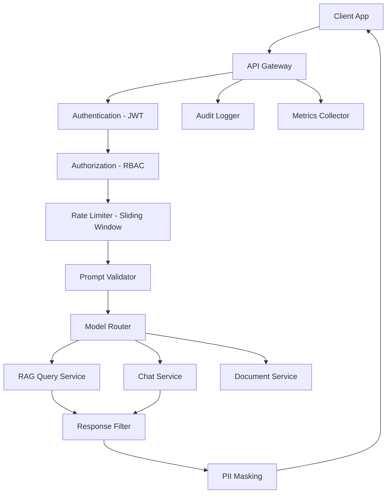
```mermaid
flowchart TD
    CLIENT[Client App] --> GW[API Gateway]
    GW --> AUTH[Authentication - JWT]
    AUTH --> AUTHZ[Authorization - RBAC]
    AUTHZ --> RATE[Rate Limiter - Sliding Window]
    RATE --> PROMPT[Prompt Validator]
    PROMPT --> ROUTE[Model Router]
    ROUTE --> RAG[RAG Query Service]
    ROUTE --> CHAT[Chat Service]
    ROUTE --> DOC[Document Service]

    RAG --> FILTER[Response Filter]
    CHAT --> FILTER
    FILTER --> PII_MASK[PII Masking]
    PII_MASK --> CLIENT

    GW --> AUDIT[Audit Logger]
    GW --> METRICS[Metrics Collector]
```

The response pipeline applies output filtering: PII masking scans the response for any sensitive data that leaked through, response validation checks for toxic content and hallucination indicators, and the response is optionally streamed back to the client. Every request and response (with PII masked) is logged to the audit store with request_id, duration, status code, and token counts.

We choose Kong for the base gateway with custom plugins for GenAI-specific logic, rather than building entirely from scratch. Kong provides mature authentication plugins, rate limiting (with Redis backend), and request/response transformation. Custom plugins handle prompt validation, model routing, token-based rate limiting, and response filtering. This hybrid approach gives us production-grade infrastructure with GenAI-specific extensions.

**Key Points to Hit:**
- [ ] Middleware chain: auth, authorization, rate limiting, prompt validation, routing
- [ ] Model routing by query complexity: fast/balanced/premium tiers with heuristic scoring
- [ ] Streaming support (SSE) without response buffering -- proxy_buffering off or Go Flusher
- [ ] Response filtering: PII masking, toxicity check, output validation
- [ ] Kong + custom plugins vs. fully custom gateway tradeoff

**Follow-Up Questions:**
1. Why would you build a custom gateway instead of using Kong or APISIX?
2. How do you handle streaming responses through an API gateway?
3. What is model routing and why is it important for cost control?

**Source:** `architecture/api-gateway-design.md`, `architecture/enterprise-genai-architecture.md`

---

### Q12: 🟡 Explain the CQRS Pattern and describe how you would apply it to a RAG query analytics system.

**Strong Answer:**

CQRS (Command Query Responsibility Segregation) separates the write (command) and read (query) models of a system into distinct, independently optimized data models. Instead of using the same normalized database for both operations, CQRS maintains a write model optimized for consistency and a read model optimized for query performance.

In banking GenAI systems, CQRS is particularly valuable because read traffic (querying analytics dashboards, searching documents, checking metrics) vastly exceeds write traffic (document ingestion, configuration updates), and the two have fundamentally different data model requirements. The write model needs to be normalized and transactionally consistent. The read model can be denormalized, pre-aggregated, and eventually consistent.

For a RAG Query Analytics system, the command side handles logging of every RAG query interaction. When a query completes, the command handler validates the event, writes it to an append-only event store, and publishes a `RAGQueryCompleted` event. The command side uses PostgreSQL with normalized tables for transactional integrity:

```
Command tables: rag_query_events (query_id, tenant_id, customer_id, query_hash, model_used, token_count, response_time_ms, confidence_score, timestamp)
```

The query side maintains denormalized read models optimized for dashboard queries. A Projection Handler consumes `RAGQueryCompleted` events asynchronously and updates multiple read models:

```
Read model 1: daily_summary (tenant_id, date, total_queries, avg_response_time, p95_response_time, avg_confidence, total_tokens, unique_customers)
Read model 2: model_usage (tenant_id, date, model_name, query_count, avg_cost, total_tokens)
Read model 3: quality_trend (tenant_id, date, avg_confidence, hallucination_rate, retrieval_recall)
```

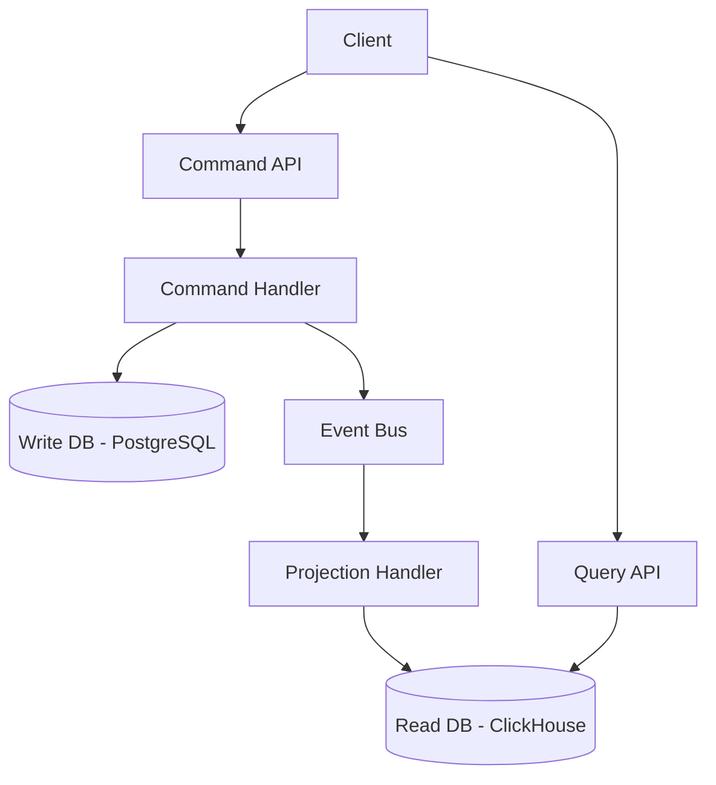
```mermaid
flowchart TD
    CLIENT[Client] --> CMD_API[Command API]
    CLIENT --> QRY_API[Query API]

    CMD_API --> CMD_HANDLER[Command Handler]
    CMD_HANDLER --> WRITE_DB[(Write DB - PostgreSQL)]
    CMD_HANDLER --> EVENT_BUS[Event Bus]

    EVENT_BUS --> PROJ[Projection Handler]
    PROJ --> READ_DB[(Read DB - ClickHouse)]

    QRY_API --> READ_DB
```

The read model is stored in ClickHouse (not PostgreSQL) because ClickHouse excels at time-series analytics and aggregation queries. Dashboard queries that scan millions of rows and compute percentiles, averages, and trends run 10-100x faster in ClickHouse than PostgreSQL.

The key tradeoff is eventual consistency. The read model lags behind the write model by the projection processing time (typically milliseconds to a few seconds). For analytics dashboards, this is perfectly acceptable -- no one needs real-time accuracy for a daily summary. For critical queries where consistency is required, the system can fall back to the write model with a warning about potentially stale data.

CQRS is not appropriate for all scenarios. For simple CRUD applications, it is over-engineering. For financial transactions requiring strict consistency, the write model is the single source of truth. CQRS shines when you have read-heavy workloads, complex analytical queries on normalized data, audit trail requirements, and real-time dashboard needs -- all of which apply to RAG analytics.

**Key Points to Hit:**
- [ ] CQRS separates command (write) and query (read) models for independent optimization
- [ ] Write model: normalized PostgreSQL for transactional consistency
- [ ] Read model: denormalized ClickHouse for fast aggregation and analytics
- [ ] Projections transform events into read models asynchronously
- [ ] Tradeoff: eventual consistency -- read model lags write model by projection time

**Follow-Up Questions:**
1. What is the main tradeoff of CQRS?
2. How does CQRS differ from having separate read and write databases?
3. Can you use CQRS without event sourcing?
4. How do you handle a read model that falls behind the write model?

**Source:** `architecture/cqrs.md`, `architecture/event-driven-architecture.md`

---

### Q13: 🟡 Design an Event-Driven Architecture for a GenAI platform using Kafka with ordering, dead letter queues, and event replay.

**Strong Answer:**

Event-Driven Architecture (EDA) decouples GenAI platform services by communicating through events rather than synchronous API calls. In banking GenAI systems, EDA is essential for asynchronous document processing (ingestion, chunking, embedding), audit trails, real-time analytics, and regulatory reporting.

The core pattern uses Apache Kafka as the message broker with topic-based routing. Services publish events to Kafka topics (e.g., `document.ingested`, `rag.query.completed`, `session.ended`), and consumer services subscribe to the topics they care about. Multiple consumers can independently process the same event -- for example, a `DocumentIngested` event triggers the Embedding Generator, Search Index Updater, and Audit Logger simultaneously without any service depending on another.

Event schema design follows the CloudEvents specification (v1.0) with banking-specific extensions. Every event has a standardized envelope: id (UUID), source (service name), type (e.g., `com.banking.rag.query.completed`), timestamp, tenant_id, customer_id, correlation_id (for tracing related events across services), causation_id (the event that caused this one), data_classification (public/internal/confidential/restricted), and the event data payload.

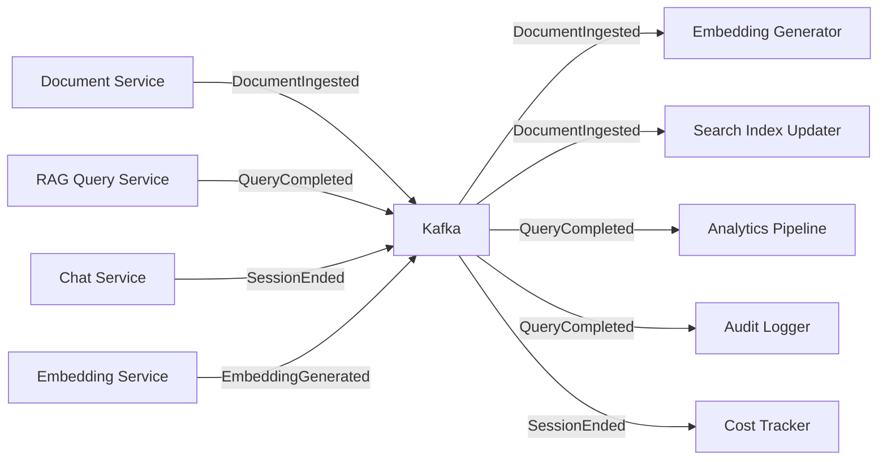
```mermaid
flowchart LR
    DOC[Document Service] -->|DocumentIngested| KAFKA[Kafka]
    RAG[RAG Query Service] -->|QueryCompleted| KAFKA
    CHAT[Chat Service] -->|SessionEnded| KAFKA
    EMBED[Embedding Service] -->|EmbeddingGenerated| KAFKA

    KAFKA -->|DocumentIngested| EMB_GEN[Embedding Generator]
    KAFKA -->|DocumentIngested| SEARCH_IDX[Search Index Updater]
    KAFKA -->|QueryCompleted| ANALYTICS[Analytics Pipeline]
    KAFKA -->|QueryCompleted| AUDIT[Audit Logger]
    KAFKA -->|SessionEnded| COST[Cost Tracker]
```

Consumer groups enable parallel consumption. Each consumer group processes every event exactly once, but multiple consumer groups can independently consume the same topic. The analytics consumer group and the audit consumer group both consume `RAGQueryCompleted` events independently.

Ordering is maintained through Kafka partitioning. Events for the same entity (same customer_id or tenant_id) go to the same partition, guaranteeing order within that entity's event stream. For cross-service ordering, we use the correlation_id to group related events and sort by the event store's append order rather than wall-clock time.

Dead Letter Queues handle events that cannot be processed. When a consumer fails to process an event after maximum retries (3 attempts with exponential backoff), the event is published to a `topic.dead-letter` topic with the original event, error details, and retry count. A DLQ consumer service monitors these queues and either auto-retries (for transient errors) or escalates to human review (for schema violations or data corruption).

Event replay is a critical capability. Because all events are persisted in Kafka (with configurable retention, typically 7-30 days), we can replay events to rebuild projections, fix bugs in consumers, or create new consumer services. To replay: (1) Create a new consumer group with offset set to the beginning of the retention window, (2) Ensure the projection handler is idempotent (same event processed twice produces the same result), (3) Monitor the replay progress and verify data integrity.

Schema evolution follows backward compatibility: we add fields only, never remove or rename. When breaking changes are unavoidable, we version the event type: `com.banking.rag.query.v2.completed`. A schema registry (Confluent Schema Registry) validates backward compatibility before allowing schema changes.

**Key Points to Hit:**
- [ ] Kafka topics with CloudEvents-compliant schema and banking extensions (tenant_id, correlation_id, data_classification)
- [ ] Consumer groups for independent parallel consumption of the same events
- [ ] Partitioning by entity key for ordering guarantees
- [ ] Dead Letter Queues with retry, auto-retry, and human escalation
- [ ] Event replay capability for rebuilding projections and fixing bugs
- [ ] Schema evolution: add-only fields, backward compatibility, versioned event types

**Follow-Up Questions:**
1. What is the difference between event notification and event-carried state transfer?
2. How do you handle event ordering in a distributed system?
3. How do you prevent event schema breaking changes?

**Source:** `architecture/event-driven-architecture.md`, `architecture/cqrs.md`, `architecture/saga-pattern.md`

---

### Q14: 🟡 Explain Reliability Engineering concepts (SLOs, error budgets, circuit breakers, retries) and how you would apply them to a GenAI platform.

**Strong Answer:**

Reliability engineering in a banking GenAI context is not just an engineering discipline -- it is a regulatory requirement and trust imperative. An AI system that provides incorrect information about interest rates or fails during a fraud alert has consequences far beyond a typical software outage.

SLOs (Service Level Objectives) define the reliability targets for each critical service. For our GenAI platform, we track: Availability (99.95% over rolling 30 days), P95 Latency (< 2,500ms for RAG queries), Answer Quality (> 85% of answers with confidence > 0.7), Safety Compliance (100% -- any violation is unacceptable), Retrieval Recall (> 80% of queries retrieve relevant documents), and Document Freshness (> 95% of documents indexed within 60 seconds of ingestion). Each SLO has an alert threshold that is stricter than the target (e.g., availability alerts at 99.9%, below the 99.95% target) to provide early warning.

The Error Budget is the allowable amount of unreliability, calculated as `1 - SLO`. For 99.95% availability, the error budget is 0.05% -- meaning we can have 0.05% of requests fail in the measurement window. The budget governs release decisions: if the budget is exhausted, all non-critical releases are blocked and the team focuses on reliability improvements.

We use Google's multi-window, multi-burn-rate alerting strategy. A 14.4x burn rate means the monthly error budget would be consumed in 2 days -- this pages the on-call engineer immediately. A 6x burn rate (5 days to exhaust) pages with lower urgency. A 3x burn rate (10 days) notifies without paging. A 1x burn rate (30 days) is logged for review. Each alert requires the burn rate to be sustained across two time windows (e.g., 2-hour and 5-minute windows for 14.4x) to avoid false positives.

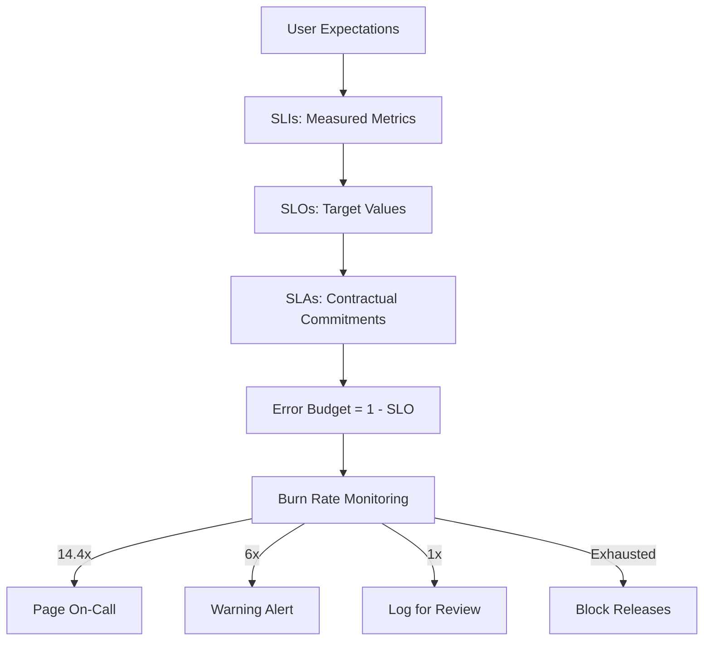
```mermaid
flowchart TD
    USER[User Expectations] --> SLI[SLIs: Measured Metrics]
    SLI --> SLO[SLOs: Target Values]
    SLO --> SLA[SLAs: Contractual Commitments]
    SLA --> BUDGET[Error Budget = 1 - SLO]
    BUDGET --> BURN[Burn Rate Monitoring]
    BURN -->|14.4x| PAGE[Page On-Call]
    BURN -->|6x| WARN[Warning Alert]
    BURN -->|1x| LOG[Log for Review]
    BURN -->|Exhausted| BLOCK[Block Releases]
```

Circuit Breakers protect against cascading failures when dependencies are unhealthy. For the LLM Gateway, each provider (OpenAI, Anthropic, Google) has a circuit breaker with a failure threshold (5 failures), recovery timeout (60 seconds), and half-open state testing. When a provider's circuit opens, requests are immediately routed to alternative providers rather than waiting for timeouts. This is critical for maintaining availability during provider outages.

Retry with Exponential Backoff and Jitter handles transient failures. We retry up to 3 times with delays of 1s, 2s, 4s (exponential base 2), plus random jitter (0-1s) to prevent thundering herd. We only retry on transient errors (timeouts, connection errors, 503s), never on permanent errors (400s, auth failures, validation errors).

Bulkhead isolation separates the platform into independent resource pools. The chatbot service, document ingestion service, and analytics service each have separate CPU, memory, and connection pool allocations. If document ingestion experiences a load spike, it cannot consume resources needed by the chatbot service. In Kubernetes, this is implemented via resource quotas, limit ranges, and separate node pools.

**Key Points to Hit:**
- [ ] SLIs (measured metrics) -> SLOs (targets) -> SLAs (contracts) hierarchy
- [ ] Error budget governs release decisions -- exhausted budget blocks new features
- [ ] Multi-window, multi-burn-rate alerting: 14.4x (page), 6x (warn), 3x (notify), 1x (log)
- [ ] Circuit breakers for LLM provider failover with half-open state testing
- [ ] Retry with exponential backoff + jitter, only on transient errors
- [ ] Bulkhead isolation prevents resource contention between services

**Follow-Up Questions:**
1. What does a burn rate of 14.4x mean?
2. How do you measure GenAI-specific SLIs like answer quality?
3. Your error budget is exhausted. What do you do?

**Source:** `architecture/reliability-engineering.md`, `architecture/ai-platform-design.md`

---

### Q15: 🟡 How would you approach Capacity Planning for a GenAI platform with GPU resources, variable token costs, and unpredictable traffic spikes?

**Strong Answer:**

Capacity planning for a GenAI platform is uniquely complex because GPU resources are scarce and expensive ($10K-$40K per A100/H100), LLM token costs vary per query, and traffic patterns are inherently unpredictable (market events, rate changes, tax seasons cause spikes).

The methodology follows a continuous cycle: assess current capacity, forecast demand, identify bottlenecks, model scenarios, plan procurement, implement and monitor. We maintain a rolling 6-month forecast because GPU procurement lead times are 3-6 months.

Current capacity assessment inventories all resources: GPU instances (type, count, memory, region, utilization), service-level metrics (current RPS, max tested RPS, P95 latency, CPU/memory/GPU utilization, token rate per second), vector database capacity (total vectors, storage, query latency), and LLM provider rate limits (tokens per minute, current utilization). For example, if our RAG query service runs at 150 RPS with a max of 500 RPS, GPU utilization at 65%, and token rate at 5,000 tokens/sec, we have 3.3x headroom on RPS but need to monitor the trajectory.

Demand forecasting combines historical trend analysis (linear regression on past 12 months) with business growth projections (e.g., 10% monthly user growth). We apply seasonal factors specific to banking: tax season (April-May) sees 10-15% increases, year-end planning (November-December) sees 10-15% increases, and January typically sees a 10% decrease. The forecast produces upper and lower bounds (plus/minus 20%) to account for uncertainty.

For GPU planning, we model based on token consumption rather than query count. Each A100 can process approximately 1,000 tokens/second for inference. We project monthly token demand from the RPS forecast multiplied by average tokens per query, then calculate additional GPUs needed, adding 30% regulatory headroom. The target GPU utilization is 60-70% -- below 60% wastes money, above 75% leaves insufficient headroom for spikes.

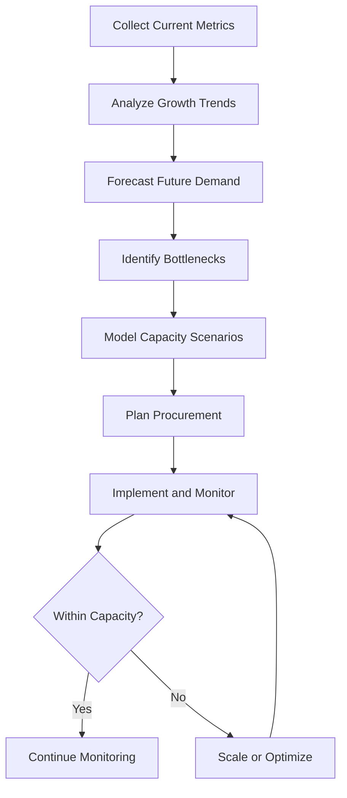
```mermaid
flowchart TD
    METRICS[Collect Current Metrics] --> TRENDS[Analyze Growth Trends]
    TRENDS --> FORECAST[Forecast Future Demand]
    FORECAST --> BOTTLENECKS[Identify Bottlenecks]
    BOTTLENECKS --> SCENARIOS[Model Capacity Scenarios]
    SCENARIOS --> PROCUREMENT[Plan Procurement]
    PROCUREMENT --> IMPLEMENT[Implement and Monitor]
    IMPLEMENT --> CHECK{Within Capacity?}
    CHECK -->|Yes| MONITOR[Continue Monitoring]
    CHECK -->|No| SCALE[Scale or Optimize]
    SCALE --> IMPLEMENT
```

Auto-scaling handles variable traffic. The HPA (Horizontal Pod Autoscaler) scales application pods based on CPU (65% target), memory (75% target), and queries per second (50 QPS per pod target). The Cluster Autoscaler adds GPU nodes when pods are pending due to GPU resource constraints, with a minimum of 2 always-on GPU nodes and a maximum of 20. Scale-up stabilizes within 60 seconds, scale-down waits 300 seconds to prevent oscillation.

Scenario planning prepares for two key scenarios: organic growth (10% monthly -- gradual GPU provisioning over months) and new product launches (3x traffic spike -- requires provisioning 4 weeks before launch, increasing LLM provider rate limits 2 weeks before, load testing at 2x expected peak 1 week before).

When an LLM provider increases prices by 40%, we evaluate: (1) token usage optimization (shorter prompts, shorter outputs), (2) routing more queries to cheaper models/providers, (3) accelerating self-hosted model deployment, and (4) negotiating volume discounts. The capacity plan must include cost-per-query trending, not just resource utilization.

**Key Points to Hit:**
- [ ] Rolling 6-month forecast due to GPU procurement lead times
- [ ] Model on token consumption, not query count -- variable cost per query
- [ ] Target GPU utilization: 60-70% with 30% regulatory headroom
- [ ] Seasonal factors: tax season (+15%), year-end planning (+15%), January lull (-10%)
- [ ] Auto-scaling: HPA for pods, Cluster Autoscaler for GPU nodes with min/max bounds
- [ ] Scenario planning: organic growth vs. new product launch with different timelines

**Follow-Up Questions:**
1. How do you plan capacity for unpredictable query complexity?
2. What is the right GPU utilization target?
3. How do you handle 3-6 month GPU procurement lead times?
4. An LLM provider increases prices by 40% -- how does this affect capacity planning?

**Source:** `architecture/capacity-planning.md`, `architecture/reliability-engineering.md`

---

### Q16: 🔴 Design a complete Enterprise GenAI Platform for a global bank serving 100M+ customers across 60+ countries. Show the complete architecture from ingress to AI model.

**Strong Answer:**

This is the most comprehensive system design question and tests your ability to synthesize all GenAI architecture knowledge into a coherent, production-grade platform design.

The platform serves four user segments through multiple channels: retail customers (mobile app, web banking), business customers (web banking), employees (internal portal, contact center), and partners (API channels). All traffic flows through a layered architecture.

The Ingress Layer starts with a CDN for static assets, a Web Application Firewall (WAF) for SQL injection/XSS/injection protection, an API Gateway for routing and transformation, an Auth Service (OAuth2/OIDC for external users, SAML for internal employees), and a Rate Limiter (token-based for GenAI endpoints). TLS 1.3 encrypts all traffic in transit.

The Application Layer contains domain-specific services: Chat Service (conversational AI), Summarization Service (document summarization), Classification Service (document/intent classification), Analysis Service (data analysis), and Code Assistant Service (for developer tools). Each service is independently scalable and can have different SLA requirements.

The Orchestration Layer is the GenAI-specific intelligence layer. The Prompt Manager handles versioning, A/B testing, and template rendering. The Model Router selects the optimal model based on query complexity, cost, and latency requirements. The Response Cache (exact + semantic) reduces redundant LLM calls. The Context Manager maintains conversation history with summarization to stay within context windows. The Tool Orchestrator enables function calling for actions like database queries and API integrations.

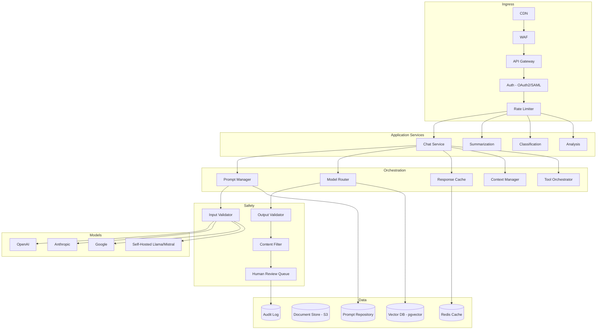
```mermaid
graph TB
    subgraph "Ingress"
        CDN[CDN] --> WAF[WAF]
        WAF --> APIGW[API Gateway]
        APIGW --> AUTH[Auth - OAuth2/SAML]
        AUTH --> RATE[Rate Limiter]
    end

    subgraph "Application Services"
        CHAT[Chat Service]
        SUM[Summarization]
        CLASS[Classification]
        ANALYSIS[Analysis]
    end

    subgraph "Orchestration"
        PROMPT[Prompt Manager]
        ROUTER[Model Router]
        CACHE[Response Cache]
        CONTEXT[Context Manager]
        TOOLS[Tool Orchestrator]
    end

    subgraph "Safety"
        INPUT_VAL[Input Validator]
        OUTPUT_VAL[Output Validator]
        CONTENT_FILTER[Content Filter]
        HITL[Human Review Queue]
    end

    subgraph "Models"
        OPENAI[OpenAI]
        ANTHROPIC[Anthropic]
        GOOGLE[Google]
        SELFHOSTED[Self-Hosted Llama/Mistral]
    end

    subgraph "Data"
        VDB[(Vector DB - pgvector)]
        DOC[(Document Store - S3)]
        PROMPT_DB[(Prompt Repository)]
        REDIS[(Redis Cache)]
        AUDIT[(Audit Log)]
    end

    RATE --> CHAT
    RATE --> SUM
    RATE --> CLASS
    RATE --> ANALYSIS

    CHAT --> PROMPT
    CHAT --> ROUTER
    CHAT --> CACHE
    CHAT --> CONTEXT
    CHAT --> TOOLS

    PROMPT --> INPUT_VAL
    INPUT_VAL --> OPENAI
    INPUT_VAL --> ANTHROPIC
    INPUT_VAL --> GOOGLE
    INPUT_VAL --> SELFHOSTED

    ROUTER --> OUTPUT_VAL
    OUTPUT_VAL --> CONTENT_FILTER
    CONTENT_FILTER --> HITL

    ROUTER --> VDB
    PROMPT --> PROMPT_DB
    CACHE --> REDIS
    HITL --> AUDIT
```

The Safety Layer is non-negotiable in banking. Input validation detects prompt injection, excessive length, and prohibited content. Output validation checks for PII leakage, hallucination indicators (responses not grounded in retrieved context), and toxic content. The content filter categorizes outputs into harm categories. If any safety check flags high-severity issues, the response is routed to a Human Review Queue rather than being returned to the user.

The Model Layer uses a multi-provider strategy (OpenAI, Anthropic, Google, self-hosted Llama 3 and Mistral) for three reasons: (1) fallback capability during provider outages, (2) best-of-breed model selection for different tasks, and (3) negotiation leverage. Self-hosted models handle data-residency-sensitive workloads that cannot leave the bank's network.

For global deployment, we use a primary region (London) with a warm standby DR region (Frankfurt). Databases use async replication, vector databases have read replicas in the DR region, and application pods are deployed but scaled to minimal capacity in the DR region. Failover is automated with health-check-based detection and 5-minute RTO target.

**Key Points to Hit:**
- [ ] Five-layer architecture: Ingress, Application, Orchestration, Safety, Model
- [ ] Multi-provider model strategy for resilience, optimization, and negotiation
- [ ] Four-tier safety: input validation, output validation, content filtering, human review
- [ ] Global deployment: primary/DR regions with async replication and automated failover
- [ ] Multi-tenant isolation with shared models but tenant-specific prompts, data, budgets

**Follow-Up Questions:**
1. How do you ensure data isolation between tenants in this shared platform?
2. Walk me through the complete request flow from user input to AI response.
3. How would you design for disaster recovery?
4. What are the key security layers?

**Source:** `genai-platforms/enterprise-genai-architecture.md`, `architecture/zero-trust-architecture.md`, `architecture/ai-platform-design.md`

---

### Q17: 🔴 Design a Zero-Trust Security Architecture for a GenAI platform handling sensitive banking data and external LLM API calls.

**Strong Answer:**

Zero-trust architecture assumes no network boundary is inherently trustworthy -- every request must be authenticated, authorized, encrypted, and audited regardless of its origin. For a GenAI platform in a regulated bank, this is essential because the platform handles sensitive customer data, employee information, and makes external API calls to third-party LLM providers.

The security architecture has four defense layers. The Perimeter Security layer includes the WAF (blocking SQL injection, XSS, and common injection attacks), DDoS protection, and TLS 1.3 for encryption in transit. All external traffic terminates TLS at the load balancer, and internal service-to-service communication uses mutual TLS (mTLS) via a service mesh (Istio or Linkerd).

The Application Security layer handles authentication (OAuth2/OIDC with MFA for internal users), authorization (RBAC with department and clearance-level filtering, supplemented by ABAC for fine-grained resource-level access), input validation (schema validation, injection pattern detection, length limits), and output validation (PII detection, hallucination checking, toxicity filtering). Every service validates the identity and permissions of the caller, even if the caller is another internal service.

The Data Security layer encrypts all data at rest with AES-256 using HSM-backed key management. PII is tokenized -- sensitive fields are replaced with non-reversible tokens, and the mapping is stored in a separate, highly-restricted vault. Data residency requirements are enforced by routing tenant data to region-specific infrastructure (EU tenant data stays in EU regions). Vector database payloads are encrypted at rest, and embedding vectors themselves do not contain recoverable PII (verified through adversarial testing).

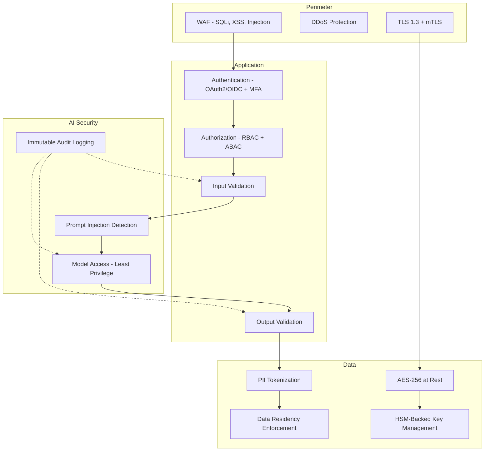
```mermaid
graph TB
    subgraph "Perimeter"
        WAF[WAF - SQLi, XSS, Injection]
        DDoS[DDoS Protection]
        TLS[TLS 1.3 + mTLS]
    end

    subgraph "Application"
        AUTHN[Authentication - OAuth2/OIDC + MFA]
        AUTHZ[Authorization - RBAC + ABAC]
        INPUT_VAL[Input Validation]
        OUTPUT_VAL[Output Validation]
    end

    subgraph "Data"
        AES[AES-256 at Rest]
        TOKEN[PII Tokenization]
        RESIDENCY[Data Residency Enforcement]
        HSM[HSM-Backed Key Management]
    end

    subgraph "AI Security"
        PROMPT_DEF[Prompt Injection Detection]
        MODEL_ACL[Model Access - Least Privilege]
        AUDIT[Immutable Audit Logging]
    end

    WAF --> AUTHN
    AUTHN --> AUTHZ
    AUTHZ --> INPUT_VAL
    INPUT_VAL --> PROMPT_DEF
    PROMPT_DEF --> MODEL_ACL
    MODEL_ACL --> OUTPUT_VAL
    OUTPUT_VAL --> TOKEN
    TLS --> AES
    AES --> HSM
    TOKEN --> RESIDENCY
    AUDIT -.-> INPUT_VAL
    AUDIT -.-> OUTPUT_VAL
    AUDIT -.-> MODEL_ACL
```

The AI Security layer addresses GenAI-specific threats. Prompt injection detection uses pattern matching for common injection techniques (system prompt override attempts, role-play manipulation, instruction forgetting) and an ML classifier trained on known injection patterns. Model access follows least privilege -- each service can only call the specific LLM endpoints it needs, with scoped API keys. Every prompt and response is logged to an immutable audit store.

For external LLM API calls, we implement additional controls: PII is redacted before any data leaves the bank's network, calls go through a NAT gateway with IP allowlisting at the provider side, responses are validated before being used, and all external calls are logged with request/response hashes (not full content, to minimize external data exposure).

Network segmentation uses Kubernetes namespaces and NetworkPolicies to isolate services. The API Gateway namespace can reach application service namespaces, but application services cannot reach each other directly. The LLM Gateway namespace can reach external IPs (for LLM provider APIs) but cannot reach internal database namespaces. Database namespaces only accept connections from their specific application namespaces.

**Key Points to Hit:**
- [ ] Four-layer defense: Perimeter (WAF, DDoS, TLS), Application (auth, validation), Data (encryption, tokenization, residency), AI-specific (prompt injection, model ACLs)
- [ ] mTLS for all service-to-service communication via service mesh
- [ ] PII redaction before any external LLM API call, with NAT gateway and IP allowlisting
- [ ] Least-privilege model access with scoped API keys per service
- [ ] Immutable audit logging of every security-relevant event
- [ ] Network segmentation via Kubernetes namespaces and NetworkPolicies

**Follow-Up Questions:**
1. How do you detect and prevent prompt injection attacks?
2. How do you ensure data sent to external LLM APIs is protected?
3. How does data residency work in a multi-region deployment?

**Source:** `architecture/zero-trust-architecture.md`, `genai-platforms/enterprise-genai-architecture.md`, `system-design/ai-gateway-platform.md`

---

### Q18: 🔴 Design a system for Prompt Regression Testing and Automated Quality Gates before deploying prompt changes to production.

**Strong Answer:**

Prompt regression testing is one of the most under-engineered aspects of GenAI platforms, yet it is critical for maintaining quality in production. A single prompt change can silently degrade response quality across thousands of queries, and without automated testing, these regressions are often discovered by users first.

The system centers on a Golden Dataset -- a curated, versioned collection of representative test cases that cover the full spectrum of expected user queries. For a banking GenAI platform, the golden dataset includes: (1) Policy questions (300+ queries about banking policies, procedures, and products), (2) Compliance queries (100+ regulatory interpretation questions with exact CFR citations), (3) Edge cases (100+ ambiguous, adversarial, and out-of-scope queries), and (4) Multilingual queries (50+ queries in each supported language). Each test case has the input query, expected answer criteria, required citations, and pass/fail criteria.

The evaluation pipeline runs automatically on every prompt change. When a prompt version is created or modified, the pipeline: (1) Renders the new prompt template, (2) Executes every query in the golden dataset through the full RAG pipeline with the new prompt, (3) Scores each response against the expected criteria using automated evaluators (groundedness check, citation accuracy, factual correctness via a judge model, safety check), and (4) Compares the results against the baseline (current production prompt version).

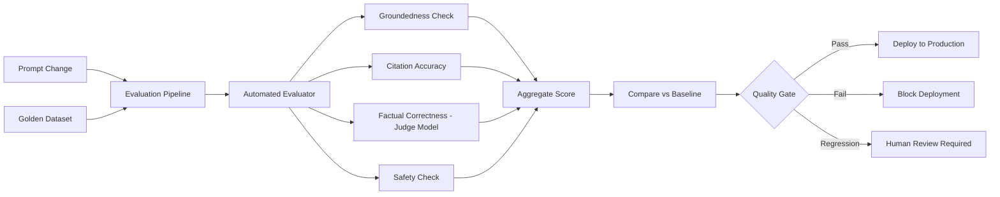
```mermaid
flowchart LR
    PROMPT[Prompt Change] --> PIPELINE[Evaluation Pipeline]
    GOLDEN[Golden Dataset] --> PIPELINE

    PIPELINE --> EVAL[Automated Evaluator]
    EVAL --> GROUND[Groundedness Check]
    EVAL --> CITE[Citation Accuracy]
    EVAL --> FACT[Factual Correctness - Judge Model]
    EVAL --> SAFETY[Safety Check]

    GROUND --> SCORE[Aggregate Score]
    CITE --> SCORE
    FACT --> SCORE
    SAFETY --> SCORE

    SCORE --> COMPARE[Compare vs Baseline]
    COMPARE --> DECISION{Quality Gate}
    DECISION -->|Pass| DEPLOY[Deploy to Production]
    DECISION -->|Fail| BLOCK[Block Deployment]
    DECISION -->|Regression| REVIEW[Human Review Required]
```

The quality gates enforce deployment criteria. A prompt change can only be deployed if: (1) Overall pass rate on the golden dataset is >= 95% (same threshold as production SLO), (2) No regression > 2 percentage points on any query category compared to baseline, (3) Safety violation rate is 0%, (4) Average groundedness score is >= 0.85, and (5) No individual query that previously passed now fails with critical severity.

For automated evaluation, we use a multi-metric approach. Groundedness is measured by an NLI (Natural Language Inference) model that checks whether the response is entailed by the retrieved context. Citation accuracy verifies that cited document IDs and section references actually exist and support the claimed content. Factual correctness uses a stronger LLM (gpt-4o) as a judge model to compare the response against the expected answer criteria. Safety checks run the same PII, toxicity, and regulatory compliance validators used in production.

The canary deployment strategy provides an additional safety net. Even after passing all quality gates, the new prompt is first deployed to 5% of production traffic for 24 hours. During the canary phase, we monitor: real-user satisfaction scores, groundedness distribution, error rates, and cost per query. If any metric degrades beyond threshold, the canary is automatically rolled back. After 24 hours of stable canary, the prompt is rolled out to 100% of traffic.

For continuous monitoring, we run the golden dataset evaluation on a schedule (daily) against the production prompt, independent of any changes. This catches quality drift caused by model updates (LLM providers silently changing model behavior) or data changes (document updates in the knowledge base).

**Key Points to Hit:**
- [ ] Golden Dataset: curated, versioned test cases covering policies, compliance, edge cases, multilingual
- [ ] Automated evaluation pipeline on every prompt change with multi-metric scoring
- [ ] Quality gates: >= 95% pass rate, no regression > 2pp, 0% safety violations, groundedness >= 0.85
- [ ] Multi-metric evaluation: NLI groundedness, citation accuracy, judge model factual correctness, safety
- [ ] Canary deployment (5% for 24h) with auto-rollback on metric degradation
- [ ] Continuous daily evaluation against production prompt to catch model/data drift

**Follow-Up Questions:**
1. How do you build and maintain the golden dataset?
2. What do you do when an LLM provider silently updates model behavior and breaks your evaluations?
3. How do you handle subjective quality metrics that automated evaluators cannot capture?

**Source:** `system-design/prompt-management-platform.md`, `architecture/reliability-engineering.md`, `system-design/observability-platform.md`

---

### Q19: 🔴 Design a system that handles graceful degradation when multiple GenAI platform components fail simultaneously (LLM provider outage + vector DB degradation + cache miss storm).

**Strong Answer:**

This is a worst-case scenario that tests architectural resilience at its limits. When the primary LLM provider is down, the vector database is degraded (high latency), and the cache is cold (no cached responses), the platform must still provide a functional, albeit degraded, experience to users.

The degradation strategy follows a tiered approach with defined degradation levels. Level 0 (normal operation): full RAG pipeline with premium models. Level 1 (single component failure): fallback to redundant components. Level 2 (multiple component failures): degraded but functional service. Level 3 (catastrophic failure): minimal service with clear user communication.

When the LLM provider fails, the Model Router's fallback chain activates. If the primary provider (e.g., OpenAI) is down, it tries the secondary (Anthropic), then tertiary (Google), then self-hosted models. The circuit breaker for each provider opens after 5 consecutive failures, immediately routing to alternatives. If all external providers are simultaneously down (rare but possible), self-hosted models on the bank's GPU infrastructure become the last resort -- they may have lower quality but provide baseline functionality.

When the vector database is degraded (response latency spikes from 50ms to 500ms+), the retrieval engine adapts: (1) It reduces the retrieval scope from k=20 to k=10 to reduce latency, (2) It skips the re-ranking step (saving 200-400ms), (3) It falls back to full-text search in Elasticsearch if vector search is completely unavailable, and (4) It implements query timeout at 2 seconds -- if retrieval does not complete within the timeout, it proceeds with whatever partial results are available.

When the cache is cold (e.g., after a cache cluster restart or failover), the sudden increase in direct LLM calls can overwhelm providers. To prevent a cache miss storm from becoming a provider overload, we implement request coalescing: if multiple identical queries arrive simultaneously and none is in cache, only the first request proceeds to the LLM, and subsequent identical requests wait for its result (up to 2 seconds) rather than each making independent LLM calls. This reduces duplicate LLM calls during cache warm-up by 60-80%.

```mermaid
flowchart TD
    REQUEST[User Request] --> CB1{Cache Hit?}
    CB1 -->|Yes| RETURN[Return Cached Response]
    CB1 -->|No| COALESCE{Request Coalescing}

    COALESCE -->|First Request| RETRIEVE[Retrieval]
    COALESCE -->|Duplicate Request| WAIT[Wait for Result]

    RETRIEVE --> DB_CHECK{Vector DB Healthy?}
    DB_CHECK -->|Yes| VDB[Full Vector Search + Re-rank]
    DB_CHECK -->|Degraded| REDUCED[Reduced k=10, No Re-rank]
    DB_CHECK -->|Down| FTS[Full-Text Search Only]

    VDB --> LLM[LLM Generation]
    REDUCED --> LLM
    FTS --> LLM

    LLM --> PROV_CHECK{Provider Available?}
    PROV_CHECK -->|Primary| PRIMARY[Primary Provider]
    PROV_CHECK -->|No| FALLBACK[Fallback Chain: Secondary -> Tertiary -> Self-Hosted]
    PROV_CHECK -->|All Down| MINIMAL[Minimal Response: "Service degraded, try again"]

    PRIMARY --> OUTPUT[Output Validation]
    FALLBACK --> OUTPUT
    OUTPUT --> CACHE_STORE[Store in Cache]
    OUTPUT --> RETURN
```

The user experience during degradation is managed transparently. At Level 1 degradation, users see no difference -- the fallback is invisible. At Level 2, we add a subtle indicator ("Response may take longer than usual") and reduce streaming latency expectations. At Level 3, we display a clear maintenance message with an estimated recovery time and offer alternative channels (knowledge base search, contact number).

The recovery process is gradual. When components recover, we do not immediately return to full operation. The cache is warmed progressively (starting with most common queries), the vector DB is validated for stable latency before re-enabling full retrieval, and LLM providers are tested with synthetic queries before routing production traffic.

Post-incident, we conduct a blameless post-mortem focusing on: root cause of each component failure, whether the degradation strategy worked as designed, what additional resilience improvements are needed, and whether our monitoring detected the degradation quickly enough.

**Key Points to Hit:**
- [ ] Tiered degradation levels: normal, single failure, multiple failures, catastrophic
- [ ] LLM fallback chain: primary -> secondary -> tertiary -> self-hosted
- [ ] Vector DB adaptation: reduce k, skip re-ranking, fall back to full-text search
- [ ] Request coalescing during cache miss storms to prevent provider overload
- [ ] Transparent user communication at each degradation level
- [ ] Gradual, validated recovery process -- not an immediate switch back to normal

**Follow-Up Questions:**
1. How do you decide which users get service first during degradation (prioritization)?
2. How do you test degradation scenarios without causing actual outages?
3. What metrics do you track to detect degradation early?

**Source:** `architecture/reliability-engineering.md`, `system-design/internal-enterprise-chatbot.md`, `system-design/ai-gateway-platform.md`

---

### Q20: 🔴 Design a cost optimization system for a GenAI platform that dynamically routes traffic between providers, manages token budgets, and optimizes prompt efficiency without sacrificing quality.

**Strong Answer:**

Cost optimization in GenAI is a multi-dimensional challenge because costs are driven by token consumption (input + output), model selection (gpt-4o costs 5x more than gpt-4o-mini per token), and query volume. A 500K-employee enterprise platform can easily spend $100K-$500K/month on LLM APIs without active cost management.

The system operates on three optimization levers: model routing, token efficiency, and cache optimization.

Model routing is the highest-impact lever. Our intelligent router scores each request and routes to the cheapest model that meets quality requirements. The scoring system evaluates query complexity (word count, keyword analysis, multi-part detection) and maps to model tiers: simple queries (greetings, factual lookups, navigation) go to gpt-4o-mini ($0.003/1K input tokens), moderate queries (account inquiries, policy explanations) go to claude-sonnet ($0.012/1K input tokens), and complex queries (regulatory analysis, compliance checks) go to gpt-4o ($0.015/1K input tokens). We continuously validate routing decisions by sampling queries across all tiers and measuring quality -- if gpt-4o-mini consistently achieves groundedness > 0.9 for a query category, that category is permanently moved to the cheaper tier.

Dynamic provider selection adds another dimension. When multiple providers offer comparable models (e.g., GPT-4o vs. Claude Sonnet vs. Gemini Pro), the router selects based on real-time pricing. Providers periodically change prices, offer volume discounts, or run promotions. The cost tracker monitors per-provider pricing and updates routing weights. If Anthropic offers a 20% volume discount at our current usage level, the router shifts traffic to maximize the discount.

Token efficiency optimization reduces the number of tokens consumed per query. We optimize prompts by: (1) Removing redundant instructions and examples from system prompts (saving 200-500 input tokens per query), (2) Truncating retrieved context to the most relevant passages (top 4 documents instead of top 8, saving 2,000-4,000 input tokens), (3) Constraining output length with explicit instructions ("respond in 3-5 sentences" for simple queries), and (4) Using structured output formats (JSON schema) to prevent verbose, unstructured responses. These optimizations can reduce per-query token consumption by 30-50%.

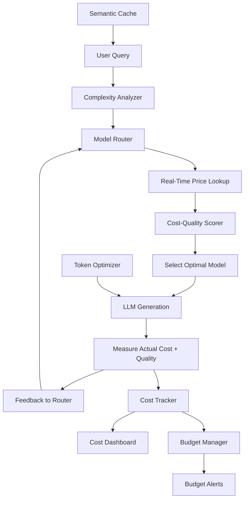
```mermaid
flowchart TB
    QUERY[User Query] --> COMPLEXITY[Complexity Analyzer]
    COMPLEXITY --> ROUTE[Model Router]

    ROUTE --> PRICING[Real-Time Price Lookup]
    PRICING --> SCORE[Cost-Quality Scorer]
    SCORE --> SELECT[Select Optimal Model]

    SELECT --> GEN[LLM Generation]
    GEN --> MEASURE[Measure Actual Cost + Quality]
    MEASURE --> FEEDBACK[Feedback to Router]
    FEEDBACK --> ROUTE

    MEASURE --> TRACKER[Cost Tracker]
    TRACKER --> DASH[Cost Dashboard]
    TRACKER --> BUDGET[Budget Manager]
    BUDGET --> ALERT[Budget Alerts]

    TOKEN_OPT[Token Optimizer] --> GEN
    CACHE[Semantic Cache] --> QUERY
```

The cache optimization layer maximizes cache hit rates. Semantic caching (embedding similarity > 0.95) achieves 30-50% hit rates, directly reducing LLM API calls. We optimize cache TTL based on content type: policy answers cached for 1 hour, procedural answers for 30 minutes, and time-sensitive information for 5 minutes. Cache warming pre-populates the cache with the top 1,000 most frequent queries during off-peak hours.

Budget management enforces cost controls at the team and platform level. Each team has a monthly budget with soft limits (80% -- alert team lead), hard limits (100% -- block non-critical requests), and emergency override capability (VP approval for critical needs). The platform-level budget manager tracks total spend against the monthly allocation and can throttle traffic if the daily spend rate would exceed the monthly budget. The cost forecast uses the past 7 days of spend to project month-end costs and alert if the projection exceeds the budget.

The continuous feedback loop is essential. Every LLM call records the actual cost, model used, and quality score (groundedness). The router uses this feedback to refine its complexity scoring model -- if queries classified as "simple" consistently produce low-groundedness responses, the router adjusts its classification thresholds. This self-tuning ensures that cost optimization does not silently degrade quality over time.

**Key Points to Hit:**
- [ ] Three optimization levers: model routing, token efficiency, cache optimization
- [ ] Complexity-based routing to cheaper models with continuous quality validation
- [ ] Dynamic provider selection based on real-time pricing and volume discounts
- [ ] Token efficiency: prompt optimization, context truncation, output length constraints (30-50% savings)
- [ ] Semantic caching with content-type-based TTL and cache warming
- [ ] Continuous feedback loop: actual cost + quality data refines routing decisions
- [ ] Budget management: soft limits, hard limits, emergency override, cost forecasting

**Follow-Up Questions:**
1. How do you ensure cost optimization doesn't silently degrade response quality?
2. How do you allocate costs across multiple teams consuming the shared platform?
3. When is it more cost-effective to run self-hosted models vs. using external APIs?

**Source:** `system-design/ai-gateway-platform.md`, `system-design/observability-platform.md`, `architecture/capacity-planning.md`, `architecture/cost-management.md`
