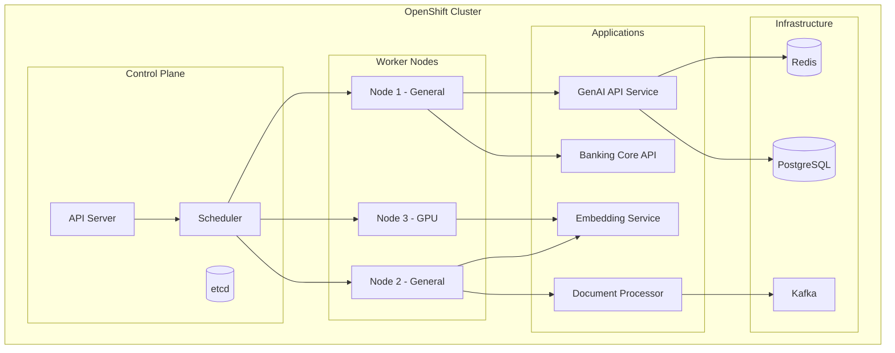

# Kubernetes/OpenShift for GenAI Banking Platforms

## Overview

Kubernetes (K8s) and OpenShift form the deployment platform for modern banking GenAI applications. They provide container orchestration, service discovery, autoscaling, and security controls needed to run AI workloads at scale in regulated environments. This guide covers K8s/OpenShift fundamentals, banking-specific patterns, and production operational practices.

## Architecture Overview



## Why Kubernetes for Banking GenAI

```yaml
benefits:
  - "Containerized deployments: Consistent across dev, staging, production"
  - "Autoscaling: Handle variable GenAI request loads"
  - "Self-healing: Automatic restart of failed pods"
  - "Service discovery: Internal DNS for microservices"
  - "Rolling updates: Zero-downtime deployments"
  - "Resource quotas: Prevent resource exhaustion"
  - "Network policies: Zero-trust networking"
  - "Secrets management: Encrypted credential storage"
  - "GPU scheduling: Run ML models on GPU nodes"

banking_requirements_met:
  - "Audit trails: All cluster events logged"
  - "RBAC: Fine-grained access control"
  - "Network isolation: Policies restrict pod-to-pod communication"
  - "Compliance: Pod security standards, admission controllers"
  - "High availability: Multi-AZ cluster deployments"
  - "Disaster recovery: Etcd backups, multi-cluster failover"
```

## Core Concepts

### Pod

```yaml
# The smallest deployable unit in K8s
# A pod runs one or more containers that share network and storage
apiVersion: v1
kind: Pod
metadata:
  name: genai-api
  namespace: banking-genai
  labels:
    app: genai-api
    tier: frontend
spec:
  containers:
    - name: api
      image: banking/genai-api:1.2.0
      ports:
        - containerPort: 8080
      env:
        - name: DATABASE_URL
          valueFrom:
            secretKeyRef:
              name: db-credentials
              key: url
      resources:
        requests:
          cpu: 250m
          memory: 512Mi
        limits:
          cpu: "1"
          memory: 1Gi
      readinessProbe:
        httpGet:
          path: /health/ready
          port: 8080
        initialDelaySeconds: 10
        periodSeconds: 5
      livenessProbe:
        httpGet:
          path: /health/live
          port: 8080
        initialDelaySeconds: 30
        periodSeconds: 10
```

### Key K8s Resources

| Resource | Purpose | Banking Use Case |
|----------|---------|-----------------|
| Pod | Container group | Run application containers |
| Deployment | Replica management | Stateless API services |
| Service | Network abstraction | Internal service discovery |
| Ingress/Route | External access | API gateway |
| ConfigMap | Configuration | App settings |
| Secret | Sensitive data | DB credentials, API keys |
| StatefulSet | Stateful pods | Databases, Kafka |
| CronJob | Scheduled tasks | Daily ETL, embedding refresh |
| HPA | Autoscaling | Scale API based on load |

## OpenShift vs Vanilla Kubernetes

| Feature | OpenShift | Vanilla K8s |
|---------|-----------|-------------|
| Installation | Integrated (OKD/OCP) | Manual (kubeadm, etc.) |
| Container Runtime | CRI-O | containerd, CRI-O |
| Registry | Built-in | External (Harbor, etc.) |
| CI/CD | OpenShift Pipelines (Tekton) | External (GitHub Actions, etc.) |
| Monitoring | Built-in (Prometheus) | External setup |
| Security | SCC, Security Contexts | Pod Security Standards |
| Routes | Built-in routing | Ingress controllers |
| Cost | Higher (subscription) | Lower (open source) |

## Banking Deployment Architecture

```
Production OpenShift Cluster:

┌─────────────────────────────────────────────┐
│  Projects (Namespaces)                       │
├─────────────────────────────────────────────┤
│                                             │
│  banking-genai-dev                          │
│  ├── genai-api (Deployment)                 │
│  ├── embedding-service (Deployment)         │
│  ├── document-processor (Deployment)        │
│  └── redis (StatefulSet)                    │
│                                             │
│  banking-genai-staging                      │
│  ├── genai-api (Deployment)                 │
│  └── ...                                    │
│                                             │
│  banking-genai-prod                         │
│  ├── genai-api (Deployment x3)              │
│  ├── embedding-service (Deployment x2)      │
│  ├── document-processor (Deployment x2)     │
│  └── ...                                    │
│                                             │
│  banking-data                               │
│  ├── postgresql (StatefulSet)               │
│  ├── kafka (Strimzi Operator)               │
│  └── ...                                    │
│                                             │
└─────────────────────────────────────────────┘
```

## Cross-References

- **Pods**: See [pods.md](pods.md) for pod lifecycle and debugging
- **Deployments**: See [deployments.md](deployments.md) for deployment strategies
- **GPU Workloads**: See [gpu-workloads.md](gpu-workloads.md) for ML model serving

## Interview Questions

1. **Why would a bank choose OpenShift over vanilla Kubernetes?**
2. **How does Kubernetes self-healing work? What happens when a pod crashes?**
3. **What is the difference between a Deployment and a StatefulSet?**
4. **How do you ensure zero-downtime deployments in Kubernetes?**
5. **What are resource requests and limits? Why do they matter?**
6. **How would you architect a multi-environment K8s setup for a banking GenAI platform?**

## Checklist: Kubernetes Readiness

- [ ] Cluster provisioned with appropriate node types
- [ ] Network policies configured for zero-trust
- [ ] RBAC roles defined for teams
- [ ] Resource quotas set per namespace
- [ ] Monitoring and alerting configured
- [ ] Log aggregation set up
- [ ] Image registry configured with scanning
- [ ] Backup strategy for etcd and stateful workloads
- [ ] Disaster recovery plan for cluster failure
- [ ] Team trained on K8s fundamentals and debugging
