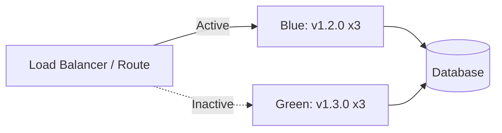

# Blue/Green Deployments on OpenShift

## Overview

Blue/green deployments run two identical environments and switch traffic between them, enabling instant rollback and zero-downtime deployments. This guide covers blue/green patterns on OpenShift for banking GenAI applications.

## Blue/Green Architecture



## Implementation

```yaml
# Shared service that points to active deployment
apiVersion: v1
kind: Service
metadata:
  name: genai-api-active
  namespace: banking-genai
spec:
  selector:
    app: genai-api
    active: "true"
  ports:
    - port: 80
      targetPort: 8080
---
# Blue deployment (currently active)
apiVersion: apps/v1
kind: Deployment
metadata:
  name: genai-api-blue
spec:
  replicas: 3
  selector:
    matchLabels:
      app: genai-api
      track: blue
  template:
    metadata:
      labels:
        app: genai-api
        track: blue
        active: "true"
    spec:
      containers:
        - name: api
          image: quay.io/banking/genai-api:1.2.0
---
# Green deployment (new version, inactive)
apiVersion: apps/v1
kind: Deployment
metadata:
  name: genai-api-green
spec:
  replicas: 3
  selector:
    matchLabels:
      app: genai-api
      track: green
  template:
    metadata:
      labels:
        app: genai-api
        track: green
        active: "false"
    spec:
      containers:
        - name: api
          image: quay.io/banking/genai-api:1.3.0
```

## Switch Traffic

```bash
# Switch from blue to green
# Update service selector to point to green
oc patch service genai-api-active -p '{"spec":{"selector":{"active":"false"}}}' -n banking-genai

# Or using labels:
oc label deployment genai-api-blue active=false -n banking-genai
oc label deployment genai-api-green active=true -n banking-genai

# Verify
oc get pods -l app=genai-api,active=true -n banking-genai

# Rollback: switch back to blue
oc label deployment genai-api-blue active=true -n banking-genai
oc label deployment genai-api-green active=false -n banking-genai
```

## Cross-References

- **Canary Releases**: See [canary-releases.md](canary-releases.md) for gradual rollout
- **Deployments**: See [deployments.md](deployments.md) for rolling updates

## Interview Questions

1. **How does blue/green deployment work? What are its advantages?**
2. **How do you switch traffic in a blue/green deployment on OpenShift?**
3. **What is the cost of blue/green vs rolling update?**
4. **How do you handle database migrations with blue/green deployments?**
5. **How do you test the green environment before switching traffic?**
6. **What happens to the blue deployment after a successful switch?**

## Checklist: Blue/Green Deployment

- [ ] Both environments identical in configuration
- [ ] Database migrations backward-compatible
- [ ] Health checks passing on green before switch
- [ ] Automated traffic switching
- [ ] Instant rollback capability
- [ ] Resource capacity for running both environments
- [ ] Monitoring comparing both environments
- [ ] Old environment decommissioned after verification
