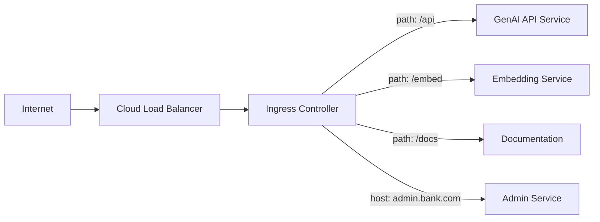

# Kubernetes Ingress: Controllers, TLS, and Routing

## Overview

Ingress manages external HTTP/HTTPS access to services within a Kubernetes cluster. In banking environments, ingress controllers handle TLS termination, path-based routing, rate limiting, and integration with WAF (Web Application Firewall) for security.

## Ingress Architecture



## NGINX Ingress Configuration

```yaml
apiVersion: networking.k8s.io/v1
kind: Ingress
metadata:
  name: banking-genai-ingress
  namespace: banking-genai
  annotations:
    # TLS settings
    cert-manager.io/cluster-issuer: letsencrypt-prod
    
    # Security headers
    nginx.ingress.kubernetes.io/configuration-snippet: |
      add_header X-Frame-Options "DENY" always;
      add_header X-Content-Type-Options "nosniff" always;
      add_header X-XSS-Protection "1; mode=block" always;
      add_header Strict-Transport-Security "max-age=31536000; includeSubDomains" always;
    
    # Rate limiting
    nginx.ingress.kubernetes.io/limit-rps: "100"
    nginx.ingress.kubernetes.io/limit-connections: "50"
    
    # Request size (for document uploads)
    nginx.ingress.kubernetes.io/proxy-body-size: "50m"
    
    # Timeouts
    nginx.ingress.kubernetes.io/proxy-read-timeout: "120"
    nginx.ingress.kubernetes.io/proxy-send-timeout: "120"
    
    # SSL redirect
    nginx.ingress.kubernetes.io/ssl-redirect: "true"
    
    # CORS (if API is accessed from browser)
    nginx.ingress.kubernetes.io/enable-cors: "true"
    nginx.ingress.kubernetes.io/cors-allow-origin: "https://banking-app.bank.com"
    nginx.ingress.kubernetes.io/cors-allow-methods: "GET, POST, OPTIONS"
    nginx.ingress.kubernetes.io/cors-allow-headers: "Authorization, Content-Type"

spec:
  ingressClassName: nginx
  tls:
    - hosts:
        - genai-api.bank.com
        - genai-admin.bank.com
      secretName: genai-tls-secret
  rules:
    - host: genai-api.bank.com
      http:
        paths:
          - path: /api/v1
            pathType: Prefix
            backend:
              service:
                name: genai-api
                port:
                  number: 80
          - path: /api/v1/embeddings
            pathType: Prefix
            backend:
              service:
                name: embedding-service
                port:
                  number: 80
    - host: genai-admin.bank.com
      http:
        paths:
          - path: /
            pathType: Prefix
            backend:
              service:
                name: admin-service
                port:
                  number: 80
```

## TLS Configuration

```yaml
# cert-manager Certificate for Let's Encrypt
apiVersion: cert-manager.io/v1
kind: Certificate
metadata:
  name: genai-tls
  namespace: banking-genai
spec:
  secretName: genai-tls-secret
  duration: 2160h  # 90 days
  renewBefore: 360h  # 15 days before expiry
  issuerRef:
    name: letsencrypt-prod
    kind: ClusterIssuer
  dnsNames:
    - genai-api.bank.com
    - genai-admin.bank.com
---
# ClusterIssuer for production Let's Encrypt
apiVersion: cert-manager.io/v1
kind: ClusterIssuer
metadata:
  name: letsencrypt-prod
spec:
  acme:
    server: https://acme-v02.api.letsencrypt.org/directory
    email: infrastructure@bank.com
    privateKeySecretRef:
      name: letsencrypt-prod-account
    solvers:
      - http01:
          ingress:
            class: nginx
```

## Cross-References

- **OpenShift Routes**: See [openshift-routes.md](openshift-routes.md) for OpenShift alternative
- **Services**: See [services.md](services.md) for internal networking
- **Security**: See [secure-deployment-patterns.md](secure-deployment-patterns.md) for security patterns

## Interview Questions

1. **What is the difference between Ingress and Service in Kubernetes?**
2. **How do you configure TLS termination for a banking API in Kubernetes?**
3. **What is cert-manager and how does it automate TLS certificates?**
4. **How do you implement rate limiting at the ingress level?**
5. **Compare NGINX Ingress with OpenShift Routes.**
6. **How do you handle WebSocket connections through Kubernetes Ingress?**

## Checklist: Ingress Configuration

- [ ] TLS enabled with automatic certificate renewal
- [ ] Security headers configured (HSTS, X-Frame-Options, etc.)
- [ ] Rate limiting configured
- [ ] Request body size limits set
- [ ] Appropriate timeouts configured for GenAI workloads
- [ ] CORS configured if browser access needed
- [ ] Health check endpoints excluded from auth
- [ ] Ingress controller hardened for production
- [ ] WAF integration configured
- [ ] Access logging enabled
