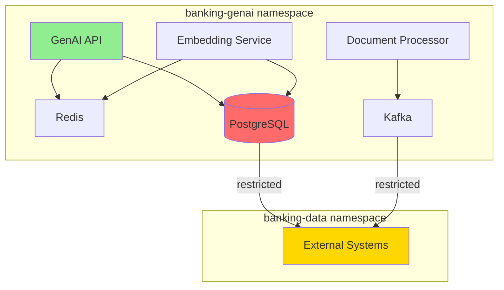

# Network Policies: Zero-Trust Networking in Kubernetes

## Overview

Network Policies control pod-to-pod communication within a Kubernetes cluster. In banking, zero-trust networking ensures that compromised pods cannot access sensitive services, meeting regulatory requirements for network segmentation.

## Zero-Trust Architecture



## Network Policy Examples

```yaml
# Default deny all ingress traffic in namespace
apiVersion: networking.k8s.io/v1
kind: NetworkPolicy
metadata:
  name: default-deny-ingress
  namespace: banking-genai
spec:
  podSelector: {}  # All pods
  policyTypes:
    - Ingress
---
# Allow GenAI API to receive traffic from Ingress
apiVersion: networking.k8s.io/v1
kind: NetworkPolicy
metadata:
  name: allow-ingress-to-genai-api
  namespace: banking-genai
spec:
  podSelector:
    matchLabels:
      app: genai-api
  policyTypes:
    - Ingress
  ingress:
    - from:
        - namespaceSelector:
            matchLabels:
              kubernetes.io/metadata.name: ingress-nginx
      ports:
        - protocol: TCP
          port: 8080
---
# Allow GenAI API to access PostgreSQL
apiVersion: networking.k8s.io/v1
kind: NetworkPolicy
metadata:
  name: allow-genai-to-postgres
  namespace: banking-data
spec:
  podSelector:
    matchLabels:
      app: postgresql
  policyTypes:
    - Ingress
  ingress:
    - from:
        - namespaceSelector:
            matchLabels:
              kubernetes.io/metadata.name: banking-genai
          podSelector:
            matchLabels:
              app: genai-api
      ports:
        - protocol: TCP
          port: 5432
---
# Allow egress only to specific services
apiVersion: networking.k8s.io/v1
kind: NetworkPolicy
metadata:
  name: genai-api-egress
  namespace: banking-genai
spec:
  podSelector:
    matchLabels:
      app: genai-api
  policyTypes:
    - Egress
  egress:
    # Allow DNS resolution
    - to: []
      ports:
        - protocol: UDP
          port: 53
        - protocol: TCP
          port: 53
    # Allow access to PostgreSQL
    - to:
        - namespaceSelector:
            matchLabels:
              kubernetes.io/metadata.name: banking-data
          podSelector:
            matchLabels:
              app: postgresql
      ports:
        - protocol: TCP
          port: 5432
    # Allow access to Redis
    - to:
        - podSelector:
            matchLabels:
              app: redis
      ports:
        - protocol: TCP
          port: 6379
```

## Cross-References

- **RBAC**: See [rbac.md](rbac.md) for access control
- **Secure Deployments**: See [secure-deployment-patterns.md](secure-deployment-patterns.md) for security patterns

## Interview Questions

1. **What is a Kubernetes NetworkPolicy? What is the default behavior without policies?**
2. **How do you implement zero-trust networking in Kubernetes?**
3. **How do you allow traffic between namespaces?**
4. **What is the difference between ingress and egress policies?**
5. **How do you debug network policy issues?**
6. **What happens when you apply a default-deny policy?**

## Checklist: Network Policies

- [ ] Default-deny policy applied to all namespaces
- [ ] Explicit allow policies for required communication paths
- [ ] Egress policies restrict outbound traffic
- [ ] DNS access allowed for service discovery
- [ ] Inter-namespace policies documented
- [ ] Network policy tested with connectivity checks
- [ ] CNI plugin supports NetworkPolicy (Calico, Cilium)
- [ ] Policy changes reviewed for security impact
- [ ] Monitoring for denied connections enabled
