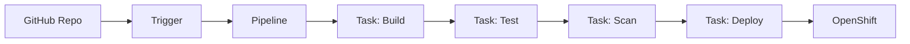

# OpenShift Pipelines (Tekton)

## Overview

OpenShift Pipelines provides CI/CD capabilities using Tekton, a cloud-native pipeline framework. This guide covers creating CI/CD pipelines for banking GenAI applications using Tekton.

## Pipeline Architecture



## Pipeline Definition

```yaml
apiVersion: tekton.dev/v1beta1
kind: Pipeline
metadata:
  name: genai-api-pipeline
  namespace: banking-genai
spec:
  params:
    - name: repo-url
      type: string
    - name: revision
      type: string
      default: main
    - name: image-name
      type: string
      default: quay.io/banking/genai-api
    - name: deploy-namespace
      type: string
      default: banking-genai
  workspaces:
    - name: shared-workspace
  tasks:
    - name: fetch-source
      taskRef:
        name: git-clone
      params:
        - name: url
          value: $(params.repo-url)
        - name: revision
          value: $(params.revision)
      workspaces:
        - name: output
          workspace: shared-workspace
    
    - name: build-image
      taskRef:
        name: buildah
      runAfter:
        - fetch-source
      params:
        - name: IMAGE
          value: $(params.image-name):$(tasks.fetch-source.results.commit)
      workspaces:
        - name: source
          workspace: shared-workspace
    
    - name: run-tests
      taskRef:
        name: run-tests
      runAfter:
        - fetch-source
      workspaces:
        - name: source
          workspace: shared-workspace
    
    - name: deploy
      taskRef:
        name: openshift-client
      runAfter:
        - build-image
        - run-tests
      params:
        - name: SCRIPT
          value: |
            oc set image deployment/genai-api \
              api=$(params.image-name):$(tasks.fetch-source.results.commit) \
              -n $(params.deploy-namespace)
```

## Cross-References

- **Tekton**: See [tekton.md](../cicd-devops/tekton.md) for Tekton details
- **CI/CD Design**: See [ci-cd-design.md](../cicd-devops/ci-cd-design.md) for pipeline patterns

## Interview Questions

1. **What is Tekton? How does it differ from Jenkins?**
2. **How do you create a Tekton Pipeline for a banking application?**
3. **What are Tekton Tasks, Workspaces, and Results?**
4. **How do you pass artifacts between Tekton tasks?**
5. **How do you trigger a Tekton Pipeline on a git push?**
6. **How do you integrate Tekton with OpenShift deployment?**

## Checklist: OpenShift Pipelines

- [ ] Pipeline defined as code (YAML)
- [ ] Source control integration configured
- [ ] Image build with security scanning
- [ ] Test stage before deployment
- [ ] Deployment automated with rollback
- [ ] Pipeline execution monitored
- [ ] Secrets managed via OpenShift Secrets
- [ ] Pipeline runs isolated per branch/PR
