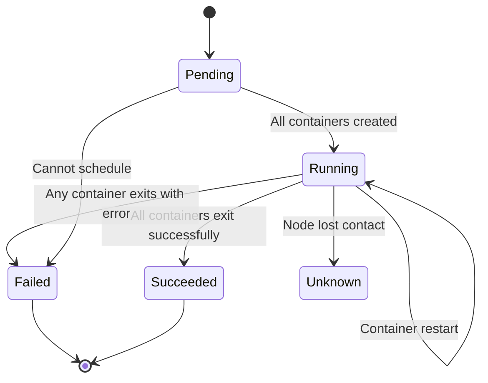

# Kubernetes Pods: Lifecycle, Configuration, and Debugging

## Overview

Pods are the smallest deployable units in Kubernetes. Understanding pod lifecycle, configuration patterns, and debugging techniques is essential for operating GenAI applications in banking environments.

## Pod Lifecycle



```
Pod Phases:
- Pending: Pod accepted, containers not yet running (pulling images, scheduling)
- Running: At least one container is running
- Succeeded: All containers exited successfully (Jobs)
- Failed: At least one container exited with non-zero status
- Unknown: Pod state cannot be determined (node communication lost)
```

## Pod Configuration

```yaml
apiVersion: v1
kind: Pod
metadata:
  name: genai-api
  namespace: banking-genai
  labels:
    app: genai-api
    version: "1.2.0"
    team: genai-platform
  annotations:
    prometheus.io/scrape: "true"
    prometheus.io/port: "8080"
spec:
  # Security context
  securityContext:
    runAsNonRoot: true
    runAsUser: 1000
    fsGroup: 2000
    seccompProfile:
      type: RuntimeDefault
  
  # Service account
  serviceAccountName: genai-api-sa
  
  # Restart policy
  restartPolicy: Always  # Always (default), OnFailure, Never
  
  # Node selection
  nodeSelector:
    workload-type: general
  
  # Affinity rules
  affinity:
    podAntiAffinity:
      preferredDuringSchedulingIgnoredDuringExecution:
        - weight: 100
          podAffinityTerm:
            labelSelector:
              matchExpressions:
                - key: app
                  operator: In
                  values: ["genai-api"]
            topologyKey: kubernetes.io/hostname
  
  # Image pull secrets
  imagePullSecrets:
    - name: registry-credentials
  
  containers:
    - name: api
      image: quay.io/banking/genai-api:1.2.0
      ports:
        - containerPort: 8080
          name: http
          protocol: TCP
      
      # Environment variables
      env:
        - name: APP_ENV
          value: "production"
        - name: LOG_LEVEL
          value: "info"
        - name: DATABASE_URL
          valueFrom:
            secretKeyRef:
              name: db-credentials
              key: url
        - name: REDIS_URL
          valueFrom:
            configMapKeyRef:
              name: app-config
              key: redis_url
        - name: POD_NAME
          valueFrom:
            fieldRef:
              fieldPath: metadata.name
        - name: POD_NAMESPACE
          valueFrom:
            fieldRef:
              fieldPath: metadata.namespace
      
      # Resource requests and limits
      resources:
        requests:
          cpu: 250m
          memory: 512Mi
          ephemeral-storage: 100Mi
        limits:
          cpu: "1"
          memory: 1Gi
          ephemeral-storage: 500Mi
      
      # Probes
      startupProbe:
        httpGet:
          path: /health/startup
          port: 8080
        failureThreshold: 30
        periodSeconds: 10
      readinessProbe:
        httpGet:
          path: /health/ready
          port: 8080
        initialDelaySeconds: 10
        periodSeconds: 5
        timeoutSeconds: 3
        failureThreshold: 3
      livenessProbe:
        httpGet:
          path: /health/live
          port: 8080
        initialDelaySeconds: 30
        periodSeconds: 10
        timeoutSeconds: 5
        failureThreshold: 3
      
      # Volume mounts
      volumeMounts:
        - name: config-volume
          mountPath: /app/config
          readOnly: true
        - name: tmp-volume
          mountPath: /tmp
      
      # Lifecycle hooks
      lifecycle:
        preStop:
          exec:
            command: ["/bin/sh", "-c", "sleep 15"]
  
  # Volumes
  volumes:
    - name: config-volume
      configMap:
        name: genai-api-config
    - name: tmp-volume
      emptyDir:
        medium: Memory
        sizeLimit: 100Mi
  
  # Termination grace period
  terminationGracePeriodSeconds: 30
  
  # DNS configuration
  dnsPolicy: ClusterFirst
  dnsConfig:
    options:
      - name: ndots
        value: "2"
```

## Debugging Pods

```bash
# Check pod status
kubectl get pods -n banking-genai
kubectl get pods -n banking-genai -o wide  # With node info

# Describe pod for events
kubectl describe pod genai-api-abc123 -n banking-genai

# View logs
kubectl logs genai-api-abc123 -n banking-genai
kubectl logs genai-api-abc123 -n banking-genai --previous  # Previous container
kubectl logs genai-api-abc123 -n banking-genai -c sidecar-container  # Specific container
kubectl logs -f genai-api-abc123 -n banking-genai  # Follow

# Execute command in pod
kubectl exec -it genai-api-abc123 -n banking-genai -- /bin/bash
kubectl exec genai-api-abc123 -n banking-genai -- ps aux

# Check resource usage
kubectl top pods -n banking-genai

# Port forward for local debugging
kubectl port-forward pod/genai-api-abc123 8080:8080 -n banking-genai

# Check pod events
kubectl get events -n banking-genai --sort-by='.lastTimestamp'

# Get pod YAML
kubectl get pod genai-api-abc123 -n banking-genai -o yaml

# Check pod conditions
kubectl get pod genai-api-abc123 -n banking-genai -o jsonpath='{.status.conditions}'

# Debug with ephemeral container (K8s 1.23+)
kubectl debug -it genai-api-abc123 -n banking-genai --image=busybox --target=api
```

## Common Pod Issues

```bash
# Pod stuck in Pending
# Cause: Insufficient resources, node selector mismatch, PVC not bound
kubectl describe pod <pod-name>  # Check events
kubectl get nodes -o custom-columns="NAME:.metadata.name,ALLOCATABLE:.status.allocatable"

# Pod in CrashLoopBackOff
# Cause: Application crashing, misconfiguration, missing dependencies
kubectl logs <pod-name> --previous
kubectl describe pod <pod-name>  # Check restart count

# Pod in ImagePullBackOff
# Cause: Image not found, wrong credentials, network issue
kubectl describe pod <pod-name>
kubectl get secret <registry-secret> -o yaml

# Pod in Running but not Ready
# Cause: Readiness probe failing, app slow to start
kubectl describe pod <pod-name>  # Check readiness probe events
kubectl exec <pod-name> -- curl -s localhost:8080/health/ready

# OOMKilled
# Cause: Memory limit too low, memory leak
kubectl describe pod <pod-name>  # Check "OOMKilled" in last state
# Fix: Increase memory limit or fix memory leak
```

## Cross-References

- **Deployments**: See [deployments.md](deployments.md) for managing pod replicas
- **Debugging**: See [debugging-pods.md](debugging-pods.md) for advanced debugging
- **ConfigMaps**: See [configmaps.md](configmaps.md) for configuration management

## Interview Questions

1. **What is the pod lifecycle? What happens during each phase?**
2. **A pod is in CrashLoopBackOff. How do you debug it?**
3. **What is the difference between readiness and liveness probes?**
4. **Why would you use a startup probe?**
5. **What happens when a pod exceeds its memory limit? CPU limit?**
6. **How do you run a pod as a non-root user? Why is this important for banking?**

## Checklist: Pod Configuration

- [ ] Resource requests and limits set for all containers
- [ ] Readiness and liveness probes configured
- [ ] Startup probe for slow-starting applications
- [ ] Security context with runAsNonRoot: true
- [ ] Seccomp profile set to RuntimeDefault
- [ ] Image pull secrets configured for private registries
- [ ] Pod anti-affinity for high availability
- [ ] PreStop hook for graceful shutdown
- [ ] Termination grace period appropriate for drain time
- [ ] Labels and annotations for monitoring and discovery
- [ ] Service account with minimal permissions
