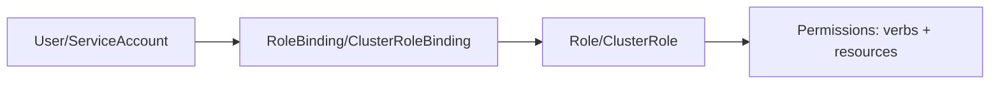

# Kubernetes RBAC: Role-Based Access Control

## Overview

RBAC controls who can perform what actions on which resources in a Kubernetes cluster. In banking, RBAC is essential for compliance, least-privilege access, and audit requirements.

## RBAC Components



## Role and RoleBinding

```yaml
# Role: Namespace-scoped permissions
apiVersion: rbac.authorization.k8s.io/v1
kind: Role
metadata:
  name: genai-developer
  namespace: banking-genai
rules:
  # Read access to pods and logs
  - apiGroups: [""]
    resources: ["pods", "pods/log", "services", "configmaps"]
    verbs: ["get", "list", "watch"]
  # Deploy and update applications
  - apiGroups: ["apps"]
    resources: ["deployments", "replicasets"]
    verbs: ["get", "list", "watch", "create", "update", "patch"]
  # View secrets (restricted)
  - apiGroups: [""]
    resources: ["secrets"]
    verbs: ["get", "list"]
    resourceNames: ["genai-api-config"]  # Only specific secrets
---
# RoleBinding: Bind role to user/group
apiVersion: rbac.authorization.k8s.io/v1
kind: RoleBinding
metadata:
  name: genai-developer-binding
  namespace: banking-genai
subjects:
  - kind: Group
    name: genai-team
    apiGroup: rbac.authorization.k8s.io
  - kind: User
    name: jane@bank.com
    apiGroup: rbac.authorization.k8s.io
roleRef:
  kind: Role
  name: genai-developer
  apiGroup: rbac.authorization.k8s.io
---
# ClusterRole: Cluster-wide permissions
apiVersion: rbac.authorization.k8s.io/v1
kind: ClusterRole
metadata:
  name: cluster-viewer
rules:
  - apiGroups: [""]
    resources: ["nodes", "namespaces", "persistentvolumes"]
    verbs: ["get", "list", "watch"]
---
# ClusterRoleBinding
apiVersion: rbac.authorization.k8s.io/v1
kind: ClusterRoleBinding
metadata:
  name: cluster-viewer-binding
subjects:
  - kind: Group
    name: sre-team
    apiGroup: rbac.authorization.k8s.io
roleRef:
  kind: ClusterRole
  name: cluster-viewer
  apiGroup: rbac.authorization.k8s.io
```

## Service Accounts

```yaml
# Service account for application pods
apiVersion: v1
kind: ServiceAccount
metadata:
  name: genai-api-sa
  namespace: banking-genai
  annotations:
    # AWS IAM role for service account (IRSA)
    eks.amazonaws.com/role-arn: arn:aws:iam::123456789:role/genai-api-role
---
# Role for service account
apiVersion: rbac.authorization.k8s.io/v1
kind: Role
metadata:
  name: genai-api-role
  namespace: banking-genai
rules:
  - apiGroups: [""]
    resources: ["configmaps"]
    verbs: ["get", "list", "watch"]
    resourceNames: ["genai-api-config"]
  - apiGroups: [""]
    resources: ["secrets"]
    verbs: ["get"]
    resourceNames: ["db-credentials", "openai-api-key"]
---
apiVersion: rbac.authorization.k8s.io/v1
kind: RoleBinding
metadata:
  name: genai-api-role-binding
subjects:
  - kind: ServiceAccount
    name: genai-api-sa
roleRef:
  kind: Role
  name: genai-api-role
  apiGroup: rbac.authorization.k8s.io
---
# Use service account in pod
apiVersion: apps/v1
kind: Deployment
metadata:
  name: genai-api
spec:
  template:
    spec:
      serviceAccountName: genai-api-sa
      containers:
        - name: api
          image: quay.io/banking/genai-api:1.0.0
```

## Cross-References

- **Secrets**: See [secrets.md](secrets.md) for secret access control
- **Network Policies**: See [network-policies.md](network-policies.md) for network-level security

## Interview Questions

1. **What is the difference between a Role and a ClusterRole?**
2. **How do you grant a user access to only one namespace?**
3. **What is a ServiceAccount? How does it differ from a regular user?**
4. **How do you implement least-privilege access in Kubernetes?**
5. **What are the security risks of using the default service account?**
6. **How do you audit who accessed what in a Kubernetes cluster?**

## Checklist: RBAC Best Practices

- [ ] Default service account not used by application pods
- [ ] Each application has its own service account
- [ ] Roles scoped to minimum required permissions
- [ ] No cluster-admin role granted to application service accounts
- [ ] Secret access restricted to specific resourceNames
- [ ] RBAC policies reviewed regularly
- [ ] Service account token automount disabled when not needed
- [ ] Audit logging enabled for RBAC changes
- [ ] Group-based access (not individual users)
- [ ] No wildcard permissions except for admin roles
