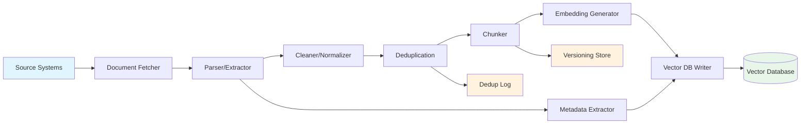

# Data Ingestion Pipeline

## Overview

The data ingestion pipeline transforms raw documents into indexed, searchable chunks in the vector database. It is the foundation of the entire RAG system -- garbage in, garbage out.

```
Raw Documents --> [Parse] --> [Clean] --> [Chunk] --> [Embed] --> [Store] --> [Index]
```

## Pipeline Architecture



## Pipeline Stages

### Stage 1: Document Fetching

```python
from typing import Iterator, Dict

class DocumentFetcher:
    """Fetch documents from various source systems."""
    
    def __init__(self, sources: dict):
        self.sources = sources  # {"policy_db": PolicyDBSource, "sharepoint": SharePointSource, ...}
    
    def fetch_all(self) -> Iterator[Dict]:
        """Fetch all documents from all sources."""
        for source_name, source in self.sources.items():
            for doc in source.fetch():
                doc["source_system"] = source_name
                doc["fetched_at"] = datetime.utcnow().isoformat()
                yield doc
    
    def fetch_incremental(self, since: datetime) -> Iterator[Dict]:
        """Fetch only documents modified since the given time."""
        for source_name, source in self.sources.items():
            for doc in source.fetch_modified_since(since):
                doc["source_system"] = source_name
                doc["fetched_at"] = datetime.utcnow().isoformat()
                yield doc

class PolicyDBSource:
    def fetch(self) -> Iterator[Dict]:
        """Fetch all policies from database."""
        cursor = db.execute("SELECT * FROM policy_documents WHERE status = 'active'")
        for row in cursor:
            yield {
                "id": row["id"],
                "title": row["title"],
                "content": row["content"],
                "metadata": {
                    "doc_type": "policy",
                    "department": row["department"],
                    "version": row["version"],
                    "effective_from": row["effective_from"],
                    "effective_until": row["effective_until"],
                    "author": row["author"],
                    "approved_by": row["approved_by"],
                }
            }

class SharePointSource:
    def fetch(self) -> Iterator[Dict]:
        """Fetch documents from SharePoint."""
        from office365.sharepoint.client_context import ClientContext
        
        ctx = ClientContext.connect_with_credentials(
            self.site_url, UserCredential(self.username, self.password)
        )
        
        folder = ctx.web.get_folder_by_server_relative_url("/Shared Documents/Policies")
        files = folder.files
        ctx.load(files)
        ctx.execute_query()
        
        for file in files:
            content = download_file(file)
            yield {
                "id": f"sp-{file.unique_id}",
                "title": file.name,
                "content": content,
                "metadata": {
                    "doc_type": "sharepoint_document",
                    "source_url": file.serverRelativeUrl,
                    "modified": file.timeLastModified,
                    "author": file.author,
                }
            }
```

### Stage 2: Parsing and Extraction

```python
class DocumentParser:
    """Parse different document formats."""
    
    def parse(self, doc: Dict) -> Dict:
        """Parse document and extract text + metadata."""
        
        doc_type = self.detect_type(doc)
        
        if doc_type == "pdf":
            return self.parse_pdf(doc)
        elif doc_type == "docx":
            return self.parse_docx(doc)
        elif doc_type == "html":
            return self.parse_html(doc)
        elif doc_type == "txt":
            return self.parse_text(doc)
        elif doc_type == "csv":
            return self.parse_csv(doc)
        else:
            return self.parse_text(doc)  # Fallback
    
    def parse_pdf(self, doc: Dict) -> Dict:
        """Parse PDF document."""
        from pypdf import PdfReader
        import io
        
        pdf_file = io.BytesIO(doc["raw_content"])
        reader = PdfReader(pdf_file)
        
        text_parts = []
        metadata = {}
        
        for i, page in enumerate(reader.pages):
            text = page.extract_text()
            text_parts.append(f"[Page {i+1}]\n{text}")
        
        # Extract PDF metadata
        if reader.metadata:
            metadata["pdf_author"] = reader.metadata.get("/Author", "")
            metadata["pdf_title"] = reader.metadata.get("/Title", "")
            metadata["pdf_created"] = str(reader.metadata.get("/CreationDate", ""))
        
        doc["content"] = "\n\n".join(text_parts)
        doc["metadata"].update(metadata)
        doc["page_count"] = len(reader.pages)
        
        return doc
    
    def parse_html(self, doc: Dict) -> Dict:
        """Parse HTML, stripping tags."""
        from bs4 import BeautifulSoup
        
        soup = BeautifulSoup(doc["raw_content"], "html.parser")
        
        # Extract title
        title = soup.title.string if soup.title else doc.get("title", "")
        doc["title"] = title
        
        # Extract text, preserving some structure
        text = soup.get_text(separator="\n", strip=True)
        doc["content"] = text
        
        return doc
```

### Stage 3: Cleaning and Normalization

```python
class DocumentCleaner:
    """Clean and normalize document text."""
    
    def clean(self, doc: Dict) -> Dict:
        """Apply cleaning transformations."""
        
        text = doc["content"]
        
        # Normalize whitespace
        text = re.sub(r'\n{3,}', '\n\n', text)  # Max 2 consecutive newlines
        text = re.sub(r' {2,}', ' ', text)       # Single spaces
        text = text.strip()
        
        # Remove common artifacts
        text = self.remove_page_numbers(text)
        text = self.remove_headers_footers(text)
        text = self.fix_encoding_issues(text)
        
        # Normalize unicode
        text = unicodedata.normalize('NFC', text)
        
        doc["content"] = text
        return doc
    
    def remove_page_numbers(self, text: str) -> str:
        """Remove page number artifacts."""
        # Patterns like "Page 3 of 15", "- 3 -", etc.
        patterns = [
            r'\n\s*Page \d+ of \d+\s*\n',
            r'\n\s*-\s*\d+\s*-\s*\n',
            r'\n\s*\d+\s*\n',  # Standalone number between paragraphs
        ]
        for pattern in patterns:
            text = re.sub(pattern, '\n', text)
        return text
    
    def fix_encoding_issues(self, text: str) -> str:
        """Fix common encoding artifacts."""
        replacements = {
            '\ufeff': '',       # BOM
            '\u2018': "'",      # Smart quote
            '\u2019': "'",
            '\u201c': '"',
            '\u201d': '"',
            '\u2013': '-',      # En dash
            '\u2014': '--',     # Em dash
            '\u00a0': ' ',      # Non-breaking space
        }
        for old, new in replacements.items():
            text = text.replace(old, new)
        return text
```

### Stage 4: Deduplication

```python
class Deduplicator:
    """Detect and remove duplicate documents."""
    
    def __init__(self, similarity_threshold: float = 0.95):
        self.similarity_threshold = similarity_threshold
        self.indexed_hashes = set()  # Hashes of already-indexed documents
    
    def is_duplicate(self, doc: Dict) -> bool:
        """Check if document is a duplicate."""
        content_hash = hashlib.sha256(doc["content"].encode()).hexdigest()
        
        if content_hash in self.indexed_hashes:
            return True
        
        # Fuzzy matching for near-duplicates
        for existing_hash in self.indexed_hashes:
            if self._fuzzy_match(doc["content"], existing_hash):
                return True
        
        return False
    
    def _fuzzy_match(self, content: str, existing_hash: str) -> bool:
        """Check fuzzy similarity using MinHash or Jaccard similarity."""
        # Simplified: use shingle-based Jaccard similarity
        existing_content = get_content_by_hash(existing_hash)
        if not existing_content:
            return False
        
        shingles1 = set(self._get_shingles(content))
        shingles2 = set(self._get_shingles(existing_content))
        
        intersection = shingles1 & shingles2
        union = shingles1 | shingles2
        
        jaccard = len(intersection) / len(union) if union else 0
        return jaccard > self.similarity_threshold
    
    def _get_shingles(self, text: str, k: int = 5) -> list[str]:
        """Extract k-shingles (consecutive word sequences)."""
        words = text.split()
        return [' '.join(words[i:i+k]) for i in range(len(words) - k + 1)]
    
    def add_to_index(self, doc: Dict):
        """Add document hash to index after successful processing."""
        content_hash = hashlib.sha256(doc["content"].encode()).hexdigest()
        self.indexed_hashes.add(content_hash)
```

### Stage 5: Chunking

See [chunking.md](chunking.md) for detailed chunking strategies.

```python
def chunk_document(doc: Dict, strategy: str = "recursive") -> list[Dict]:
    """Split document into chunks with metadata."""
    
    content = doc["content"]
    base_metadata = doc.get("metadata", {})
    
    if strategy == "recursive":
        splitter = RecursiveCharacterTextSplitter(
            chunk_size=400,
            chunk_overlap=60,
            separators=["\n\n", "\n", ". ", " ", ""]
        )
        raw_chunks = splitter.split_text(content)
    
    # Create chunk objects with metadata
    chunks = []
    for i, chunk_text in enumerate(raw_chunks):
        chunk = {
            "id": f"{doc['id']}-chunk-{i}",
            "doc_id": doc["id"],
            "content": chunk_text,
            "metadata": {
                **base_metadata,
                "chunk_index": i,
                "total_chunks": len(raw_chunks),
                "doc_title": doc.get("title", "Unknown"),
                "indexed_at": datetime.utcnow().isoformat(),
            }
        }
        chunks.append(chunk)
    
    return chunks
```

### Stage 6: Embedding Generation

```python
def generate_embeddings(chunks: list[Dict], embedding_model, 
                        batch_size: int = 100) -> list[Dict]:
    """Generate embeddings for chunks in batches."""
    
    for i in range(0, len(chunks), batch_size):
        batch = chunks[i:i + batch_size]
        texts = [chunk["content"] for chunk in batch]
        
        # Batch embedding API call
        embeddings = embedding_model.encode_batch(texts)
        
        for chunk, embedding in zip(batch, embeddings):
            chunk["embedding"] = embedding.tolist()
    
    return chunks
```

### Stage 7: Vector Database Storage

```python
def store_in_vector_db(chunks: list[Dict], vectorstore, 
                       batch_size: int = 100):
    """Store chunks in vector database."""
    
    for i in range(0, len(chunks), batch_size):
        batch = chunks[i:i + batch_size]
        
        documents = []
        for chunk in batch:
            doc = Document(
                id=chunk["id"],
                page_content=chunk["content"],
                metadata=chunk["metadata"]
            )
            doc.embedding = chunk["embedding"]
            documents.append(doc)
        
        vectorstore.add_documents(documents)
```

## Complete Pipeline

```python
class IngestionPipeline:
    def __init__(self, parser, cleaner, deduplicator, 
                 chunker, embedding_model, vectorstore, metadata_store):
        self.parser = parser
        self.cleaner = cleaner
        self.deduplicator = deduplicator
        self.chunker = chunker
        self.embedding_model = embedding_model
        self.vectorstore = vectorstore
        self.metadata_store = metadata_store
    
    def run(self, documents: Iterator[Dict]) -> dict:
        """Run the full ingestion pipeline."""
        
        stats = {
            "total_fetched": 0,
            "parsed": 0,
            "cleaned": 0,
            "duplicates_removed": 0,
            "chunks_created": 0,
            "embedded": 0,
            "stored": 0,
            "errors": 0,
            "start_time": datetime.utcnow(),
        }
        
        for doc in documents:
            try:
                stats["total_fetched"] += 1
                
                # Stage 2: Parse
                doc = self.parser.parse(doc)
                stats["parsed"] += 1
                
                # Stage 3: Clean
                doc = self.cleaner.clean(doc)
                stats["cleaned"] += 1
                
                # Stage 4: Deduplicate
                if self.deduplicator.is_duplicate(doc):
                    stats["duplicates_removed"] += 1
                    continue
                self.deduplicator.add_to_index(doc)
                
                # Stage 5: Chunk
                chunks = self.chunker.chunk(doc)
                stats["chunks_created"] += len(chunks)
                
                # Stage 6: Embed
                chunks = generate_embeddings(chunks, self.embedding_model)
                stats["embedded"] += len(chunks)
                
                # Stage 7: Store
                store_in_vector_db(chunks, self.vectorstore)
                stats["stored"] += len(chunks)
                
                # Update metadata store
                self.metadata_store.update(doc["id"], {
                    "indexed_at": datetime.utcnow().isoformat(),
                    "content_hash": hashlib.sha256(doc["content"].encode()).hexdigest(),
                    "chunk_count": len(chunks),
                    "status": "indexed",
                })
                
            except Exception as e:
                stats["errors"] += 1
                log_error(f"Error processing doc {doc.get('id', 'unknown')}: {e}")
        
        stats["end_time"] = datetime.utcnow()
        stats["duration"] = (stats["end_time"] - stats["start_time"]).total_seconds()
        
        return stats
```

## Monitoring and Alerting

```python
def validate_ingestion_stats(stats: dict) -> list[str]:
    """Validate ingestion pipeline results and flag issues."""
    
    warnings = []
    
    # High error rate
    error_rate = stats["errors"] / max(stats["total_fetched"], 1)
    if error_rate > 0.05:
        warnings.append(f"High error rate: {error_rate:.1%}")
    
    # High deduplication rate
    dedup_rate = stats["duplicates_removed"] / max(stats["total_fetched"], 1)
    if dedup_rate > 0.50:
        warnings.append(f"High dedup rate: {dedup_rate:.1%} - possible ingestion loop")
    
    # Zero chunks
    if stats["total_fetched"] > 0 and stats["chunks_created"] == 0:
        warnings.append("No chunks created from fetched documents")
    
    # Chunk count per document
    avg_chunks = stats["chunks_created"] / max(stats["total_fetched"] - stats["duplicates_removed"], 1)
    if avg_chunks > 100:
        warnings.append(f"High avg chunk count: {avg_chunks:.0f} per document")
    if avg_chunks < 1:
        warnings.append(f"Low avg chunk count: {avg_chunks:.0f} per document")
    
    return warnings
```

## Best Practices

1. **Idempotent pipeline**: Running the pipeline twice should produce the same result
2. **Track content hashes**: Detect changes at byte level
3. **Log every stage**: For debugging and compliance
4. **Handle errors gracefully**: One bad document shouldn't stop the pipeline
5. **Monitor pipeline health**: Alert on high error rates or anomalies
6. **Version your pipeline**: Track which pipeline version indexed which documents
7. **Test with real documents**: Use production documents in staging environment
8. **Batch operations**: Embed and store in batches for efficiency
