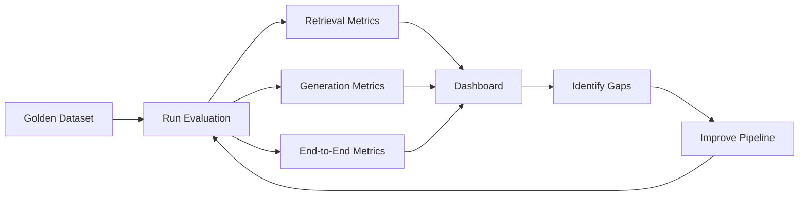

# RAG Evaluation Framework

## Why Evaluation Matters

You cannot improve what you cannot measure. RAG evaluation is the systematic process of measuring how well your RAG system performs, identifying weaknesses, and tracking improvements over time.

In banking, evaluation is not optional -- it is a compliance requirement. Regulators expect evidence that AI systems provide accurate, consistent, and non-discriminatory responses.

## Evaluation Framework Overview



## Golden Dataset

A golden dataset consists of query-answer pairs with known correct answers and relevant source documents.

### Creating a Golden Dataset

```python
from dataclasses import dataclass
from typing import List

@dataclass
class GoldenQuery:
    query: str
    category: str  # factual, procedural, comparative, multi_part
    relevant_doc_ids: List[str]  # Documents that should be retrieved
    relevant_section: List[str]  # Specific sections within documents
    expected_answer: str  # Ground truth answer
    answer_type: str  # single_fact, list, explanation, procedural
    difficulty: str  # easy, medium, hard
    banking_domain: str  # retail, corporate, compliance, wealth

# Example golden queries for banking
golden_queries = [
    GoldenQuery(
        query="What is the processing fee for a personal loan?",
        category="factual",
        relevant_doc_ids=["POL-RTL-001"],
        relevant_section=["4.1 - Fees and Charges"],
        expected_answer="1.5% of loan amount, min $500, max $5,000",
        answer_type="single_fact",
        difficulty="easy",
        banking_domain="retail"
    ),
    GoldenQuery(
        query="Compare the eligibility criteria for personal loans vs business loans",
        category="comparative",
        relevant_doc_ids=["POL-RTL-001", "POL-CORP-003"],
        relevant_section=["3.2 - Eligibility", "2.1 - Requirements"],
        expected_answer="Personal: age 21+, income $30K+. Business: 2+ years, revenue $100K+.",
        answer_type="explanation",
        difficulty="hard",
        banking_domain="retail"
    ),
]
```

### Golden Dataset Size

| Dataset Size | Use Case | Effort to Create |
|---|---|---|
| 50-100 queries | Initial validation, smoke tests | 1-2 days |
| 200-500 queries | Regular evaluation, A/B testing | 1-2 weeks |
| 1000+ queries | Comprehensive evaluation, regression testing | 1-2 months |

**Banking recommendation**: Start with 100 queries covering all major document types and categories. Grow to 500+ over time.

### Generating Golden Queries with LLM Assistance

```python
def generate_golden_queries_from_documents(documents: list, llm) -> list[dict]:
    """Use LLM to suggest golden queries from documents."""
    
    for doc in documents:
        prompt = f"""Based on the following banking policy document, generate 5 test questions
        that an employee might ask. Include the answer that should be returned.

        Document: {doc.metadata['doc_title']}
        Content: {doc.page_content[:3000]}

        For each question, provide:
        1. The question
        2. The expected answer
        3. The section where the answer is found
        4. Difficulty (easy/medium/hard)
        5. Category (factual/procedural/comparative/multi_part)"""
        
        response = llm.generate(prompt)
        # Parse response into GoldenQuery objects
        # ALWAYS have human review before adding to golden dataset
```

## Evaluation Metrics

### Retrieval Metrics

| Metric | What It Measures | Target |
|---|---|---|
| **Precision@K** | % of retrieved docs that are relevant | > 0.70 |
| **Recall@K** | % of all relevant docs that were retrieved | > 0.60 |
| **MRR** | How early the first relevant doc appears | > 0.60 |
| **NDCG@K** | Ranking quality (relevant docs ranked higher) | > 0.70 |
| **Hit Rate@K** | % of queries with at least 1 relevant result | > 0.90 |

### Generation Metrics

| Metric | What It Measures | Target |
|---|---|---|
| **Faithfulness** | % of claims in response supported by context | > 0.85 |
| **Answer Relevance** | How well the response answers the query | > 0.80 |
| **Context Precision** | % of retrieved context that was actually used | > 0.60 |
| **Groundedness** | Overall grounding quality of response | > 0.85 |

### End-to-End Metrics

| Metric | What It Measures | Target |
|---|---|---|
| **Answer Accuracy** | % of responses matching expected answers | > 0.80 |
| **Response Latency P95** | 95th percentile response time | < 3000ms |
| **Hallucination Rate** | % of responses with hallucinated content | < 5% |
| **User Satisfaction** | User ratings of responses | > 4.0/5.0 |

## Evaluation Pipeline

```python
class RAGEvaluator:
    def __init__(self, rag_pipeline, golden_queries):
        self.pipeline = rag_pipeline
        self.golden_queries = golden_queries
    
    def evaluate(self) -> dict:
        """Run full evaluation suite."""
        
        results = {
            "retrieval": {},
            "generation": {},
            "end_to_end": {},
            "latency": {},
            "per_category": {},
        }
        
        all_retrieval_scores = []
        all_generation_scores = []
        all_accuracy_scores = []
        all_latencies = []
        category_scores = {}
        
        for gq in self.golden_queries:
            # Run the pipeline
            start_time = time.time()
            response = self.pipeline.query(gq.query)
            latency = time.time() - start_time
            all_latencies.append(latency)
            
            # Evaluate retrieval
            retrieval_score = self._evaluate_retrieval(gq, response.retrieved_docs)
            all_retrieval_scores.append(retrieval_score)
            
            # Evaluate generation
            gen_score = self._evaluate_generation(gq, response.text)
            all_generation_scores.append(gen_score)
            
            # Evaluate end-to-end accuracy
            accuracy = self._evaluate_accuracy(gq, response.text)
            all_accuracy_scores.append(accuracy)
            
            # Category tracking
            category = gq.category
            if category not in category_scores:
                category_scores[category] = {"accuracy": [], "retrieval": []}
            category_scores[category]["accuracy"].append(accuracy)
            category_scores[category]["retrieval"].append(retrieval_score["precision_at_4"])
        
        # Aggregate
        results["retrieval"] = {
            "precision_at_4": np.mean([s["precision_at_4"] for s in all_retrieval_scores]),
            "recall_at_4": np.mean([s["recall_at_4"] for s in all_retrieval_scores]),
            "mrr": np.mean([s["mrr"] for s in all_retrieval_scores]),
            "ndcg_at_4": np.mean([s["ndcg_at_4"] for s in all_retrieval_scores]),
        }
        
        results["generation"] = {
            "faithfulness": np.mean([s["faithfulness"] for s in all_generation_scores]),
            "answer_relevance": np.mean([s["answer_relevance"] for s in all_generation_scores]),
        }
        
        results["end_to_end"] = {
            "accuracy": np.mean(all_accuracy_scores),
            "hallucination_rate": np.mean([s["hallucination_rate"] for s in all_generation_scores]),
        }
        
        results["latency"] = {
            "mean_ms": np.mean(all_latencies) * 1000,
            "p50_ms": np.percentile(all_latencies, 50) * 1000,
            "p95_ms": np.percentile(all_latencies, 95) * 1000,
            "p99_ms": np.percentile(all_latencies, 99) * 1000,
        }
        
        results["per_category"] = {
            cat: {
                "accuracy": np.mean(scores["accuracy"]),
                "retrieval_precision": np.mean(scores["retrieval"])
            }
            for cat, scores in category_scores.items()
        }
        
        return results
```

## Using RAGAS Framework

RAGAS (RAG Assessment) is a popular open-source framework for RAG evaluation.

```python
from ragas import evaluate
from ragas.metrics import faithfulness, answer_relevance, context_precision, context_recall
from datasets import Dataset

# Prepare data
data = {
    "question": [gq.query for gq in golden_queries],
    "answer": [responses[i].text for i in range(len(golden_queries))],
    "contexts": [[doc.page_content for doc in responses[i].retrieved_docs] 
                 for i in range(len(golden_queries))],
    "ground_truth": [gq.expected_answer for gq in golden_queries]
}

dataset = Dataset.from_dict(data)

# Evaluate
result = evaluate(
    dataset,
    metrics=[faithfulness, answer_relevance, context_precision, context_recall]
)

print(result)
```

### RAGAS Metrics Explained

| Metric | Description | Score Range |
|---|---|---|
| **Faithfulness** | Claims in answer are supported by context | 0-1 |
| **Answer Relevance** | Answer actually addresses the question | 0-1 |
| **Context Precision** | Retrieved context contains the answer | 0-1 |
| **Context Recall** | All necessary context was retrieved | 0-1 |

## Using LLM-as-Judge

For evaluation where a human-level assessment is needed:

```python
def llm_judge(query: str, expected: str, actual: str, llm) -> dict:
    """Use LLM to evaluate answer quality."""
    
    prompt = f"""Evaluate the following answer to the question.

Question: {query}

Expected Answer: {expected}

Actual Answer: {actual}

Rate on a scale of 1-5 for each criterion:
1. Correctness: Is the factual information accurate?
2. Completeness: Does it cover all important aspects?
3. Conciseness: Is it appropriately detailed without unnecessary information?

Also note any specific factual errors or missing important information.

Respond in JSON: {{"correctness": N, "completeness": N, "conciseness": N, "errors": [...], "missing": [...]}}"""
    
    response = llm.generate(prompt)
    return parse_json(response)
```

## Automated Evaluation with Golden Answers

```python
def semantic_similarity_answer(expected: str, actual: str, embedding_model) -> float:
    """Check if the actual answer is semantically similar to expected."""
    emb_expected = embedding_model.encode(expected)
    emb_actual = embedding_model.encode(actual)
    
    from sklearn.metrics.pairwise import cosine_similarity
    return cosine_similarity([emb_expected], [emb_actual])[0][0]

def key_fact_match(expected: str, actual: str) -> bool:
    """Extract key facts (numbers, dates, names) and check they match."""
    # Extract numbers
    expected_numbers = set(re.findall(r'\d+\.?\d*%?', expected))
    actual_numbers = set(re.findall(r'\d+\.?\d*%?', actual))
    
    # Check key numbers match
    for num in expected_numbers:
        if num not in actual_numbers:
            return False
    
    return True
```

## Evaluation Dashboard

```python
import plotly.graph_objects as go
import plotly.express as px

def create_evaluation_dashboard(results: dict):
    """Create visual dashboard of evaluation results."""
    
    fig = go.Figure()
    
    # Radar chart for all metrics
    metrics = [
        "Retrieval P@4", "Retrieval MRR", "Faithfulness", 
        "Answer Relevance", "Accuracy", "1-Hallucination"
    ]
    values = [
        results["retrieval"]["precision_at_4"],
        results["retrieval"]["mrr"],
        results["generation"]["faithfulness"],
        results["generation"]["answer_relevance"],
        results["end_to_end"]["accuracy"],
        1 - results["end_to_end"]["hallucination_rate"],
    ]
    
    fig = go.Figure()
    fig.add_trace(go.Scatterpolar(
        r=values,
        theta=metrics,
        fill='toself',
        name='Current'
    ))
    
    fig.update_layout(polar=dict(radialaxis=dict(visible=True, range=[0, 1])))
    fig.show()
    
    # Per-category bar chart
    categories = list(results["per_category"].keys())
    accuracies = [results["per_category"][c]["accuracy"] for c in categories]
    
    fig2 = px.bar(x=categories, y=accuracies, 
                  title="Accuracy by Query Category",
                  labels={"x": "Category", "y": "Accuracy"})
    fig2.show()
```

## Regression Testing

Every pipeline change should be validated against the golden dataset.

```python
def regression_test(old_results: dict, new_results: dict, 
                    thresholds: dict = None) -> dict:
    """Check if new pipeline is at least as good as old."""
    
    if thresholds is None:
        thresholds = {
            "retrieval_precision": -0.05,  # Can drop by at most 5%
            "accuracy": -0.03,
            "faithfulness": -0.05,
            "latency_p95_ms": 500,  # Can increase by at most 500ms
        }
    
    regressions = []
    improvements = []
    
    if new_results["retrieval"]["precision_at_4"] < old_results["retrieval"]["precision_at_4"] + thresholds["retrieval_precision"]:
        regressions.append("retrieval_precision dropped significantly")
    
    if new_results["end_to_end"]["accuracy"] < old_results["end_to_end"]["accuracy"] + thresholds["accuracy"]:
        regressions.append("accuracy dropped significantly")
    
    if new_results["generation"]["faithfulness"] < old_results["generation"]["faithfulness"] + thresholds["faithfulness"]:
        regressions.append("faithfulness dropped significantly")
    
    if new_results["latency"]["p95_ms"] > old_results["latency"]["p95_ms"] + thresholds["latency_p95_ms"]:
        regressions.append("latency increased significantly")
    
    return {
        "passed": len(regressions) == 0,
        "regressions": regressions,
        "old": old_results,
        "new": new_results
    }
```

## Evaluation Frequency

| Type | Frequency | Scope |
|---|---|---|
| Smoke test | Every deployment | 20-50 critical queries |
| Full evaluation | Every pipeline change | Full golden dataset (200+) |
| Quarterly review | Quarterly | Expanded dataset, human review |
| Incident-driven | After user complaints | Specific failure cases |

## Banking Compliance Requirements for Evaluation

1. **Document evaluation results**: Store all evaluation runs with timestamps
2. **Track model versions**: Record which LLM, embedding model, and retrieval config was used
3. **Human review sample**: Have human experts review 50+ responses quarterly
4. **Bias testing**: Test across different demographics and document types
5. **Adversarial testing**: Test with deliberately tricky or edge-case queries
6. **Drift monitoring**: Re-evaluate monthly as documents change

```python
# Evaluation result logging for compliance
evaluation_log = {
    "evaluation_id": str(uuid.uuid4()),
    "timestamp": datetime.utcnow().isoformat(),
    "pipeline_version": "2.3.1",
    "llm_model": "gpt-4o-mini",
    "embedding_model": "text-embedding-3-large",
    "retrieval_config": "hybrid_reranked_k20_final4",
    "golden_dataset_version": "v12",
    "golden_dataset_size": 350,
    "results": { ... },  # Full results
    "evaluator": "automated",
    "human_reviewer": None,  # Or name if human reviewed
    "passed": True,
}
```
