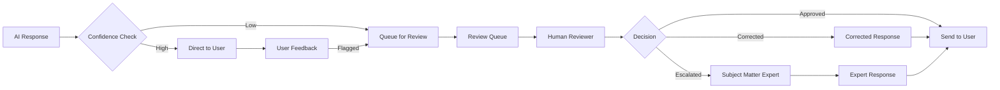

# Human Review Workflows

## Why Human Review Is Essential

Even the best RAG system makes mistakes. In banking, where incorrect information can lead to regulatory violations and customer harm, human review is a critical safety net.

**What needs human review:**
- Low-confidence AI responses
- High-stakes queries (compliance, legal, customer-facing advice)
- New or changed policy areas
- User-flagged incorrect responses
- Periodic quality sampling

## Review Workflow Architecture



## Confidence-Based Routing

```python
from enum import Enum

class ConfidenceLevel(Enum):
    HIGH = "high"          # > 0.85 - direct response
    MEDIUM = "medium"      # 0.60-0.85 - response with disclaimer
    LOW = "low"            # 0.40-0.60 - queue for review
    VERY_LOW = "very_low"  # < 0.40 - block, escalate

class ResponseRouter:
    """Route responses based on confidence scoring."""
    
    def __init__(self, review_queue_db, escalation_service):
        self.review_queue = review_queue_db
        self.escalation = escalation_service
    
    def route(self, query: str, response: str, sources: list,
              confidence_scores: dict, user_id: str,
              query_category: str) -> dict:
        """Route response based on confidence."""
        
        overall_confidence = self._calculate_overall_confidence(confidence_scores)
        
        if overall_confidence >= 0.85:
            return {
                "action": "direct_response",
                "response": response,
                "confidence": overall_confidence,
                "reviewed": False,
            }
        
        elif overall_confidence >= 0.60:
            return {
                "action": "response_with_disclaimer",
                "response": response,
                "disclaimer": "This answer is based on available documents. Please verify with your manager or the policy team if this is for a customer-facing decision.",
                "confidence": overall_confidence,
                "reviewed": False,
            }
        
        elif overall_confidence >= 0.40:
            # Queue for review
            review_ticket = self._create_review_ticket(
                query=query,
                response=response,
                sources=sources,
                confidence=overall_confidence,
                user_id=user_id,
                category=query_category,
                priority="normal"
            )
            
            return {
                "action": "queued_for_review",
                "ticket_id": review_ticket["id"],
                "message": "Your question has been queued for review by a banking specialist. Expected response time: 2-4 hours.",
                "confidence": overall_confidence,
            }
        
        else:
            # Escalate to subject matter expert
            escalation_ticket = self._create_escalation_ticket(
                query=query,
                response=response,
                sources=sources,
                confidence=overall_confidence,
                user_id=user_id,
                category=query_category
            )
            
            return {
                "action": "escalated",
                "ticket_id": escalation_ticket["id"],
                "message": "Your question requires expert review. A specialist will respond within 24 hours.",
                "confidence": overall_confidence,
            }
    
    def _calculate_overall_confidence(self, scores: dict) -> float:
        """Calculate overall confidence from multiple signals."""
        
        retrieval_confidence = scores.get("retrieval_score", 0.5)
        groundedness = scores.get("groundedness_score", 0.5)
        re_rank_score = scores.get("rerank_score", 0.5)
        
        # Weighted combination
        weights = {
            "retrieval": 0.3,
            "groundedness": 0.5,  # Most important
            "rerank": 0.2,
        }
        
        overall = (
            weights["retrieval"] * retrieval_confidence +
            weights["groundedness"] * groundedness +
            weights["rerank"] * re_rank_score
        )
        
        return overall
```

## Review Queue Management

```python
class ReviewQueue:
    """Manage human review queue."""
    
    def __init__(self, db_connection):
        self.db = db_connection
    
    def create_ticket(self, query: str, response: str, sources: list,
                      confidence: float, user_id: str, category: str,
                      priority: str = "normal") -> dict:
        """Create a review ticket."""
        
        ticket_id = str(uuid.uuid4())
        
        # Determine SLA based on priority and category
        sla_hours = self._calculate_sla(priority, category)
        
        self.db.execute("""
            INSERT INTO review_tickets (
                ticket_id, query, ai_response, sources, confidence,
                user_id, category, priority, status, created_at,
                sla_deadline, assigned_to
            ) VALUES (%s, %s, %s, %s, %s, %s, %s, %s, 'pending', %s, %s, NULL)
        """, (
            ticket_id, query, response, json.dumps(sources), confidence,
            user_id, category, priority, datetime.utcnow(),
            datetime.utcnow() + timedelta(hours=sla_hours)
        ))
        
        return {
            "id": ticket_id,
            "query": query,
            "priority": priority,
            "sla_hours": sla_hours,
        }
    
    def _calculate_sla(self, priority: str, category: str) -> int:
        """Calculate SLA in hours."""
        base_sla = {"high": 1, "normal": 4, "low": 24}
        category_multiplier = {"compliance": 0.5, "legal": 0.5, "general": 1.0}
        
        base = base_sla.get(priority, 4)
        multiplier = category_multiplier.get(category, 1.0)
        
        return max(1, int(base * multiplier))
    
    def get_next_ticket(self, reviewer_id: str) -> dict:
        """Get next ticket for a reviewer."""
        
        # Priority order: high -> normal -> low, then by wait time
        ticket = self.db.query("""
            SELECT * FROM review_tickets
            WHERE status = 'pending'
              AND (assigned_to IS NULL OR assigned_to = %s)
            ORDER BY 
                CASE priority 
                    WHEN 'high' THEN 1 
                    WHEN 'normal' THEN 2 
                    WHEN 'low' THEN 3 
                END,
                created_at ASC
            LIMIT 1
            FOR UPDATE SKIP LOCKED
        """, (reviewer_id,))
        
        if ticket:
            # Assign to reviewer
            self.db.execute("""
                UPDATE review_tickets 
                SET assigned_to = %s, status = 'in_review', started_at = %s
                WHERE ticket_id = %s
            """, (reviewer_id, datetime.utcnow(), ticket[0]["ticket_id"]))
        
        return ticket[0] if ticket else None
    
    def submit_review(self, ticket_id: str, reviewer_id: str,
                      decision: str, corrected_response: str = None,
                      notes: str = None) -> dict:
        """Submit a review decision."""
        
        self.db.execute("""
            UPDATE review_tickets
            SET status = %s,
                decision = %s,
                corrected_response = %s,
                reviewer_notes = %s,
                reviewed_at = %s,
                reviewed_by = %s
            WHERE ticket_id = %s
        """, (
            "approved" if decision == "approved" else "corrected",
            decision,
            corrected_response,
            notes,
            datetime.utcnow(),
            reviewer_id,
            ticket_id
        ))
        
        # Notify the original user
        self._notify_user(ticket_id, decision, corrected_response)
        
        return {"ticket_id": ticket_id, "decision": decision}
```

## Reviewer Interface

```python
class ReviewerInterface:
    """Interface for human reviewers."""
    
    def render_review_ticket(self, ticket: dict) -> dict:
        """Render ticket for reviewer with all context."""
        
        return {
            "ticket_id": ticket["ticket_id"],
            "query": ticket["query"],
            "ai_response": ticket["ai_response"],
            "sources": ticket["sources"],  # Original source documents
            "confidence": ticket["confidence"],
            "user_id": ticket["user_id"],
            "category": ticket["category"],
            "priority": ticket["priority"],
            "wait_time_minutes": (
                datetime.utcnow() - ticket["created_at"]
            ).total_seconds() / 60,
            "sla_remaining_hours": (
                ticket["sla_deadline"] - datetime.utcnow()
            ).total_seconds() / 3600,
            "suggested_actions": self._suggest_actions(ticket),
        }
    
    def _suggest_actions(self, ticket: dict) -> list[str]:
        """Suggest review actions based on ticket characteristics."""
        
        actions = []
        
        if ticket["confidence"] < 0.5:
            actions.append("Verify all factual claims against source documents")
        
        if ticket["category"] in ("compliance", "legal"):
            actions.append("Cross-reference with latest regulatory guidance")
        
        if ticket["category"] == "compliance" and "deadline" in ticket["query"].lower():
            actions.append("Verify regulatory deadlines are current")
        
        if any(num in ticket["ai_response"] for num in ["%", "$"]):
            actions.append("Verify all numbers and percentages against source")
        
        if len(ticket["sources"]) == 0:
            actions.append("No source documents found - search knowledge base manually")
        
        return actions
```

## Quality Sampling

Even high-confidence responses should be periodically reviewed.

```python
class QualitySampler:
    """Randomly sample responses for quality review."""
    
    def __init__(self, db, sample_rate: float = 0.05):
        self.db = db
        self.sample_rate = sample_rate  # 5% of responses
    
    def should_sample(self) -> bool:
        """Decide whether to sample this interaction."""
        return random.random() < self.sample_rate
    
    def create_review_ticket(self, interaction: dict) -> dict:
        """Create review ticket for sampled interaction."""
        
        ticket = {
            "ticket_id": str(uuid.uuid4()),
            "type": "quality_sample",
            "query": interaction["query"],
            "ai_response": interaction["response"],
            "sources": interaction["sources"],
            "user_id": interaction["user_id"],
            "timestamp": interaction["timestamp"],
            "priority": "low",  # Quality samples are low priority
        }
        
        self.db.execute("""
            INSERT INTO review_tickets (
                ticket_id, type, query, ai_response, sources, 
                user_id, priority, status, created_at
            ) VALUES (%s, 'quality_sample', %s, %s, %s, %s, 'low', 'pending', %s)
        """, (
            ticket["ticket_id"], ticket["query"], ticket["ai_response"],
            json.dumps(ticket["sources"]), ticket["user_id"],
            datetime.utcnow()
        ))
        
        return ticket
```

## Escalation to Subject Matter Experts

```python
class EscalationService:
    """Escalate complex queries to subject matter experts."""
    
    def __init__(self, db, expert_mapping: dict):
        self.db = db
        # {"compliance": ["expert1", "expert2"], "legal": ["expert3"], ...}
        self.expert_mapping = expert_mapping
    
    def escalate(self, query: str, category: str, ai_response: str,
                 user_id: str) -> dict:
        """Escalate to appropriate SME."""
        
        experts = self.expert_mapping.get(category, ["general_expert"])
        
        escalation = {
            "escalation_id": str(uuid.uuid4()),
            "query": query,
            "category": category,
            "ai_response": ai_response,
            "user_id": user_id,
            "assigned_expert": experts[0],  # Round-robin in practice
            "created_at": datetime.utcnow(),
            "sla_hours": 24,  # Escalations get 24-hour SLA
        }
        
        self.db.execute("""
            INSERT INTO escalations (
                escalation_id, query, category, ai_response, user_id,
                assigned_expert, status, created_at, sla_deadline
            ) VALUES (%s, %s, %s, %s, %s, %s, 'pending', %s, %s)
        """, (
            escalation["escalation_id"], escalation["query"],
            escalation["category"], escalation["ai_response"],
            escalation["user_id"], escalation["assigned_expert"],
            escalation["created_at"],
            escalation["created_at"] + timedelta(hours=escalation["sla_hours"])
        ))
        
        # Notify expert
        notify_expert(escalation["assigned_expert"], escalation)
        
        return escalation
```

## Learning from Human Reviews

```python
def analyze_review_patterns(db, days: int = 30) -> dict:
    """Analyze patterns in human reviews to identify systemic issues."""
    
    reviews = db.query("""
        SELECT category, decision, confidence,
               COUNT(*) as count
        FROM review_tickets
        WHERE reviewed_at > %s
        GROUP BY category, decision, confidence
    """, (datetime.utcnow() - timedelta(days=days),))
    
    # Category-wise correction rates
    category_stats = {}
    for row in reviews:
        cat = row["category"]
        if cat not in category_stats:
            category_stats[cat] = {"total": 0, "corrected": 0, "approved": 0}
        
        category_stats[cat]["total"] += row["count"]
        if row["decision"] == "corrected":
            category_stats[cat]["corrected"] += row["count"]
        else:
            category_stats[cat]["approved"] += row["count"]
    
    # Calculate correction rates
    for cat, stats in category_stats.items():
        stats["correction_rate"] = stats["corrected"] / max(stats["total"], 1)
    
    # Identify problematic categories
    high_correction = [
        cat for cat, stats in category_stats.items()
        if stats["correction_rate"] > 0.3  # > 30% correction rate
    ]
    
    return {
        "category_stats": category_stats,
        "high_correction_categories": high_correction,
        "total_reviews": sum(s["total"] for s in category_stats.values()),
        "overall_correction_rate": (
            sum(s["corrected"] for s in category_stats.values()) /
            max(sum(s["total"] for s in category_stats.values()), 1)
        )
    }
```

## Best Practices

1. **Set clear SLAs**: Define response time expectations by priority
2. **Route by expertise**: Match tickets to reviewers with relevant domain knowledge
3. **Track correction patterns**: High correction rates in a category signal a systemic issue
4. **Feedback loop to RAG**: Feed corrections back into the system to improve future responses
5. **Quality sample is mandatory**: Don't rely only on low-confidence routing
6. **Reviewer training**: Train reviewers on what to look for and how to correct
7. **Escalation path**: Have clear escalation paths for queries no reviewer can answer
8. **Audit trail**: Log every review decision for compliance
9. **Reviewer workload balancing**: Distribute tickets evenly across available reviewers
10. **Measure reviewer performance**: Track accuracy and throughput per reviewer
