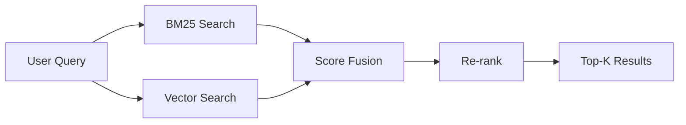

# Hybrid Search

## What Is Hybrid Search?

Hybrid search combines two complementary retrieval approaches:
1. **BM25 (keyword search)**: Finds exact term matches using term frequency and inverse document frequency
2. **Vector search (semantic search)**: Finds conceptually similar content using embeddings



**Why combine them?** Each approach catches what the other misses:

| Scenario | BM25 Catches | Vector Catches |
|---|---|---|
| "processing fee" vs "processing charges" | No (different words) | Yes (semantic similarity) |
| "REG-E compliance" | Yes (exact term) | Maybe (depends on training) |
| "loan ID LN-2024-0451" | Yes (exact match) | No (no semantic meaning) |
| "how to apply for mortgage" | Partial | Yes (semantic intent) |
| "KYC documentation" | Yes (exact term) | Yes ("know your customer docs") |

In banking, you need both. Product codes, regulation names, and specific terminology require exact matching. Conceptual questions about policies and procedures benefit from semantic matching.

## BM25 Explained

BM25 (Best Matching 25) scores documents based on:

```
score(D, Q) = SUM over qi in Q of:
    IDF(qi) * (f(qi, D) * (k1 + 1)) / (f(qi, D) + k1 * (1 - b + b * |D| / avgdl))
```

Where:
- `f(qi, D)`: Term frequency of qi in document D
- `IDF(qi)`: Inverse document frequency (rarer terms score higher)
- `|D|`: Document length
- `avgdl`: Average document length
- `k1`: Term frequency saturation (typically 1.2-2.0)
- `b`: Length normalization (typically 0.75)

**Intuition**: Terms that appear frequently in a document but rarely across all documents get the highest scores. Shorter documents with the term get higher scores than longer ones.

### BM25 Implementation

```python
from rank_bm25 import BM25Okapi
import nltk

class BM25Searcher:
    def __init__(self, documents: list[str]):
        # Tokenize documents
        self.tokenized_docs = [
            nltk.word_tokenize(doc.lower()) 
            for doc in documents
        ]
        self.bm25 = BM25Okapi(self.tokenized_docs)
        self.documents = documents
    
    def search(self, query: str, k: int = 20) -> list[tuple[float, int]]:
        """Search and return (score, doc_index) pairs."""
        tokenized_query = nltk.word_tokenize(query.lower())
        scores = self.bm25.get_scores(tokenized_query)
        
        # Sort by score descending
        ranked = sorted(
            enumerate(scores), 
            key=lambda x: x[1], 
            reverse=True
        )
        return ranked[:k]
```

## Score Normalization and Fusion

The critical challenge: BM25 and vector search produce scores on different scales. You must normalize before combining.

### Min-Max Normalization

```python
def min_max_normalize(scores: list[float]) -> list[float]:
    """Normalize scores to [0, 1] range."""
    min_s = min(scores)
    max_s = max(scores)
    if max_s == min_s:
        return [0.5] * len(scores)
    return [(s - min_s) / (max_s - min_s) for s in scores]
```

### Reciprocal Rank Fusion (RRF)

More robust approach: use ranks instead of raw scores.

```python
def reciprocal_rank_fusion(results_list: list[list[str]], 
                           k_param: int = 60) -> dict[str, float]:
    """
    Combine multiple result lists using Reciprocal Rank Fusion.
    RRF score = sum(1 / (k + rank)) for each occurrence
    """
    rrf_scores = {}
    
    for results in results_list:
        for rank, doc_id in enumerate(results):
            if doc_id not in rrf_scores:
                rrf_scores[doc_id] = 0
            rrf_scores[doc_id] += 1.0 / (k_param + rank + 1)
    
    return rrf_scores

# Usage
def hybrid_search_rrf(query: str, bm25_searcher, vector_searcher, k: int = 10):
    """Hybrid search using RRF."""
    # Get results from each method
    bm25_results = bm25_searcher.search(query, k=k*2)
    vector_results = vector_searcher.search(query, k=k*2)
    
    # Extract doc_ids in rank order
    bm25_ids = [doc_id for _, doc_id in bm25_results]
    vector_ids = [doc_id for _, doc_id in vector_results]
    
    # RRF fusion
    combined = reciprocal_rank_fusion([bm25_ids, vector_ids])
    
    # Sort and return top-k
    sorted_results = sorted(combined.items(), key=lambda x: x[1], reverse=True)
    return sorted_results[:k]
```

### Weighted Linear Combination

```python
def weighted_fusion(bm25_results: list, vector_results: list,
                    alpha: float = 0.3, k: int = 10) -> list:
    """
    Combine BM25 and vector scores with weighted average.
    alpha = weight for BM25, (1-alpha) = weight for vector
    """
    # Normalize both score sets
    bm25_scores = min_max_normalize([s for s, _ in bm25_results])
    vector_scores = min_max_normalize([s for s, _ in vector_results])
    
    # Build score maps
    bm25_map = {doc_id: score for score, doc_id in zip(bm25_scores, [d for _, d in bm25_results])}
    vector_map = {doc_id: score for score, doc_id in zip(vector_scores, [d for _, d in vector_results])}
    
    # Combine
    all_docs = set(list(bm25_map.keys()) + list(vector_map.keys()))
    combined = {}
    for doc_id in all_docs:
        bm25_s = bm25_map.get(doc_id, 0)
        vector_s = vector_map.get(doc_id, 0)
        combined[doc_id] = alpha * bm25_s + (1 - alpha) * vector_s
    
    # Sort and return top-k
    sorted_results = sorted(combined.items(), key=lambda x: x[1], reverse=True)
    return sorted_results[:k]
```

## Alpha Tuning

The alpha parameter controls the BM25 vs. vector weight balance.

```python
def find_optimal_alpha(golden_queries, alpha_range=None):
    """Grid search for optimal alpha on golden dataset."""
    if alpha_range is None:
        alpha_range = [0.0, 0.1, 0.2, 0.3, 0.4, 0.5, 0.6, 0.7, 0.8, 0.9, 1.0]
    
    results = {}
    for alpha in alpha_range:
        scores = []
        for query in golden_queries:
            retrieved = weighted_fusion(
                bm25_search(query), vector_search(query), 
                alpha=alpha, k=4
            )
            precision = compute_precision(retrieved, query.relevant_docs)
            scores.append(precision)
        results[alpha] = sum(scores) / len(scores)
    
    best_alpha = max(results, key=results.get)
    print(f"Best alpha: {best_alpha} (P@4: {results[best_alpha]:.3f})")
    return best_alpha
```

**Typical optimal values for banking**:
- General policy Q&A: alpha = 0.3-0.4 (favor vector search)
- Document lookup (by name/code): alpha = 0.6-0.7 (favor BM25)
- Mixed workload: alpha = 0.4-0.5

## Implementing Hybrid Search in Practice

### With pgvector + PostgreSQL Full-Text Search

```python
import psycopg2
from pgvector.psycopg2 import register_vector

def hybrid_search_pgvector(query: str, connection, k: int = 10, alpha: float = 0.3):
    """Hybrid search using pgvector + PostgreSQL full-text search."""
    
    with connection.cursor() as cur:
        # BM25 approximation via full-text search (ts_rank)
        cur.execute("""
            SELECT id, content, metadata,
                   ts_rank(to_tsvector('english', content), plainto_tsquery('english', %s)) as bm25_score,
                   embedding <=> %s::vector as vector_distance
            FROM documents
            WHERE metadata->>'status' = 'active'
            ORDER BY bm25_score DESC
            LIMIT %s
        """, (query, query, k * 2))
        
        bm25_results = cur.fetchall()
        
        # Vector search
        cur.execute("""
            SELECT id, content, metadata,
                   embedding <=> %s::vector as vector_distance
            FROM documents
            WHERE metadata->>'status' = 'active'
            ORDER BY vector_distance
            LIMIT %s
        """, (query, k * 2))
        
        vector_results = cur.fetchall()
    
    # Normalize and combine
    bm25_normalized = min_max_normalize([r[3] for r in bm25_results])
    vector_normalized = min_max_normalize([1 - r[3] for r in vector_results])  # Convert distance to similarity
    
    # ... combine as above
```

### With Weaviate (Built-in Hybrid Search)

```python
import weaviate

client = weaviate.Client("http://localhost:8080")

result = (
    client.query
    .get("BankingDocuments", ["content", "doc_title", "department"])
    .with_hybrid(
        query="processing fee for personal loans",
        alpha=0.3,  # 0.3 = 70% BM25, 30% vector
        properties=["content", "doc_title"]
    )
    .with_limit(10)
    .with_where({
        "path": ["status"],
        "operator": "Equal",
        "valueString": "active"
    })
    .do()
)
```

### With Pinecone (Dense + Sparse)

```python
from pinecone import Pinecone

pc = Pinecone(api_key="...")
index = pc.Index("banking-knowledge")

# Hybrid: dense (vector) + sparse (BM25)
query_embedding = embed(query)
sparse_values = bm25_encoder.encode(query)  # Convert query to sparse representation

results = index.query(
    vector=query_embedding,
    sparse_vector={"indices": sparse_values.indices, "values": sparse_values.values},
    top_k=10,
    include_metadata=True,
    filter={"status": "active"}
)
```

## Hybrid Search with Metadata Filters

```python
def hybrid_with_metadata(query: str, user: User, k: int = 4):
    """Hybrid search with access control filtering."""
    
    # Build filter
    filter_dict = {
        "status": "active",
        "department": {"$in": user.allowed_departments},
        "min_clearance": {"$lte": user.clearance_level}
    }
    
    # BM25 with filter
    bm25_results = bm25_search(query, k=k*3, filter=filter_dict)
    
    # Vector with filter
    vector_results = vector_search(query, k=k*3, filter=filter_dict)
    
    # Combine
    return weighted_fusion(bm25_results, vector_results, alpha=0.3, k=k)
```

## Evaluation of Hybrid vs. Pure Search

### Expected Results on Banking Dataset

| Method | P@4 | MRR | NDCG@4 | Notes |
|---|---|---|---|---|
| BM25 only | 0.52 | 0.45 | 0.55 | Good for exact terms |
| Vector only | 0.58 | 0.53 | 0.62 | Good for semantics |
| Hybrid (alpha=0.3) | 0.71 | 0.66 | 0.75 | Best of both |
| Hybrid + Re-rank | 0.85 | 0.80 | 0.88 | Production standard |

### When Hybrid Matters Most

| Query Type | BM25 Score | Vector Score | Hybrid Score |
|---|---|---|---|
| "What is Regulation E?" | 0.95 | 0.70 | 0.92 |
| "Customer dispute process" | 0.40 | 0.85 | 0.72 |
| "LN-2024-0451 details" | 0.99 | 0.15 | 0.85 |
| "How do I check my loan status?" | 0.35 | 0.82 | 0.68 |
| "AML suspicious activity report filing deadline" | 0.70 | 0.75 | 0.82 |

## Production Considerations

### Performance

| Approach | Latency (P95) | Throughput | Infrastructure |
|---|---|---|---|
| BM25 only | 10-30ms | 1000+ QPS | CPU only |
| Vector only | 30-100ms | 200-500 QPS | CPU or GPU |
| Hybrid | 40-120ms | 150-400 QPS | CPU + embedding API |
| Hybrid + Re-rank | 150-400ms | 50-150 QPS | GPU for re-ranker |

### Caching

```python
# Cache hybrid search results
CACHE_TTL = 3600  # 1 hour

def cached_hybrid_search(query: str, user_roles: tuple, k: int = 4):
    cache_key = f"hybrid:{hashlib.md5(query.encode()).hexdigest()}:{user_roles}:{k}"
    
    cached = redis.get(cache_key)
    if cached:
        return json.loads(cached)
    
    results = hybrid_search(query, user_roles, k)
    redis.setex(cache_key, CACHE_TTL, json.dumps(results))
    return results
```

### Monitoring

Track the contribution of each component:
```python
def log_hybrid_metrics(query, bm25_top_ids, vector_top_ids, final_ids):
    """Log what proportion came from each source."""
    bm25_overlap = len(set(final_ids) & set(bm25_top_ids)) / len(final_ids)
    vector_overlap = len(set(final_ids) & set(vector_top_ids)) / len(final_ids)
    
    metrics.log("hybrid_bm25_contribution", bm25_overlap)
    metrics.log("hybrid_vector_contribution", vector_overlap)
    
    # If one component dominates consistently, adjust alpha
    if bm25_overlap > 0.9:
        logger.warning("BM25 dominating hybrid results for recent queries")
    if vector_overlap > 0.9:
        logger.warning("Vector dominating hybrid results for recent queries")
```

## Common Pitfalls

1. **Not normalizing scores**: Raw BM25 and vector scores are on incompatible scales. Always normalize before combining.

2. **Wrong alpha**: Default 0.5 is rarely optimal. Tune on your data.

3. **Filtering after fusion**: Apply metadata filters to each component separately before fusion, not after.

4. **Ignoring query type**: Some queries are inherently keyword-heavy (product codes), others semantic (procedural questions). Consider routing by query type.

5. **Not re-evaluating**: As your document corpus grows, the optimal alpha may shift. Re-evaluate quarterly.

## When to Skip Hybrid Search

Skip hybrid (use vector-only) when:
- Document collection < 5K chunks
- All queries are conceptual (no product codes, regulation names)
- Infrastructure constraints prevent running BM25

Skip hybrid (use BM25-only) when:
- Documents are highly structured (FAQs with exact Q&A pairs)
- Semantic embeddings perform poorly on your domain
- Infrastructure is CPU-only and embedding models are too slow
