# Case Study: Compliance Audit Failure Due to Missing Audit Logs

## Executive Summary

During a scheduled regulatory audit by the Financial Conduct Authority (FCA), the bank failed to produce required audit logs for its GenAI-powered customer advisory system. The audit revealed that 14 months of AI-generated financial advice had no immutable audit trail, violating FCA Principles for Businesses (PRIN) and Senior Management Arrangements, Systems and Controls (SYSC) requirements. The failure resulted in a formal enforcement action, a required remediation program, and a restriction on expanding AI-powered advisory services until compliance was demonstrated.

**Severity:** SEV-1 (Regulatory Compliance Failure)
**Duration:** 14 months of unlogged AI advice
**Regulatory body:** Financial Conduct Authority (FCA)
**Regulations violated:** FCA PRIN, SYSC, GDPR Article 22 (automated decision-making)
**Financial impact:** £2.1M (fines + remediation costs)
**Business impact:** Restriction on GenAI advisory service expansion for 8 months

---

## Background and Context

### The System

"WealthAdvisor AI" is a GenAI-powered financial advisory chatbot that provides:
- Investment recommendations based on customer risk profiles
- Portfolio rebalancing suggestions
- Market commentary and analysis
- Retirement planning guidance
- General financial education

### Regulatory Requirements

The system was subject to:
1. **FCA PRIN 2.1.1**: Adequate record-keeping for all customer interactions
2. **FCA SYSC 4.1.1**: Systems and controls to ensure compliance with regulatory requirements
3. **FCA COBS 2.1.1**: Clear, fair, and not misleading communications
4. **GDPR Article 22**: Right to human review of automated decisions
5. **MiFID II Article 16**: Recording of telephone and electronic communications

### What Was Logged

The system logged:
- User session start/end times
- API request/response pairs (stored in Elasticsearch)
- LLM prompt and response (stored in PostgreSQL)
- Tool invocations (market data lookups, portfolio calculations)

### What Was NOT Logged (The Gap)

Missing from the audit trail:
1. **Model version and configuration** used for each response
2. **Retrieved context documents** (RAG retrieval results)
3. **Model confidence scores** and alternative response candidates
4. **Temperature and sampling parameters** used
5. **System prompt version** (changed 23 times without versioning)
6. **Agent/employee access logs** (which support staff viewed which conversations)
7. **Data retention policy enforcement** (logs were auto-deleted after 90 days, but regulation requires 5 years)
8. **Customer consent records** for AI-based advice

---

## Timeline of Events

```mermaid
timeline
    title Compliance Audit Failure Timeline
    section 14 Months Before Audit
        System launch : WealthAdvisor AI launched<br/>with incomplete logging
        : No compliance review<br/>of logging requirements
        : Legal team assumed<br/>engineering had adequate logs
        : Engineering assumed<br/>legal defined requirements
    section During the 14 Months
        Month 3 : System prompt changed<br/>without versioning
        Month 5 : Model upgraded from<br/>GPT-4 to GPT-4-Turbo,<br/>no version tracking
        Month 8 : RAG context source<br/>expanded, no logging<br/>of retrieved documents
        Month 11 : Auto-deletion policy<br/>deletes first 2 months<br/>of logs (undiscovered)
        Month 14 : Log retention bug<br/>discovered but not<br/>prioritized for fix
    section Audit Preparation
        T-60 days : Audit notification<br/>received from FCA
        : Compliance team begins<br/>evidence gathering
        T-30 days : Compliance requests<br/>sample of AI advice logs<br/>with full audit trail
        T-28 days : Engineering discovers<br/>missing audit trail components
        : Panic: 14 months of<br/>incomplete records
        T-25 days : Emergency meeting:<br/>legal, compliance,<br/>engineering, security
        T-20 days : Attempt to reconstruct<br/>missing logs from<br/>partial data (limited success)
    section The Audit
        T-0 : Audit begins<br/>FCA examiner arrives
        T+2 days : Examiner requests<br/>audit trail sample for<br/>50 AI advice interactions
        T+3 days : Engineering produces<br/>partial logs, missing<br/>key audit trail components
        T+5 days : Examiner identifies<br/>gaps: no model version,<br/>no retrieved context, no consent records
        T+7 days : Examiner requests<br/>evidence of systematic<br/>record-keeping controls
        T+8 days : Cannot produce evidence:<br/>no log retention policy<br/>enforcement, no versioning
        T+10 days : Formal finding:<br/>inadequate audit trail<br/>for AI advisory system
    section Post-Audit
        T+15 days : Enforcement action<br/>issued by FCA
        : £2.1M fine + mandatory<br/>remediation program
        : Restriction on expanding<br/>AI advisory services
        T+30 days : Remediation program<br/>begins
        T+8 months : Remediation complete,<br/>restriction lifted
```



### The Discovery

The gap was discovered when the compliance team asked engineering for:

> "A sample of 50 customer interactions with WealthAdvisor AI from the past 6 months, including the full audit trail: what advice was given, what model version generated it, what data was used to generate it, and whether the customer consented to AI-based advice."

Engineering could provide:
- The advice given (from PostgreSQL)
- The timestamp (from Elasticsearch)

Engineering could NOT provide:
- Model version (changed without tracking)
- Retrieved context documents (not logged)
- System prompt version (not versioned)
- Customer consent records (not captured)
- Confidence scores (not recorded)
- Whether the same advice would be generated today (no reproducibility)

---

## Root Cause Analysis

### Technical Root Causes

1. **Incomplete Logging Design**
   - Logs were designed for debugging, not for regulatory compliance
   - Engineering defined logging requirements without compliance team input
   - No regulatory requirements mapping in the logging architecture

2. **No Model Versioning**
   - Model upgrades (GPT-4 -> GPT-4-Turbo) were not tracked per-interaction
   - System prompt changes were not versioned
   - Temperature/sampling parameters were not recorded

3. **Missing Context Logging**
   - RAG retrieval results (the "augmented" part of RAG) were not logged
   - Without retrieved context, advice cannot be reproduced or validated
   - No way to determine if advice was based on outdated or incorrect information

4. **Auto-Deletion Policy**
   - Logs were automatically deleted after 90 days (default infrastructure policy)
   - Regulatory requirement is 5 years for financial advice records
   - The conflict was never identified

5. **No Consent Tracking**
   - Customer consent for AI-based advice was not explicitly captured or logged
   - GDPR Article 22 requires explicit consent for automated decision-making
   - No evidence that customers were informed they were interacting with AI

### Organizational Root Causes

1. **Assumption Gap**
   - Legal assumed engineering had adequate logs
   - Engineering assumed legal defined requirements
   - Nobody owned the intersection of technical logging and regulatory requirements

2. **No Compliance Review at Launch**
   - The system launched without a formal compliance review of logging requirements
   - Compliance was consulted for the advisory content (financial advice accuracy) but not for record-keeping

3. **Regulatory Knowledge Gap**
   - Engineering team was not aware of FCA record-keeping requirements for AI systems
   - No regulatory technology (RegTech) specialist was involved in the design

4. **Priority Misalignment**
   - When the log retention bug was discovered at Month 14, it was classified as "low priority"
   - The business impact (regulatory non-compliance) was not understood

---

## What Went Wrong Technically

### The Logging Architecture (Before)

```python
# WHAT WAS LOGGED:
def log_interaction(session_id: str, prompt: str, response: str):
    db.execute("""
        INSERT INTO ai_interactions (session_id, prompt, response, timestamp)
        VALUES (%s, %s, %s, NOW())
    """, (session_id, prompt, response))
    # That's it. Nothing else.
```

### What Should Have Been Logged

```python
# WHAT SHOULD HAVE BEEN LOGGED:
def log_interaction_comprehensive(
    session_id: str,
    prompt: str,
    response: str,
    model_version: str,
    system_prompt_version: str,
    retrieved_context: List[Document],
    confidence_scores: Dict[str, float],
    temperature: float,
    customer_id: str,
    customer_consent_id: str,
    agent_id: Optional[str],
):
    db.execute("""
        INSERT INTO ai_interactions (
            session_id, customer_id, prompt, response,
            model_version, system_prompt_version,
            retrieved_context_ids, confidence_scores,
            temperature, customer_consent_id, agent_id,
            timestamp, retention_until
        ) VALUES (
            %s, %s, %s, %s, %s, %s, %s, %s, %s, %s, %s,
            NOW(), NOW() + INTERVAL '5 years'
        )
    """, (...))

    # Log retrieved context documents separately
    for doc in retrieved_context:
        db.execute("""
            INSERT INTO retrieval_logs (session_id, document_id, score, timestamp)
            VALUES (%s, %s, %s, NOW())
        """, (session_id, doc.id, doc.score))

    # Log customer consent
    db.execute("""
        INSERT INTO consent_logs (customer_id, consent_id, consent_type, timestamp)
        VALUES (%s, %s, 'ai_advice', NOW())
    """, (customer_id, customer_consent_id))
```

### The Retention Policy Bug

```yaml
# infrastructure/log-retention.yaml
retention_policies:
  - service: ai_interactions
    # BUG: 90 days is the default, regulatory requirement is 5 years
    retention: 90d  # Should be 1825d (5 years)
    auto_delete: true
```

---

## What Went Wrong Organizationally

1. **Compliance-Engineering Disconnect**: The two teams operated in silos. Compliance was not involved in the technical design of logging.

2. **Regulatory Ambiguity**: No one translated regulatory requirements into technical logging specifications.

3. **Launch Without Compliance Sign-Off**: The system launched without a compliance review of the audit trail.

4. **Low Priority for Compliance Bugs**: When the retention bug was found, it was not escalated because the business impact was not understood.

---

## Immediate Response and Mitigation

### First 30 Days Post-Audit

1. **Remediation Program Initiated**: Dedicated team of 12 engineers, 3 compliance officers, and 2 legal advisors
2. **Comprehensive Logging Implemented**: All missing audit trail components added
3. **Retention Policy Fixed**: Log retention changed to 5 years with tamper-evident storage
4. **Consent Capture Added**: Explicit customer consent flow implemented for AI-based advice

### Reconstruction Efforts

1. **Partial Log Reconstruction**: Attempted to reconstruct missing data from partial sources
   - Model versions inferred from deployment logs (60% recovery)
   - System prompt versions reconstructed from git history (80% recovery)
   - Retrieved context: unrecoverable (not stored anywhere)
   - Customer consent: unrecoverable (never captured)

2. **Customer Notification**: 34,000 customers who received AI advice during the 14-month period were notified

3. **Advice Review**: A team of 8 financial advisors reviewed a sample of AI advice for accuracy and appropriateness

---

## Long-Term Fixes and Systemic Changes

### Technical Fixes

1. **Comprehensive Audit Logging**
   ```python
   class AuditLogger:
       def log_ai_interaction(self, interaction: AIInteraction):
           record = {
               "interaction_id": str(uuid4()),
               "customer_id": interaction.customer_id,
               "session_id": interaction.session_id,
               "prompt": interaction.prompt,
               "response": interaction.response,
               "model_version": interaction.model_version,
               "model_provider": interaction.model_provider,
               "system_prompt_version": interaction.system_prompt_version,
               "system_prompt_hash": hash(interaction.system_prompt),
               "retrieved_context": [
                   {"doc_id": d.id, "source": d.source, "score": d.score}
                   for d in interaction.retrieved_context
               ],
               "confidence_scores": interaction.confidence_scores,
               "temperature": interaction.temperature,
               "top_p": interaction.top_p,
               "customer_consent_id": interaction.consent_id,
               "agent_id": interaction.agent_id,
               "timestamp": datetime.utcnow().isoformat(),
               "retention_until": (datetime.utcnow() + timedelta(days=1825)).isoformat(),
               "integrity_hash": None,  # Computed after all fields
           }
           record["integrity_hash"] = self._compute_integrity_hash(record)
           self._store_in_immutable_store(record)
   ```

2. **Tamper-Evident Log Storage**
   - Logs written to append-only storage (AWS S3 Object Lock)
   - Integrity hash computed over all log fields
   - Any modification attempt detectable via hash verification

3. **Consent Management System**
   - Explicit consent captured before AI-based advice
   - Consent records linked to every interaction
   - Consent withdrawal flow implemented

4. **Model Versioning System**
   - Every model deployment tagged with unique version
   - System prompt changes require version bump
   - Configuration parameters (temperature, top_p) logged per-interaction

### Process Changes

1. **Compliance Sign-Off Required**: All GenAI systems require compliance review before launch
2. **Regulatory Requirements Mapping**: Every technical feature mapped to specific regulatory requirements
3. **Quarterly Compliance Audits**: Internal audits of GenAI audit trails quarterly
4. **Log Retention Review**: Log retention policies reviewed and approved by compliance team
5. **Regulatory Change Monitoring**: Dedicated monitoring of regulatory changes affecting AI systems

### Cultural Changes

1. **Compliance as a Feature, Not a Burden**: Compliance is treated as a product feature, not a checkbox
2. **Engineering-Compliance Partnership**: Compliance officers embedded in engineering teams
3. **Regulatory Awareness**: Engineering teams trained on relevant regulatory requirements

---

## Lessons Learned

1. **Assumptions Kill Compliance**: "Someone else is handling it" is the most dangerous phrase in compliance.

2. **Engineering-Compliance Collaboration Is Essential**: Technical teams need compliance guidance; compliance teams need technical understanding.

3. **Audit Trails Must Be Designed, Not Bolted On**: Logging for regulatory compliance requires upfront design, not retrofitting.

4. **Retention Policies Are Regulatory Decisions**: Log retention is not just an infrastructure concern; it is a compliance concern.

5. **Context Matters for Reproducibility**: Without logging retrieved context, AI advice cannot be reproduced or validated.

6. **Consent Must Be Explicit and Recorded**: GDPR Article 22 requires explicit consent for automated decisions. This must be captured and logged.

---

## Interview Questions Derived From This Case Study

1. **Compliance**: "What audit trail requirements would you design for a GenAI system providing financial advice? What regulations apply?"

2. **System Design**: "Design a logging system for an AI advisory platform that satisfies FCA and GDPR requirements."

3. **Risk Management**: "How do you ensure engineering teams understand and implement regulatory requirements for AI systems?"

4. **Incident Response**: "You discover that 14 months of AI interactions lack proper audit logs. How do you assess the regulatory risk and remediate?"

5. **Architecture**: "How do you make AI-generated advice reproducible for audit purposes? What must you log?"

6. **Process**: "What process would you put in place to ensure compliance requirements are captured during GenAI system design?"

---

## Cross-References

- See `../incident-management/regulatory-notification.md` for regulatory notification procedures
- See `../incident-management/postmortem-process.md` for blameless postmortem procedures
- See `../security/audit-logging.md` for audit logging best practices
- See `../leadership-and-collaboration/compliance-engineering.md` for compliance-engineering collaboration
- See `../databases/data-retention.md` for data retention policies
