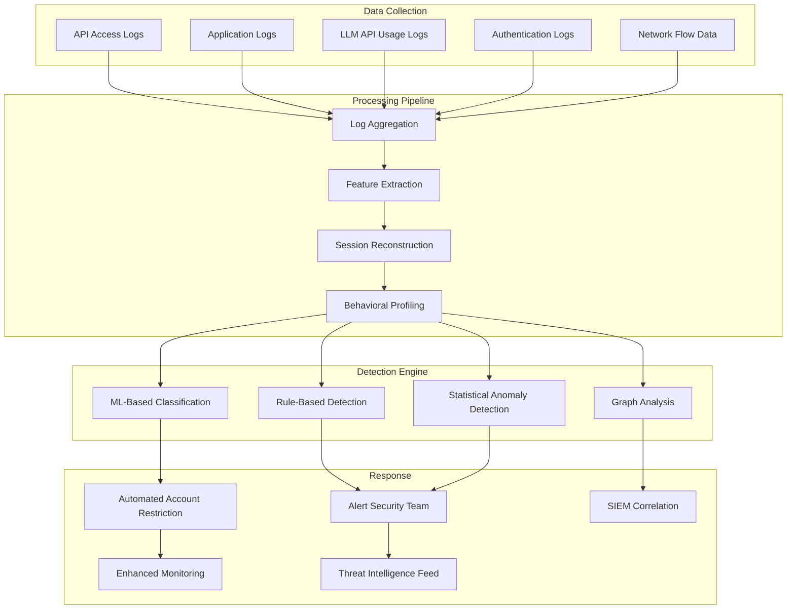

# API Abuse Detection

## Overview

API abuse detection is the practice of identifying and responding to malicious or excessive usage patterns of APIs. Unlike rate limiting, which enforces hard thresholds, abuse detection is about understanding behavioral patterns, identifying anomalies, and responding to sophisticated attackers who operate within normal rate limits but with malicious intent.

In banking GenAI platforms, API abuse takes unique forms: systematic knowledge extraction through carefully paced queries, prompt injection campaigns, credential stuffing against AI endpoints, cost amplification through optimized attack patterns, and automated reconnaissance of AI system capabilities. This guide provides engineering patterns for detecting and responding to these threats.

## Abuse vs. Normal Usage

### Normal Usage Patterns

```
Normal User Behavior:
├── Query frequency: 1-5 requests per minute during active session
├── Session duration: 5-30 minutes
├── Query diversity: Varied topics, natural language
├── Time patterns: Business hours, with some after-hours usage
├── Token usage: Reasonable prompt/response sizes
└── Error rate: Low (<5%), mostly user-caused typos
```

### Abuse Patterns

```
Abusive Behavior Patterns:
├── Systematic enumeration: Sequential queries to map data
├── Prompt injection: Repeated attempts with injection payloads
├── Credential stuffing: Many users from same IP/pattern
├── Cost amplification: Maximum context, maximum response tokens
├── Reconnaissance: Probing for tool capabilities, system prompts
├── Data scraping: Structured queries covering entire knowledge base
├── Timing manipulation: Precise intervals to avoid rate limits
└── Multi-account: Distributed across many accounts from same source
```

## Abuse Detection Architecture



## Feature Extraction for Abuse Detection

### Request-Level Features

```python
from dataclasses import dataclass
from datetime import datetime
from typing import Optional

@dataclass
class RequestFeatures:
    """Features extracted from a single API request."""
    timestamp: datetime
    user_id: str
    endpoint: str
    method: str
    source_ip: str
    user_agent: str
    prompt_length: int
    prompt_complexity: float  # lexical diversity score
    requested_tokens: int
    contains_urls: bool
    contains_code: bool
    contains_special_chars: float  # ratio of non-alphanumeric chars
    language: str
    session_id: str
    auth_method: str
    is_repeat_query: bool  # similar to recent queries
    time_since_last_request: float  # seconds
```

### Session-Level Features

```python
@dataclass
class SessionFeatures:
    """Features computed from a user session."""
    user_id: str
    session_id: str
    start_time: datetime
    duration_seconds: float
    total_requests: int
    requests_per_minute: float
    unique_endpoints: int
    total_tokens_consumed: int
    avg_prompt_length: float
    prompt_length_variance: float
    unique_topics: int  # estimated topic diversity
    injection_attempts: int
    error_count: int
    error_rate: float
    off_hours: bool  # outside user's normal usage hours
    new_user: bool
    geographic_anomaly: bool  # unusual location for user
    device_anomaly: bool  # unusual device/browser
    consecutive_similar_queries: int  # potential scraping
    max_burst_rate: float  # max requests in any 10-second window
    time_between_requests_std: float  # regularity of timing
```

## Rule-Based Detection Rules

### Python: Detection Rule Engine

```python
from dataclasses import dataclass
from typing import Callable
from datetime import datetime, timedelta

@dataclass
class AbuseAlert:
    rule_id: str
    rule_name: str
    severity: str  # "info", "warning", "critical"
    user_id: str
    session_id: str
    evidence: dict
    timestamp: datetime
    action_taken: str  # "monitor", "throttle", "block", "alert"

@dataclass
class DetectionRule:
    rule_id: str
    name: str
    severity: str
    condition: Callable[[SessionFeatures], bool]
    evidence_extractor: Callable[[SessionFeatures], dict]
    action: str

class AbuseDetectionEngine:
    """Rule-based abuse detection engine."""

    def __init__(self):
        self.rules: list[DetectionRule] = []
        self._register_rules()

    def _register_rules(self):
        # Rule 1: High-frequency systematic querying
        self.rules.append(DetectionRule(
            rule_id="ABUSE-001",
            name="Systematic Query Pattern",
            severity="warning",
            condition=lambda s: (
                s.requests_per_minute > 15 and
                s.unique_topics > 10 and
                s.duration_seconds > 600
            ),
            evidence_extractor=lambda s: {
                "requests_per_minute": s.requests_per_minute,
                "unique_topics": s.unique_topics,
                "session_duration_min": s.duration_seconds / 60,
            },
            action="alert",
        ))

        # Rule 2: Prompt injection campaign
        self.rules.append(DetectionRule(
            rule_id="ABUSE-002",
            name="Prompt Injection Campaign",
            severity="critical",
            condition=lambda s: s.injection_attempts >= 3,
            evidence_extractor=lambda s: {
                "injection_attempts": s.injection_attempts,
                "total_requests": s.total_requests,
                "injection_rate": s.injection_attempts / max(1, s.total_requests),
            },
            action="block",
        ))

        # Rule 3: Cost amplification
        self.rules.append(DetectionRule(
            rule_id="ABUSE-003",
            name="Cost Amplification Attack",
            severity="critical",
            condition=lambda s: (
                s.total_tokens_consumed > 500_000 and
                s.avg_prompt_length > 4000
            ),
            evidence_extractor=lambda s: {
                "total_tokens": s.total_tokens_consumed,
                "avg_prompt_length": s.avg_prompt_length,
                "estimated_cost_usd": s.total_tokens_consumed * 0.00003,
            },
            action="throttle",
        ))

        # Rule 4: Reconnaissance pattern
        self.rules.append(DetectionRule(
            rule_id="ABUSE-004",
            name="System Reconnaissance",
            severity="warning",
            condition=lambda s: (
                s.unique_endpoints > 8 and
                s.total_requests > 20 and
                s.duration_seconds < 300
            ),
            evidence_extractor=lambda s: {
                "endpoints_probed": s.unique_endpoints,
                "total_requests": s.total_requests,
                "probe_rate": s.total_requests / max(1, s.duration_seconds / 60),
            },
            action="alert",
        ))

        # Rule 5: Off-hours anomalous usage
        self.rules.append(DetectionRule(
            rule_id="ABUSE-005",
            name="Off-Hours Anomalous Usage",
            severity="info",
            condition=lambda s: (
                s.off_hours and
                s.requests_per_minute > 10 and
                s.new_user
            ),
            evidence_extractor=lambda s: {
                "is_off_hours": s.off_hours,
                "is_new_user": s.new_user,
                "requests_per_minute": s.requests_per_minute,
            },
            action="monitor",
        ))

        # Rule 6: Automated timing pattern
        self.rules.append(DetectionRule(
            rule_id="ABUSE-006",
            name="Automated Timing Pattern",
            severity="warning",
            condition=lambda s: (
                s.time_between_requests_std < 0.5 and
                s.total_requests > 30
            ),
            evidence_extractor=lambda s: {
                "timing_stddev_seconds": s.time_between_requests_std,
                "total_requests": s.total_requests,
                "likely_automated": True,
            },
            action="alert",
        ))

        # Rule 7: Consecutive similar queries (scraping)
        self.rules.append(DetectionRule(
            rule_id="ABUSE-007",
            name="Data Scraping Pattern",
            severity="critical",
            condition=lambda s: s.consecutive_similar_queries >= 10,
            evidence_extractor=lambda s: {
                "consecutive_similar": s.consecutive_similar_queries,
                "total_requests": s.total_requests,
                "scraping_confidence": min(1.0, s.consecutive_similar_queries / 20),
            },
            action="block",
        ))

    def evaluate(self, features: SessionFeatures) -> list[AbuseAlert]:
        """Evaluate all detection rules against session features."""
        alerts = []
        for rule in self.rules:
            try:
                if rule.condition(features):
                    alert = AbuseAlert(
                        rule_id=rule.rule_id,
                        rule_name=rule.name,
                        severity=rule.severity,
                        user_id=features.user_id,
                        session_id=features.session_id,
                        evidence=rule.evidence_extractor(features),
                        timestamp=datetime.utcnow(),
                        action_taken=rule.action,
                    )
                    alerts.append(alert)
            except Exception as e:
                # Never let a detection rule failure block processing
                logger.error(f"Detection rule {rule.rule_id} failed: {e}")

        return alerts
```

## Statistical Anomaly Detection

### Z-Score Based Anomaly Detection

```python
import numpy as np
from collections import defaultdict

class StatisticalAnomalyDetector:
    """Detect anomalies using statistical baselines per user."""

    def __init__(self, lookback_days: int = 30):
        self.lookback_days = lookback_days
        # user_id -> list of historical daily metrics
        self.user_baselines: dict[str, list[dict]] = defaultdict(list)

    def update_baseline(self, user_id: str, daily_metrics: dict):
        """Update user's historical baseline."""
        self.user_baselines[user_id].append(daily_metrics)
        # Keep only lookback window
        cutoff = len(self.user_baselines[user_id]) - self.lookback_days
        if cutoff > 0:
            self.user_baselines[user_id] = self.user_baselines[user_id][cutoff:]

    def detect_anomalies(self, user_id: str, current_metrics: dict) -> list[dict]:
        """Detect anomalous metrics compared to user's baseline."""
        if user_id not in self.user_baselines:
            return []  # New user, no baseline

        history = self.user_baselines[user_id]
        anomalies = []

        for metric_name, current_value in current_metrics.items():
            values = [h.get(metric_name, 0) for h in history if metric_name in h]
            if len(values) < 7:  # Need at least 7 data points
                continue

            mean = np.mean(values)
            std = np.std(values)

            if std == 0:
                # No variance in history -- any deviation is anomalous
                if current_value != mean:
                    anomalies.append({
                        "metric": metric_name,
                        "current": current_value,
                        "baseline_mean": mean,
                        "baseline_std": 0,
                        "z_score": float("inf"),
                    })
                continue

            z_score = abs(current_value - mean) / std
            if z_score > 3.0:  # 3 standard deviations
                anomalies.append({
                    "metric": metric_name,
                    "current": current_value,
                    "baseline_mean": round(mean, 2),
                    "baseline_std": round(std, 2),
                    "z_score": round(z_score, 2),
                })

        return anomalies
```

### Behavioral Profiling

```python
class BehavioralProfiler:
    """Build and compare behavioral profiles for users."""

    def __init__(self):
        # user_id -> behavioral profile
        self.profiles: dict[str, dict] = {}

    def build_profile(self, user_id: str, requests: list[dict]) -> dict:
        """Build a behavioral profile from request history."""
        if not requests:
            return {}

        timestamps = [r["timestamp"] for r in requests]
        prompt_lengths = [r["prompt_length"] for r in requests]
        token_usages = [r["tokens_consumed"] for r in requests]

        hours_of_activity = [r["timestamp"].hour for r in requests]

        profile = {
            "user_id": user_id,
            "avg_requests_per_session": len(requests) / max(1, self._count_sessions(requests)),
            "avg_prompt_length": np.mean(prompt_lengths),
            "prompt_length_p95": np.percentile(prompt_lengths, 95),
            "avg_tokens_per_request": np.mean(token_usages),
            "typical_hours": self._modal_hours(hours_of_activity),
            "typical_endpoints": self._common_endpoints(requests),
            "typical_error_rate": sum(1 for r in requests if r.get("error")) / len(requests),
            "created_at": min(timestamps),
            "updated_at": max(timestamps),
        }

        self.profiles[user_id] = profile
        return profile

    def compare_to_profile(self, user_id: str, current_session: dict) -> float:
        """
        Compare current session to user's profile.
        Returns anomaly score: 0.0 = normal, 1.0 = highly anomalous.
        """
        profile = self.profiles.get(user_id)
        if not profile:
            return 0.5  # Unknown user, moderate anomaly

        anomaly_score = 0.0
        anomaly_count = 0

        # Check request rate
        if profile["avg_requests_per_session"] > 0:
            rate_ratio = current_session.get("requests", 0) / profile["avg_requests_per_session"]
            if rate_ratio > 3:
                anomaly_score += min(0.3, (rate_ratio - 3) * 0.1)
                anomaly_count += 1

        # Check prompt length
        if profile["avg_prompt_length"] > 0:
            prompt_ratio = current_session.get("avg_prompt_length", 0) / profile["avg_prompt_length"]
            if prompt_ratio > 3:
                anomaly_score += min(0.3, (prompt_ratio - 3) * 0.1)
                anomaly_count += 1

        # Check hour of activity
        current_hour = datetime.utcnow().hour
        if current_hour not in profile.get("typical_hours", []):
            anomaly_score += 0.1
            anomaly_count += 1

        return min(1.0, anomaly_score)

    def _count_sessions(self, requests: list[dict]) -> int:
        """Estimate number of sessions based on time gaps."""
        if not requests:
            return 0
        sorted_reqs = sorted(requests, key=lambda r: r["timestamp"])
        sessions = 1
        for i in range(1, len(sorted_reqs)):
            gap = (sorted_reqs[i]["timestamp"] - sorted_reqs[i-1]["timestamp"]).total_seconds()
            if gap > 1800:  # 30 minute gap = new session
                sessions += 1
        return sessions

    def _modal_hours(self, hours: list[int]) -> list[int]:
        """Return the most common hours of activity."""
        from collections import Counter
        counter = Counter(hours)
        return [h for h, _ in counter.most_common(5)]

    def _common_endpoints(self, requests: list[dict]) -> list[str]:
        """Return the most commonly accessed endpoints."""
        endpoints = [r.get("endpoint", "") for r in requests]
        from collections import Counter
        counter = Counter(endpoints)
        return [e for e, _ in counter.most_common(5)]
```

## Go: Real-Time Stream Processing

```go
package abusedetection

import (
    "context"
    "sync"
    "time"
)

// RequestEvent represents a single API request event.
type RequestEvent struct {
    UserID      string
    Endpoint    string
    Timestamp   time.Time
    PromptLen   int
    TokensUsed  int
    SourceIP    string
    IsInjection bool
    IsError     bool
}

// SlidingWindowCounter tracks event counts in a sliding window.
type SlidingWindowCounter struct {
    mu       sync.Mutex
    events   map[string][]time.Time // key -> timestamps
    window   time.Duration
}

func NewSlidingWindowCounter(window time.Duration) *SlidingWindowCounter {
    return &SlidingWindowCounter{
        events: make(map[string][]time.Time),
        window: window,
    }
}

func (sw *SlidingWindowCounter) Add(key string, t time.Time) int {
    sw.mu.Lock()
    defer sw.mu.Unlock()

    // Prune old events
    cutoff := t.Add(-sw.window)
    times := sw.events[key]
    idx := 0
    for idx < len(times) && times[idx].Before(cutoff) {
        idx++
    }
    sw.events[key] = times[idx:]
    sw.events[key] = append(sw.events[key], t)

    return len(sw.events[key])
}

// StreamProcessor processes request events in real-time.
type StreamProcessor struct {
    requestCounts *SlidingWindowCounter
    injectionCounts *SlidingWindowCounter
    alertCh       chan AbuseAlert
    thresholds    DetectionThresholds
}

type DetectionThresholds struct {
    MaxRequestsPerMinute    int
    MaxInjectionsPerHour    int
    MaxTokensPerSession     int
    MaxUniqueEndpoints      int
}

type AbuseAlert struct {
    UserID    string
    RuleID    string
    Severity  string
    Evidence  map[string]interface{}
    Timestamp time.Time
}

func NewStreamProcessor(thresholds DetectionThresholds) *StreamProcessor {
    return &StreamProcessor{
        requestCounts: NewSlidingWindowCounter(time.Minute),
        injectionCounts: NewSlidingWindowCounter(time.Hour),
        alertCh:       make(chan AbuseAlert, 1000),
        thresholds:    thresholds,
    }
}

func (sp *StreamProcessor) ProcessEvent(ctx context.Context, event RequestEvent) {
    // Check request rate
    count := sp.requestCounts.Add("req:"+event.UserID, event.Timestamp)
    if count > sp.thresholds.MaxRequestsPerMinute {
        select {
        case sp.alertCh <- AbuseAlert{
            UserID:   event.UserID,
            RuleID:   "ABUSE-001",
            Severity: "warning",
            Evidence: map[string]interface{}{
                "requests_per_minute": count,
                "limit":              sp.thresholds.MaxRequestsPerMinute,
            },
            Timestamp: event.Timestamp,
        }:
        default:
            // Alert channel full, drop
        }
    }

    // Check injection attempts
    if event.IsInjection {
        injCount := sp.injectionCounts.Add("inj:"+event.UserID, event.Timestamp)
        if injCount > sp.thresholds.MaxInjectionsPerHour {
            select {
            case sp.alertCh <- AbuseAlert{
                UserID:   event.UserID,
                RuleID:   "ABUSE-002",
                Severity: "critical",
                Evidence: map[string]interface{}{
                    "injections_per_hour": injCount,
                    "limit":               sp.thresholds.MaxInjectionsPerHour,
                },
                Timestamp: event.Timestamp,
            }:
            default:
            }
        }
    }
}

func (sp *StreamProcessor) Alerts() <-chan AbuseAlert {
    return sp.alertCh
}
```

## Multi-Account Abuse Detection

### Graph-Based Detection

```python
from collections import defaultdict

class MultiAccountDetector:
    """Detect abuse patterns across multiple accounts."""

    def __init__(self):
        # Shared attribute -> list of user IDs
        self.ip_to_users: dict[str, set[str]] = defaultdict(set)
        self.device_to_users: dict[str, set[str]] = defaultdict(set)
        self.behavior_clusters: list[set[str]] = []

    def register_user_activity(self, user_id: str, ip: str, device_fingerprint: str):
        """Track user activity for cross-account analysis."""
        self.ip_to_users[ip].add(user_id)
        self.device_to_users[device_fingerprint].add(user_id)

    def detect_coordinated_abuse(self) -> list[dict]:
        """Detect potential coordinated multi-account abuse."""
        findings = []

        # Check for IPs with many users
        for ip, users in self.ip_to_users.items():
            if len(users) > 5:
                findings.append({
                    "pattern": "shared_ip",
                    "ip": ip,
                    "user_count": len(users),
                    "users": list(users),
                    "confidence": min(1.0, len(users) / 20),
                })

        # Check for shared devices
        for device, users in self.device_to_users.items():
            if len(users) > 3:
                findings.append({
                    "pattern": "shared_device",
                    "device_hash": device[:16] + "...",
                    "user_count": len(users),
                    "users": list(users),
                    "confidence": min(1.0, len(users) / 10),
                })

        return findings
```

## Integration with SIEM and Incident Response

### Structured Alert Output

```python
import json

def format_alert_for_siem(alert: AbuseAlert) -> str:
    """Format abuse detection alert for SIEM ingestion."""
    return json.dumps({
        "event_type": "api_abuse_detection",
        "version": "1.0",
        "timestamp": alert.timestamp.isoformat() + "Z",
        "rule_id": alert.rule_id,
        "rule_name": alert.rule_name,
        "severity": alert.severity,
        "user_id": alert.user_id,
        "session_id": alert.session_id,
        "action_taken": alert.action_taken,
        "evidence": alert.evidence,
        "source_system": "genai-abuse-detection",
    })
```

### Automated Response Actions

```python
from enum import Enum

class ResponseAction(Enum):
    MONITOR = "monitor"      # Enhanced logging only
    THROTTLE = "throttle"    # Reduce rate limits
    CAPTCHA = "captcha"      # Require challenge
    BLOCK = "block"          # Block user temporarily
    ESCALATE = "escalate"    # Alert security team

class AutomatedResponder:
    """Take automated actions based on abuse alerts."""

    def __init__(self, rate_limiter, account_service, alert_service):
        self.rate_limiter = rate_limiter
        self.account_service = account_service
        self.alert_service = alert_service

    async def respond(self, alert: AbuseAlert):
        """Execute response action for an abuse alert."""
        if alert.severity == "info":
            # Just log -- no automated action
            logger.info(f"Info alert for user {alert.user_id}: {alert.rule_name}")
            return

        if alert.severity == "warning":
            # Reduce rate limits for this user
            await self.rate_limiter.reduce_limits(
                user_id=alert.user_id,
                factor=0.5,  # 50% of normal limits
                duration_minutes=60,
            )
            logger.warning(f"Throttled user {alert.user_id} for {alert.rule_name}")

        elif alert.severity == "critical":
            # Block user and alert security team
            await self.account_service.temporarily_suspend(
                user_id=alert.user_id,
                reason=f"Abuse detection: {alert.rule_name}",
                duration_minutes=1440,  # 24 hours
            )
            await self.alert_service.create_incident(
                title=f"Critical API Abuse: {alert.rule_name}",
                user_id=alert.user_id,
                evidence=alert.evidence,
                priority="P1",
            )
            logger.critical(
                f"BLOCKED user {alert.user_id} for {alert.rule_name}",
                extra={"evidence": alert.evidence}
            )
```

## Kubernetes Integration: Sidecar Detection

```yaml
# OpenTelemetry Collector config for abuse detection metrics
apiVersion: opentelemetry.io/v1alpha1
kind: OpenTelemetryCollector
metadata:
  name: genai-abuse-detection
  namespace: genai-platform
spec:
  config: |
    receivers:
      otlp:
        protocols:
          grpc:
          http:

    processors:
      # Detect anomalous request patterns
      filter/abuse:
        spans:
          include:
            match_type: regexp
            attributes:
              - key: http.status_code
                value: "429"
              - key: genai.prompt.injection_detected
                value: "true"

      # Aggregate per user
      metricstransform:
        transforms:
          - include: ^genai\.abuse\.detection\.alerts$
            match_type: regexp
            action: update
            new_name: genai_abuse_alerts_total

    exporters:
      prometheus:
        endpoint: 0.0.0.0:8889

      # Send abuse alerts to SIEM
      logging:
        loglevel: warn

    service:
      pipelines:
        metrics:
          receivers: [otlp]
          processors: [metricstransform]
          exporters: [prometheus]
        logs:
          receivers: [otlp]
          processors: [filter/abuse]
          exporters: [logging]
```

## Secure Defaults and Hardening Checklist

### Must-Have Controls

- [ ] Rule-based detection for common abuse patterns (injection, scraping, cost amplification)
- [ ] Session reconstruction and behavioral profiling per user
- [ ] Statistical anomaly detection with per-user baselines
- [ ] Multi-account correlation (shared IP, device, behavior)
- [ ] Automated response actions (throttle, block, alert)
- [ ] Structured alert output compatible with SIEM integration
- [ ] Prometheus metrics for abuse detection coverage
- [ ] Regular review and tuning of detection rules (monthly)

### Should-Have Controls

- [ ] ML-based classification for novel abuse patterns
- [ ] Graph analysis for coordinated multi-account abuse
- [ ] IP reputation scoring from threat intelligence feeds
- [ ] Geographic and temporal usage anomaly detection
- [ ] Prompt similarity clustering to detect systematic enumeration
- [ ] Integration with identity provider for account behavior correlation
- [ ] Automated incident creation for critical alerts

### Interview Questions

1. **What is the difference between rate limiting and abuse detection?** Why do you need both?

2. **A sophisticated attacker is making 1 request per minute -- well within rate limits -- but each query is designed to extract a small piece of sensitive data. Over a week, they reconstruct an entire dataset. How do you detect this?**

3. **How would you distinguish between a power user who genuinely uses the system heavily and an attacker doing reconnaissance?**

4. **Your abuse detection system has a 1% false positive rate. With 100,000 daily sessions, that's 1,000 false alerts per day. How do you reduce noise while maintaining detection capability?**

5. **Describe how you would implement a behavioral profile for a user of a GenAI system. What features would you track and why?**

6. **An attacker creates 50 accounts and distributes queries across them to avoid per-user detection. How do you detect this multi-account abuse pattern?**

7. **How do you measure the effectiveness of your abuse detection system?** What metrics would you track?

## Cross-References

- `rate-limiting.md` -- Rate limiting as first line of defense
- `llm-data-exfiltration.md` -- Data scraping and exfiltration detection
- `prompt-injection.md` -- Injection attempt detection
- `api-security.md` -- API-level abuse prevention
- `secure-logging.md` -- Logging abuse events without leaking sensitive data
- `incident-response.md` -- Responding to confirmed abuse incidents
- `../observability/` -- Monitoring and alerting infrastructure
- `../regulations-and-compliance/audit-trails.md` -- Abuse events as audit events

## Further Reading

- AWS WAF Bot Control for API abuse detection
- Google reCAPTCHA Enterprise for bot detection
- Cloudflare Bot Management patterns
- "Detecting API Abuse" -- Stripe engineering blog
- MITRE ATLAS: LLM01 Prompt Injection, LLM06 Sensitive Information Disclosure
