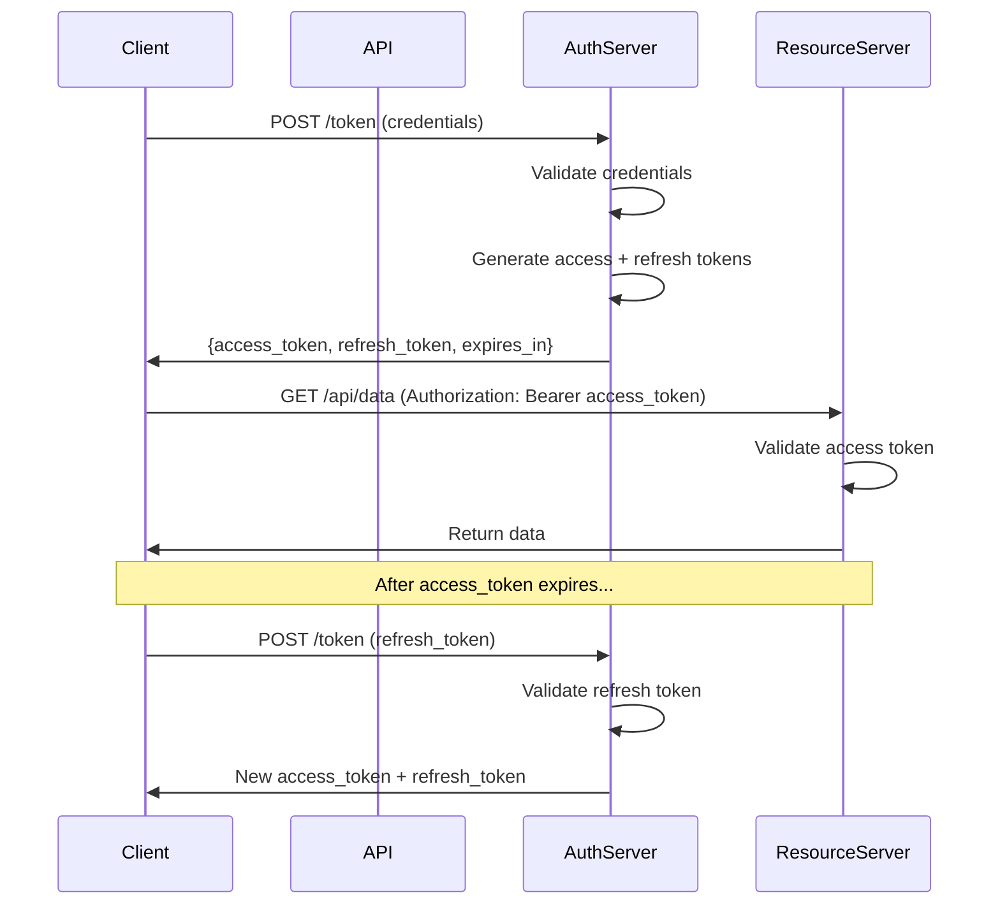

# Authentication and Authorization

## Overview

Authentication (AuthN) proves identity -- "who are you?" Authorization (AuthZ) determines permissions -- "what are you allowed to do?" In banking, a failure in either system can result in unauthorized access to financial data, fraudulent transactions, and regulatory penalties.

This guide covers session management, token handling, and authorization patterns for production banking systems.

## Authentication Fundamentals

### Authentication Factors

| Factor | Type | Examples | Strength |
|---|---|---|---|
| Knowledge | Something you know | Password, PIN | Low |
| Possession | Something you have | Phone, hardware token, YubiKey | Medium |
| Inherence | Something you are | Fingerprint, face ID | Medium |
| Location | Somewhere you are | IP geolocation, GPS | Low |
| Time | Something that changes | TOTP, push notification | Medium |

**MFA (Multi-Factor Authentication)**: Requires at least two different factor types. Banking regulations often require MFA for any financial transaction.

### Password Security

```python
import bcrypt
import secrets
import hashlib

# BAD: MD5/SHA1 for passwords (crackable in seconds)
password_hash = hashlib.md5(password.encode()).hexdigest()

# BAD: Unsalted hashes (rainbow table attacks)
password_hash = hashlib.sha256(password.encode()).hexdigest()

# GOOD: bcrypt with work factor
def hash_password(password: str) -> str:
    salt = bcrypt.gensalt(rounds=12)  # Increase as hardware improves
    return bcrypt.hashpw(password.encode('utf-8'), salt).decode('utf-8')

def verify_password(password: str, stored_hash: str) -> bool:
    return bcrypt.checkpw(
        password.encode('utf-8'),
        stored_hash.encode('utf-8')
    )

# BETTER: Argon2id (winner of Password Hashing Competition)
from argon2 import PasswordHasher, Type

ph = PasswordHasher(
    time_cost=3,          # Iterations
    memory_cost=65536,    # 64 MB
    parallelism=4,        # Parallel threads
    hash_len=32,          # Output hash length
    salt_len=16,          # Salt length
    type=Type.ID          # Argon2id (resists both side-channel and GPU attacks)
)

def hash_password_argon2(password: str) -> str:
    return ph.hash(password)

def verify_password_argon2(hash: str, password: str) -> bool:
    try:
        return ph.verify(hash, password)
    except Exception:
        return False
```

### Breached Password Detection

```python
import hashlib
import aiohttp

async def is_password_breached(password: str) -> bool:
    """
    Check if password appears in known breaches using
    Have I Been Pwned API (k-anonymity model - never sends full hash)
    """
    sha1_hash = hashlib.sha1(password.encode('utf-8')).hexdigest().upper()
    prefix = sha1_hash[:5]
    suffix = sha1_hash[5:]

    async with aiohttp.ClientSession() as session:
        async with session.get(f"https://api.pwnedpasswords.com/range/{prefix}") as resp:
            if resp.status != 200:
                return False  # Fail open - don't block registration on API failure

            hashes = dict(line.split(':') for line in (await resp.text()).splitlines())
            return suffix in hashes
```

## Session Management

### Server-Side Sessions

```python
import secrets
import time
from dataclasses import dataclass, asdict
from typing import Optional

@dataclass
class Session:
    id: str
    user_id: str
    created_at: float
    expires_at: float
    last_activity: float
    ip_address: str
    user_agent: str
    mfa_verified: bool = False
    is_revoked: bool = False

class SessionManager:
    def __init__(self, redis_client):
        self.redis = redis_client
        self.session_ttl = 3600  # 1 hour
        self.absolute_timeout = 86400  # 24 hours

    def create_session(self, user_id: str, ip_address: str, user_agent: str) -> Session:
        session = Session(
            id=secrets.token_urlsafe(32),
            user_id=user_id,
            created_at=time.time(),
            expires_at=time.time() + self.session_ttl,
            last_activity=time.time(),
            ip_address=ip_address,
            user_agent=user_agent,
        )
        self._store_session(session)
        return session

    def validate_session(self, session_id: str) -> Optional[Session]:
        session = self._load_session(session_id)
        if not session or session.is_revoked:
            return None
        if time.time() > session.expires_at:
            self.revoke_session(session_id)
            return None
        if time.time() - session.created_at > self.absolute_timeout:
            self.revoke_session(session_id)  # Force re-authentication
            return None

        # Check for session fixation indicators
        if self._detect_anomaly(session):
            self.revoke_session(session_id)
            return None

        # Refresh expiry on activity
        session.last_activity = time.time()
        session.expires_at = time.time() + self.session_ttl
        self._store_session(session)

        return session

    def revoke_session(self, session_id: str):
        self.redis.delete(f"session:{session_id}")

    def revoke_all_user_sessions(self, user_id: str):
        """Called on password change or suspicious activity"""
        # Scan and delete all sessions for user
        cursor = 0
        while True:
            cursor, keys = self.redis.scan(
                cursor=cursor,
                match=f"session:*",
                count=100
            )
            for key in keys:
                session_data = self.redis.get(key)
                if session_data and session_data.get("user_id") == user_id:
                    self.redis.delete(key)
            if cursor == 0:
                break

    def _detect_anomaly(self, session: Session) -> bool:
        """Detect potential session hijacking"""
        # Flag if IP changes drastically (different country)
        # Flag if user agent changes mid-session
        # Flag impossible travel (same user, different locations in short time)
        return False  # Implement geo-IP and UA comparison

    def _store_session(self, session: Session):
        self.redis.setex(
            f"session:{session.id}",
            self.session_ttl,
            asdict(session)
        )

    def _load_session(self, session_id: str) -> Optional[Session]:
        data = self.redis.get(f"session:{session_id}")
        if data:
            return Session(**data)
        return None
```

### Cookie Security

```python
# Secure cookie configuration
SECURE_COOKIE_OPTIONS = {
    "httponly": True,       # Not accessible via JavaScript
    "secure": True,         # Only sent over HTTPS
    "samesite": "Lax",      # CSRF protection (Strict for highest security)
    "max_age": 3600,        # 1 hour
    "path": "/",
    "domain": ".banking.example.com",  # Subdomain sharing
}

# Flask example
from flask import make_response

def set_session_cookie(response, session_id: str):
    response.set_cookie(
        "session_id",
        session_id,
        httponly=True,
        secure=True,
        samesite="Lax",
        max_age=3600,
        path="/",
        domain=".banking.example.com",
    )
    return response
```

## Authorization Patterns

### Role-Based Access Control (RBAC)

```python
class RBACAuthorizer:
    def __init__(self):
        self.role_permissions = {
            "customer": ["account:view:own", "transfer:create", "transaction:view:own"],
            "teller": ["account:view:any", "transaction:view:any", "transfer:create:limited"],
            "manager": ["account:view:any", "account:freeze", "transaction:view:any", "transfer:approve"],
            "admin": ["*"],  # All permissions
        }

    def check(self, user_role: str, required_permission: str) -> bool:
        permissions = self.role_permissions.get(user_role, [])
        if "*" in permissions:
            return True
        return required_permission in permissions

# Usage
authz = RBACAuthorizer()
if not authz.check(user.role, "transfer:create"):
    raise HTTPException(403, "Forbidden")
```

### Attribute-Based Access Control (ABAC)

More flexible than RBAC for complex banking scenarios.

```python
from dataclasses import dataclass
from typing import Callable

@dataclass
class AccessRequest:
    subject: dict       # User attributes
    action: str         # What they want to do
    resource: dict      # Resource attributes
    environment: dict   # Time, location, etc.

@dataclass
class AccessDecision:
    allowed: bool
    reason: str = ""

class ABACPolicyEngine:
    def __init__(self):
        self.policies: list[Callable] = []

    def add_policy(self, name: str, rule: Callable[[AccessRequest], AccessDecision]):
        self.policies.append(rule)

    def evaluate(self, request: AccessRequest) -> AccessDecision:
        for policy in self.policies:
            decision = policy(request)
            if not decision.allowed:
                return decision  # Deny on first match
        return AccessDecision(allowed=True)

# Policy definitions
def transaction_amount_limit(req: AccessRequest) -> AccessDecision:
    amount = req.resource.get("amount", 0)
    user_limit = req.subject.get("daily_transfer_limit", 10000)
    if amount > user_limit:
        return AccessDecision(
            allowed=False,
            reason=f"Amount {amount} exceeds daily limit {user_limit}"
        )
    return AccessDecision(allowed=True)

def business_hours_only(req: AccessRequest) -> AccessDecision:
    """Large transfers only during business hours"""
    hour = req.environment.get("hour", 12)
    amount = req.resource.get("amount", 0)
    if amount > 50000 and (hour < 8 or hour > 18):
        return AccessDecision(
            allowed=False,
            reason="Large transfers only allowed 8 AM - 6 PM"
        )
    return AccessDecision(allowed=True)

def geo_restriction(req: AccessRequest) -> AccessDecision:
    """Block transactions from high-risk countries"""
    country = req.environment.get("country", "")
    blocked_countries = ["KP", "IR", "SY"]
    if country in blocked_countries:
        return AccessDecision(allowed=False, reason="Geographic restriction")
    return AccessDecision(allowed=True)

# Register policies
engine = ABACPolicyEngine()
engine.add_policy("transaction_amount_limit", transaction_amount_limit)
engine.add_policy("business_hours_only", business_hours_only)
engine.add_policy("geo_restriction", geo_restriction)

# Evaluate
decision = engine.evaluate(AccessRequest(
    subject={"role": "customer", "daily_transfer_limit": 10000},
    action="transfer:create",
    resource={"amount": 75000, "type": "wire"},
    environment={"hour": 14, "country": "US"}
))
# decision.allowed = False, reason = "Amount 75000 exceeds daily limit 10000"
```

## Token-Based Authentication

### Access Token Flow



### Refresh Token Rotation

```python
class RefreshTokenStore:
    """
    Implements refresh token rotation:
    - Each refresh token can only be used once
    - Using a refresh token returns a new refresh token
    - If a reused refresh token is detected, revoke the entire family
    """

    def __init__(self, redis_client):
        self.redis = redis_client

    def create_refresh_token(self, user_id: str) -> tuple[str, str]:
        """Returns (token, token_id)"""
        import secrets
        token = secrets.token_urlsafe(64)
        token_id = hashlib.sha256(token.encode()).hexdigest()

        # Store token with user context
        self.redis.setex(
            f"refresh:{token_id}",
            86400 * 30,  # 30 days
            json.dumps({
                "user_id": user_id,
                "created_at": time.time(),
                "family_id": secrets.token_urlsafe(16),
            })
        )

        return token, token_id

    def rotate_refresh_token(self, presented_token: str) -> Optional[dict]:
        """
        Validate and rotate refresh token.
        Returns new token data or None if invalid.
        """
        token_id = hashlib.sha256(presented_token.encode()).hexdigest()
        data = self.redis.get(f"refresh:{token_id}")

        if not data:
            # Token not found - could be replay attack
            # Check if this token_id was recently revoked (replay detection)
            if self.redis.get(f"revoked:{token_id}"):
                # Replay attack detected - revoke entire family
                self._revoke_family(data.get("family_id"))
            return None

        # Delete old token (one-time use)
        self.redis.delete(f"refresh:{token_id}")
        # Mark as revoked for replay detection
        self.redis.setex(f"revoked:{token_id}", 60, "1")

        return json.loads(data)
```

## Banking-Specific Authentication Controls

### Step-Up Authentication

```python
class StepUpAuth:
    """
    Require additional authentication for sensitive operations:
    - Adding new payee
    - Transfers above threshold
    - Changing account details
    - Password reset
    """

    SENSITIVE_OPERATIONS = {
        "add_payee": {"requires_mfa": True, "requires_otp": True},
        "large_transfer": {"requires_mfa": True, "requires_otp": True},
        "change_email": {"requires_mfa": True},
        "change_password": {"requires_current_password": True},
        "wire_transfer": {"requires_mfa": True, "requires_otp": True, "requires_approval": True},
    }

    def check_requirements(self, operation: str, session: Session) -> bool:
        requirements = self.SENSITIVE_OPERATIONS.get(operation, {})

        if requirements.get("requires_mfa") and not session.mfa_verified:
            return False
        if requirements.get("requires_otp") and not self._verify_otp(session.user_id):
            return False
        if requirements.get("requires_current_password") and not self._verify_password(session.user_id):
            return False

        return True
```

### Device Fingerprinting

```python
import hashlib

def generate_device_fingerprint(request) -> str:
    """
    Create a device fingerprint from request attributes.
    Used for detecting suspicious login from new devices.
    """
    components = [
        request.headers.get("User-Agent", ""),
        request.headers.get("Accept-Language", ""),
        request.headers.get("Accept-Encoding", ""),
        str(request.headers.get("Sec-CH-UA", "")),
        str(request.headers.get("Sec-CH-UA-Platform", "")),
    ]
    raw = "|".join(components)
    return hashlib.sha256(raw.encode()).hexdigest()

def check_device_trust(user_id: str, fingerprint: str) -> dict:
    """
    Returns trust level for device:
    - trusted: Seen before, no issues
    - known: Seen before, but not frequent
    - new: Never seen before
    - suspicious: Flagged for suspicious activity
    """
    known_devices = get_known_devices(user_id)
    if fingerprint in known_devices:
        device = known_devices[fingerprint]
        if device.get("suspicious"):
            return {"level": "suspicious", "action": "require_mfa"}
        if device.get("last_seen_days", 999) < 30:
            return {"level": "trusted", "action": "allow"}
        return {"level": "known", "action": "allow"}

    return {"level": "new", "action": "require_mfa_and_email"}
```

## OpenShift and Kubernetes Implications

### Securing Authentication in K8s

```yaml
# Use OpenShift OAuth with external identity provider
apiVersion: config.openshift.io/v1
kind: OAuth
metadata:
  name: cluster
spec:
  identityProviders:
  - name: ldap-provider
    mappingMethod: claim
    type: LDAP
    ldap:
      attributes:
        id:
        - dn
        email:
        - mail
        name:
        - cn
        preferredUsername:
        - uid
      bindDN: "cn=readonly,ou=system,dc=bank,dc=com"
      bindPassword:
        name: ldap-bind-password
      insecure: false
      url: "ldaps://ldap.bank.com/ou=users,dc=bank,dc=com"

# Application-level service account authentication
apiVersion: v1
kind: ServiceAccount
metadata:
  name: banking-api-sa
  namespace: production
secrets:
- name: banking-api-sa-token
automountServiceAccountToken: false  # Don't auto-mount
```

## Security Testing for AuthN/AuthZ

```python
# Integration tests for authentication
async def test_authentication_flow():
    # 1. Login with valid credentials
    response = await client.post("/auth/login", json={
        "username": "testuser",
        "password": "correct_password"
    })
    assert response.status_code == 200
    assert "access_token" in response.json()
    assert "refresh_token" in response.json()

    # 2. Access protected resource
    token = response.json()["access_token"]
    response = await client.get(
        "/api/accounts",
        headers={"Authorization": f"Bearer {token}"}
    )
    assert response.status_code == 200

    # 3. Access with expired token
    expired_token = create_expired_token()
    response = await client.get(
        "/api/accounts",
        headers={"Authorization": f"Bearer {expired_token}"}
    )
    assert response.status_code == 401

    # 4. Access without token
    response = await client.get("/api/accounts")
    assert response.status_code == 401

    # 5. Login with wrong password
    response = await client.post("/auth/login", json={
        "username": "testuser",
        "password": "wrong_password"
    })
    assert response.status_code == 401
    # Ensure timing doesn't leak whether username exists
    # (response time should be same for valid/invalid usernames)

async def test_authorization_checks():
    # Customer cannot access admin endpoints
    customer_token = get_token_for_role("customer")
    response = await client.get(
        "/api/admin/users",
        headers={"Authorization": f"Bearer {customer_token}"}
    )
    assert response.status_code == 403

    # Customer cannot view other customer's data
    customer_a_token = get_token_for_user("customer_a")
    response = await client.get(
        "/api/accounts/customer_b_account",
        headers={"Authorization": f"Bearer {customer_a_token}"}
    )
    assert response.status_code == 404  # Not 403 - don't leak existence
```

## Interview Questions

### Junior Level

1. What is the difference between authentication and authorization?
2. Why should you never store passwords in plaintext?
3. What is the purpose of a refresh token?
4. What does "httponly" mean for cookies?
5. What is MFA and why is it important for banking?

### Senior Level

1. Explain refresh token rotation and how it detects replay attacks.
2. How would you design a session management system that works across multiple data centers?
3. What is the difference between RBAC and ABAC? When would you use each?
4. How do you prevent timing attacks on password verification?
5. Describe how you would implement step-up authentication.

### Staff Level

1. How would you design a zero-trust authentication system for 500 microservices?
2. What is your strategy for detecting credential stuffing attacks at scale?
3. How do you balance user experience (fewer auth challenges) with security (more challenges)?
4. Design a system that can detect account takeover based on behavioral signals.

## Cross-References

- [OAuth2 and OIDC](./oauth2-and-oidc.md) - Industry-standard authentication protocols
- [JWT Security](./jwt.md) - Token structure and validation
- [API Security](./api-security.md) - API authorization patterns
- [Network Security](./network-security.md) - Zero trust networking
