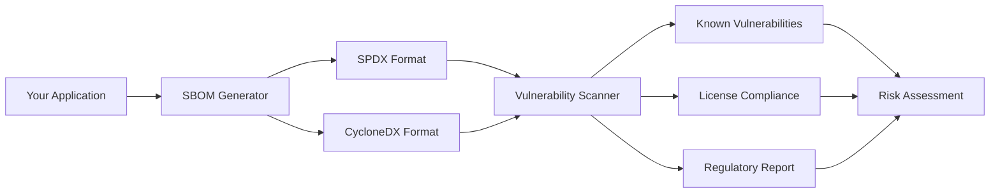
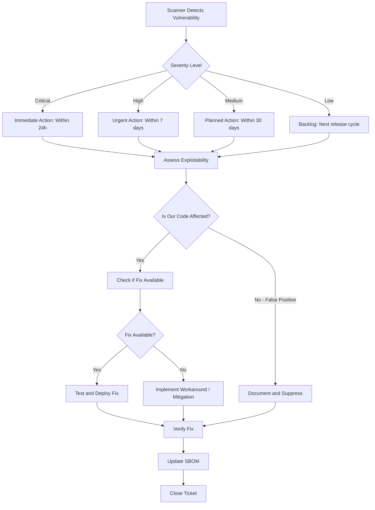

# Dependency Scanning and Supply Chain Security

## Overview

Dependency scanning (Software Composition Analysis, or SCA) is the practice of identifying and managing vulnerabilities in third-party and open-source libraries used by your applications. In GenAI systems built for banking, the dependency attack surface is particularly broad: Python ML/AI libraries, TypeScript frontend frameworks, Go infrastructure tools, Java enterprise libraries, and increasingly, AI model packages and prompt templates from external sources.

Supply chain security extends beyond known vulnerabilities to address the integrity of the entire software supply chain: ensuring artifacts have not been tampered with, verifying provenance, and maintaining an accurate inventory of all components (SBOM).

## The Supply Chain Threat Landscape

### Real-World Supply Chain Attacks

| Incident | Year | Impact | Method |
|----------|------|--------|--------|
| SolarWinds Orion | 2020 | 18,000 organizations compromised | Build system compromise, backdoored update |
| Log4Shell (Log4j) | 2021 | Hundreds of millions of systems affected | RCE via JNDI lookup in logging library |
| event-stream npm | 2018 | Bitcoin theft from users | Compromised maintainer account, malicious dependency |
| Codecov Bash Uploader | 2021 | Credentials exfiltrated from CI | Modified CI script stole secrets |
| XZ Utils backdoor | 2024 | Near-miss for Linux SSH | Social engineering, multi-year campaign |
| pytorch-nightly compromised | 2023 | Build pipeline targeted | Compromised PyPI credentials |

### GenAI-Specific Supply Chain Risks

```mermaid
graph TB
    subgraph "Traditional Dependencies"
        T1[Python: FastAPI, LangChain, NumPy]
        T2[TypeScript: React, Express, Zod]
        T3[Go: Gin, pgx, redis client]
        T4[Java: Spring Boot, Hibernate]
    end

    subgraph "AI/ML Dependencies"
        A1[Model Packages: Transformers, ONNX]
        A2[Vector DB Drivers: pgvector, Pinecone]
        A3[Embedding Models: SentenceTransformers]
        A4[Prompt Templates: Third-party templates]
        A5[Fine-tuned Models: HuggingFace downloads]
    end

    subgraph "Infrastructure Dependencies"
        I1[Container Images: base OS images]
        I2[Helm Charts: Kubernetes deployments]
        I3[Terraform Providers: Cloud infrastructure]
        I4[CI/CD Plugins: Tekton tasks, Harness steps]
    end

    subgraph "Supply Chain Attack Vectors"
        V1[Compromised package on PyPI/npm]
        V2[Typosquatting: similar package names]
        V3[Dependency confusion attacks]
        V4[Compromised maintainer accounts]
        V5[Malicious model weights]
        V6[Poisoned training data]
    end

    T1 --> V1
    T2 --> V2
    A1 --> V5
    A5 --> V6
    I1 --> V3
    I2 --> V4
```



## Software Composition Analysis (SCA)

### Python: Dependency Scanning

#### Requirements File Audit

```bash
# Install and run pip-audit (recommended for Python projects)
pip install pip-audit
pip-audit --format=json --output=pip-audit-results.json

# Output example:
# {
#   "dependencies": [
#     {
#       "name": "requests",
#       "version": "2.28.0",
#       "vulns": [
#         {
#           "id": "PYSEC-2023-123",
#           "aliases": ["CVE-2023-32681"],
#           "fix_versions": ["2.31.0"]
#         }
#       ]
#     }
#   ],
#   "vulnerabilities_found": 1,
#   "total_dependencies": 87
# }

# Safety check for known vulnerabilities
pip install safety
safety check --json --output=safety-results.json

# For production: integrate into CI pipeline
# GitHub Actions example
```

#### GitHub Actions: Python SCA Pipeline

```yaml
name: Dependency Security Scan
on:
  push:
    branches: [main]
  pull_request:
    branches: [main]
  schedule:
    - cron: '0 6 * * 1'  # Weekly Monday 6am

permissions:
  contents: read
  security-events: write

jobs:
  python-sca:
    runs-on: ubuntu-latest
    steps:
      - uses: actions/checkout@v4

      - name: Set up Python
        uses: actions/setup-python@v5
        with:
          python-version: '3.12'

      - name: Install dependencies
        run: |
          python -m pip install --upgrade pip
          pip install -r requirements.txt
          pip install pip-audit safety

      - name: Run pip-audit
        run: |
          pip-audit --format=json --output=pip-audit-results.json || true
          # Parse results and fail on critical vulnerabilities
          python -c "
          import json
          with open('pip-audit-results.json') as f:
              data = json.load(f)
          critical = sum(1 for d in data.get('dependencies', [])
                        for v in d.get('vulns', [])
                        if v.get('severity') in ('CRITICAL', 'HIGH'))
          if critical > 0:
              print(f'Found {critical} critical/high vulnerabilities')
              exit(1)
          "

      - name: Run safety check
        run: |
          safety check --json --output=safety-results.json || true

      - name: Upload results
        uses: github/codeql-action/upload-sarif@v3
        if: always()
        with:
          sarif_file: pip-audit-results.json
```

#### Pinning Dependencies Securely

```txt
# requirements.txt -- PINNED versions with hashes
# Generated by: pip-compile --generate-hashes requirements.in

# Core framework
fastapi==0.115.6 \
    --hash=sha256:abc123... \
    --hash=sha256:def456...
uvicorn[standard]==0.34.0 \
    --hash=sha256:ghi789...

# LangChain -- REVIEW: Check for supply chain risk
langchain==0.3.14 \
    --hash=sha256:jkl012...
langchain-core==0.3.29 \
    --hash=sha256:mno345...

# Database
sqlalchemy==2.0.36 \
    --hash=sha256:pqr678...
psycopg2-binary==2.9.10 \
    --hash=sha256:stu901...

# Security
pyjwt[crypto]==2.10.1 \
    --hash=sha256:vwx234...
argon2-cffi==23.1.0 \
    --hash=sha256:yza567...

# Hashes prevent dependency confusion and tampering
# If the published hash doesn't match the downloaded package, pip refuses to install
```

### TypeScript: npm Audit and Beyond

```bash
# npm built-in audit
npm audit --audit-level=critical
npm audit --json > npm-audit-results.json

# Using npm audit with fix
npm audit fix          # Fixes compatible with semver
npm audit fix --force  # May include breaking changes -- REVIEW CAREFULLY

# Snyk -- more comprehensive than npm audit
npx snyk test --severity-threshold=high
npx snyk monitor  # Continuous monitoring

# Socket -- detects supply chain risk in packages
npx @socketsecurity/cli scan

# For production: audit CI integration
npm audit --audit-level=moderate --production
# Returns exit code 1 if any moderate+ vulnerabilities found
```

#### package.json Security Configuration

```json
{
  "name": "@bank/genai-assistant-frontend",
  "version": "1.0.0",
  "dependencies": {
    "react": "^18.3.1",
    "next": "^14.2.18",
    "zod": "^3.24.1"
  },
  "overrides": {
    "force specific dependency versions to resolve vulnerabilities",
    "follows@": ">=1.0.0",
    "semver": "^7.6.3"
  },
  "resolutions": {
    "pnpm equivalent of overrides": {
      "follows@": ">=1.0.0"
    }
  },
  "scripts": {
    "audit": "npm audit --audit-level=moderate",
    "audit:fix": "npm audit fix",
    "preinstall": "npx npm-force-resolutions"
  }
}
```

### Go: Module Vulnerability Scanning

```bash
# Go built-in vulnerability detection (Go 1.18+)
govulncheck ./...

# Output example:
# Scanning your code for vulnerabilities...
# Found 2 vulnerabilities in go.mod dependencies.
#
# GO-2024-1234: Path traversal in os.ReadFile via unsanitized input
#   More info: https://pkg.go.dev/vuln/GO-2024-1234
#   Vulnerable versions: < 1.23.0
#   Fix: Update to go 1.23.0
#   Found in: golang.org/x/sys@v0.28.0
#   Your code calls os.ReadFile() with user-controlled input at:
#     cmd/server/main.go:142:15

# Scan with CI integration
govulncheck -json ./... > govulncheck-results.json
```

#### Go: Secure Dependency Usage

```go
// BAD: Using user input directly with os functions
func DownloadFile(w http.ResponseWriter, r *http.Request) {
    filename := r.URL.Query().Get("file")
    // Vulnerable to path traversal if dependency has a flaw
    data, err := os.ReadFile("/data/files/" + filename)
}

// GOOD: Validate and sanitize before using with any dependency
func DownloadFile(w http.ResponseWriter, r *http.Request) {
    filename := r.URL.Query().Get("file")

    // Validate filename against whitelist pattern
    if !regexp.MustCompile(`^[a-zA-Z0-9_-]+\.[a-z]+$`).MatchString(filename) {
        http.Error(w, "Invalid filename", http.StatusBadRequest)
        return
    }

    // Use filepath.Clean to prevent traversal
    safePath := filepath.Clean(filepath.Join("/data/files", filename))

    // Verify the resolved path is within expected directory
    if !strings.HasPrefix(safePath, "/data/files/") {
        http.Error(w, "Access denied", http.StatusForbidden)
        return
    }

    data, err := os.ReadFile(safePath)
    if err != nil {
        http.Error(w, "File not found", http.StatusNotFound)
        return
    }

    w.Write(data)
}
```

## SBOM (Software Bill of Materials)

### Why SBOM Matters in Banking

An SBOM is a complete, machine-readable inventory of all components in your software. Banking regulators increasingly require SBOMs as part of vendor risk assessment and internal compliance reporting.



### Generating SBOMs

#### Python with CycloneDX

```bash
# Generate SBOM from requirements.txt
pip install cyclonedx-bom
cyclonedx-py -r requirements.txt -o sbom-cyclonedx.json --format json

# Generate from pip environment
pip install pip
pip freeze | cyclonedx-py -i - -o sbom-cyclonedx.json

# Output (abbreviated CycloneDX):
# {
#   "bomFormat": "CycloneDX",
#   "specVersion": "1.5",
#   "components": [
#     {
#       "type": "library",
#       "name": "fastapi",
#       "version": "0.115.6",
#       "purl": "pkg:pypi/fastapi@0.115.6",
#       "licenses": [{"license": {"id": "MIT"}}]
#     }
#   ]
# }
```

#### Go with Syft

```bash
# Install Syft
brew install syft  # or download from GitHub releases

# Generate SBOM for Go module
syft packages dir:. -o cyclonedx-json > sbom-cyclonedx.json
syft packages dir:. -o spdx-json > sbom-spdx.json

# Generate SBOM for container image
syft packages docker:mybank/genai-assistant:latest -o cyclonedx-json > sbom-image.json
```

#### SBOM in CI/CD Pipeline

```yaml
name: Generate SBOM
on:
  push:
    branches: [main]

jobs:
  sbom:
    runs-on: ubuntu-latest
    steps:
      - uses: actions/checkout@v4

      - name: Generate Python SBOM
        run: |
          pip install cyclonedx-bom
          cyclonedx-py -r requirements.txt -o sbom-python.json --format json

      - name: Generate Container SBOM
        uses: anchore/sbom-action@v0
        with:
          image: mybank/genai-assistant:${{ github.sha }}
          format: cyclonedx-json
          output-file: sbom-container.json

      - name: Upload SBOMs
        uses: actions/upload-artifact@v4
        with:
          name: sboms
          path: sbom-*.json

      - name: Scan SBOM for vulnerabilities
        uses: anchore/scan-action@v3
        with:
          sbom: sbom-container.json
          fail-build: true
          severity-cutoff: high
```

## Vulnerability Management Process

### Vulnerability Triage Workflow



### Python: Vulnerability Triage Script

```python
#!/usr/bin/env python3
"""
Vulnerability triage: analyze pip-audit results and generate action items.
"""
import json
import sys
from dataclasses import dataclass
from enum import Enum

class Severity(Enum):
    CRITICAL = "CRITICAL"
    HIGH = "HIGH"
    MEDIUM = "MEDIUM"
    LOW = "LOW"

@dataclass
class VulnerabilityAction:
    package: str
    current_version: str
    cve: str
    severity: str
    fix_version: str
    action: str  # "upgrade", "remove", "mitigate", "accept"
    priority: str  # "P0", "P1", "P2", "P3"
    justification: str

def triage_vulnerabilities(results_path: str) -> list[VulnerabilityAction]:
    """Analyze vulnerability scan results and recommend actions."""
    with open(results_path) as f:
        data = json.load(f)

    actions = []

    for dep in data.get("dependencies", []):
        package = dep["name"]
        version = dep["version"]

        for vuln in dep.get("vulns", []):
            severity = vuln.get("severity", "UNKNOWN")
            cve = vuln.get("id", "unknown")
            fix_version = vuln.get("fix_versions", [""])[0] if vuln.get("fix_versions") else ""

            # Determine action based on analysis
            action, priority, justification = assess_vulnerability(
                package, version, vuln
            )

            actions.append(VulnerabilityAction(
                package=package,
                current_version=version,
                cve=cve,
                severity=severity,
                fix_version=fix_version,
                action=action,
                priority=priority,
                justification=justification,
            ))

    # Sort by priority
    priority_order = {"P0": 0, "P1": 1, "P2": 2, "P3": 3}
    actions.sort(key=lambda a: priority_order.get(a.priority, 99))

    return actions

def assess_vulnerability(package: str, version: str, vuln: dict) -> tuple:
    """Assess a vulnerability and recommend action."""
    severity = vuln.get("severity", "UNKNOWN")
    fix_available = bool(vuln.get("fix_versions"))

    # Banking-specific risk assessment
    critical_packages = {
        "fastapi", "django", "flask",       # Web frameworks
        "sqlalchemy", "psycopg2",            # Database
        "cryptography", "pyjwt",             # Security
        "pydantic",                          # Data validation
        "langchain", "openai",               # AI/ML
    }

    is_critical = package in critical_packages

    if severity in ("CRITICAL", "HIGH") and fix_available:
        if is_critical or severity == "CRITICAL":
            return "upgrade", "P0", f"Critical/high vuln in core package {package}"
        return "upgrade", "P1", f"{severity} vuln in {package}, fix available"

    if severity == "CRITICAL" and not fix_available:
        return "mitigate", "P0", f"No fix available for CRITICAL vuln in {package}"

    if severity == "HIGH" and not fix_available:
        return "mitigate", "P1", f"No fix for HIGH vuln in {package}, need workaround"

    if severity == "MEDIUM":
        if fix_available:
            return "upgrade", "P2", f"Medium vuln, fix to {fix_version}"
        return "accept", "P3", f"Medium vuln, no fix, low exploitability"

    return "upgrade", "P3", f"Low severity, upgrade to {fix_version or 'latest'}"

def generate_report(actions: list[VulnerabilityAction]) -> str:
    """Generate a human-readable triage report."""
    report = ["# Vulnerability Triage Report\n"]

    for priority in ["P0", "P1", "P2", "P3"]:
        priority_actions = [a for a in actions if a.priority == priority]
        if not priority_actions:
            continue

        report.append(f"\n## {priority} Actions\n")
        report.append("| Package | Version | CVE | Severity | Action | Fix Version |")
        report.append("|---------|---------|-----|----------|--------|-------------|")

        for a in priority_actions:
            report.append(
                f"| {a.package} | {a.current_version} | {a.cve} | "
                f"{a.severity} | {a.action} | {a.fix_version or 'N/A'} |"
            )

    return "\n".join(report)

if __name__ == "__main__":
    if len(sys.argv) != 2:
        print("Usage: triage.py <pip-audit-results.json>")
        sys.exit(1)

    actions = triage_vulnerabilities(sys.argv[1])
    print(generate_report(actions))

    # Exit with error code if P0/P1 vulnerabilities found
    critical_count = sum(1 for a in actions if a.priority in ("P0", "P1"))
    if critical_count > 0:
        print(f"\n{critical_count} critical/high priority vulnerabilities found")
        sys.exit(1)
```

## Dependency Confusion Prevention

### Understanding the Attack

```
Attack: Dependency Confusion (Alex Birsan, 2021)
├── Internal package: @bank/utils (private registry, v1.2.3)
├── Attacker publishes @bank/utils to public npm (v9.9.9)
├── npm install prefers higher version from public registry
├── Result: Attacker's code executes in your build pipeline
```

### Prevention Controls

#### npm: Scoped Registry Configuration

```ini
# .npmrc at project root
# Force @bank scope to use ONLY internal registry
@bank:registry=https://nexus.bank.internal/repository/npm-private/

# Default registry for everything else
registry=https://registry.npmjs.org/

# Prevent fallback to public registry for internal scope
//nexus.bank.internal/repository/npm-private/:_authToken=${NPM_TOKEN}
```

#### pip: Internal Package Index Only

```ini
# pip.conf
[global]
# Only use internal index -- no fallback to PyPI
index-url = https://pypi.bank.internal/simple/
# Prevent fallback to public PyPI
no-index = true
# Additional trusted host
trusted-host = pypi.bank.internal
```

#### Docker: Build-Time Protection

```dockerfile
FROM python:3.12-slim

# Configure pip to use only internal index
ENV PIP_INDEX_URL=https://pypi.bank.internal/simple/
ENV PIP_NO_INDEX=true
ENV PIP_TRUSTED_HOST=pypi.bank.internal

# Copy requirements and install
COPY requirements.txt .
RUN pip install --no-cache-dir -r requirements.txt

# Verify no unexpected packages
RUN pip freeze > /tmp/installed.txt \
    && diff <(sort /tmp/installed.txt) <(sort expected-packages.txt) \
    || (echo "UNEXPECTED PACKAGES DETECTED" && exit 1)
```

## AI/ML-Specific Supply Chain Risks

### Malicious Model Packages

```python
"""
WARNING: Pickle files (.pkl, .pickle) can execute arbitrary code.
Many ML model formats use pickle internally, including some PyTorch
and scikit-learn models.

DEFENSIVE MEASURES:
1. Only download models from trusted, verified sources
2. Verify model signatures/hashes before loading
3. Use safetensors format when available
4. Run model loading in sandboxed environment
"""

import hashlib
import json

class SafeModelLoader:
    """Safely load ML models with verification."""

    # Known-good model hashes (stored in internal registry)
    ALLOWED_MODELS: dict[str, str] = {
        "sentence-transformers/all-MiniLM-L6-v2": "sha256:abc123...",
    }

    def __init__(self, model_cache_dir: str):
        self.cache_dir = model_cache_dir

    def load_model(self, model_name: str, expected_hash: str) -> object:
        """Load a model with hash verification."""
        model_path = self._download_if_needed(model_name)

        # Verify model integrity
        actual_hash = self._compute_file_hash(model_path)
        if actual_hash != expected_hash:
            raise ValueError(
                f"Model hash mismatch! Expected {expected_hash}, "
                f"got {actual_hash}. Model may have been tampered with."
            )

        # Only now is it safe to load
        from sentence_transformers import SentenceTransformer
        return SentenceTransformer(model_name)

    def _compute_file_hash(self, path: str) -> str:
        """Compute SHA-256 hash of file."""
        h = hashlib.sha256()
        with open(path, 'rb') as f:
            for chunk in iter(lambda: f.read(8192), b''):
                h.update(chunk)
        return f"sha256:{h.hexdigest()}"

    def _download_if_needed(self, model_name: str) -> str:
        """Download model from trusted internal mirror."""
        # Download from INTERNAL registry only, never from HuggingFace directly
        # ... implementation downloads from bank's internal model registry
        pass
```

### Hugging Face Model Verification

```python
import requests

class HuggingFaceModelVerifier:
    """Verify models before downloading from HuggingFace."""

    def __init__(self, allowed_orgs: list[str], allowed_users: list[str]):
        self.allowed_orgs = allowed_orgs
        self.allowed_users = allowed_users

    def verify_model(self, model_id: str) -> dict:
        """Verify a HuggingFace model is from an allowed source."""
        org = model_id.split("/")[0] if "/" in model_id else ""

        if org not in self.allowed_orgs:
            raise ValueError(
                f"Model {model_id} is not from an allowed organization. "
                f"Allowed: {self.allowed_orgs}"
            )

        # Fetch model card metadata
        resp = requests.get(f"https://huggingface.co/api/models/{model_id}")
        resp.raise_for_status()
        metadata = resp.json()

        # Check author
        author = metadata.get("author", "")
        if author not in self.allowed_users:
            raise ValueError(
                f"Model author {author} is not in the allowed list"
            )

        # Check downloads and likes for anomaly detection
        downloads = metadata.get("downloads", 0)
        if downloads < 100:
            # Low download count -- flag for manual review
            return {
                "verified": False,
                "reason": "low_download_count",
                "downloads": downloads,
                "requires_manual_review": True,
            }

        return {"verified": True, "metadata": metadata}
```

## Artifact Signing and Verification

### Cosign: Container Image Signing

```bash
# Sign a container image
cosign sign --key cosign.key mybank/genai-assistant:latest

# Verify a container image before deployment
cosign verify --key cosign.pub mybank/genai-assistant:latest \
    | jq '.[].critical.identity.docker-reference'

# Expected output: "mybank/genai-assistant"
# If verification fails, the image should NOT be deployed

# Store signatures in a transparency log (Rekor)
cosign sign --key cosign.key --tlog-upload=true mybank/genai-assistant:latest
```

### OpenShift: Image Verification Policy

```yaml
apiVersion: config.openshift.io/v1
kind: ImageContentSourcePolicy
metadata:
  name: genai-assistant-policy
spec:
  repositoryDigestMirrors:
    - mirrors:
        - nexus.bank.internal:5000/genai-assistant
      source: mybank/genai-assistant
---
# OpenShift admission policy to require signed images
apiVersion: admissionregistration.k8s.io/v1
kind: ValidatingAdmissionPolicy
metadata:
  name: require-signed-images
spec:
  failurePolicy: Fail
  matchConstraints:
    resourceRules:
      - apiGroups: ["apps"]
        apiVersions: ["v1"]
        operations: ["CREATE", "UPDATE"]
        resources: ["deployments"]
  validations:
    - expression: >
        object.spec.template.spec.containers.all(c,
          c.image =~ '^nexus.bank.internal:5000/')
      message: "All container images must come from the internal registry"
```

## Secure Defaults and Hardening Checklist

### Must-Have Controls

- [ ] Automated SCA scanning in CI/CD pipeline (every PR, nightly full scan)
- [ ] SBOM generation for every release (CycloneDX format)
- [ ] Dependency pinning with hashes (Python) or lockfiles (npm, Go)
- [ ] Private registry for internal packages with no public fallback
- [ ] Container image scanning before deployment
- [ ] Vulnerability severity thresholds in CI (block on Critical/High)
- [ ] Weekly automated vulnerability scanning (scheduled)
- [ ] AI/ML model verification before loading (hash checking)

### Should-Have Controls

- [ ] Dependency review in PR process (auto-comment on new dependencies)
- [ ] License compliance scanning (no GPL in proprietary software)
- [ ] Container image signing and verification (cosign)
- [ ] Internal model registry for AI/ML models
- [ ] Typosquatting detection (monitor for similar package names)
- [ ] Maintainer verification for new dependencies (security review required)
- [ ] Automated dependency update PRs (Dependabot/Renovate with review)
- [ ] Supply chain security monitoring (GitHub Advanced Security, Snyk)

### Interview Questions

1. **What is a dependency confusion attack?** How would you prevent it for a banking application using both internal and public package registries?

2. **Your CI pipeline detects a Critical vulnerability in a core dependency (e.g., Log4j-equivalent in your Java stack). The fix is not available yet. What do you do?**

3. **How does an SBOM help with regulatory compliance?** What format would you use and why?

4. **A developer wants to add a new Python dependency that was published last week by a first-time author with 5 downloads. How do you evaluate this request?**

5. **What is the difference between SCA (Software Composition Analysis) and SAST (Static Application Security Testing)?** When do you use each?

6. **How would you verify that a container image deployed to production is the same one that passed security scanning in CI?**

7. **Your SBOM shows 300 dependencies, 15 of which have known vulnerabilities (3 High, 12 Medium). The release is due tomorrow. What's your recommendation?**

## Cross-References

- `supply-chain-security.md` -- Extended supply chain security (provenance, signing)
- `secure-software-development-lifecycle.md` -- Security gates in SDLC
- `kubernetes-security.md` -- Image security in Kubernetes deployments
- `secrets-management.md` -- Protecting registry credentials
- `../cicd-devops/` -- CI/CD pipeline security integration
- `../regulations-and-compliance/vendor-risk-management.md` -- Third-party component risk
- `../regulations-and-compliance/third-party-ai-risk.md` -- AI/ML dependency risks

## Further Reading

- SLSA (Supply chain Levels for Software Artifacts): https://slsa.dev
- OWASP Dependency Check
- CNCF Supply Chain Security Best Practices
- "Dependency Confusion" -- Alex Birsan
- NIST SSDF (Secure Software Development Framework) SP 800-218
