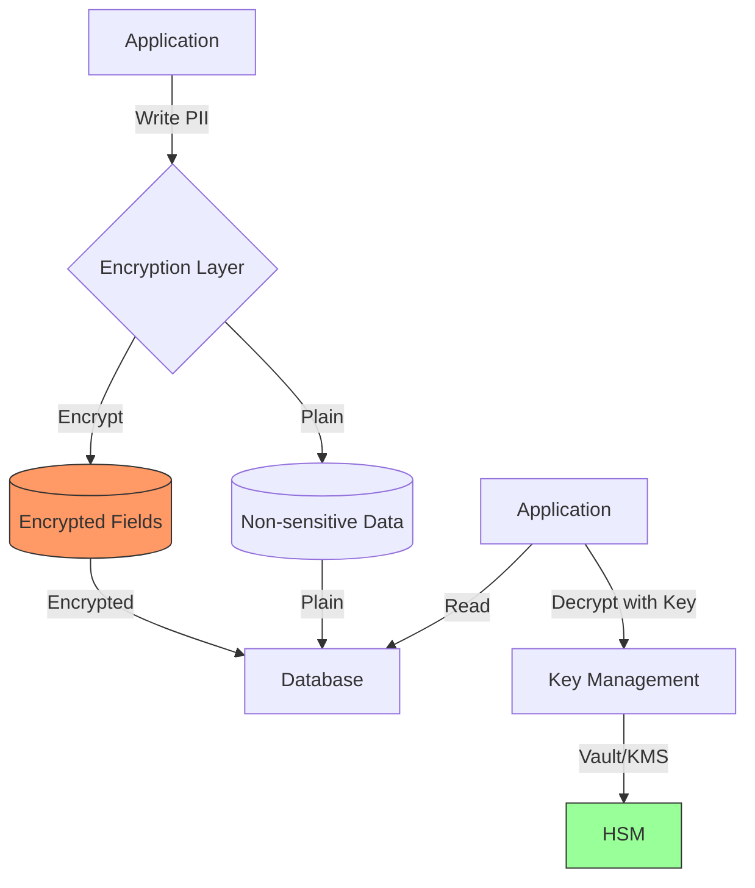
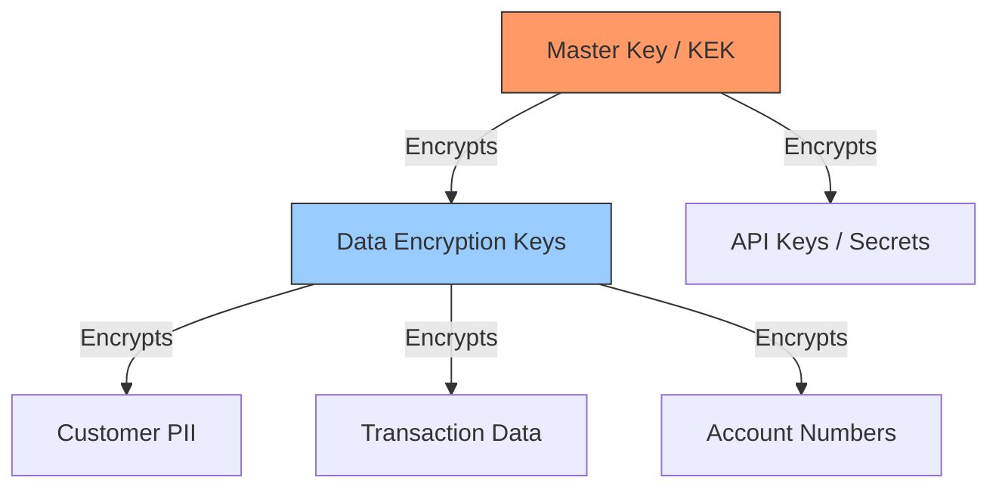

# Encryption

## Overview

Encryption protects data from unauthorized access both at rest (stored data) and in transit (data moving across networks). In banking, encryption is not optional -- it is mandated by regulations (PCI-DSS, GDPR, SOX) and is the last line of defense when other controls fail. This guide covers encryption algorithms, key management, hardware security modules, and production-grade encryption patterns.

## Encryption Fundamentals

### Symmetric vs Asymmetric Encryption

| Property | Symmetric | Asymmetric |
|---|---|---|
| Keys | Single shared key | Public/private key pair |
| Speed | Fast (GB/s) | Slow (MB/s) |
| Key Distribution | Hard (must share secret) | Easy (public key is public) |
| Algorithms | AES-256, ChaCha20 | RSA, ECDSA, ECDH |
| Use Cases | Data at rest, bulk encryption | Key exchange, digital signatures |
| Key Size | 256 bits | 2048+ bits (RSA), 256 bits (EC) |

### Real-World Encryption Failures

- **Adobe (2013)**: Used ECB mode encryption for passwords. Identical plaintext blocks produced identical ciphertext, revealing password patterns. 153M accounts affected.
- **Equifax (2017)**: Sensitive data stored without encryption at rest. 147M records exposed.
- **Capital One (2019)**: Data in S3 was encrypted, but the SSRF vulnerability allowed access to the encryption keys via instance metadata.

## Encryption at Rest

### AES-256-GCM (Recommended)

```python
from cryptography.hazmat.primitives.ciphers.aead import AESGCM
import os

class DataEncryptor:
    """
    Encrypts sensitive data at rest using AES-256-GCM.
    Each encryption operation uses a unique nonce.
    """

    def __init__(self, key: bytes):
        if len(key) != 32:
            raise ValueError("Key must be 32 bytes (256 bits)")
        self.aesgcm = AESGCM(key)

    def encrypt(self, plaintext: bytes, associated_data: bytes = None) -> bytes:
        """
        Encrypt data with AES-256-GCM.
        Returns: nonce + ciphertext + auth_tag
        """
        nonce = os.urandom(12)  # 96-bit nonce (GCM recommended size)
        ct = self.aesgcm.encrypt(nonce, plaintext, associated_data)
        return nonce + ct  # Store nonce with ciphertext

    def decrypt(self, blob: bytes, associated_data: bytes = None) -> bytes:
        """
        Decrypt data. Nonce is extracted from the beginning.
        """
        nonce = blob[:12]
        ct = blob[12:]
        return self.aesgcm.decrypt(nonce, ct, associated_data)

# Usage: Encrypt PII before storing in database
encryptor = DataEncryptor(key=get_key_from_vault())

# Encrypt customer SSN before storage
ssn = b"123-45-6789"
associated = b"customer_id:12345"  # Bound ciphertext to specific record
encrypted_ssn = encryptor.encrypt(ssn, associated)

# Store encrypted_ssn in database
db.execute(
    "INSERT INTO customers (id, encrypted_ssn) VALUES (%s, %s)",
    (12345, encrypted_ssn)
)

# Decrypt when needed (with access control check first)
if user_has_permission(current_user, "read:ssn", customer_id=12345):
    stored = db.query("SELECT encrypted_ssn FROM customers WHERE id = %s", 12345)
    ssn = encryptor.decrypt(stored, associated=b"customer_id:12345")
```

### Field-Level Encryption vs Full Database Encryption



| Approach | Pros | Cons | Banking Usage |
|---|---|---|---|
| Field-level | Selective encryption, query on non-sensitive fields | Application complexity | Recommended (encrypt SSN, account numbers) |
| Full disk/TDE | Transparent, no app changes | DBA can see data, queries on encrypted data limited | Required by PCI-DSS |
| Application-level | Maximum control, audit logging | Performance overhead, complex | For highest sensitivity data |

### Encrypting JSON Documents

```python
import json
from dataclasses import dataclass, asdict
from typing import Any

@dataclass
class EncryptedField:
    """Marker for encrypted fields in JSON"""
    encrypted: str  # Base64-encoded ciphertext
    algorithm: str = "AES-256-GCM"
    key_id: str = ""  # Which key was used (for rotation)

class JSONEncryptor:
    def __init__(self, encryptor: DataEncryptor, key_id: str):
        self.encryptor = encryptor
        self.key_id = key_id

    def encrypt_fields(self, data: dict, sensitive_fields: list[str]) -> dict:
        """Encrypt only specified fields in a JSON object"""
        result = {}
        for key, value in data.items():
            if key in sensitive_fields:
                plaintext = json.dumps(value).encode()
                encrypted = self.encryptor.encrypt(plaintext)
                result[key] = EncryptedField(
                    encrypted=base64.b64encode(encrypted).decode(),
                    key_id=self.key_id,
                )
            else:
                result[key] = value
        return result

    def decrypt_fields(self, data: dict, sensitive_fields: list[str]) -> dict:
        """Decrypt specified fields"""
        result = {}
        for key, value in data.items():
            if key in sensitive_fields and isinstance(value, dict) and "encrypted" in value:
                encrypted = base64.b64decode(value["encrypted"])
                plaintext = self.encryptor.decrypt(encrypted)
                result[key] = json.loads(plaintext)
            else:
                result[key] = value
        return result

# Usage
encryptor = JSONEncryptor(DataEncryptor(key), key_id="key-2024-01")

customer_record = {
    "id": 12345,
    "name": "John Doe",
    "ssn": "123-45-6789",
    "account_number": "ACC123456789",
    "email": "john@example.com",
}

encrypted_record = encryptor.encrypt_fields(
    customer_record,
    sensitive_fields=["ssn", "account_number"]
)

# Result:
# {
#   "id": 12345,
#   "name": "John Doe",
#   "ssn": {"encrypted": "BASE64CIPHERTEXT...", "algorithm": "AES-256-GCM", "key_id": "key-2024-01"},
#   "account_number": {"encrypted": "BASE64CIPHERTEXT...", "algorithm": "AES-256-GCM", "key_id": "key-2024-01"},
#   "email": "john@example.com"
# }
```

## Encryption in Transit

### TLS Configuration

See [TLS and Certificates](./tls-and-certificates.md) for comprehensive TLS coverage.

Key points for encryption in transit:

```python
# Enforce TLS 1.2+ for all connections
import ssl

context = ssl.SSLContext(ssl.PROTOCOL_TLS_CLIENT)
context.minimum_version = ssl.TLSVersion.TLSv1_2
context.set_ciphers('ECDHE+AESGCM:ECDHE+CHACHA20:DHE+AESGCM')
context.verify_mode = ssl.CERT_REQUIRED
context.check_hostname = True

# HTTPS-only for all API calls
import httpx

client = httpx.Client(
    verify=True,  # Verify server certificate
    http2=False,  # Disable if not needed
    timeout=10.0,
)

# Never allow HTTP redirect to silently downgrade
client.follow_redirects = True  # But verify the redirect target is HTTPS
```

### Database Connection Encryption

```python
# PostgreSQL with SSL/TLS
import psycopg2

conn = psycopg2.connect(
    host="postgres.bank.svc",
    port=5432,
    dbname="banking",
    user="app_user",
    password=get_db_password(),
    sslmode="require",        # Require SSL
    sslrootcert="/certs/ca.crt",
    sslcert="/certs/client.crt",
    sslkey="/certs/client.key",
)

# Verify encryption
with conn.cursor() as cur:
    cur.execute("SELECT ssl_is_used();")
    if not cur.fetchone()[0]:
        raise ConnectionError("Database connection is not encrypted!")
```

### Redis Encryption

```python
import redis

# TLS-enabled Redis connection
redis_client = redis.Redis(
    host="redis.bank.svc",
    port=6379,
    ssl=True,
    ssl_certfile="/certs/client.crt",
    ssl_keyfile="/certs/client.key",
    ssl_ca_certs="/certs/ca.crt",
    ssl_check_hostname=True,
    decode_responses=True,
)

# Encrypt sensitive data before storing in Redis (defense in depth)
# Even with TLS in transit, data at rest in Redis should be encrypted
sensitive_data = json.dumps({"api_key": "sk-..."})
encrypted = encryptor.encrypt(sensitive_data.encode())
redis_client.setex("config:api_key", 3600, base64.b64encode(encrypted).decode())
```

## Key Management

### Key Hierarchy



| Level | Name | Purpose | Storage |
|---|---|---|---|
| L0 | Master Key / KEK | Encrypts other keys | HSM, Cloud KMS |
| L1 | Data Encryption Keys | Encrypts actual data | Encrypted at rest |
| L2 | Per-field keys | Granular encryption | Encrypted with L1 |

### Key Lifecycle

```python
from enum import Enum
from datetime import datetime

class KeyState(Enum):
    PENDING = "pending"       # Generated but not active
    ACTIVE = "active"         # In use for encryption
    SUSPENDED = "suspended"   # Temporarily disabled
    DEACTIVATED = "deactivated"  # No new encryptions, still decrypts
    DESTROYED = "destroyed"   # Deleted, data unrecoverable

@dataclass
class EncryptionKey:
    id: str
    state: KeyState
    created_at: datetime
    activated_at: datetime | None
    deactivated_at: datetime | None
    destroyed_at: datetime | None
    algorithm: str
    key_material: bytes  # Encrypted with KEK
    key_version: int

class KeyManager:
    """Manages encryption key lifecycle"""

    def __init__(self, kms_client, key_encryption_key: bytes):
        self.kms = kms_client
        self.kek = key_encryption_key  # Key Encryption Key
        self.keys: dict[str, EncryptionKey] = {}

    def create_key(self) -> str:
        """Generate a new data encryption key"""
        import os
        key_material = os.urandom(32)  # 256-bit key

        # Encrypt key material with KEK before storage
        encrypted_material = self._encrypt_with_kek(key_material)

        key = EncryptionKey(
            id=f"dek-{int(datetime.utcnow().timestamp())}",
            state=KeyState.ACTIVE,
            created_at=datetime.utcnow(),
            activated_at=datetime.utcnow(),
            algorithm="AES-256-GCM",
            key_material=encrypted_material,
            key_version=1,
        )

        self.keys[key.id] = key
        self._persist_key(key)
        return key.id

    def rotate_key(self, key_id: str) -> str:
        """
        Rotate a key:
        1. Mark old key as DEACTIVATED (can still decrypt)
        2. Create new key (ACTIVE)
        3. Re-encrypt data with new key (background job)
        4. Eventually DESTROY old key
        """
        old_key = self.keys[key_id]
        old_key.state = KeyState.DEACTIVATED
        old_key.deactivated_at = datetime.utcnow()

        new_key_id = self.create_key()
        return new_key_id

    def decrypt_with_key(self, key_id: str, ciphertext: bytes) -> bytes:
        """Decrypt data using the specified key"""
        key = self.keys.get(key_id)
        if not key:
            raise ValueError(f"Key {key_id} not found")
        if key.state == KeyState.DESTROYED:
            raise ValueError(f"Key {key_id} has been destroyed")

        # Decrypt key material with KEK
        plaintext_key = self._decrypt_with_kek(key.key_material)

        # Use key to decrypt data
        encryptor = DataEncryptor(plaintext_key)
        return encryptor.decrypt(ciphertext)
```

### Key Rotation Strategy

```yaml
key_rotation_policy:
  master_key:
    rotation_period: 365d        # Rotate annually
    overlap_period: 30d          # Old key still works for 30 days

  data_encryption_key:
    rotation_period: 90d         # Rotate quarterly
    overlap_period: 7d

  field_encryption_key:
    rotation_period: 30d         # Rotate monthly
    overlap_period: 24h

  api_keys:
    rotation_period: 90d
    notification_days: 14
```

### Envelope Encryption Pattern

```python
class EnvelopeEncryption:
    """
    Envelope encryption: data is encrypted with a data key,
    and the data key is encrypted with a master key.

    This allows efficient key rotation -- only re-encrypt data keys,
    not all the data.
    """

    def __init__(self, kms_client):
        self.kms = kms_client

    def encrypt(self, plaintext: bytes) -> dict:
        """
        1. Generate a data key from KMS
        2. Encrypt data with the data key
        3. Return encrypted data + encrypted data key
        """
        # Request data key from KMS
        response = self.kms.generate_data_key(
            KeyId="alias/banking-master-key",
            KeySpec="AES_256",
        )
        plaintext_data_key = response["Plaintext"]
        encrypted_data_key = response["CiphertextBlob"]

        # Encrypt data with the plaintext data key
        aesgcm = AESGCM(plaintext_data_key)
        nonce = os.urandom(12)
        ciphertext = aesgcm.encrypt(nonce, plaintext, None)

        # Zero out plaintext data key from memory
        plaintext_data_key = b'\x00' * len(plaintext_data_key)

        return {
            "encrypted_data_key": base64.b64encode(encrypted_data_key).decode(),
            "nonce": base64.b64encode(nonce).decode(),
            "ciphertext": base64.b64encode(ciphertext).decode(),
        }

    def decrypt(self, envelope: dict) -> bytes:
        """
        1. Decrypt the data key using KMS
        2. Use the data key to decrypt the data
        """
        encrypted_data_key = base64.b64decode(envelope["encrypted_data_key"])
        nonce = base64.b64decode(envelope["nonce"])
        ciphertext = base64.b64decode(envelope["ciphertext"])

        # Decrypt data key with KMS
        response = self.kms.decrypt(
            CiphertextBlob=encrypted_data_key
        )
        plaintext_data_key = response["Plaintext"]

        # Decrypt data
        aesgcm = AESGCM(plaintext_data_key)
        plaintext = aesgcm.decrypt(nonce, ciphertext, None)

        # Zero out plaintext data key
        plaintext_data_key = b'\x00' * len(plaintext_data_key)

        return plaintext
```

## Hardware Security Modules (HSM)

### What is an HSM?

An HSM is a physical computing device that safeguards and manages digital keys. It provides:
- **Tamper resistance**: Physical protection against key extraction
- **FIPS 140-2 Level 3+**: Validated cryptographic module
- **Key non-exportability**: Private keys never leave the HSM
- **Audit logging**: All cryptographic operations logged

### HSM Use Cases in Banking

| Use Case | Why HSM | Regulatory Requirement |
|---|---|---|
| Card PIN processing | PCI-DSS requires HSM for PIN | PCI-DSS Requirement 3 |
| Payment transaction signing | Non-repudiation | PSD2 SCA |
| Root CA key storage | Certificate authority security | WebTrust |
| Master encryption keys | Key non-exportability | SOX, GLBA |

### Cloud HSM (AWS CloudHSM Example)

```python
import boto3

class CloudHSMManager:
    def __init__(self, cluster_id: str):
        self.cloudhsm = boto3.client('cloudhsmv2')
        self.kms = boto3.client('kms')

    def create_key_in_hsm(self) -> str:
        """Create a key that never leaves the HSM"""
        response = self.kms.create_key(
            Origin='AWS_CLOUDHSM',
            KeyUsage='ENCRYPT_DECRYPT',
            KeySpec='AES_256',
            Description='Banking master encryption key',
            Tags=[{'TagKey': 'Environment', 'TagValue': 'production'}]
        )
        return response['KeyMetadata']['KeyId']

    def encrypt_with_hsm_key(self, key_id: str, plaintext: bytes) -> bytes:
        """Encrypt data using HSM-stored key"""
        response = self.kms.encrypt(
            KeyId=key_id,
            Plaintext=plaintext,
            EncryptionAlgorithm='SYMMETRIC_DEFAULT'
        )
        return response['CiphertextBlob']

    def decrypt_with_hsm_key(self, key_id: str, ciphertext: bytes) -> bytes:
        """Decrypt data using HSM-stored key"""
        response = self.kms.decrypt(
            KeyId=key_id,
            CiphertextBlob=ciphertext
        )
        return response['Plaintext']
```

## Banking-Specific Encryption Requirements

### PCI-DSS Requirements

| Requirement | Description | Implementation |
|---|---|---|
| 3.4 | Render PAN unreadable | AES-256 encryption or truncation |
| 3.5 | Document key management | Key management policy + procedures |
| 3.6 | Key lifecycle management | Key generation, distribution, storage, rotation, destruction |
| 3.7 | Key compromise procedures | Incident response for key breach |
| 4.1 | Strong cryptography for transit | TLS 1.2+ with strong ciphers |

### Encryption at Rest: What to Encrypt

```python
# Fields that MUST be encrypted in banking systems
SENSITIVE_FIELDS = [
    "ssn",                    # Social Security Number
    "national_id",            # National identification numbers
    "account_number",         # Bank account numbers
    "card_number",            # Payment card numbers (PAN)
    "card_cvv",               # NEVER store CVV (PCI-DSS violation)
    "pin",                    # PIN codes (HSM required)
    "biometric_hash",         # Biometric data
    "date_of_birth",          # PII
    "address",                # PII
    "phone_number",           # PII
    "email",                  # PII (if linked to financial data)
    "transaction_amount",     # Financial data
    "balance",                # Financial data
    "ip_address",             # Personal data (GDPR)
    "device_fingerprint",     # Personal data
]

# Fields that CAN remain unencrypted
NON_SENSITIVE_FIELDS = [
    "id",
    "created_at",
    "currency_code",
    "transaction_type",       # DEBIT/CREDIT
    "status",                 # PENDING/COMPLETED/FAILED
    "country_code",           # Non-identifying
]
```

## Interview Questions

### Junior Level

1. What is the difference between encryption at rest and encryption in transit?
2. Why is AES-256-GCM preferred over AES-256-CBC?
3. What is a nonce and why must it be unique for each encryption?
4. What is the difference between a data encryption key and a key encryption key?

### Senior Level

1. Explain envelope encryption and why it is used in cloud environments.
2. How would you design a key rotation strategy for 100TB of encrypted data?
3. What happens when an encryption key is compromised? Walk through the response.
4. Why should you never store CVV codes, even encrypted?

### Staff Level

1. Design an encryption strategy for a multi-tenant banking platform where each tenant requires their own encryption keys.
2. How do you handle the performance impact of field-level encryption on high-throughput transaction processing?
3. What is your strategy for encrypted data recovery when a key management system fails?

## Cross-References

- [TLS and Certificates](./tls-and-certificates.md) - Encryption in transit
- [Secrets Management](./secrets-management.md) - Key storage and rotation
- [Kubernetes Security](./kubernetes-security.md) - Encryption in K8s
- [Secure Logging](./secure-logging.md) - Not logging decrypted data
