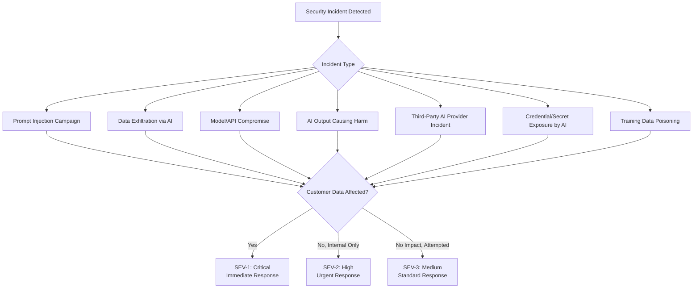
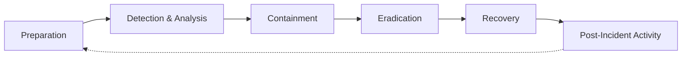
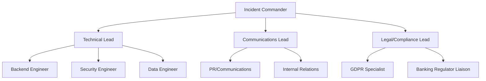
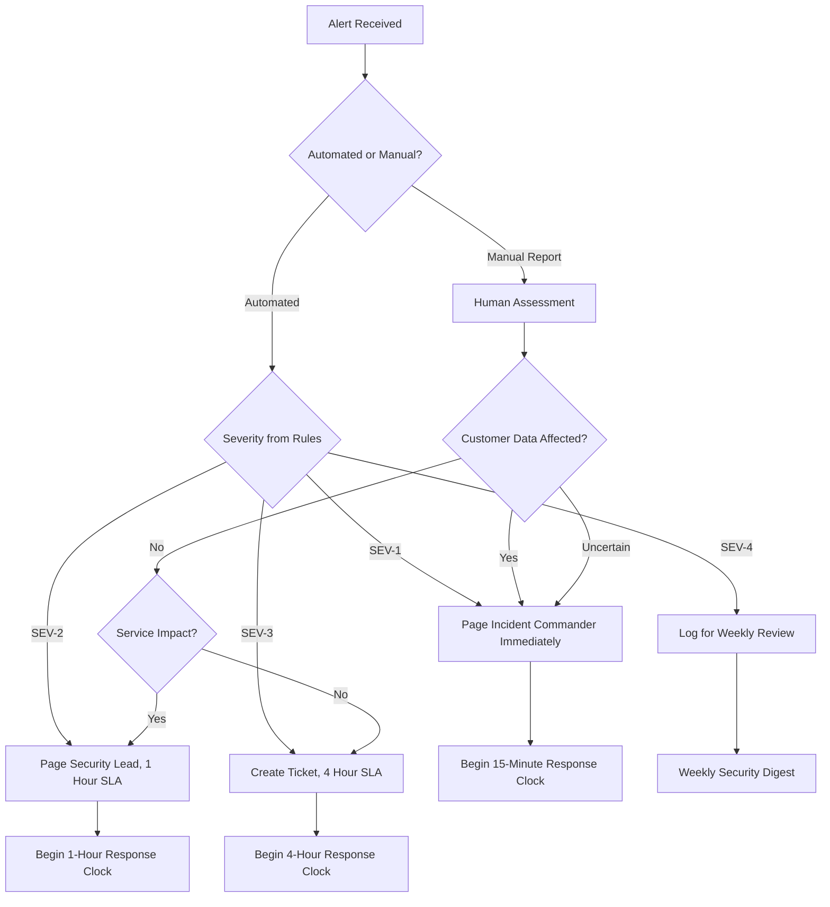
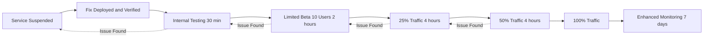

# Security Incident Response for GenAI Systems

## Overview

Security incident response is the organized process of detecting, responding to, containing, eradicating, and recovering from security incidents. GenAI systems introduce unique incident scenarios that traditional response playbooks do not cover: prompt injection campaigns, mass data exfiltration through AI outputs, model poisoning, AI-generated content causing regulatory harm, and third-party AI provider outages or compromises.

In a banking context, incident response is governed by regulatory requirements that mandate specific notification timelines, escalation paths, and documentation standards. A poorly handled incident can be more damaging than the incident itself.

## GenAI Incident Taxonomy

### Incident Types and Severity Classification



### Incident Severity Matrix for GenAI

| Severity | Criteria | Response Time | Escalation | Notification |
|----------|---------|---------------|------------|--------------|
| **SEV-1** | Customer data exposed, regulatory breach, active exploitation | 15 minutes | CISO, CTO, Legal, Comms | Regulator within 72h (GDPR) |
| **SEV-2** | Internal data exposed, successful injection, no customer impact | 1 hour | Security Lead, Engineering Lead | Internal security team |
| **SEV-3** | Attempted attack blocked, near-miss, vulnerability discovered | 4 hours | Security team | Security team weekly digest |
| **SEV-4** | Policy violation, misconfiguration without exploitation | 24 hours | Team lead | Included in security report |

### GenAI-Specific Incident Scenarios

| Scenario | Description | Example | Severity |
|----------|-------------|---------|----------|
| Prompt injection campaign | Coordinated attempts to bypass AI guardrails | Attacker uses RAG document injection to extract customer data across multiple sessions | SEV-1 |
| Data exfiltration | AI system reveals sensitive data in responses | LLM outputs account numbers from RAG context to unauthorized user | SEV-1 |
| Model compromise | LLM API or model weights compromised | Azure OpenAI credentials leaked, unauthorized access to model | SEV-1 |
| Harmful AI output | AI generates advice causing financial/regulatory harm | Compliance assistant gives incorrect regulatory guidance leading to breach | SEV-2 |
| Third-party compromise | AI provider (OpenAI, Anthropic) suffers breach | OpenAI confirms unauthorized access to customer data | SEV-1 |
| Training data poisoning | Malicious data injected into fine-tuning/training data | Attacker uploads documents with false compliance information to RAG corpus | SEV-2 |
| Secret exposure | AI reveals credentials, API keys, internal URLs | System prompt containing internal URLs exposed to user | SEV-2 |
| AI service outage | LLM API unavailable, degrading service | Azure OpenAI regional outage disables assistant for 4 hours | SEV-3 |
| Unauthorized tool use | LLM calls tools/functions beyond intended scope | LLM accesses database it should not, reads unauthorized records | SEV-1 |
| Cross-tenant data leak | Multi-tenant AI system leaks data between tenants | User A sees User B's conversation context | SEV-1 |

## Incident Response Process

### NIST-Inspired IR Lifecycle (Adapted for GenAI)



### Phase 1: Preparation

#### Incident Response Team Structure



#### Pre-Prepared Playbooks

Every GenAI incident type should have a pre-written playbook:

```markdown
# PLAYBOOK: LLM Data Exfiltration Incident
# Classification: SEV-1
# Last Updated: [Date]

## Trigger Conditions
- Response scanning detects PII/financial data in LLM output
- User reports receiving other users' data
- Unusual data access patterns detected by abuse detection system
- SIEM alert: exfiltration risk score > 0.8

## Immediate Actions (First 15 Minutes)
1. [ ] Declare SEV-1 incident, page Incident Commander
2. [ ] Enable enhanced logging for affected endpoints
3. [ ] Identify affected user(s) and conversation(s)
4. [ ] Determine what data was potentially exposed
5. [ ] Activate the affected user's session quarantine
6. [ ] Preserve all relevant logs and audit trail

## Containment (15-60 Minutes)
7. [ ] Block affected user account(s)
8. [ ] Reduce rate limits for similar endpoints
9. [ ] Enable enhanced output scanning (stricter thresholds)
10. [ ] If RAG-based: audit affected document corpus for injection
11. [ ] Review prompt injection detection rules for gaps

## Assessment (1-4 Hours)
12. [ ] Determine scope: how many users, what data, what timeframe
13. [ ] Classify exposed data (PII, financial, internal)
14. [ ] Determine if this is an isolated incident or ongoing campaign
15. [ ] Engage Legal if customer data exposed

## Notification (4-24 Hours)
16. [ ] If GDPR-triggering: begin 72-hour clock
17. [ ] Notify affected users if required
18. [ ] Prepare regulatory notification if required
19. [ ] Internal communication to leadership

## Eradication and Recovery (24-72 Hours)
20. [ ] Deploy fix for root cause
21. [ ] Verify fix with automated tests
22. [ ] Gradually restore affected services
23. [ ] Enhanced monitoring for 7 days post-fix

## Post-Incident (1 Week)
24. [ ] Conduct blameless postmortem
25. [ ] Update playbooks based on learnings
26. [ ] Implement preventive controls
27. [ ] Regulatory follow-up if required
```

#### Python: Incident Detection and Alerting

```python
import asyncio
import logging
from dataclasses import dataclass
from datetime import datetime
from enum import Enum
from typing import Optional

class IncidentSeverity(Enum):
    SEV1 = "SEV-1"
    SEV2 = "SEV-2"
    SEV3 = "SEV-3"
    SEV4 = "SEV-4"

@dataclass
class GenAIIncident:
    incident_id: str
    title: str
    severity: IncidentSeverity
    incident_type: str  # "data_exfiltration", "prompt_injection", etc.
    description: str
    detected_at: datetime
    affected_systems: list[str]
    affected_users: list[str]
    data_classes_exposed: list[str]
    is_contained: bool = False
    status: str = "open"
    incident_commander: Optional[str] = None
    timeline: list[dict] = None

class GenAIIncidentDetector:
    """Automated incident detection for GenAI systems."""

    def __init__(self, alert_service, rate_limiter, abuse_detector):
        self.alert_service = alert_service
        self.rate_limiter = rate_limiter
        self.abuse_detector = abuse_detector

    async def evaluate_event(self, event: dict) -> Optional[GenAIIncident]:
        """Evaluate an event and determine if it constitutes an incident."""
        event_type = event.get("event_type")

        if event_type == "response_contained_pii":
            return await self._handle_response_pii(event)

        if event_type == "prompt_injection_detected":
            return await self._handle_prompt_injection(event)

        if event_type == "unauthorized_data_access":
            return await self._handle_unauthorized_access(event)

        if event_type == "llm_api_error":
            return await self._handle_llm_api_error(event)

        return None

    async def _handle_response_pii(self, event: dict) -> GenAIIncident:
        """Handle PII detected in LLM response."""
        data_types = event.get("pii_types", [])
        user_id = event.get("user_id")

        # Determine severity based on data types
        critical_types = {"ssn", "account_number", "credit_card", "password"}
        high_types = {"email", "phone", "name", "address"}
        financial_types = {"balance", "transaction", "sort_code"}

        if any(t in critical_types for t in data_types):
            severity = IncidentSeverity.SEV1
        elif any(t in high_types or t in financial_types for t in data_types):
            severity = IncidentSeverity.SEV2
        else:
            severity = IncidentSeverity.SEV3

        incident = GenAIIncident(
            incident_id=f"INC-{datetime.utcnow().strftime('%Y%m%d%H%M%S')}",
            title=f"PII in LLM Response: {', '.join(data_types)}",
            severity=severity,
            incident_type="data_exfiltration",
            description=f"LLM response contained PII types: {data_types}",
            detected_at=datetime.utcnow(),
            affected_systems=["genai-assistant", "ai-gateway"],
            affected_users=[user_id] if user_id else [],
            data_classes_exposed=data_types,
        )

        await self.alert_service.create_incident(incident)

        # Auto-contain if SEV-1
        if severity == IncidentSeverity.SEV1 and user_id:
            await self.rate_limiter.block_user(
                user_id=user_id,
                reason=f"Security incident {incident.incident_id}",
                duration_hours=24,
            )

        return incident

    async def _handle_prompt_injection(self, event: dict) -> Optional[GenAIIncident]:
        """Handle prompt injection detection."""
        risk_score = event.get("risk_score", 0)
        user_id = event.get("user_id")
        blocked = event.get("blocked", True)

        # Single blocked attempt is SEV-4 (informational)
        # Successful (unblocked) injection is SEV-1
        if not blocked:
            incident = GenAIIncident(
                incident_id=f"INC-{datetime.utcnow().strftime('%Y%m%d%H%M%S')}",
                title="Successful Prompt Injection",
                severity=IncidentSeverity.SEV1,
                incident_type="prompt_injection",
                description=f"Prompt injection was not blocked (risk score: {risk_score})",
                detected_at=datetime.utcnow(),
                affected_systems=["genai-assistant"],
                affected_users=[user_id] if user_id else [],
                data_classes_exposed=[],
            )
            await self.alert_service.create_incident(incident)
            return incident

        return None  # Blocked injection, logged but not an incident
```

### Phase 2: Detection and Analysis

#### Triage Decision Tree



### Phase 3: Containment

#### Short-Term Containment Actions

```python
class GenAIIncidentResponder:
    """Execute containment actions for GenAI incidents."""

    def __init__(self, account_service, rate_limiter, feature_flags, rag_service):
        self.account_service = account_service
        self.rate_limiter = rate_limiter
        self.feature_flags = feature_flags
        self.rag_service = rag_service

    async def contain_sev1_exfiltration(self, incident: GenAIIncident):
        """Contain a SEV-1 data exfiltration incident."""

        # 1. Block affected user accounts
        for user_id in incident.affected_users:
            await self.account_service.suspend_account(
                user_id=user_id,
                reason=f"Incident {incident.incident_id}: suspected data exfiltration",
            )

        # 2. Aggressively rate-limit affected endpoints
        await self.rate_limiter.emergency_reduce(
            endpoint="/api/v1/chat",
            factor=0.25,  # 25% of normal limits
            duration_hours=4,
        )

        # 3. Enable maximum output scanning
        await self.feature_flags.set("enhanced_output_scanning", True)

        # 4. If RAG-based: quarantine suspected documents
        if incident.incident_type == "data_exfiltration":
            await self.rag_service.quarantine_documents_by_risk_score(
                min_risk_score=0.7,
                reason=f"Incident {incident.incident_id}",
            )

        # 5. Preserve evidence
        await self._preserve_evidence(incident)

        incident.is_contained = True

    async def contain_successful_injection(self, incident: GenAIIncident):
        """Contain a successful prompt injection."""

        # 1. Block the specific user
        for user_id in incident.affected_users:
            await self.account_service.suspend_account(
                user_id=user_id,
                reason=f"Incident {incident.incident_id}: successful prompt injection",
            )

        # 2. Update injection detection rules
        # (This should be done carefully -- automated rule updates need review)
        await self.feature_flags.set("strict_injection_detection", True)

        # 3. Audit recent responses from affected conversations
        # for additional data that may have been exposed

        incident.is_contained = True

    async def _preserve_evidence(self, incident: GenAIIncident):
        """Preserve all relevant logs and data for forensic analysis."""
        # Copy relevant logs to immutable evidence store
        # Include: access logs, application logs, audit logs, database queries
        # Hash all evidence for integrity verification
        pass
```

### Phase 4: Eradication

#### Root Cause Analysis and Fix

```markdown
## Eradication Checklist

### For Data Exfiltration Incidents
- [ ] Identify root cause (missing ACL? injection vulnerability? misconfiguration?)
- [ ] Deploy fix with regression tests
- [ ] Verify fix in staging with same attack patterns
- [ ] Update RAG document sanitization if documents were the vector
- [ ] Update prompt injection detection rules if injection was the vector
- [ ] Review and update access control policies
- [ ] Re-scan all RAG documents for injection payloads
- [ ] Verify output scanning catches the specific data type that leaked

### For Prompt Injection Incidents
- [ ] Analyze the injection payload and identify detection gap
- [ ] Add detection rule for the specific injection pattern
- [ ] Update system prompt with additional protections
- [ ] Test against known injection datasets (Garak, Promptfoo)
- [ ] Review RAG document ingestion for malicious content
- [ ] Implement additional output validation

### For Credential/Secret Exposure
- [ ] Rotate ALL exposed credentials immediately
- [ ] Review access logs for unauthorized use of exposed credentials
- [ ] Update secret management to prevent recurrence
- [ ] Audit system prompts for any remaining secrets
- [ ] Implement secret scanning in prompt/response pipeline
```

### Phase 5: Recovery

#### Gradual Service Restoration



### Phase 6: Post-Incident Activity

#### Blameless Postmortem Template

```markdown
# Postmortem: [Incident Title]
# Incident ID: [INC-XXXX]
# Date: [Date]
# Authors: [Names]

## Summary
[Brief description of what happened, impact, and resolution]

## Timeline
| Time (UTC) | Event |
|------------|-------|
| 14:32 | Automated detection: PII found in LLM response |
| 14:35 | SEV-1 declared, Incident Commander paged |
| 14:42 | IC acknowledges, war room opened |
| 14:50 | Containment: user blocked, rate limits reduced |
| 15:15 | Root cause identified: missing ACL on RAG retrieval |
| 16:00 | Fix deployed to staging, tested |
| 16:30 | Fix deployed to production |
| 17:00 | Service restored to limited users |
| 18:00 | Full service restored |

## Impact
- **Duration:** 3 hours 28 minutes
- **Affected Users:** 12
- **Data Exposed:** Customer email addresses and names (not financial data)
- **Financial Impact:** None identified
- **Regulatory Impact:** GDPR notification assessed, not required (low risk)

## Root Cause
The RAG retriever did not enforce document-level access control when returning
similar documents. Documents from all clearance levels were returned based on
similarity alone, and the LLM included content from a document the user was not
authorized to access in its response.

## Contributing Factors
1. Access control enforcement was only at the service layer, not at retrieval
2. No automated test verified ACL enforcement in the retrieval pipeline
3. Output scanning caught the PII, but only after it had been returned to 12 users

## What Went Well
- Automated detection caught the PII in responses within 3 minutes
- Incident response playbook was followed correctly
- Containment actions were effective within 15 minutes
- Communication to stakeholders was timely

## What Could Be Improved
- Detection should have been at retrieval time, not output time
- No integration test for ACL enforcement existed
- Rate limiting should have been triggered automatically

## Action Items
| ID | Action | Owner | Due Date | Status |
|----|--------|-------|----------|--------|
| 1 | Implement document-level ACL in RAG retriever | Platform Team | 1 week | In Progress |
| 2 | Add ACL enforcement test to integration test suite | QA Team | 1 week | Open |
| 3 | Add automated containment for SEV-1 PII detection | Security Team | 2 weeks | Open |
| 4 | Review all RAG document corpus for similar ACL gaps | Data Engineering | 1 week | In Progress |

## Lessons Learned
- Defense in depth: PII scanning caught the issue, but the first line of
  defense (access control at retrieval) was missing
- Automated tests must verify security-critical functionality
- Incident response was effective because playbooks were prepared in advance
```

## Regulatory Notification Requirements

### GDPR Breach Notification Timeline

```mermaid
gantt
    title GDPR Breach Notification Timeline
    dateFormat HH:mm
    axisFormat %H:%M

    section Incident
    Detection              :00:00, 15m
    Initial Assessment     :00:15, 45m
    Containment            :01:00, 2h
    Full Assessment        :03:00, 5h

    section Decision
    GDPR Assessment        :08:00, 4h
    Legal Review           :12:00, 2h
    Notify DPA Decision    :14:00, 1h

    section Notification
    DPA Notification (if required)    :15:00, 57h
    User Notification (if required)   :24:00, 48h

    section Deadline
    72-Hour DPA Deadline   :crit, 72:00, 1m
```

### Banking-Specific Notification Requirements

| Regulation | Trigger | Timeline | Recipient |
|-----------|---------|----------|-----------|
| GDPR | Personal data breach | 72 hours | Supervisory Authority |
| GDPR (User) | High risk to individuals | Without undue delay | Affected individuals |
| FCA/PRA | Material operational incident | Promptly | FCA Supervisory Team |
| PCI-DSS | Cardholder data breach | Immediately | Card brands, acquirer |
| DORA (EU) | ICT incident affecting financial interest | 4 hours (initial), 24 hours (detailed) | Competent Authority |
| Internal | Any SEV-1/SEV-2 | Per internal policy | CISO, CTO, Legal |

## Prometheus: Incident Detection Alert Rules

```yaml
groups:
  - name: genai-security-incidents
    rules:
      - alert: GenAIDataExfiltrationDetected
        expr: rate(llm_exfiltration_blocks_total{action="blocked"}[5m]) > 0
        for: 1m
        labels:
          severity: critical
          team: genai-security
        annotations:
          summary: "LLM data exfiltration detected"
          description: "PII or sensitive data detected in LLM response. Check SIEM for details."
          runbook_url: "https://internal.wiki/runbooks/genai-data-exfiltration"

      - alert: GenAIPromptInjectionSuccessful
        expr: increase(genai_prompt_injection_unblocked_total[5m]) > 0
        for: 0m
        labels:
          severity: critical
          team: genai-security
        annotations:
          summary: "Successful prompt injection detected"
          description: "A prompt injection was not blocked by security controls"
          runbook_url: "https://internal.wiki/runbooks/prompt-injection"

      - alert: GenAIAbnormalUserBehavior
        expr: genai_abuse_anomaly_score > 0.8
        for: 5m
        labels:
          severity: warning
          team: genai-security
        annotations:
          summary: "Abnormal user behavior detected"
          description: "User {{ $labels.user_id }} has anomaly score {{ $value }}"
          runbook_url: "https://internal.wiki/runbooks/abuse-detection"
```

## Secure Defaults and Hardening Checklist

### Must-Have Controls

- [ ] Pre-written incident response playbooks for each GenAI incident type
- [ ] Automated incident detection with severity classification
- [ ] Defined incident response team structure with named roles
- [ ] Evidence preservation procedures (immutable logs, hash chains)
- [ ] Regulatory notification timeline tracking (GDPR 72-hour clock)
- [ ] Post-incident blameless postmortem process
- [ ] Containment automation capability (block users, reduce rate limits, toggle feature flags)
- [ ] Regular incident response tabletop exercises (quarterly)

### Should-Have Controls

- [ ] Automated containment for confirmed SEV-1 incidents
- [ ] War room automation (Slack/Teams channel, evidence collection)
- [ ] Real-time dashboard of active incidents
- [ ] Integration between abuse detection and incident response systems
- [ ] Postmortem action item tracking with SLA
- [ ] Annual red team exercise including GenAI attack scenarios
- [ ] Regulatory notification templates pre-approved by Legal
- [ ] Customer communication templates pre-approved by Legal and Comms

### Interview Questions

1. **Your automated system detects that a GenAI assistant has output another customer's account number. Walk through your incident response from detection to resolution.**

2. **A user reports that the AI assistant gave them incorrect compliance guidance that caused a regulatory breach. How do you handle this incident? What makes it different from a technical security incident?**

3. **During an incident, the Incident Commander asks you to preserve evidence. What do you preserve and how do you ensure its integrity?**

4. **You discover that an attacker has been using your GenAI system for 2 weeks to gradually extract information about your internal processes. No single request was flagged, but the cumulative picture is clear. How did this happen and how do you respond?**

5. **Your postmortem identifies that the root cause was a missing access control check in the RAG retrieval pipeline. What action items do you create and how do you prioritize them?**

6. **When would you need to notify regulators about a GenAI security incident?** Consider GDPR, FCA, and PCI-DSS contexts.

7. **How do you balance the need for rapid containment with the need to preserve evidence for forensic analysis?**

## Cross-References

- `abuse-detection.md` -- Detection systems that trigger incidents
- `llm-data-exfiltration.md` -- Exfiltration incident scenarios
- `prompt-injection.md` -- Injection incident scenarios
- `secure-logging.md` -- Evidence preservation through secure logging
- `genai-threat-modeling.md` -- Threat model informing incident types
- `../incident-management/` -- General incident management practices
- `../regulations-and-compliance/gdpr.md` -- GDPR breach notification requirements
- `../regulations-and-compliance/audit-trails.md` -- Audit evidence requirements
- `../observability/` -- Monitoring and alerting infrastructure

## Further Reading

- NIST SP 800-61: Computer Security Incident Handling Guide
- GDPR Article 33: Notification of Personal Data Breach
- SANS Incident Response Process
- PagerDuty Incident Response Documentation
- "Incident Response in the Age of AI" -- Black Hat 2024
