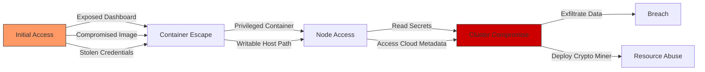

# Kubernetes Security

## Overview

Kubernetes is the orchestration platform running banking workloads. A misconfigured cluster can lead to full platform compromise, data exfiltration, and regulatory violations. This guide covers pod security, RBAC, network policies, image security, and runtime protection for production Kubernetes clusters in banking environments.

## Threat Landscape

### Kubernetes Attack Vectors



| Attack | Description | Real-World Example |
|---|---|---|
| Cryptojacking | Deploying mining containers | Tesla (2018): Kubernetes console misconfiguration |
| Supply Chain | Malicious container images | Multiple incidents via Docker Hub |
| Privilege Escalation | Container escaping to host | CVE-2019-5736: runc escape |
| Credential Theft | Accessing service account tokens | Cloud metadata SSRF attacks |
| Data Exfiltration | Reading secrets/ConfigMaps | Misconfigured RBAC |
| DoS | Resource exhaustion | No resource limits set |

### Real-World Kubernetes Breaches

- **Tesla (2018)**: Unprotected Kubernetes dashboard allowed attackers to deploy crypto-mining containers. AWS credentials obtained via pod metadata API.
- **Redhat Team (2018)**: Researchers found 840M records exposed via misconfigured MongoDB on Kubernetes.
- **Unit 42 / Palo Alto (2020)**: Multiple organizations found with exposed etcd databases containing Kubernetes secrets.

## Pod Security

### Pod Security Standards

| Standard | Description | Banking Usage |
|---|---|---|
| Privileged | No restrictions | NEVER in production |
| Baseline | Prevents known privilege escalations | Minimum for development |
| Restricted | Hardened security posture | REQUIRED for production |

### Secure Pod Specification

```yaml
apiVersion: v1
kind: Pod
metadata:
  name: banking-api
  namespace: production
  labels:
    app: banking-api
    tier: frontend
    version: "2.1.0"
spec:
  # Run as non-root user
  securityContext:
    runAsNonRoot: true
    runAsUser: 1000
    runAsGroup: 1000
    fsGroup: 1000
    seccompProfile:
      type: RuntimeDefault

  automountServiceAccountToken: false

  # Restrict which nodes the pod can run on
  nodeSelector:
    workload-type: banking-production

  # Anti-affinity: don't run two replicas on same node
  affinity:
    podAntiAffinity:
      requiredDuringSchedulingIgnoredDuringExecution:
      - labelSelector:
          matchExpressions:
          - key: app
            operator: In
            values:
            - banking-api
        topologyKey: kubernetes.io/hostname

  containers:
  - name: banking-api
    image: registry.bank.internal/banking-api@sha256:abc123...
    # Pin by digest, never use :latest in production

    ports:
    - containerPort: 8443
      protocol: TCP

    securityContext:
      allowPrivilegeEscalation: false
      readOnlyRootFilesystem: true
      capabilities:
        drop:
          - ALL

    resources:
      requests:
        memory: "256Mi"
        cpu: "250m"
      limits:
        memory: "512Mi"
        cpu: "500m"

    # Read-only root filesystem with writable tmp
    volumeMounts:
    - name: tmp
      mountPath: /tmp
    - name: cache
      mountPath: /app/cache
    - name: tls-cert
      mountPath: /etc/tls
      readOnly: true

    # Health checks
    livenessProbe:
      httpGet:
        path: /healthz
        port: 8443
        scheme: HTTPS
      initialDelaySeconds: 30
      periodSeconds: 10
      timeoutSeconds: 5
      failureThreshold: 3

    readinessProbe:
      httpGet:
        path: /ready
        port: 8443
        scheme: HTTPS
      initialDelaySeconds: 5
      periodSeconds: 5

    # Environment from secrets (not hardcoded)
    env:
    - name: DB_HOST
      value: "postgres.bank.svc"
    - name: DB_PASSWORD
      valueFrom:
        secretKeyRef:
          name: banking-db-credentials
          key: password
    - name: LOG_LEVEL
      value: "info"  # Not "debug" in production

  volumes:
  - name: tmp
    emptyDir:
      sizeLimit: 100Mi
  - name: cache
    emptyDir:
      sizeLimit: 200Mi
  - name: tls-cert
    secret:
      secretName: banking-api-tls
      defaultMode: 0400
```

### Pod Security Admission (Kubernetes 1.25+)

```yaml
# Enforce restricted Pod Security Standard at namespace level
apiVersion: v1
kind: Namespace
metadata:
  name: production
  labels:
    pod-security.kubernetes.io/enforce: restricted
    pod-security.kubernetes.io/enforce-version: latest
    pod-security.kubernetes.io/audit: restricted
    pod-security.kubernetes.io/audit-version: latest
    pod-security.kubernetes.io/warn: restricted
    pod-security.kubernetes.io/warn-version: latest
```

## RBAC (Role-Based Access Control)

### Principle of Least Privilege

```yaml
# BAD: Wildcard permissions (cluster-admin equivalent)
apiVersion: rbac.authorization.k8s.io/v1
kind: ClusterRole
metadata:
  name: bad-role
rules:
- apiGroups: ["*"]
  resources: ["*"]
  verbs: ["*"]

# GOOD: Minimal permissions for banking API service account
apiVersion: rbac.authorization.k8s.io/v1
kind: Role
metadata:
  name: banking-api-role
  namespace: production
rules:
# Read own ConfigMaps
- apiGroups: [""]
  resources: ["configmaps"]
  verbs: ["get", "list"]
  resourceNames: ["banking-api-config"]

# Read own secrets (specifically named)
- apiGroups: [""]
  resources: ["secrets"]
  verbs: ["get"]
  resourceNames: ["banking-api-secret", "banking-db-credentials"]

# Read own service account token
- apiGroups: [""]
  resources: ["serviceaccounts"]
  verbs: ["get"]
  resourceNames: ["banking-api-sa"]

---
apiVersion: rbac.authorization.k8s.io/v1
kind: RoleBinding
metadata:
  name: banking-api-rolebinding
  namespace: production
subjects:
- kind: ServiceAccount
  name: banking-api-sa
  namespace: production
roleRef:
  kind: Role
  name: banking-api-role
  apiGroup: rbac.authorization.k8s.io
```

### Restricting Human Access

```yaml
# Developers can view logs but not exec into pods
apiVersion: rbac.authorization.k8s.io/v1
kind: Role
metadata:
  name: developer-role
  namespace: production
rules:
- apiGroups: [""]
  resources: ["pods", "pods/log"]
  verbs: ["get", "list", "watch"]
- apiGroups: [""]
  resources: ["events"]
  verbs: ["get", "list"]
- apiGroups: ["apps"]
  resources: ["deployments", "replicasets"]
  verbs: ["get", "list", "watch"]
# NO exec, NO port-forward, NO secret access

---
# SRE team has elevated access
apiVersion: rbac.authorization.k8s.io/v1
kind: Role
metadata:
  name: sre-role
  namespace: production
rules:
- apiGroups: [""]
  resources: ["pods", "pods/log", "pods/exec"]
  verbs: ["get", "list", "watch", "create"]
- apiGroups: [""]
  resources: ["secrets"]
  verbs: ["get", "list"]
# NO delete, NO update (use CI/CD for changes)

---
# Production namespace: NO delete on deployments
apiVersion: rbac.authorization.k8s.io/v1
kind: Role
metadata:
  name: production-admin
  namespace: production
rules:
- apiGroups: ["apps"]
  resources: ["deployments"]
  verbs: ["get", "list", "watch", "update", "patch"]
  # NO delete in production
- apiGroups: [""]
  resources: ["services", "configmaps"]
  verbs: ["get", "list", "watch", "create", "update", "patch"]
```

### Audit RBAC Regularly

```bash
# Find overly permissive roles
kubectl get clusterroles -o json | jq -r '
  .items[] |
  select(.rules[]? |
    (.verbs | contains(["*"])) or
    (.resources | contains(["*"])) or
    (.apiGroups | contains(["*"]))
  ) |
  .metadata.name
'

# Find service accounts with cluster-admin
kubectl get clusterrolebindings -o json | jq -r '
  .items[] |
  select(.roleRef.name == "cluster-admin") |
  .subjects[] |
  select(.kind == "ServiceAccount") |
  "\(.namespace)/\(.name)"
'

# Check for pods using default service account
kubectl get pods --all-namespaces -o json | jq -r '
  .items[] |
  select(.spec.serviceAccountName == "default") |
  "\(.metadata.namespace)/\(.metadata.name)"
'
```

## Network Policies

See [Network Security](./network-security.md) for comprehensive network policy coverage.

Key patterns:

```yaml
# Default deny all traffic
apiVersion: networking.k8s.io/v1
kind: NetworkPolicy
metadata:
  name: default-deny-all
  namespace: production
spec:
  podSelector: {}
  policyTypes:
  - Ingress
  - Egress

---
# Allow only specific service communication
apiVersion: networking.k8s.io/v1
kind: NetworkPolicy
metadata:
  name: banking-api-network
  namespace: production
spec:
  podSelector:
    matchLabels:
      app: banking-api
  policyTypes:
  - Ingress
  - Egress
  ingress:
  - from:
    - podSelector:
        matchLabels:
          app: api-gateway
    ports:
    - protocol: TCP
      port: 8443
  egress:
  # DNS
  - to: []
    ports:
    - protocol: UDP
      port: 53
    - protocol: TCP
      port: 53
  # Database
  - to:
    - podSelector:
        matchLabels:
          app: postgresql
    ports:
    - protocol: TCP
      port: 5432
  # Auth service
  - to:
    - podSelector:
        matchLabels:
          app: auth-service
    ports:
    - protocol: TCP
      port: 8443
```

## Image Security

### Image Scanning Pipeline

```yaml
# Trivy image scanning in CI/CD
name: Image Security Scan
on:
  pull_request:
    paths:
      - 'Dockerfile'
      - '**/requirements.txt'
      - '**/go.mod'
      - '**/package.json'

jobs:
  scan:
    runs-on: ubuntu-latest
    steps:
      - uses: actions/checkout@v4

      - name: Build image
        run: docker build -t banking-api:${{ github.sha }} .

      - name: Run Trivy vulnerability scanner
        uses: aquasecurity/trivy-action@master
        with:
          image-ref: 'banking-api:${{ github.sha }}'
          format: 'sarif'
          output: 'trivy-results.sarif'
          severity: 'CRITICAL,HIGH'
          exit-code: '1'  # Fail on CRITICAL/HIGH

      - name: Upload results
        uses: github/codeql-action/upload-sarif@v2
        with:
          sarif_file: 'trivy-results.sarif'
```

### Image Admission Controller

```yaml
# OPA/Gatekeeper: Only allow images from trusted registry
apiVersion: constraints.gatekeeper.sh/v1beta1
kind: K8sTrustedImages
metadata:
  name: require-trusted-images
spec:
  match:
    kinds:
      - apiGroups: [""]
        kinds: ["Pod"]
    namespaces: ["production"]
  parameters:
    registries:
      - "registry.bank.internal"
      - "gcr.io/bank-project"

---
# OPA/Gatekeeper: No latest tag
apiVersion: constraints.gatekeeper.sh/v1beta1
kind: K8sDisallowedTags
metadata:
  name: no-latest-tag
spec:
  match:
    kinds:
      - apiGroups: [""]
        kinds: ["Pod"]
    namespaces: ["production"]
  parameters:
    tags:
      - "latest"
```

### Secure Dockerfile

```dockerfile
# Multi-stage build for minimal attack surface
FROM golang:1.21-alpine AS builder
WORKDIR /app

# Download dependencies separately (better caching)
COPY go.mod go.sum ./
RUN go mod download

# Copy source and build
COPY . .
RUN CGO_ENABLED=0 GOOS=linux go build \
    -ldflags="-s -w -X main.version=${VERSION}" \
    -o /app/banking-api

# Final stage: minimal runtime
FROM gcr.io/distroless/static:nonroot

# Copy binary from builder
COPY --from=builder /app/banking-api /banking-api

# Health check
HEALTHCHECK --interval=30s --timeout=5s --start-period=10s --retries=3 \
  CMD ["/banking-api", "health"]

USER nonroot:nonroot
EXPOSE 8443

ENTRYPOINT ["/banking-api"]
```

## Runtime Security

### Falco for Runtime Threat Detection

```yaml
# Falco rules for banking workloads
- rule: Suspicious Shell Spawned in Container
  desc: Detects shell execution in production containers
  condition: >
    spawned_process and container and
    container.image.repository contains "banking" and
    proc.name in (sh, bash, zsh, ash)
  output: >
    Shell spawned in banking container
    (user=%user.name, container=%container.name,
    image=%container.image.repository, command=%proc.cmdline)
  priority: CRITICAL
  tags: [container, banking, shell]

- rule: Sensitive File Read in Container
  desc: Detects reading sensitive files
  condition: >
    open_read and container and
    (fd.name startswith /etc/shadow or
     fd.name startswith /etc/passwd or
     fd.name startswith /var/run/secrets/kubernetes.io)
  output: >
    Sensitive file read in container
    (user=%user.name, file=%fd.name, container=%container.name)
  priority: WARNING
  tags: [container, filesystem]

- rule: Outbound Connection to Non-Allowed Destination
  desc: Detects connections to unexpected destinations
  condition: >
    outbound and container and
    not fd.sip in (allowed_ip_ranges) and
    container.image.repository contains "banking"
  output: >
    Outbound connection to non-allowed destination
    (container=%container.name, connection=%fd.name)
  priority: WARNING
  tags: [network, banking]

- rule: Crypto Mining Process Detected
  desc: Detects known crypto mining binaries
  condition: >
    spawned_process and
    proc.name in (xmrig, minerd, cpuminer, cgminer, bfgminer,
                  ethminer, claymore, nicehash, coinhive)
  output: >
    Crypto mining detected
    (user=%user.name, process=%proc.name, command=%proc.cmdline,
     container=%container.name)
  priority: CRITICAL
  tags: [cryptomining, process]
```

## Secrets in Kubernetes

See [Secrets Management](./secrets-management.md) for comprehensive secrets coverage.

Key points:
- Enable encryption at rest for etcd
- Use External Secrets Operator with Vault
- Never store secrets in ConfigMaps
- Rotate service account tokens regularly

## GenAI-Specific Kubernetes Security

### GPU Node Security

```yaml
# Taint GPU nodes to prevent general workloads
apiVersion: v1
kind: Node
metadata:
  name: gpu-node-1
  labels:
    gpu-type: nvidia-a100
    workload-type: genai
  taints:
  - key: workload-type
    value: genai
    effect: NoSchedule

---
# Only GenAI workloads can schedule on GPU nodes
apiVersion: apps/v1
kind: Deployment
metadata:
  name: genai-service
  namespace: production
spec:
  template:
    spec:
      tolerations:
      - key: "workload-type"
        operator: "Equal"
        value: "genai"
        effect: "NoSchedule"
      nodeSelector:
        workload-type: genai
```

### Model Volume Security

```yaml
# Mount model storage read-only
apiVersion: v1
kind: PersistentVolumeClaim
metadata:
  name: model-storage
  namespace: production
spec:
  accessModes:
    - ReadOnlyMany
  storageClassName: model-storage-sc

---
# GenAI pod with read-only model volume
apiVersion: apps/v1
kind: Deployment
metadata:
  name: genai-service
spec:
  template:
    spec:
      containers:
      - name: genai
        image: registry.bank.internal/genai-service:sha256-abc
        volumeMounts:
        - name: model
          mountPath: /models
          readOnly: true  # Prevent model modification
        - name: tmp
          mountPath: /tmp
      volumes:
      - name: model
        persistentVolumeClaim:
          claimName: model-storage
      - name: tmp
        emptyDir: {}
```

## Security Testing

### kube-bench (CIS Benchmark)

```bash
# Run CIS Kubernetes Benchmark
kube-bench run --targets master,node,policy,managedservices

# Check for critical findings
kube-bench run --json | jq '.Totals.CHECKS | to_entries[] | select(.value > 0)'

# CI/CD gate
kube-bench run --check 1.1.1,1.1.2,1.1.3  # etcd encryption checks
if [ $? -ne 0 ]; then
  echo "Critical security checks failed"
  exit 1
fi
```

### kubesec (Pod Security Scoring)

```bash
# Score pod specifications
kubesec scan pod.yaml

# Example output:
# [{
#   "score": 8,
#   "scoring": {
#     "critical": [
#       {
#         "selector": "containers[]",
#         "reason": "Default capabilities not set",
#         "weight": 1
#       }
#     ],
#     "advise": [
#       {
#         "selector": ".spec.securityContext.runAsNonRoot",
#         "reason": "Not set to true",
#         "weight": 1
#       }
#     ]
#   }
# }]
```

## Interview Questions

### Junior Level

1. Why should containers run as non-root users?
2. What is the difference between a Role and a ClusterRole?
3. Why should you pin container images by digest instead of tag?
4. What is a network policy and why is it important?

### Senior Level

1. How would you design RBAC for a team of 20 developers who need production access for debugging?
2. Explain how you would detect a compromised container in real-time.
3. What is the difference between liveness and readiness probes from a security perspective?
4. How do you prevent a container from accessing the Kubernetes API server?

### Staff Level

1. Design a multi-tenant Kubernetes platform security model where each tenant is a different banking division.
2. How would you respond to a confirmed container escape on a production node?
3. What is your strategy for managing Kubernetes cluster upgrades without downtime while maintaining security compliance?

## Cross-References

- [OpenShift Security](./openshift-security.md) - OpenShift-specific controls
- [Network Security](./network-security.md) - Network segmentation
- [Secrets Management](./secrets-management.md) - K8s secrets handling
- [Service-to-Service Security](./service-to-service-security.md) - mTLS between pods
