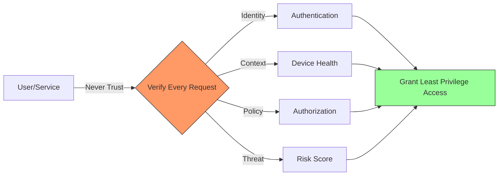
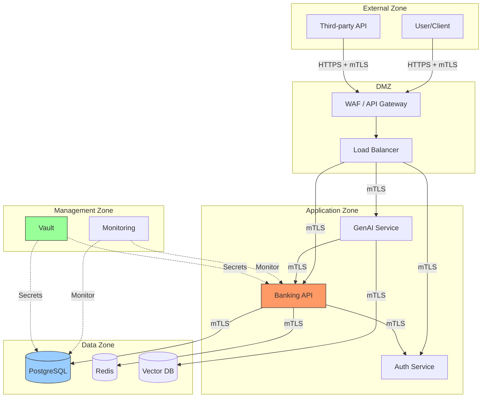
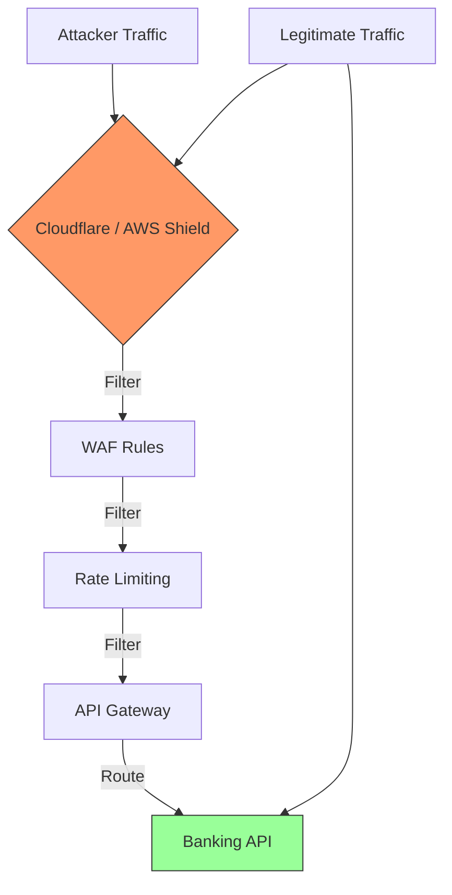

# Network Security

## Overview

Network security in banking is not about building a perimeter -- it is about controlling every connection between every component. With microservices, cloud, and GenAI platforms, the traditional network perimeter has dissolved. This guide covers zero trust networking, VPC design, network segmentation, and defense-in-depth for banking infrastructure.

## Threat Landscape

### Network-Level Attacks

| Attack | Description | Impact |
|---|---|---|
| Lateral Movement | Attacker moves from compromised service to others | Full platform compromise |
| DNS Spoofing | Redirect traffic to attacker-controlled server | Credential theft |
| ARP Poisoning | Intercept traffic on same network segment | Man-in-the-middle |
| VLAN Hopping | Jump between network segments | Bypass segmentation |
| BGP Hijacking | Redirect traffic at ISP level | Traffic interception |
| DDoS | Overwhelm services with traffic | Service outage |
| Eavesdropping | Capture unencrypted network traffic | Data exfiltration |
| Port Scanning | Discover services and versions | Attack surface mapping |

### Real-World Network Breaches

- **Target (2013)**: Attackers entered through HVAC vendor's network credentials, moved laterally to payment systems. 40M credit cards stolen. Cost: $18.5M settlement.
- **Maersk (2017)**: NotPetya malware spread laterally across network, destroying 45,000 endpoints. Cost: $300M.
- **Colonial Pipeline (2021)**: Lateral movement from legacy VPN to OT systems. Pipeline shutdown, $4.4M ransom paid.

## Zero Trust Architecture

### Principles



**Zero Trust Principles:**
1. **Never trust, always verify** -- Every request is authenticated and authorized
2. **Assume breach** -- Design as if the network is already compromised
3. **Least privilege access** -- Grant minimum required permissions
4. **Microsegmentation** -- Isolate workloads from each other
5. **Continuous monitoring** -- Detect anomalies in real-time

### Zero Trust Network Architecture



## VPC Design for Banking

### Multi-VPC Architecture

```mermaid
graph TB
    subgraph "VPC: Shared Services"
        A[NAT Gateway]
        B[Transit Gateway]
        C[DNS Resolver]
    end

    subgraph "VPC: Production"
        subgraph "Subnet: Public"
            D[API Gateway]
            E[Load Balancer]
        end
        subnet "Subnet: Private - App"
            F[Banking API Pods]
            G[Auth Service Pods]
        end
        subnet "Subnet: Private - Data"
            H[PostgreSQL Primary]
            I[Redis Cluster]
        end
    end

    subgraph "VPC: Development"
        J[Dev API]
        K[Dev Database]
    end

    subgraph "VPC: Management"
        L[Monitoring]
        M[Vault]
        N[CI/CD]
    end

    B <--> D
    B <--> J
    B <--> L
    A --> F
    F --> H

    style D fill:#f96,stroke:#333
    style H fill:#9cf,stroke:#333
    style M fill:#9f9,stroke:#333
```

### VPC Design Principles

| Principle | Implementation | Rationale |
|---|---|---|
| Separate environments | Different VPCs for prod/stage/dev | Prevent dev-to-prod attacks |
| Private subnets for data | Data subnets with no internet route | Data cannot be exfiltrated directly |
| NAT for outbound only | Services can reach internet but not receive | Block inbound attack vectors |
| Transit Gateway | Centralized inter-VPC routing | Controlled cross-VPC communication |
| VPC Flow Logs | All traffic logged to S3/SIEM | Forensic capability |
| No peering by default | Explicit peering only | Minimize blast radius |

### AWS VPC Configuration

```yaml
# VPC with private subnets for banking workloads
Resources:
  BankingVPC:
    Type: AWS::EC2::VPC
    Properties:
      CidrBlock: 10.0.0.0/16
      EnableDnsHostnames: true
      EnableDnsSupport: true
      Tags:
        - Key: Name
          Value: banking-production

  # Public subnets (only for load balancers and NAT)
  PublicSubnetA:
    Type: AWS::EC2::Subnet
    Properties:
      VpcId: !Ref BankingVPC
      CidrBlock: 10.0.1.0/24
      AvailabilityZone: us-east-1a
      MapPublicIpOnLaunch: false
      Tags:
        - Key: Tier
          Value: public

  # Private subnets for application workloads
  PrivateAppSubnetA:
    Type: AWS::EC2::Subnet
    Properties:
      VpcId: !Ref BankingVPC
      CidrBlock: 10.0.10.0/24
      AvailabilityZone: us-east-1a
      Tags:
        - Key: Tier
          Value: private-app

  # Private subnets for data (no NAT route)
  PrivateDataSubnetA:
    Type: AWS::EC2::Subnet
    Properties:
      VpcId: !Ref BankingVPC
      CidrBlock: 10.0.20.0/24
      AvailabilityZone: us-east-1a
      Tags:
        - Key: Tier
          Value: private-data

  # VPC Flow Logs for security monitoring
  VPCFlowLog:
    Type: AWS::EC2::FlowLog
    Properties:
      ResourceId: !Ref BankingVPC
      ResourceType: VPC
      TrafficType: ALL
      LogDestinationType: s3
      LogDestination: !GetAtt FlowLogsBucket.Arn
```

## Network Segmentation

### Kubernetes Network Policies

```yaml
# Default deny all ingress traffic
apiVersion: networking.k8s.io/v1
kind: NetworkPolicy
metadata:
  name: default-deny-ingress
  namespace: production
spec:
  podSelector: {}
  policyTypes:
  - Ingress

---
# Allow API Gateway to reach banking API
apiVersion: networking.k8s.io/v1
kind: NetworkPolicy
metadata:
  name: allow-gateway-to-api
  namespace: production
spec:
  podSelector:
    matchLabels:
      app: banking-api
  policyTypes:
  - Ingress
  ingress:
  - from:
    - podSelector:
        matchLabels:
          app: api-gateway
    ports:
    - protocol: TCP
      port: 8443

---
# Banking API can only reach database and auth service
apiVersion: networking.k8s.io/v1
kind: NetworkPolicy
metadata:
  name: banking-api-egress
  namespace: production
spec:
  podSelector:
    matchLabels:
      app: banking-api
  policyTypes:
  - Egress
  egress:
  # Allow DNS
  - to: []
    ports:
    - protocol: UDP
      port: 53
    - protocol: TCP
      port: 53
  # Allow database
  - to:
    - podSelector:
        matchLabels:
          app: postgresql
    ports:
    - protocol: TCP
      port: 5432
  # Allow auth service
  - to:
    - podSelector:
        matchLabels:
          app: auth-service
    ports:
    - protocol: TCP
      port: 8443

---
# Database only accepts connections from banking API
apiVersion: networking.k8s.io/v1
kind: NetworkPolicy
metadata:
  name: postgres-ingress
  namespace: production
spec:
  podSelector:
    matchLabels:
      app: postgresql
  policyTypes:
  - Ingress
  ingress:
  - from:
    - podSelector:
        matchLabels:
          app: banking-api
    ports:
    - protocol: TCP
      port: 5432
```

### Cilium Network Policies (L7 Awareness)

```yaml
# Cilium can enforce HTTP-level network policies
apiVersion: cilium.io/v2
kind: CiliumNetworkPolicy
metadata:
  name: banking-api-l7-policy
  namespace: production
spec:
  endpointSelector:
    matchLabels:
      app: banking-api
  ingress:
  - fromEndpoints:
    - matchLabels:
        app: api-gateway
    toPorts:
    - ports:
      - port: "8443"
        protocol: TCP
      rules:
        http:
        - method: GET
          path: "/api/.*"
        - method: POST
          path: "/api/transfers"
        - method: POST
          path: "/api/payments"

---
# Block all GenAI service egress to external internet
apiVersion: cilium.io/v2
kind: CiliumNetworkPolicy
metadata:
  name: genai-no-internet-egress
  namespace: production
spec:
  endpointSelector:
    matchLabels:
      app: genai-service
  egress:
  - toEndpoints:
    - matchLabels:
        k8s:io.kubernetes.pod.namespace: production
  - toFQDNs:
    - matchPattern: "*.bank.internal"  # Only internal services
```

## DNS Security

### Internal DNS Configuration

```yaml
# CoreDNS configuration for banking
apiVersion: v1
kind: ConfigMap
metadata:
  name: coredns
  namespace: kube-system
data:
  Corefile: |
    .:53 {
        errors
        health
        ready
        kubernetes cluster.local in-addr.arpa ip6.arpa {
          pods insecure
          fallthrough in-addr.arpa ip6.arpa
        }
        hosts {
          10.0.20.10 postgres.bank.svc
          10.0.20.11 redis.bank.svc
          fallthrough
        }
        forward . /etc/resolv.conf {
          prefer_udp
        }
        cache 30
        loop
        reload
        loadbalance

        # Block external DNS resolution for data pods
        # Force all DNS through internal resolver
    }

    # External DNS queries go through filtering proxy
    external:53 {
        forward . dns-proxy.bank.svc:53
    }
```

### DNS Security Controls

```python
# DNS query filtering
class DNSQueryFilter:
    """Block DNS queries to suspicious domains"""

    BLOCKED_TLDS = {'.tk', '.ml', '.ga', '.cf', '.gq'}  # Commonly abused
    BLOCKED_PATTERNS = [
        r'.*\.onion$',          # Tor hidden services
        r'.*\.bit$',            # Namecoin domains
        r'api\.openai\.com',    # Block direct LLM API calls (go through proxy)
    ]

    @classmethod
    def is_allowed(cls, domain: str) -> bool:
        if any(domain.endswith(tld) for tld in cls.BLOCKED_TLDS):
            return False
        if any(re.match(pattern, domain, re.IGNORECASE) for pattern in cls.BLOCKED_PATTERNS):
            return False
        return True
```

## DDoS Protection

### Layered DDoS Defense



### DDoS Mitigation Strategy

```yaml
# AWS Shield Advanced protection
Resources:
  DDoSProtection:
    Type: AWS::Shield::Protection
    Properties:
      ResourceArn: !GetAtt LoadBalancer.Arn
      ProtectionName: banking-api-ddos-protection

  # WAF rules for DDoS mitigation
  WAFWebACL:
    Type: AWS::WAFv2::WebACL
    Properties:
      Name: banking-api-waf
      Scope: REGIONAL
      DefaultAction:
        Allow: {}
      Rules:
        # Rate-based rule
        - Name: RateLimit
          Priority: 1
          Statement:
            RateBasedStatement:
              Limit: 2000
              AggregateKeyType: IP
          Action:
            Block: {}
          VisibilityConfig:
            SampledRequestsEnabled: true
            CloudWatchMetricsEnabled: true
            MetricName: RateLimit

        # Geo-block high-risk countries
        - Name: GeoBlock
          Priority: 2
          Statement:
            GeoMatchStatement:
              CountryCodes:
                - KP
                - IR
                - SY
          Action:
            Block: {}
```

## Banking-Specific Network Requirements

### PCI-DSS Network Requirements

| Requirement | Description | Implementation |
|---|---|---|
| 1.1 | Firewall configuration standards | Network policies, security groups |
| 1.2 | Restrict inbound traffic | Only necessary ports/protocols open |
| 1.3 | Restrict outbound traffic | Whitelist destinations |
| 1.4 | Personal firewall on mobile | MDM, endpoint security |
| 2.1 | Change vendor defaults | Hardened base images |
| 6.6 | WAF for public-facing | WAF in front of all public APIs |

### Network Security Checklist

```yaml
network_security_checklist:
  perimeter:
    - [ ] WAF deployed on all public endpoints
    - [ ] DDoS protection enabled
    - [ ] TLS termination at edge only
    - [ ] HSTS headers on all responses

  internal:
    - [ ] mTLS between all services
    - [ ] Network policies deny by default
    - [ ] No direct database access from public subnets
    - [ ] No internet access from data subnets
    - [ ] VPC Flow Logs enabled and monitored

  dns:
    - [ ] Internal DNS resolver used
    - [ ] External DNS filtered
    - [ ] DNSSEC enabled for public domains
    - [ ] Split-horizon DNS for internal/external views

  monitoring:
    - [ ] Network flow logs analyzed
    - [ ] Anomaly detection on traffic patterns
    - [ ] Port scan detection alerts
    - [ ] Lateral movement detection
```

## Interview Questions

### Junior Level

1. What is the difference between a public and private subnet?
2. What is a network policy in Kubernetes?
3. Why should you restrict outbound traffic from services?
4. What is a VPC and why is it important?

### Senior Level

1. Design a network architecture for a banking platform with public-facing APIs and internal data processing.
2. How would you detect lateral movement in a Kubernetes cluster?
3. What is the difference between security groups and network policies?
4. How do you prevent DNS-based data exfiltration?

### Staff Level

1. How would you implement zero trust networking across hybrid cloud (on-prem + AWS + Azure)?
2. What is your strategy for network segmentation when you have 500+ microservices?
3. Design a DDoS response plan for a banking API handling $1B/day in transactions.

## Cross-References

- [Kubernetes Security](./kubernetes-security.md) - K8s network policies
- [Service-to-Service Security](./service-to-service-security.md) - mTLS between services
- [TLS and Certificates](./tls-and-certificates.md) - TLS configuration
- [Abuse Detection](./abuse-detection.md) - Network-level anomaly detection
