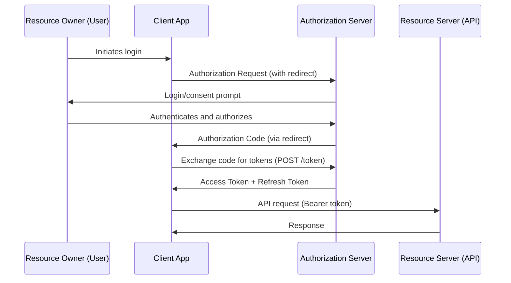
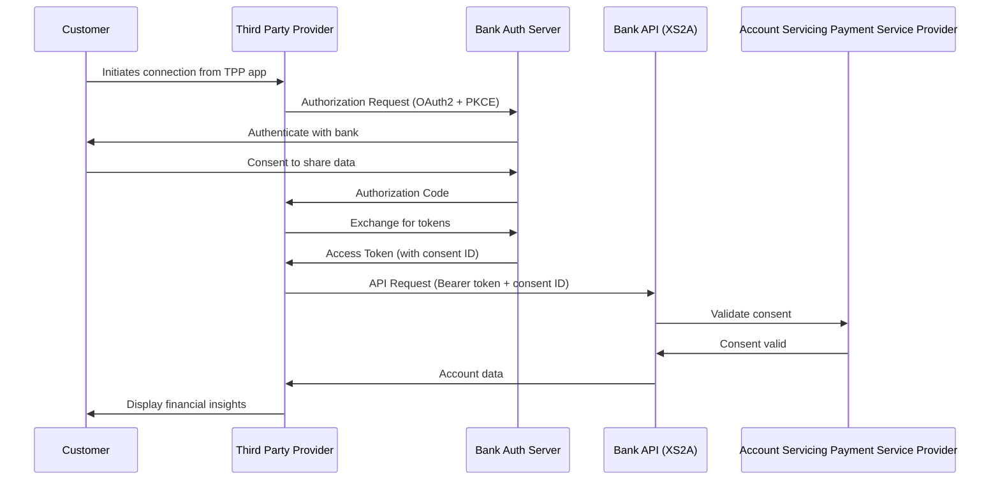

# OAuth2 and OpenID Connect

## Overview

OAuth2 is an authorization framework that enables applications to obtain limited access to user accounts. OpenID Connect (OIDC) is an authentication layer on top of OAuth2. Together, they form the foundation of modern authentication for banking APIs, mobile apps, and third-party integrations.

## Protocol Fundamentals

### OAuth2 Roles



| Role | Description | Banking Example |
|---|---|---|
| Resource Owner | The user who owns the data | Bank customer |
| Client | Application requesting access | Mobile banking app, third-party fintech app |
| Authorization Server | Issues tokens after authentication | Bank's identity provider (Keycloak, Okta) |
| Resource Server | Hosts protected resources | Banking API, account service |

### OAuth2 Flows

#### Authorization Code Flow with PKCE (Recommended)

This is the ONLY flow recommended for modern applications (including SPAs and mobile apps).

```
1. Client generates:
   - code_verifier = random_string(43-128 chars)
   - code_challenge = BASE64URL(SHA256(code_verifier))

2. Client redirects user to:
   GET /authorize?
     response_type=code
     &client_id=banking_app
     &redirect_uri=https://app.example.com/callback
     &scope=openid profile accounts:read transactions:read
     &state=random_csrf_token
     &code_challenge=E9Melhoa2OwvFrEMTJguCHaoeK1t8URWbuGJSstw-cM
     &code_challenge_method=S256

3. User authenticates and authorizes

4. Authorization server redirects to:
   https://app.example.com/callback?code=AUTH_CODE&state=random_csrf_token

5. Client exchanges code for tokens:
   POST /token
     grant_type=authorization_code
     &code=AUTH_CODE
     &redirect_uri=https://app.example.com/callback
     &client_id=banking_app
     &code_verifier=dBjftJeZ4CVP-mB92K27uhbUJU1p1r_wW1gFWFOEjXk
```

```python
# PKCE Implementation
import secrets
import base64
import hashlib

def generate_code_verifier() -> str:
    """Generate a cryptographically random code verifier"""
    return secrets.token_urlsafe(64)  # 64 bytes = 86 chars (within 43-128 range)

def generate_code_challenge(code_verifier: str) -> str:
    """Generate code challenge from verifier using S256 method"""
    sha256 = hashlib.sha256(code_verifier.encode('ascii')).digest()
    # Base64url encode (no padding)
    return base64.urlsafe_b64encode(sha256).rstrip(b'=').decode('ascii')

# Client-side: Initiate flow
code_verifier = generate_code_verifier()
code_challenge = generate_code_challenge(code_verifier)

# Store code_verifier securely (session storage, NOT localStorage)
session['oauth_code_verifier'] = code_verifier

# Redirect to authorization server
auth_url = (
    f"https://auth.bank.com/authorize?"
    f"response_type=code&"
    f"client_id=banking_app&"
    f"redirect_uri=https://app.example.com/callback&"
    f"scope=openid%20profile%20accounts:read&"
    f"state={generate_state()}&"
    f"code_challenge={code_challenge}&"
    f"code_challenge_method=S256"
)
return redirect(auth_url)

# Server-side: Exchange code for tokens
@app.route('/callback')
def oauth_callback():
    code = request.args.get('code')
    state = request.args.get('state')

    # Validate state (CSRF protection)
    if state != session.get('oauth_state'):
        raise AuthorizationError("Invalid state parameter")

    code_verifier = session.pop('oauth_code_verifier')

    # Exchange code for tokens
    token_response = requests.post(
        "https://auth.bank.com/token",
        data={
            "grant_type": "authorization_code",
            "code": code,
            "redirect_uri": "https://app.example.com/callback",
            "client_id": "banking_app",
            "code_verifier": code_verifier,
        },
        auth=("banking_app", CLIENT_SECRET)  # Confidential clients use basic auth
    )

    tokens = token_response.json()
    # Store tokens securely
    session['access_token'] = tokens['access_token']
    session['refresh_token'] = tokens.get('refresh_token')
    return redirect('/dashboard')
```

#### Client Credentials Flow (Service-to-Service)

Used for machine-to-machine authentication (no user context).

```python
# Service A requests access to Service B
import requests
from requests.auth import HTTPBasicAuth

def get_service_token(client_id: str, client_secret: str, scope: str) -> str:
    """Obtain OAuth2 token for service-to-service communication"""
    response = requests.post(
        "https://auth.bank.com/token",
        auth=HTTPBasicAuth(client_id, client_secret),
        data={
            "grant_type": "client_credentials",
            "scope": scope,
        }
    )
    response.raise_for_status()
    return response.json()["access_token"]

# Usage: Transaction service calls Account service
token = get_service_token(
    client_id="transaction-service",
    client_secret=SECRETS.get("transaction-service-secret"),  # From Vault
    scope="accounts:read transactions:create"
)

response = requests.post(
    "https://account-service.internal/api/debit",
    json={"account_id": "ACC123", "amount": 50.00},
    headers={"Authorization": f"Bearer {token}"},
)
```

#### Flows to AVOID

| Flow | Why Avoid | Alternative |
|---|---|---|
| Implicit Flow | Tokens in URL, no refresh, vulnerable to history attacks | Authorization Code + PKCE |
| Resource Owner Password Credentials | Exposes user credentials to client | Authorization Code + PKCE |
| Device Code Flow (for web) | Phishing risk | Use only for actual device auth |

## OpenID Connect (OIDC)

OIDC adds an ID Token (JWT) to OAuth2, enabling authentication.

### ID Token Structure

```json
{
  "iss": "https://auth.bank.com",
  "sub": "user-12345",
  "aud": "banking_app",
  "exp": 1700000000,
  "iat": 1699996400,
  "auth_time": 1699996350,
  "nonce": "random_nonce_value",
  "acr": "urn:mace:incommon:iap:silver",
  "amr": ["pwd", "otp"],
  "name": "John Doe",
  "email": "john@example.com",
  "email_verified": true
}
```

### Standard OIDC Scopes

| Scope | Claims Provided | Banking Usage |
|---|---|---|
| `openid` | Required for OIDC | Always required |
| `profile` | name, given_name, family_name, picture | User display |
| `email` | email, email_verified | Communication |
| `phone` | phone_number, phone_number_verified | MFA, alerts |
| `address` | formatted_address, street_address | Compliance (KYC) |
| `offline_access` | Refresh token issuance | Persistent sessions |

### Banking-Specific Scopes

```yaml
# Custom scopes for banking API
banking_scopes:
  accounts:read:
    description: "View account balances and details"
    sensitive: false

  accounts:write:
    description: "Modify account settings"
    sensitive: true
    requires_step_up: true

  transactions:read:
    description: "View transaction history"
    sensitive: false

  transactions:read:full:
    description: "View full transaction details including payee info"
    sensitive: true

  transfers:create:
    description: "Initiate fund transfers"
    sensitive: true
    requires_step_up: true
    daily_limit: 10000

  payments:create:
    description: "Initiate bill payments"
    sensitive: true
    requires_step_up: true
    daily_limit: 5000

  beneficiaries:manage:
    description: "Add/remove payees"
    sensitive: true
    requires_step_up: true
    requires_otp: true

  admin:users:read:
    description: "View all users (admin only)"
    sensitive: true
    role_required: admin
```

## Token Endpoint Security

### Token Response

```json
{
  "access_token": "eyJhbGciOiJSUzI1NiIs...",
  "token_type": "Bearer",
  "expires_in": 3600,
  "refresh_token": "dGhpcyBpcyBhIHJlZnJl...",
  "id_token": "eyJhbGciOiJSUzI1NiIs...",
  "scope": "openid profile accounts:read transactions:read"
}
```

### Token Introspection

```python
# Resource server validates token via introspection
def introspect_token(token: str) -> dict:
    """Validate token with authorization server"""
    response = requests.post(
        "https://auth.bank.com/token/introspect",
        auth=HTTPBasicAuth("resource_server", RS_SECRET),
        data={"token": token}
    )
    response.raise_for_status()
    result = response.json()

    if not result.get("active"):
        raise InvalidTokenError()

    return result

# Response:
# {
#   "active": true,
#   "client_id": "banking_app",
#   "scope": "openid profile accounts:read",
#   "sub": "user-12345",
#   "exp": 1700000000,
#   "iat": 1699996400
# }
```

### Token Revocation

```python
def revoke_token(token: str, token_type_hint: str = None):
    """Revoke a token (logout)"""
    requests.post(
        "https://auth.bank.com/token/revoke",
        auth=HTTPBasicAuth("banking_app", CLIENT_SECRET),
        data={
            "token": token,
            "token_type_hint": token_type_hint,  # "access_token" or "refresh_token"
        }
    )
```

## Banking Open Banking / PSD2 Integration

### OAuth2 for Open Banking



```python
# Open Banking consent handling
class OpenBankingConsent:
    """
    PSD2 requires explicit, time-bound consent for data access.
    """

    def create_consent(self, tpp_id: str, user_id: str, scopes: list, duration_days: int = 90) -> str:
        consent_id = str(uuid.uuid4())

        consent_record = {
            "consent_id": consent_id,
            "tpp_id": tpp_id,
            "user_id": user_id,
            "scopes": scopes,
            "created_at": datetime.utcnow(),
            "expires_at": datetime.utcnow() + timedelta(days=duration_days),
            "status": "pending",  # pending -> granted -> consumed -> expired -> revoked
            "frequency_per_day": 4,  # PSD2 limit
        }

        self.db.store_consent(consent_record)
        return consent_id

    def validate_consent_for_request(self, consent_id: str) -> bool:
        consent = self.db.get_consent(consent_id)
        if not consent:
            return False
        if consent["status"] != "granted":
            return False
        if datetime.utcnow() > consent["expires_at"]:
            return False

        # Check daily frequency limit
        today_count = self.db.count_requests_today(consent_id)
        if today_count >= consent["frequency_per_day"]:
            return False

        return True
```

## Provider Implementations

### Keycloak (Open Source)

```yaml
# Keycloak realm configuration for banking
apiVersion: v1
kind: KeycloakRealm
metadata:
  name: banking-realm
spec:
  realm:
    id: banking
    realm: banking
    enabled: true
    sslRequired: external
    bruteForceProtected: true
    failureFactor: 5         # Lock after 5 failed attempts
    waitIncrementSeconds: 300 # Lock for 5 minutes
    maxFailureWaitSeconds: 3600
    maxDeltaTimeSeconds: 43200
  clients:
    - clientId: banking-mobile
      publicClient: true
      standardFlowEnabled: true
      redirectUris:
        - "com.example.banking://callback"
      webOrigins:
        - "+"
    - clientId: banking-web
      publicClient: true
      standardFlowEnabled: true
      redirectUris:
        - "https://banking.example.com/*"
    - clientId: transaction-service
      secret: ${TRANSACTION_SERVICE_SECRET}
      serviceAccountsEnabled: true
      clientAuthenticatorType: client-secret
      directAccessGrantsEnabled: false
```

### Okta (Commercial)

```yaml
# Okta Authorization Server policy
policies:
  - name: "banking-api-policy"
    status: ACTIVE
    conditions:
      clients:
        include:
          - "banking_app"
    rules:
      - name: "require-mfa-for-transfers"
        conditions:
          scopes:
            include:
              - "transfers:create"
          risk:
            level: HIGH
        actions:
          token:
            accessToken:
              groups_claim: "groups"
          requireFactor: "okta_verify_push"
```

## Secure Defaults

### Authorization Server

```yaml
token_settings:
  access_token_lifetime: 3600        # 1 hour
  refresh_token_lifetime: 2592000    # 30 days
  id_token_lifetime: 3600            # 1 hour
  authorization_code_lifetime: 300   # 5 minutes

security:
  require_pkce: true
  pkce_method: S256                   # Not "plain"
  require_state_parameter: true
  enforce_redirect_uri_match: true
  rotate_refresh_tokens: true
  reuse_interval: 0                   # Refresh tokens are single-use
  absolute_refresh_token_lifetime: 7776000  # 90 days max

token_format:
  access_token: jwt                   # Or opaque with introspection
  signing_algorithm: RS256            # Or ES256 for EC
  encryption: true                    # JWE for sensitive claims
```

## Interview Questions

### Junior Level

1. What is the difference between OAuth2 and OpenID Connect?
2. Why is PKCE required for mobile and SPA applications?
3. What does the `state` parameter protect against?
4. What is the difference between an access token and an ID token?

### Senior Level

1. Explain why the Implicit flow is deprecated for SPAs.
2. How would you implement token refresh without disrupting the user experience?
3. What scopes would you define for a banking API, and how would you enforce them?
4. How does Open Banking (PSD2) use OAuth2 differently?

### Staff Level

1. Design a multi-tenant OAuth2 system where each tenant can have its own identity provider.
2. How do you handle token validation in a microservices architecture with 100+ services?
3. What is your strategy for OAuth2 token revocation at scale when a breach is detected?

## Cross-References

- [JWT Security](./jwt.md) - Token structure and validation
- [Authentication and Authorization](./authn-and-authz.md) - General auth patterns
- [API Security](./api-security.md) - API-level security controls
- [Kubernetes Security](./kubernetes-security.md) - Securing identity in K8s
