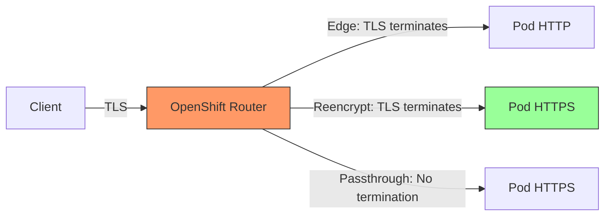

# OpenShift Security

## Overview

OpenShift is Red Hat's enterprise Kubernetes platform with additional security features including Security Context Constraints (SCCs), SELinux integration, built-in image registries, and opinionated defaults. This guide covers OpenShift-specific security controls that go beyond vanilla Kubernetes for banking-grade deployments.

## Security Context Constraints (SCCs)

### SCC Overview

SCCs control what actions pods can perform and what permissions they have. They are OpenShift's primary mechanism for pod security, more powerful than Kubernetes Pod Security Standards.

| SCC | Privilege Level | Banking Usage |
|---|---|---|
| privileged | Unrestricted access | NEVER in production |
| hostaccess | Host namespace access | NEVER in production |
| hostnetwork | Host network access | Monitoring pods only |
| hostmount-anyuid | Host path mounts | Backup jobs only |
| nonroot | Must run as non-root | Legacy applications |
| restricted | Most restrictive | REQUIRED for production |
| restricted-v2 | Restricted + seccomp | Preferred for production |
| anyuid | Any UID allowed | Avoid in production |

### Viewing SCCs

```bash
# List all SCCs
oc get scc

# Describe the restricted SCC
oc describe scc restricted

# Check which SCC applies to a service account
oc adm policy who-can use scc restricted
```

### Creating Custom SCC for Banking Workloads

```yaml
# Custom SCC for banking API workloads
# Based on restricted but with specific controls
apiVersion: security.openshift.io/v1
kind: SecurityContextConstraints
metadata:
  name: banking-restricted
allowPrivilegedContainer: false
allowHostDirVolumePlugin: false
allowHostIPC: false
allowHostNetwork: false
allowHostPID: false
allowHostPorts: false
allowPrivilegeEscalation: false
readOnlyRootFilesystem: false  # Allow writable filesystem for logs
requiredDropCapabilities:
  - ALL
allowedCapabilities: []
runAsUser:
  type: MustRunAsNonRoot
seLinuxContext:
  type: MustRunAs
fsGroup:
  type: MustRunAs
supplementalGroups:
  type: RunAsAny
volumes:
  - configMap
  - downwardAPI
  - emptyDir
  - persistentVolumeClaim
  - projected
  - secret

---
# Grant SCC to banking service account
apiVersion: rbac.authorization.k8s.io/v1
kind: RoleBinding
metadata:
  name: banking-api-scc-binding
  namespace: production
subjects:
- kind: ServiceAccount
  name: banking-api-sa
  namespace: production
roleRef:
  kind: ClusterRole
  name: system:openshift:scc:banking-restricted
  apiGroup: rbac.authorization.k8s.io
```

## SELinux in OpenShift

### SELinux Fundamentals

SELinux (Security-Enhanced Linux) provides Mandatory Access Control (MAC) that restricts what processes can do, even as root. OpenShift uses SELinux to isolate containers from each other and from the host.

```
SELinux Label Format:
  user:role:type:level

  Example:
    system_u:system_r:container_t:s0:c123,c456

  user: system_u (system user)
  role: system_r (system role)
  type: container_t (container process type)
  level: s0:c123,c456 (Multi-Category Security - unique per pod)
```

### SELinux Policy for Banking

```yaml
# OpenShift automatically assigns unique SELinux labels per pod
# This ensures pods cannot access each other's files even with same UID

# Pod with explicit SELinux options
apiVersion: v1
kind: Pod
metadata:
  name: banking-api
  namespace: production
spec:
  securityContext:
    seLinuxOptions:
      # OpenShift will override the MCS category portion
      # The type must be container_t or a custom banking type
      type: container_t
      level: "s0:c100,c200"  # Custom categories (optional)
  containers:
  - name: banking-api
    image: registry.bank.internal/banking-api:latest
    securityContext:
      seLinuxOptions:
        type: container_t
```

### Custom SELinux Policy Module

```te
# Custom SELinux policy for banking-specific requirements
# Compile: make -f /usr/share/selinux/devel/Makefile banking.pp
# Install: semodule -i banking.pp

module banking 1.0;

require {
    type container_t;
    type postgresql_port_t;
    type redis_port_t;
    type vault_port_t;
    class tcp_socket name_connect;
}

# Allow banking containers to connect to specific service ports
allow container_t postgresql_port_t:tcp_socket name_connect;
allow container_t redis_port_t:tcp_socket name_connect;
allow container_t vault_port_t:tcp_socket name_connect;

# Deny everything else (default deny)
```

## OpenShift Route Security

### Route TLS Termination Modes



| Mode | TLS Termination | Backend | Banking Usage |
|---|---|---|---|
| Edge | Router | HTTP | Internal services only |
| Reencrypt | Router + Backend | HTTPS | Recommended for banking |
| Passthrough | Backend only | HTTPS | When backend controls TLS |

### Secure Route Configuration

```yaml
apiVersion: route.openshift.io/v1
kind: Route
metadata:
  name: banking-api
  namespace: production
  annotations:
    haproxy.router.openshift.io/timeout: 10s
    haproxy.router.openshift.io/rate-limit-connections: "true"
    haproxy.router.openshift.io/rate-limit-connections.rate-http: "100"
spec:
  host: api.bank.example.com
  to:
    kind: Service
    name: banking-api
    weight: 100
  port:
    targetPort: 8443
  tls:
    termination: reencrypt
    insecureEdgeTerminationPolicy: Redirect  # HTTP -> HTTPS redirect
    destinationCACertificate: |              # Verify backend certificate
      -----BEGIN CERTIFICATE-----
      MIIDXTCCAkWgAwIBAgIJAL...
      -----END CERTIFICATE-----
  wildcardPolicy: None
```

## OpenShift Image Security

### Built-in Image Registry

```yaml
# OpenShift has a built-in private registry
# Push images to: image-registry.openshift-image-registry.svc:5000

# ImageStream for managing image references
apiVersion: image.openshift.io/v1
kind: ImageStream
metadata:
  name: banking-api
  namespace: production
spec:
  lookupPolicy:
    local: true
  tags:
  - name: latest
    importPolicy: {}
    referencePolicy:
      type: Local

---
# ImageStreamTag with automatic import
apiVersion: image.openshift.io/v1
kind: ImageStreamTag
metadata:
  name: banking-api:2.1.0
  namespace: production
tag:
  name: "2.1.0"
  from:
    kind: DockerImage
    name: registry.bank.internal/banking-api:2.1.0
  importPolicy:
    scheduled: true  # Periodically check for updates
```

### Image Policy Configuration

```yaml
# Cluster-level image policy
apiVersion: config.openshift.io/v1
kind: Image
metadata:
  name: cluster
spec:
  allowedRegistriesForImport:
  - domainName: registry.bank.internal
  - domainName: registry.access.redhat.com
  - domainName: quay.io
  - domainName: gcr.io
  - domainName: docker.io
  blockedRegistries:
  - docker.io/untrusted-registry
  - registry.untrusted-domain.com
  externalRegistryHostnames:
  - image-registry.openshift-image-registry.svc:5000
```

### Image Content Source Policy (Air-Gapped Environments)

```yaml
# Mirror images from public registries to internal registry
apiVersion: operator.openshift.io/v1alpha1
kind: ImageContentSourcePolicy
metadata:
  name: banking-registry-mirror
spec:
  repositoryDigestMirrors:
  - mirrors:
    - registry.bank.internal/mirror/docker.io/library
    source: docker.io/library
  - mirrors:
    - registry.bank.internal/mirror/registry.access.redhat.com
    source: registry.access.redhat.com
```

## OpenShift Network Policies

### Egress Network Policies

```yaml
# Restrict which external destinations pods can reach
apiVersion: networking.k8s.io/v1
kind: NetworkPolicy
metadata:
  name: banking-api-egress
  namespace: production
spec:
  podSelector:
    matchLabels:
      app: banking-api
  policyTypes:
  - Egress
  egress:
  # Allow DNS
  - to: []
    ports:
    - protocol: UDP
      port: 53
    - protocol: TCP
      port: 53
  # Allow only specific external services
  - to:
    - ipBlock:
        cidr: 52.0.0.0/8    # AWS services
        except:
        - 52.95.0.0/16      # Except S3 (use VPC endpoint)
    ports:
    - protocol: TCP
      port: 443
  # Allow internal services
  - to:
    - namespaceSelector:
        matchLabels:
          kubernetes.io/metadata.name: production
    ports:
    - protocol: TCP
      port: 8443
    - protocol: TCP
      port: 5432
```

### Egress Firewall (OpenShift-Specific)

```yaml
# OpenShift EgressFirewall for namespace-level egress control
apiVersion: k8s.ovn.org/v1
kind: EgressFirewall
metadata:
  name: default
  namespace: production
spec:
  egress:
  - type: Allow
    to:
      dnsName: "*.bank.internal"
  - type: Allow
    to:
      dnsName: "api.openai.com"   # GenAI service needs LLM API
  - type: Allow
    to:
      cidrSelector:
        cidrSelector: 10.0.0.0/8  # Internal network
  - type: Deny
    to:
      cidrSelector:
        cidrSelector: 0.0.0.0/0   # Deny everything else
```

## OpenShift Logging and Audit

### Audit Log Configuration

```yaml
# OpenShift API server audit logging
apiVersion: config.openshift.io/v1
kind: APIServer
metadata:
  name: cluster
spec:
  audit:
    profile: WriteRequestBodies  # Log all requests with request bodies
    # Options: Default, WriteRequestBodies, AllRequestBodies, None

---
# Forward audit logs to SIEM
apiVersion: logging.openshift.io/v1
kind: ClusterLogForwarder
metadata:
  name: instance
  namespace: openshift-logging
spec:
  outputs:
  - name: siem
    type: syslog
    syslog:
      url: udp://siem.bank.internal:514
      severity: informational
      facility: security
  pipelines:
  - name: audit-to-siem
    inputRefs:
    - audit
    outputRefs:
    - siem
```

### Key Audit Events to Monitor

| Event | Severity | Response |
|---|---|---|
| SCC violation | HIGH | Alert security team |
| Cluster-admin role binding | CRITICAL | Immediate investigation |
| Secret access by unauthorized SA | HIGH | Revoke access, investigate |
| Pod exec in production | MEDIUM | Verify with developer |
| Image pull from untrusted registry | HIGH | Block and investigate |
| Node NotReady in production | MEDIUM | Investigate node health |
| Certificate expiry warning | MEDIUM | Renew certificate |

## OpenShift-Specific Hardening

### Cluster-Level Security

```yaml
# Disable anonymous access
apiVersion: config.openshift.io/v1
kind: OAuth
metadata:
  name: cluster
spec:
  templates:
    login:
      name: login-template
    providerSelection:
      name: provider-template
  identityProviders:
  - name: LDAP
    type: LDAP
    ldap:
      url: "ldaps://ldap.bank.com/ou=users,dc=bank,dc=com"
      bindDN: "cn=readonly,ou=system,dc=bank,dc=com"
      bindPassword:
        name: ldap-bind-password
      insecure: false

---
# Enforce HTTPS for all routes
apiVersion: operator.openshift.io/v1
kind: IngressController
metadata:
  name: default
  namespace: openshift-ingress-operator
spec:
  defaultCertificate:
    name: wildcard-tls
  endpointPublishingStrategy:
    type: LoadBalancerService
  routeAdmission:
    wildcardPolicy: NoAdmission  # No wildcard routes
  httpErrorCodePages:
    name: ""
```

### Node Security

```yaml
# MachineConfig for hardened nodes
apiVersion: machineconfiguration.openshift.io/v1
kind: MachineConfig
metadata:
  labels:
    machineconfiguration.openshift.io/role: worker
  name: 99-worker-hardened
spec:
  config:
    ignition:
      version: 3.2.0
    storage:
      files:
      - path: /etc/sysctl.d/99-banking-hardening.conf
        mode: 0644
        contents:
          source: data:text/plain;charset=utf-8;base64,
            bmV0LmlwdjQuY29uZl9hbGxfc3JjX3JvdXRlPTAK
            bmV0LmlwdjYuY29uZl9hbGxfc3JjX3JvdXRlPTAK
            bmV0LmlwX2ZvcndhcmQ9MAo=
            # net.ipv4.conf_all.src_route=0
            # net.ipv6.conf_all.src_route=0
            # net.ip_forward=0

    systemd:
      units:
      - name: auditd.service
        enabled: true
```

### Pod Disruption Budgets

```yaml
# Ensure high availability during maintenance
apiVersion: policy/v1
kind: PodDisruptionBudget
metadata:
  name: banking-api-pdb
  namespace: production
spec:
  minAvailable: 2  # At least 2 pods must be running
  selector:
    matchLabels:
      app: banking-api

---
apiVersion: policy/v1
kind: PodDisruptionBudget
metadata:
  name: postgresql-pdb
  namespace: production
spec:
  maxUnavailable: 0  # Never voluntarily evict PostgreSQL
  selector:
    matchLabels:
      app: postgresql
```

## GenAI-Specific OpenShift Security

### GPU Resource Controls

```yaml
# Limit GPU access to authorized workloads
apiVersion: v1
kind: LimitRange
metadata:
  name: gpu-limits
  namespace: production
spec:
  limits:
  - type: Container
    defaultRequest:
      nvidia.com/gpu: "0"  # No GPU by default
    default:
      nvidia.com/gpu: "0"
    max:
      nvidia.com/gpu: "2"  # Maximum 2 GPUs per container

---
# ResourceQuota for GenAI namespace
apiVersion: v1
kind: ResourceQuota
metadata:
  name: genai-quota
  namespace: genai
spec:
  hard:
    requests.cpu: "64"
    requests.memory: 256Gi
    limits.cpu: "128"
    limits.memory: 512Gi
    nvidia.com/gpu: "8"
    persistentvolumeclaims: "10"
```

### Model Data Protection

```yaml
# PersistentVolume with encryption for model storage
apiVersion: v1
kind: PersistentVolume
metadata:
  name: model-storage
spec:
  capacity:
    storage: 500Gi
  accessModes:
    - ReadOnlyMany
  csi:
    driver: ebs.csi.aws.com
    volumeHandle: vol-abc123
    fsType: ext4
  mountOptions:
    - noexec    # Prevent execution of files from model volume
    - nosuid    # Ignore setuid bits
    - nodev     # Don't interpret character or block special devices
```

## Compliance and Certification

### OpenShift Compliance Operator

```bash
# Install compliance operator
oc create -f - <<EOF
apiVersion: operators.coreos.com/v1alpha1
kind: Subscription
metadata:
  name: compliance-operator
  namespace: openshift-compliance
spec:
  channel: "release-0.1"
  name: compliance-operator
  source: redhat-operators
  sourceNamespace: openshift-marketplace
EOF

# Run PCI-DSS scan
oc create -f - <<EOF
apiVersion: compliance.openshift.io/v1alpha1
kind: ScanSettingBinding
metadata:
  name: pci-dss
profiles:
  - apiGroup: compliance.openshift.io/v1alpha1
    kind: Profile
    name: ocp4-pci-dss
  - apiGroup: compliance.openshift.io/v1alpha1
    kind: Profile
    name: rhcos4-pci-dss
settingsRef:
  apiGroup: compliance.openshift.io/v1alpha1
  kind: ScanSetting
  name: default
EOF

# View results
oc get compliancescan
oc get compliancescan ocp4-pci-dss -o yaml
```

## Interview Questions

### Junior Level

1. What is an SCC and how does it differ from Kubernetes Pod Security Standards?
2. What does SELinux do and why is it important in OpenShift?
3. What is the difference between Edge and Reencrypt route termination?
4. Why should production pods use the `restricted` SCC?

### Senior Level

1. How would you design custom SCCs for a banking platform with different workload types?
2. Explain how OpenShift handles SELinux labels for pods.
3. How do you restrict which external services pods in OpenShift can reach?
4. What is the Compliance Operator and how do you use it for PCI-DSS?

### Staff Level

1. How would you design a multi-cluster OpenShift security model for a global bank?
2. What is your strategy for managing image registry access across hybrid cloud?
3. How do you balance OpenShift's opinionated security with application requirements that need elevated privileges?

## Cross-References

- [Kubernetes Security](./kubernetes-security.md) - Vanilla K8s security
- [Network Security](./network-security.md) - Network policies
- [TLS and Certificates](./tls-and-certificates.md) - Route TLS configuration
- [Secrets Management](./secrets-management.md) - OpenShift secrets handling
