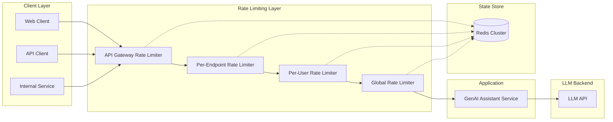
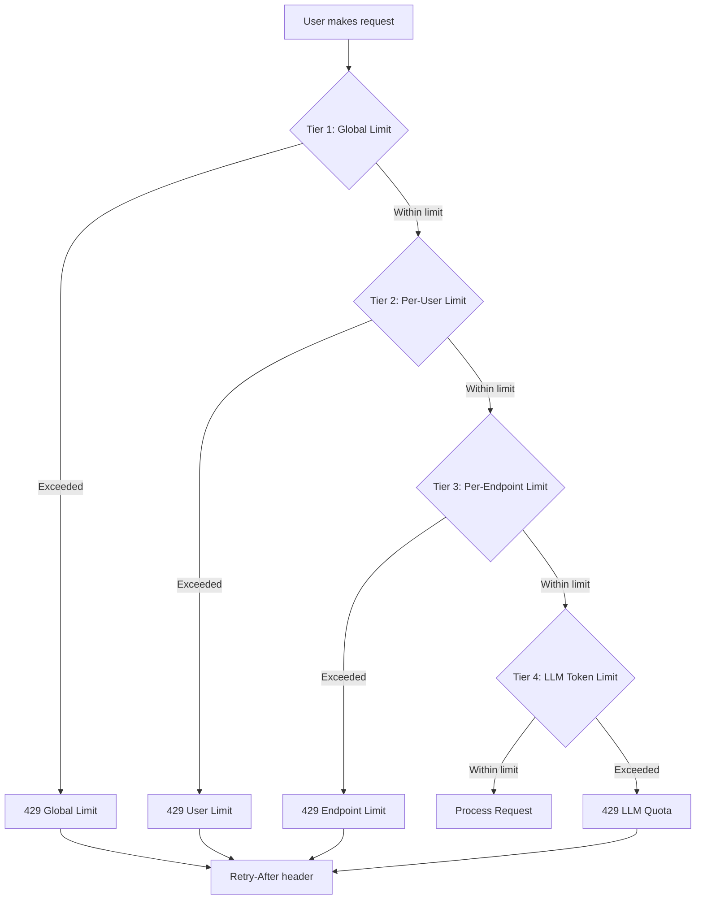

# Rate Limiting Strategies

## Overview

Rate limiting is a fundamental defensive security control that protects services from abuse, denial-of-service attacks, resource exhaustion, and cost amplification. In GenAI systems, rate limiting takes on additional importance because LLM API calls are expensive (costing fractions to dollars per request), have finite throughput limits, and can be exploited for cost amplification attacks where an attacker forces the system to make expensive upstream API calls.

This guide covers rate limiting strategies, algorithms, and implementations across Python, Go, and TypeScript, with specific focus on banking GenAI platforms.

## Why Rate Limiting Matters in Banking GenAI

| Threat | Traditional System | GenAI System | Impact Difference |
|--------|-------------------|--------------|-------------------|
| DoS via request flooding | CPU/memory exhaustion | LLM API quota exhaustion | LLM tokens cost real money per request |
| Brute force authentication | Account lockout | Same, but with prompt-based attacks | Each attempt includes expensive LLM call |
| Data scraping | API pagination abuse | Systematic knowledge extraction | Each query costs tokens + reveals data |
| Cost amplification | Bandwidth costs | Per-token pricing at scale | Attacker can trigger thousands of dollars in costs |
| Resource exhaustion | Thread pool depletion | Context window / model capacity | Model capacity is shared across all users |

### Real-World Cost Amplification Attack

An attacker with access to a banking GenAI assistant sends 10,000 carefully crafted prompts per hour. Each prompt triggers:
1. RAG retrieval (PostgreSQL query + embedding computation)
2. LLM API call (~$0.05 per request with context)
3. Response validation scanning

**Cost**: 10,000 requests/hour x $0.05 = $500/hour = $12,000/day. Without rate limiting, a single attacker can generate six-figure monthly costs.

## Rate Limiting Architecture



## Rate Limiting Algorithms

### 1. Token Bucket

The token bucket algorithm is the most widely used and provides a good balance of simplicity and effectiveness.

```
                    ┌─────────────────┐
    Tokens arrive  │   Token Bucket   │
    at fixed rate  │   capacity: 100  │─── Each request
    ──────────────►│   tokens: 67     │    consumes 1 token
                   │   refill: 10/s   │
                   └─────────────────┘
                            │
                     Bucket full?
                     ┌─── Yes: Allow
                     └─── No: Reject (429)
```

**Python Implementation (Redis-backed)**

```python
import time
import redis
from dataclasses import dataclass

@dataclass
class RateLimitResult:
    allowed: bool
    remaining: int
    limit: int
    retry_after: float  # seconds until next token available

class TokenBucketLimiter:
    """
    Distributed token bucket rate limiter using Redis.
    Suitable for multi-instance deployments.
    """

    def __init__(self, redis_client: redis.Redis, key_prefix: str = "ratelimit"):
        self.redis = redis_client
        self.key_prefix = key_prefix

    def check_rate_limit(
        self,
        key: str,
        capacity: int,
        refill_rate: float,  # tokens per second
        tokens_requested: int = 1,
    ) -> RateLimitResult:
        """
        Check and consume tokens from the bucket.

        Args:
            key: Unique identifier (e.g., user ID, API key, IP)
            capacity: Maximum tokens the bucket can hold
            refill_rate: Tokens added per second
            tokens_requested: Number of tokens this request consumes

        Returns:
            RateLimitResult with allowed status and metadata
        """
        now = time.time()
        bucket_key = f"{self.key_prefix}:{key}"

        # Use Redis pipeline for atomicity
        pipe = self.redis.pipeline(True)
        pipe.hgetall(bucket_key)
        result = pipe.execute()[0]

        if result:
            tokens = float(result.get(b"tokens", capacity))
            last_refill = float(result.get(b"last_refill", now))
        else:
            tokens = capacity
            last_refill = now

        # Calculate token refill since last check
        elapsed = now - last_refill
        tokens_to_add = elapsed * refill_rate
        tokens = min(capacity, tokens + tokens_to_add)

        if tokens >= tokens_requested:
            # Allow request, consume tokens
            tokens -= tokens_requested
            self.redis.hset(bucket_key, mapping={
                "tokens": str(tokens),
                "last_refill": str(now),
            })
            self.redis.expire(bucket_key, int(capacity / refill_rate) + 60)

            return RateLimitResult(
                allowed=True,
                remaining=int(tokens),
                limit=capacity,
                retry_after=0,
            )
        else:
            # Reject request, calculate wait time
            tokens_deficit = tokens_requested - tokens
            retry_after = tokens_deficit / refill_rate

            # Still update the refill time
            self.redis.hset(bucket_key, mapping={
                "tokens": str(tokens),
                "last_refill": str(now),
            })

            return RateLimitResult(
                allowed=False,
                remaining=0,
                limit=capacity,
                retry_after=round(retry_after, 2),
            )
```

**Go Implementation (In-Memory for Single Instance)**

```go
package ratelimit

import (
    "sync"
    "time"
)

// TokenBucket implements a thread-safe token bucket rate limiter.
type TokenBucket struct {
    mu         sync.Mutex
    capacity   int
    tokens     float64
    refillRate float64     // tokens per second
    lastRefill time.Time
}

// NewTokenBucket creates a new token bucket limiter.
func NewTokenBucket(capacity int, refillRate float64) *TokenBucket {
    return &TokenBucket{
        capacity:   capacity,
        tokens:     float64(capacity),
        refillRate: refillRate,
        lastRefill: time.Now(),
    }
}

// Allow checks if a request is allowed and consumes a token.
func (tb *TokenBucket) Allow() (allowed bool, remaining int, retryAfter time.Duration) {
    tb.mu.Lock()
    defer tb.mu.Unlock()

    now := time.Now()
    elapsed := now.Sub(tb.lastRefill).Seconds()
    tb.tokens = min(float64(tb.capacity), tb.tokens+elapsed*tb.refillRate)
    tb.lastRefill = now

    if tb.tokens >= 1 {
        tb.tokens--
        return true, int(tb.tokens), 0
    }

    deficit := 1 - tb.tokens
    retryAfter = time.Duration(deficit/tb.refillRate*1000) * time.Millisecond
    return false, 0, retryAfter
}

// TokenBucketStore manages multiple token buckets by key.
type TokenBucketStore struct {
    mu       sync.RWMutex
    buckets  map[string]*TokenBucket
    defaults func(key string) (int, float64) // capacity, refillRate
}

func NewTokenBucketStore(defaults func(string) (int, float64)) *TokenBucketStore {
    return &TokenBucketStore{
        buckets:  make(map[string]*TokenBucket),
        defaults: defaults,
    }
}

func (s *TokenBucketStore) Allow(key string) (bool, int, time.Duration) {
    s.mu.RLock()
    bucket, exists := s.buckets[key]
    s.mu.RUnlock()

    if !exists {
        s.mu.Lock()
        // Double-check after acquiring write lock
        bucket, exists = s.buckets[key]
        if !exists {
            capacity, rate := s.defaults(key)
            bucket = NewTokenBucket(capacity, rate)
            s.buckets[key] = bucket
        }
        s.mu.Unlock()
    }

    return bucket.Allow()
}
```

### 2. Sliding Window Log

The sliding window log provides more precise rate limiting by tracking exact timestamps of requests.

```
Time ───────────────────────────────────────────────►

     ┌─────────────────────────────────┐
     │    Sliding Window (60 seconds)   │
     │                                 │
     │  *  *     *    *  *    *  *  * │
     │  1  2     3    4  5    6  7  8 │
     │                                 │
     │  Count: 8 requests               │
     │  Limit: 10 requests/minute       │
     │  Status: ALLOWED (8 < 10)        │
     └─────────────────────────────────┘

     When 9th request arrives:
     Count becomes 9, still allowed.
     When 11th request arrives:
     Count would be 11 > 10, REJECTED.
```

**TypeScript Implementation (Redis-backed)**

```typescript
import Redis from 'ioredis';

interface SlidingWindowResult {
  allowed: boolean;
  currentCount: number;
  limit: number;
  windowSeconds: number;
  retryAfterMs: number;
}

export class SlidingWindowLogLimiter {
  private redis: Redis;
  private readonly keyPrefix: string;

  constructor(redis: Redis, keyPrefix = 'ratelimit:sw') {
    this.redis = redis;
    this.keyPrefix = keyPrefix;
  }

  async checkRateLimit(
    key: string,
    limit: number,
    windowSeconds: number,
  ): Promise<SlidingWindowResult> {
    const now = Date.now();
    const windowStart = now - windowSeconds * 1000;
    const redisKey = `${this.keyPrefix}:${key}`;

    // Use Redis sorted set: score = timestamp, member = unique request ID
    const pipeline = this.redis.pipeline();

    // Remove expired entries
    pipeline.zremrangebyscore(redisKey, 0, windowStart);

    // Count current entries in window
    pipeline.zcard(redisKey);

    const results = await pipeline.exec();
    const currentCount = results?.[1]?.[1] as number || 0;

    if (currentCount < limit) {
      // Allow: add entry and set expiry
      const requestId = `${now}-${Math.random().toString(36).slice(2, 9)}`;
      await this.redis
        .multi()
        .zadd(redisKey, now, requestId)
        .expire(redisKey, windowSeconds + 10)
        .exec();

      return {
        allowed: true,
        currentCount: currentCount + 1,
        limit,
        windowSeconds,
        retryAfterMs: 0,
      };
    }

    // Calculate when the oldest entry will expire
    const oldestEntries = await this.redis.zrange(redisKey, 0, 0, 'WITHSCORES');
    const oldestTimestamp = oldestEntries?.[1] ? parseInt(oldestEntries[1]) : now;
    const retryAfterMs = oldestTimestamp + windowSeconds * 1000 - now;

    return {
      allowed: false,
      currentCount,
      limit,
      windowSeconds,
      retryAfterMs: Math.max(0, retryAfterMs),
    };
  }
}
```

### 3. Sliding Window Counter

A more efficient approximation that combines the precision of sliding windows with the memory efficiency of fixed windows.

```python
class SlidingWindowCounterLimiter:
    """
    Sliding window counter -- efficient approximation using
    two fixed windows with weighted combination.
    """

    def __init__(self, redis_client: redis.Redis):
        self.redis = redis_client

    def check_rate_limit(
        self,
        key: str,
        limit: int,
        window_seconds: int,
    ) -> RateLimitResult:
        now = time.time()
        current_window = int(now // window_seconds)
        previous_window = current_window - 1

        current_key = f"ratelimit:swc:{key}:{current_window}"
        previous_key = f"ratelimit:swc:{key}:{previous_window}"

        pipe = self.redis.pipeline(True)
        pipe.get(current_key)
        pipe.get(previous_key)
        pipe.ttl(current_key)
        results = pipe.execute()

        current_count = int(results[0] or 0)
        previous_count = int(results[1] or 0)
        ttl = results[2]

        # Weighted combination
        elapsed_in_current = (now % window_seconds) / window_seconds
        weighted_count = (
            previous_count * (1 - elapsed_in_current) +
            current_count
        )

        if weighted_count < limit:
            # Allow
            pipe = self.redis.pipeline(True)
            pipe.incr(current_key)
            if ttl == -1:
                pipe.expire(current_key, window_seconds * 2)
            pipe.execute()

            remaining = int(limit - weighted_count - 1)
            return RateLimitResult(
                allowed=True,
                remaining=max(0, remaining),
                limit=limit,
                retry_after=0,
            )

        # Reject
        retry_after = window_seconds - (now % window_seconds)
        return RateLimitResult(
            allowed=False,
            remaining=0,
            limit=limit,
            retry_after=round(retry_after, 2),
        )
```

### 4. Fixed Window Counter

Simplest algorithm -- counts requests in a fixed time window. Prone to boundary bursting (2x limit at window edges).

```go
// FixedWindowLimiter -- simple but has boundary burst issue
// At window boundary, an attacker can send limit requests at end of
// window 1 and limit requests at start of window 2 = 2x the actual limit
// in a short time. Use sliding window for production systems.
type FixedWindowLimiter struct {
    mu      sync.Mutex
    windows map[string]*window
    limit   int
    window  time.Duration
}

type window struct {
    count int
    start time.Time
}

func (fw *FixedWindowLimiter) Allow(key string) bool {
    fw.mu.Lock()
    defer fw.mu.Unlock()

    now := time.Now()
    w, exists := fw.windows[key]

    if !exists || now.Sub(w.start) > fw.window {
        // New window
        fw.windows[key] = &window{count: 1, start: now}
        return true
    }

    if w.count < fw.limit {
        w.count++
        return true
    }

    return false
}
```

## Multi-Tier Rate Limiting Strategy

For banking GenAI platforms, implement rate limiting at multiple levels:



### Tier Configuration for Banking GenAI

```python
from dataclasses import dataclass
from enum import Enum

class UserRole(Enum):
    STANDARD = "standard"
    POWER = "power"
    ADMIN = "admin"
    SERVICE_ACCOUNT = "service_account"

@dataclass
class RateLimitConfig:
    # Global: all requests combined
    global_rps: int           # requests per second
    global_tokens_per_min: int

    # Per-user
    user_rpm: int             # requests per minute
    user_tokens_per_hour: int

    # Per-endpoint
    chat_rpm: int
    embedding_rpm: int

    # LLM API specific
    llm_max_tokens_per_request: int
    llm_max_context_tokens: int

# Tier configurations
RATE_LIMITS = {
    UserRole.STANDARD: RateLimitConfig(
        global_rps=500,
        global_tokens_per_min=100_000,
        user_rpm=20,          # 1 request every 3 seconds
        user_tokens_per_hour=50_000,
        chat_rpm=15,
        embedding_rpm=30,
        llm_max_tokens_per_request=2048,
        llm_max_context_tokens=8192,
    ),
    UserRole.POWER: RateLimitConfig(
        global_rps=500,
        global_tokens_per_min=100_000,
        user_rpm=60,          # 1 request per second
        user_tokens_per_hour=200_000,
        chat_rpm=50,
        embedding_rpm=60,
        llm_max_tokens_per_request=4096,
        llm_max_context_tokens=16384,
    ),
    UserRole.ADMIN: RateLimitConfig(
        global_rps=500,
        global_tokens_per_min=100_000,
        user_rpm=120,
        user_tokens_per_hour=1_000_000,
        chat_rpm=100,
        embedding_rpm=120,
        llm_max_tokens_per_request=8192,
        llm_max_context_tokens=32768,
    ),
    UserRole.SERVICE_ACCOUNT: RateLimitConfig(
        global_rps=500,
        global_tokens_per_min=100_000,
        user_rpm=300,         # High limit for automated services
        user_tokens_per_hour=5_000_000,
        chat_rpm=200,
        embedding_rpm=500,
        llm_max_tokens_per_request=4096,
        llm_max_context_tokens=16384,
    ),
}
```

### FastAPI Middleware Integration

```python
from fastapi import Request, Response, HTTPException
from fastapi.responses import JSONResponse
import time

class RateLimitMiddleware:
    def __init__(self, app, limiter: TokenBucketLimiter, config: dict):
        self.app = app
        self.limiter = limiter
        self.config = config

    async def __call__(self, scope, receive, send):
        if scope["type"] != "http":
            await self.app(scope, receive, send)
            return

        request = Request(scope, receive)
        user_id = request.headers.get("X-User-ID", "anonymous")
        user_role = request.headers.get("X-User-Role", "standard")

        # Get config for this user's role
        role_config = self.config.get(UserRole(user_role), self.config[UserRole.STANDARD])

        # Check per-user rate limit
        result = self.limiter.check_rate_limit(
            key=f"user:{user_id}",
            capacity=role_config.user_rpm,
            refill_rate=role_config.user_rpm / 60.0,
        )

        if not result.allowed:
            response = JSONResponse(
                status_code=429,
                content={
                    "error": "rate_limit_exceeded",
                    "message": f"Rate limit exceeded. Retry after {result.retry_after}s",
                    "limit": result.limit,
                    "retry_after": result.retry_after,
                },
                headers={
                    "Retry-After": str(int(result.retry_after)),
                    "X-RateLimit-Limit": str(result.limit),
                    "X-RateLimit-Remaining": str(result.remaining),
                    "X-RateLimit-Reset": str(int(time.time() + result.retry_after)),
                },
            )
            await response(scope, receive, send)
            return

        # Proceed with request
        response = await self.app(scope, receive, send)
        return response
```

## Go: API Gateway Rate Limiting

```go
package gateway

import (
    "fmt"
    "net/http"
    "strconv"
    "time"

    "github.com/gin-gonic/gin"
)

// RateLimitMiddleware creates a Gin middleware for rate limiting.
func RateLimitMiddleware(store *TokenBucketStore) gin.HandlerFunc {
    return func(c *gin.Context) {
        userID := c.GetHeader("X-User-ID")
        if userID == "" {
            userID = c.ClientIP()
        }

        key := fmt.Sprintf("user:%s", userID)
        allowed, remaining, retryAfter := store.Allow(key)

        // Set rate limit headers on all responses
        c.Header("X-RateLimit-Remaining", strconv.Itoa(remaining))

        if !allowed {
            retrySeconds := int(retryAfter.Seconds()) + 1
            c.Header("Retry-After", strconv.Itoa(retrySeconds))
            c.Header("X-RateLimit-Reset", strconv.Itoa(int(time.Now().Add(retryAfter).Unix())))

            c.AbortWithStatusJSON(http.StatusTooManyRequests, gin.H{
                "error":       "rate_limit_exceeded",
                "message":     "Too many requests. Please retry after the specified time.",
                "retry_after": retrySeconds,
            })
            return
        }

        c.Next()
    }
}
```

## LLM-Specific Rate Limiting

### Token Budget Management

Track and limit total token consumed, not just request count.

```python
class TokenBudgetTracker:
    """Track token usage per user and enforce budget limits."""

    def __init__(self, redis_client: redis.Redis):
        self.redis = redis_client

    def check_token_budget(
        self,
        user_id: str,
        tokens_requested: int,
        budget_limit: int,
        window_hours: int = 1,
    ) -> dict:
        """Check if user has remaining token budget."""
        key = f"token_budget:{user_id}"
        window_key = f"{key}:{int(time.time() // (window_hours * 3600))}"

        current_usage = int(self.redis.get(window_key) or 0)

        if current_usage + tokens_requested > budget_limit:
            remaining = budget_limit - current_usage
            reset_time = (int(time.time() // (window_hours * 3600)) + 1) * window_hours * 3600
            return {
                "allowed": False,
                "current_usage": current_usage,
                "budget_limit": budget_limit,
                "remaining": remaining,
                "reset_at": reset_time,
            }

        # Allow and record usage
        pipe = self.redis.pipeline(True)
        pipe.incrby(window_key, tokens_requested)
        pipe.expire(window_key, window_hours * 3600 + 300)
        pipe.execute()

        return {
            "allowed": True,
            "current_usage": current_usage + tokens_requested,
            "budget_limit": budget_limit,
            "remaining": budget_limit - current_usage - tokens_requested,
        }
```

### Cost-Aware Rate Limiting

```python
class CostAwareRateLimiter:
    """Rate limiter that considers the cost of each request type."""

    # Estimated cost per 1K tokens (varies by model)
    MODEL_COSTS = {
        "gpt-4": {"input": 0.03, "output": 0.06},   # per 1K tokens
        "gpt-3.5-turbo": {"input": 0.001, "output": 0.002},
        "claude-3-sonnet": {"input": 0.003, "output": 0.015},
    }

    def __init__(self, redis_client, max_cost_per_user_per_hour: float = 5.0):
        self.redis = redis_client
        self.max_hourly_cost = max_cost_per_user_per_hour

    def estimate_request_cost(
        self,
        model: str,
        prompt_tokens: int,
        max_response_tokens: int,
    ) -> float:
        """Estimate maximum cost of a request."""
        costs = self.MODEL_COSTS.get(model, {"input": 0.01, "output": 0.03})
        input_cost = (prompt_tokens / 1000) * costs["input"]
        output_cost = (max_response_tokens / 1000) * costs["output"]
        return round(input_cost + output_cost, 6)

    def check_cost_budget(self, user_id: str, estimated_cost: float) -> dict:
        """Check if user has remaining cost budget."""
        key = f"cost_budget:{user_id}:{int(time.time() // 3600)}"
        current_cost = float(self.redis.get(key) or 0)

        if current_cost + estimated_cost > self.max_hourly_cost:
            return {
                "allowed": False,
                "current_cost": round(current_cost, 4),
                "estimated_cost": round(estimated_cost, 4),
                "max_cost": self.max_hourly_cost,
            }

        self.redis.incrbyfloat(key, estimated_cost)
        self.redis.expire(key, 3900)  # 1 hour + 5 min buffer

        return {
            "allowed": True,
            "current_cost": round(current_cost + estimated_cost, 4),
            "estimated_cost": round(estimated_cost, 4),
            "max_cost": self.max_hourly_cost,
        }
```

## Kubernetes/OpenShift: Ingress Rate Limiting

### NGINX Ingress Controller Annotations

```yaml
apiVersion: networking.k8s.io/v1
kind: Ingress
metadata:
  name: genai-assistant-ingress
  namespace: genai-platform
  annotations:
    # Rate limiting zone: 10MB shared memory, individual IP tracking
    nginx.ingress.kubernetes.io/limit-connections: "50"
    nginx.ingress.kubernetes.io/limit-rps: "20"
    nginx.ingress.kubernetes.io/limit-burst-multiplier: "3"

    # Return 429 when rate limited
    nginx.ingress.kubernetes.io/limit-rate-after: "100"

    # Per-location rate limiting
    nginx.ingress.kubernetes.io/configuration-snippet: |
      limit_req zone=genai_api burst=30 nodelay;
spec:
  rules:
    - host: assistant.bank.internal
      http:
        paths:
          - path: /api/chat
            pathType: Prefix
            backend:
              service:
                name: genai-assistant
                port:
                  number: 8000
```

### OpenShift Route with Rate Limiting (via HAProxy)

```yaml
apiVersion: route.openshift.io/v1
kind: Route
metadata:
  name: genai-assistant-route
  namespace: genai-platform
  annotations:
    haproxy.router.openshift.io/rate-limit-connections: "true"
    haproxy.router.openshift.io/rate-limit-connections-rate-http: "100"
    haproxy.router.openshift.io/rate-limit-connections-rate-tcp: "50"
    haproxy.router.openshift.io/rate-limit-connections-burst-http: "30"
spec:
  host: assistant.bank.internal
  to:
    kind: Service
    name: genai-assistant
  tls:
    termination: reencrypt
    insecureEdgeTerminationPolicy: None
```

## Rate Limit Response Format

Standardize 429 responses across all services:

```json
{
  "error": "rate_limit_exceeded",
  "message": "Too many requests. Please retry after the specified time.",
  "limit": 60,
  "remaining": 0,
  "retry_after": 15,
  "retry_after_ms": 15234,
  "scope": "per_user",
  "reset_at": "2025-04-10T14:35:00Z"
}
```

Response headers:
```
HTTP/1.1 429 Too Many Requests
Content-Type: application/json
Retry-After: 15
X-RateLimit-Limit: 60
X-RateLimit-Remaining: 0
X-RateLimit-Reset: 1712758500
X-RateLimit-Scope: per_user
```

## Monitoring and Alerting

### Prometheus Metrics

```python
from prometheus_client import Counter, Histogram, Gauge

# Rate limiting metrics
RATE_LIMIT_TOTAL = Counter(
    "rate_limit_requests_total",
    "Total rate-limited requests",
    ["user_role", "endpoint", "result"]  # result: allowed, rejected
)

RATE_LIMIT_REMAINING = Gauge(
    "rate_limit_remaining_tokens",
    "Remaining rate limit tokens",
    ["user_id", "endpoint"]
)

RATE_LIMIT_REJECTED = Counter(
    "rate_limit_rejected_total",
    "Total rejected requests",
    ["user_id", "reason"]
)

LLM_TOKEN_USAGE = Counter(
    "llm_tokens_used_total",
    "Total LLM tokens consumed",
    ["user_id", "model", "direction"]  # direction: input, output
)

LLM_COST_USD = Counter(
    "llm_cost_usd_total",
    "Estimated LLM API costs in USD",
    ["user_id", "model"]
)
```

### Alerting Rules

```yaml
# Prometheus alerting rules for rate limiting
groups:
  - name: rate-limiting
    rules:
      - alert: HighRateLimitRejectionRate
        expr: |
          rate(rate_limit_rejected_total[5m])
          / rate(rate_limit_requests_total[5m]) > 0.1
        for: 5m
        labels:
          severity: warning
        annotations:
          summary: "High rate limit rejection rate ({{ $value | humanizePercentage }})"
          description: "More than 10% of requests are being rate limited. Possible DoS attack or capacity issue."

      - alert: LLMAbnormalTokenUsage
        expr: |
          sum(rate(llm_tokens_used_total[15m])) by (user_id) > 10000
        for: 10m
        labels:
          severity: critical
        annotations:
          summary: "Abnormal LLM token usage for user {{ $labels.user_id }}"
          description: "User is consuming more than 10K tokens/min. Possible cost amplification attack."

      - alert: LLMSpendSpike
        expr: |
          sum(rate(llm_cost_usd_total[1h])) > 100
        for: 15m
        labels:
          severity: warning
        annotations:
          summary: "LLM API spending spike detected"
          description: "Hourly LLM spend rate exceeds $100/hr. Current rate: ${{ $value | humanize }}/hr"
```

## Secure Defaults and Hardening Checklist

### Must-Have Controls

- [ ] Rate limiting at API gateway level (global, per-IP)
- [ ] Per-user rate limits based on role/clearance
- [ ] Per-endpoint rate limits (chat vs. embeddings vs. admin)
- [ ] Token budget tracking (not just request count)
- [ ] Cost-aware rate limiting for third-party LLM APIs
- [ ] Standardized 429 responses with Retry-After headers
- [ ] Prometheus metrics for all rate limit decisions
- [ ] Alerting on abnormal rejection rates and token usage

### Should-Have Controls

- [ ] Adaptive rate limiting that decreases limits during detected attacks
- [ ] IP reputation-based rate limiting (stricter limits for suspicious IPs)
- [ ] Graduated rate limiting (warning at 80%, hard limit at 100%)
- [ ] Rate limit bypass for internal health checks and monitoring
- [ ] Per-conversation rate limits to prevent multi-turn abuse
- [ ] LLM response token limits to prevent output flooding

### Interview Questions

1. **What is the difference between token bucket, sliding window, and fixed window rate limiters?** When would you use each?

2. **An attacker is sending exactly 1 request per second, just under your per-user limit of 20/minute. The requests are expensive LLM calls. How do you detect and stop this?**

3. **Your Redis rate limiter is down. What happens to incoming requests? How do you design for fail-open vs. fail-closed behavior?**

4. **How would you implement rate limiting for a streaming LLM response endpoint (Server-Sent Events)?** How does the approach differ from request-based limiting?

5. **You notice a service account is hitting its rate limit every hour. The team says they need higher limits for batch processing. How do you handle this?**

6. **What is the "boundary burst" problem with fixed window rate limiting?** Demonstrate with an example. How does sliding window solve it?

7. **How do you rate limit differently for an internal developer tool vs. a customer-facing GenAI feature?** What factors change?

## Cross-References

- `api-security.md` -- API-level abuse prevention
- `abuse-detection.md` -- Detecting sophisticated API abuse patterns
- `llm-data-exfiltration.md` -- Rate limiting as an exfiltration control
- `prompt-injection.md` -- Injection attempts often come in high-volume bursts
- `../genai-platforms/ai-gateway.md` -- AI Gateway rate limiting integration
- `../regulations-and-compliance/audit-trails.md` -- Rate limit events in audit logs
- `../observability/` -- Monitoring rate limit metrics and alerts

## Further Reading

- Stripe API Rate Limiting: https://stripe.com/docs/rate-limits
- Redis Rate Limiting Patterns
- Google Cloud API Rate Limiting Best Practices
- "Rate Limiting in Distributed Systems" -- Redis Conf 2023
