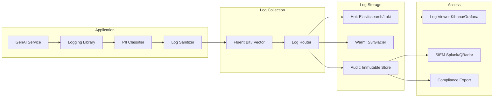
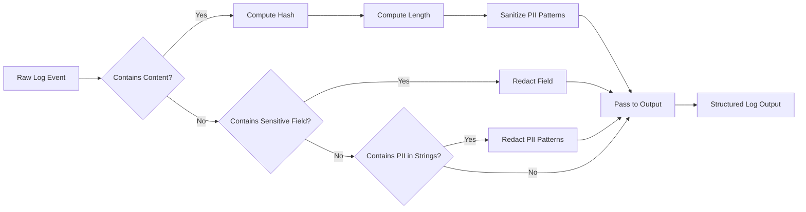

# Secure Logging for GenAI Systems

## Overview

Secure logging is the practice of recording operational information needed for debugging, monitoring, compliance, and incident response without inadvertently exposing sensitive data. In GenAI systems, logging is uniquely challenging because prompts and responses can contain PII, financial data, credentials, system internals, and other sensitive information that must never appear in logs.

In banking environments, logging requirements are driven by both operational needs (debugging production issues, monitoring performance) and regulatory requirements (GDPR data processing records, audit trails, PCI-DSS log requirements). Getting this wrong can turn your logs from a diagnostic tool into a data breach vector.

## The Logging Paradox in GenAI

```
┌─────────────────────────────────────────────────────────────────────┐
│                     THE LOGGING PARADOX                             │
│                                                                     │
│  To debug AI issues, you need to see what was asked and answered.   │
│  To protect user data, you must NOT record what was asked.          │
│                                                                     │
│  Resolution: Log WHAT happened, not the actual content.             │
│  Log metadata, hashes, classifications -- never raw prompts.        │
└─────────────────────────────────────────────────────────────────────┘
```

### Banking-Specific Risks

| What You Might Log | Risk if Exposed | Regulation |
|-------------------|-----------------|------------|
| Raw user prompt with account number | PII exposure in log aggregation | GDPR, Data Protection Act |
| LLM response with customer details | Unauthorized access via log viewer | GDPR, Banking secrecy |
| API key or token in debug log | Credential compromise | PCI-DSS, ISO 27001 |
| Vector embeddings in debug output | Training data reconstruction | Internal policy |
| System prompt in error trace | System configuration disclosure | Internal policy |
| User session ID with PII correlation | User activity profiling | GDPR |
| Database query results in error log | Full data exposure | Multiple regulations |

### Real-World Incidents

- **Uber (2016)**: Hardcoded AWS credentials in GitHub repos were discovered and used to access 57 million user records. Credentials were found in log files and configuration.
- **Various ChatGPT-like deployments**: Debug logs containing full conversation history exposed through misconfigured log endpoints, revealing user PII and internal discussions.
- **Internal banking tool (2022)**: A developer's `console.log(user)` in production logged full customer records including account balances to stdout, which was collected in Splunk accessible to 500+ engineers.

## Logging Architecture



## What to Log vs. What Never to Log

### SAFE to Log

```python
# These are always safe to log
safe_log_data = {
    "request_id": "req-abc123",           # Opaque identifier
    "user_id": "user-456",                # Opaque identifier, not email/name
    "session_id": "sess-789",             # Opaque identifier
    "endpoint": "/api/v1/chat",           # Route pattern, not query params
    "method": "POST",
    "status_code": 200,
    "response_time_ms": 342,
    "prompt_token_count": 1250,           # Counts, not content
    "response_token_count": 340,
    "model": "gpt-4",
    "model_version": "gpt-4-0125-preview",
    "prompt_hash_sha256": "a1b2c3...",    # Hash, not content
    "response_hash_sha256": "d4e5f6...",
    "user_role": "compliance_officer",    # Role, not identity details
    "user_clearance": "confidential",
    "documents_retrieved": 5,             # Counts
    "documents_filtered_by_acl": 2,       # Counts
    "injection_risk_score": 0.12,         # Scores
    "rate_limit_remaining": 45,
    "cache_hit": False,
    "error_type": "llm_timeout",          # Error classification
    "retry_count": 1,
}
```

### NEVER Log (Raw Values)

```python
# NEVER log these raw values
unsafe_log_data = {
    "raw_prompt": "What is John Smith's account balance?",     # PII in prompt
    "raw_response": "John Smith's balance is £15,432.50",      # Financial PII
    "system_prompt": "You are a banking assistant with...",    # System config
    "api_key": "sk-proj-abc123...",                            # Credential
    "jwt_token": "eyJhbGciOiJIUzI1NiIs...",                    # Credential
    "database_query_result": [{"name": "John", "balance": ...}],# Full data
    "user_email": "john.smith@bank.com",                       # PII
    "user_name": "John Smith",                                 # PII
    "customer_account_number": "1234-5678-9012",               # Financial PII
    "vector_embedding": [0.012, -0.034, ...],                  # Model internals
    "embedding_of_prompt": [0.045, 0.012, ...],               # Can be reverse-engineered
}
```

## Python: Secure Logging Implementation

### Structured Logging with PII Classification

```python
import logging
import hashlib
import json
import re
from typing import Any
from enum import Enum
from dataclasses import dataclass, field

class DataClassification(Enum):
    PUBLIC = "public"
    INTERNAL = "internal"
    CONFIDENTIAL = "confidential"
    RESTRICTED = "restricted"

@dataclass
class LogContext:
    """Structured log context with automatic PII handling."""
    request_id: str
    user_id: str
    session_id: str
    endpoint: str
    event: str
    classification: DataClassification = DataClassification.INTERNAL

    # Metrics (always safe)
    prompt_token_count: int = 0
    response_token_count: int = 0
    response_time_ms: float = 0
    documents_retrieved: int = 0

    # Hashes (safe way to track content uniqueness)
    prompt_hash: str = ""
    response_hash: str = ""

    # Risk scores
    injection_risk_score: float = 0.0
    exfil_risk_score: float = 0.0

    # Additional context (automatically sanitized)
    extra: dict[str, Any] = field(default_factory=dict)

    def to_dict(self) -> dict:
        """Convert to log-safe dictionary."""
        return {
            "request_id": self.request_id,
            "user_id": self.user_id,
            "session_id": self.session_id,
            "endpoint": self.endpoint,
            "event": self.event,
            "data_classification": self.classification.value,
            "prompt_token_count": self.prompt_token_count,
            "response_token_count": self.response_token_count,
            "response_time_ms": self.response_time_ms,
            "documents_retrieved": self.documents_retrieved,
            "documents_filtered_by_acl": self.extra.get("documents_filtered_by_acl", 0),
            "prompt_hash_sha256": self.prompt_hash,
            "response_hash_sha256": self.response_hash,
            "injection_risk_score": round(self.injection_risk_score, 4),
            "exfil_risk_score": round(self.exfil_risk_score, 4),
            "extra": self.extra,
        }

def compute_hash(content: str) -> str:
    """Compute SHA-256 hash of content for tracking without storing content."""
    return hashlib.sha256(content.encode()).hexdigest()[:16]

# Configure structured logging
class StructuredFormatter(logging.Formatter):
    """JSON formatter for structured logging."""

    def format(self, record: logging.LogRecord) -> str:
        log_entry = {
            "timestamp": self.formatTime(record),
            "level": record.levelname,
            "logger": record.name,
            "message": record.getMessage(),
        }

        # Add any extra structured data
        if hasattr(record, "log_context"):
            log_entry["context"] = record.log_context.to_dict()

        if hasattr(record, "extra_data"):
            log_entry["data"] = self._sanitize(record.extra_data)

        return json.dumps(log_entry, default=str)

    def _sanitize(self, data: dict) -> dict:
        """Sanitize data dictionary before logging."""
        sanitized = {}
        for key, value in data.items():
            if self._is_sensitive_key(key):
                sanitized[key] = "[REDACTED]"
            elif isinstance(value, str):
                sanitized[key] = self._sanitize_string(value)
            else:
                sanitized[key] = value
        return sanitized

    def _is_sensitive_key(self, key: str) -> bool:
        """Check if key suggests sensitive data."""
        sensitive_patterns = [
            "password", "secret", "token", "key", "auth", "credential",
            "ssn", "account", "card", "iban", "swift", "routing",
            "email", "phone", "address", "name", "dob",
            "prompt", "response", "message", "content",  # LLM content
        ]
        return any(p in key.lower() for p in sensitive_patterns)

    def _sanitize_string(self, value: str) -> str:
        """Check string for PII patterns and redact."""
        pii_patterns = [
            (r'\b\d{3}-\d{2}-\d{4}\b', '[SSN]'),
            (r'\b\d{4}[-\s]?\d{4}[-\s]?\d{4}[-\s]?\d{4}\b', '[ACCOUNT_NUMBER]'),
            (r'\b[A-Za-z0-9._%+-]+@[A-Za-z0-9.-]+\.[A-Za-z]{2,}\b', '[EMAIL]'),
            (r'\b\d{3}-\d{3}-\d{4}\b', '[PHONE]'),
            (r'£\d{1,3}(,\d{3})*(\.\d{2})?', '[AMOUNT]'),
        ]
        for pattern, replacement in pii_patterns:
            value = re.sub(pattern, replacement, value)
        return value

# Usage
logger = logging.getLogger("genai.security")
handler = logging.StreamHandler()
handler.setFormatter(StructuredFormatter())
logger.addHandler(handler)

def log_request_processed(ctx: LogContext):
    """Log a processed request safely."""
    logger.info(
        f"Request processed: {ctx.endpoint}",
        extra={"log_context": ctx}
    )

def log_injection_detected(ctx: LogContext, blocked: bool):
    """Log prompt injection detection."""
    logger.warning(
        f"Prompt injection detected, blocked={blocked}",
        extra={"log_context": ctx}
    )
```

### Go: Secure Logging with zap

```go
package securelog

import (
    "crypto/sha256"
    "encoding/hex"
    "regexp"
    "go.uber.org/zap"
    "go.uber.org/zap/zapcore"
)

// ComputeHash returns a truncated SHA-256 of content.
func ComputeHash(content string) string {
    h := sha256.Sum256([]byte(content))
    return hex.EncodeToString(h[:])[:16]
}

var piiPatterns = []struct {
    Pattern     *regexp.Regexp
    Replacement string
}{
    {regexp.MustCompile(`\b\d{3}-\d{2}-\d{4}\b`), "[SSN]"},
    {regexp.MustCompile(`\b\d{4}[-\s]?\d{4}[-\s]?\d{4}[-\s]?\d{4}\b`), "[ACCOUNT_NUMBER]"},
    {regexp.MustCompile(`\b[A-Za-z0-9._%+-]+@[A-Za-z0-9.-]+\.[A-Za-z]{2,}\b`), "[EMAIL]"},
    {regexp.MustCompile(`\b\d{3}-\d{3}-\d{4}\b`), "[PHONE]"},
}

// SanitizeString redacts PII patterns from a string.
func SanitizeString(s string) string {
    for _, p := range piiPatterns {
        s = p.Pattern.ReplaceAllString(s, p.Replacement)
    }
    return s
}

// IsSafeToLog checks if a string contains PII.
func IsSafeToLog(s string) bool {
    for _, p := range piiPatterns {
        if p.Pattern.MatchString(s) {
            return false
        }
    }
    return true
}

// BuildLogger creates a zap logger with safe defaults.
func BuildLogger(env string) *zap.Logger {
    cfg := zap.NewProductionConfig()

    if env == "development" {
        cfg.Level = zap.NewAtomicLevelAt(zap.DebugLevel)
        cfg.EncoderConfig.EncodeTime = zapcore.ISO8601TimeEncoder
    } else {
        cfg.Level = zap.NewAtomicLevelAt(zap.InfoLevel)
        // Never log full stack traces in production
        cfg.DisableStacktrace = true
    }

    logger, _ := cfg.Build()
    return logger
}

// SecureLogger wraps zap with automatic PII detection.
type SecureLogger struct {
    *zap.Logger
}

func NewSecureLogger(base *zap.Logger) *SecureLogger {
    return &SecureLogger{Logger: base}
}

// SafeInfo logs with automatic PII sanitization of string fields.
func (sl *SecureLogger) SafeInfo(msg string, fields ...zap.Field) {
    sanitized := make([]zap.Field, 0, len(fields))
    for _, f := range fields {
        if f.Key == "prompt" || f.Key == "response" || f.Key == "content" || f.Key == "message" {
            // Never log content fields raw
            sanitized = append(sanitized, zap.String(f.Key+"_hash", ComputeHash(f.String)))
            sanitized = append(sanitized, zap.String(f.Key+"_sanitized", SanitizeString(f.String)))
            continue
        }
        if f.Key == "password" || f.Key == "secret" || f.Key == "token" || f.Key == "api_key" {
            sanitized = append(sanitized, zap.String(f.Key, "[REDACTED]"))
            continue
        }
        sanitized = append(sanitized, f)
    }
    sl.Logger.Info(msg, sanitized...)
}
```

## TypeScript: Structured Logging with Winston

```typescript
import winston from 'winston';
import crypto from 'crypto';

/**
 * Compute a truncated hash for safe content tracking.
 */
export function contentHash(content: string): string {
  return crypto
    .createHash('sha256')
    .update(content)
    .digest('hex')
    .slice(0, 16);
}

/**
 * Sensitive field patterns that should never be logged raw.
 */
const SENSITIVE_FIELDS = [
  'prompt', 'response', 'content', 'message', 'body',
  'password', 'secret', 'token', 'apiKey', 'api_key',
  'authorization', 'cookie', 'ssn', 'account_number',
  'credit_card', 'email', 'phone', 'name', 'address',
];

/**
 * PII regex patterns for string sanitization.
 */
const PII_PATTERNS = [
  { regex: /\b\d{3}-\d{2}-\d{4}\b/g, replacement: '[SSN]' },
  { regex: /\b\d{4}[-\s]?\d{4}[-\s]?\d{4}[-\s]?\d{4}\b/g, replacement: '[ACCOUNT_NUMBER]' },
  { regex: /\b[A-Za-z0-9._%+-]+@[A-Za-z0-9.-]+\.[A-Za-z]{2,}\b/g, replacement: '[EMAIL]' },
  { regex: /£\d{1,3}(,\d{3})*(\.\d{2})?/g, replacement: '[AMOUNT]' },
];

function sanitizeString(value: string): string {
  return PII_PATTERNS.reduce(
    (acc, { regex, replacement }) => acc.replace(regex, replacement),
    value
  );
}

function isSensitiveField(key: string): boolean {
  return SENSITIVE_FIELDS.some(
    sensitive => key.toLowerCase().includes(sensitive.toLowerCase())
  );
}

/**
 * Winston format that sanitizes sensitive fields.
 */
const secureFormat = winston.format((info) => {
  const sanitized: Record<string, unknown> = {};

  for (const [key, value] of Object.entries(info)) {
    if (['level', 'message', 'timestamp', 'service'].includes(key)) {
      sanitized[key] = value;
      continue;
    }

    if (isSensitiveField(key)) {
      if (typeof value === 'string') {
        sanitized[`${key}_hash`] = contentHash(value);
        sanitized[`${key}_length`] = value.length;
        sanitized[`${key}_sanitized`] = sanitizeString(value);
      } else {
        sanitized[key] = '[REDACTED]';
      }
    } else if (typeof value === 'string') {
      sanitized[key] = sanitizeString(value);
    } else {
      sanitized[key] = value;
    }
  }

  return sanitized;
});

export const secureLogger = winston.createLogger({
  level: process.env.LOG_LEVEL || 'info',
  format: winston.format.combine(
    winston.format.timestamp(),
    secureFormat(),
    winston.format.json()
  ),
  defaultMeta: { service: 'genai-assistant' },
  transports: [
    new winston.transports.Console(),
  ],
});

// Usage example
secureLogger.info('chat request processed', {
  request_id: 'req-123',
  user_id: 'user-456',
  prompt_token_count: 1250,
  response_token_count: 340,
  response_time_ms: 342,
  // prompt: rawPrompt,  // NEVER include raw prompt
  prompt_hash: contentHash(rawPrompt),
  prompt_length: rawPrompt.length,
});
```

## Log Sanitization Pipeline



## Audit Logging Requirements

### What Must Be Logged for Compliance

For banking GenAI systems, the following events MUST be logged for audit purposes:

| Event | Required Fields | Retention | Regulation |
|-------|----------------|-----------|------------|
| User authentication | user_id (hashed), auth method, result, IP | 7 years | Various |
| Authorization decision | user_id, resource, action, decision | 7 years | SOX |
| Data access | user_id, data_classification, count | 7 years | GDPR |
| PII processing | data_type, purpose, user_role (not identity) | 7 years | GDPR Art. 30 |
| Prompt injection attempt | user_role, risk_score, blocked (not the prompt) | 3 years | Internal policy |
| Model API call | model, token_count, cost (not content) | 3 years | Internal policy |
| Configuration change | change_type, approver, timestamp | 7 years | SOX |
| Access control change | resource, old_access, new_access | 7 years | ISO 27001 |

### Immutable Audit Log

```python
import hashlib
import json
from datetime import datetime

class ImmutableAuditLog:
    """
    Append-only audit log with hash chaining.
    Each entry includes the hash of the previous entry,
    making tampering detectable.
    """

    def __init__(self, db_session):
        self.db = db_session
        self.last_hash = self._get_last_hash()

    def append(self, event_type: str, actor_role: str, resource: str,
               action: str, details: dict) -> str:
        """Append an entry to the immutable audit log."""

        entry = {
            "timestamp": datetime.utcnow().isoformat() + "Z",
            "event_type": event_type,
            "actor_role": actor_role,  # Role, not user identity
            "resource": resource,
            "action": action,
            "details": self._sanitize_details(details),
            "previous_hash": self.last_hash,
        }

        # Compute entry hash
        entry_hash = hashlib.sha256(
            json.dumps(entry, sort_keys=True).encode()
        ).hexdigest()
        entry["entry_hash"] = entry_hash

        # Store in database
        self.db.execute(
            "INSERT INTO audit_log (entry, entry_hash, previous_hash) "
            "VALUES (:entry, :entry_hash, :previous_hash)",
            {
                "entry": json.dumps(entry),
                "entry_hash": entry_hash,
                "previous_hash": self.last_hash,
            }
        )
        self.db.commit()

        self.last_hash = entry_hash
        return entry_hash

    def verify_integrity(self) -> bool:
        """Verify the entire audit log chain is intact."""
        entries = self.db.execute("SELECT entry, entry_hash FROM audit_log ORDER BY id").fetchall()

        prev_hash = None
        for row in entries:
            entry = json.loads(row["entry"])
            if entry["previous_hash"] != prev_hash and prev_hash is not None:
                return False  # Chain broken

            computed = hashlib.sha256(
                json.dumps(entry, sort_keys=True).encode()
            ).hexdigest()
            if computed != row["entry_hash"]:
                return False  # Entry tampered

            prev_hash = row["entry_hash"]

        return True

    def _sanitize_details(self, details: dict) -> dict:
        """Remove sensitive fields from audit details."""
        sanitized = {}
        for key, value in details.items():
            if key in ("prompt", "response", "content", "api_key", "token"):
                sanitized[f"{key}_present"] = value is not None and value != ""
                if isinstance(value, str):
                    sanitized[f"{key}_hash"] = hashlib.sha256(value.encode()).hexdigest()[:16]
            else:
                sanitized[key] = value
        return sanitized
```

## Log Access Control

### Kubernetes: Restricting Log Access

```yaml
# OpenShift: Restrict who can view logs
apiVersion: rbac.authorization.k8s.io/v1
kind: ClusterRole
metadata:
  name: log-reader
rules:
  - apiGroups: [""]
    resources: ["pods/log"]
    verbs: ["get", "list"]
  - apiGroups: [""]
    resources: ["pods"]
    verbs: ["get", "list"]
---
apiVersion: rbac.authorization.k8s.io/v1
kind: ClusterRoleBinding
metadata:
  name: log-reader-binding
subjects:
  - kind: Group
    name: genai-engineers
    apiGroup: rbac.authorization.k8s.io
roleRef:
  kind: ClusterRole
  name: log-reader
  apiGroup: rbac.authorization.k8s.io
# NOTE: Only engineers with production access can read logs.
# Application logs should not contain sensitive data as defense in depth.
```

### OpenShift: Log Forwarding with Access Controls

```yaml
apiVersion: logging.openshift.io/v1
kind: ClusterLogForwarder
metadata:
  name: genai-log-forwarder
  namespace: openshift-logging
spec:
  pipelines:
    # Application logs -> Elasticsearch (restricted access)
    - name: app-logs
      inputRefs:
        - application
      outputRefs:
        - elasticsearch-secure
      labels:
        access-level: restricted
    # Audit logs -> Separate secure store (compliance team only)
    - name: audit-logs
      inputRefs:
        - audit
      outputRefs:
        - secure-audit-store
      labels:
        access-level: compliance-only
  outputs:
    - name: elasticsearch-secure
      type: elasticsearch
      elasticsearch:
        structuredTypeKey: kubernetes.labels.app
      secret:
        name: elasticsearch-credentials
    - name: secure-audit-store
      type: elasticsearch
      elasticsearch:
        structuredTypeKey: kubernetes.labels.app
      secret:
        name: audit-store-credentials
```

## Log Retention and Deletion

### Python: GDPR-Compliant Log Rotation

```python
import os
import gzip
import shutil
from datetime import datetime, timedelta

class LogRetentionManager:
    """Manage log retention according to GDPR and internal policies."""

    def __init__(self, log_dir: str):
        self.log_dir = log_dir
        # Retention periods
        self.hot_retention_days = 30       # Immediately searchable
        self.warm_retention_days = 365     # Archived, slower retrieval
        self.audit_retention_days = 2555   # 7 years (2555 days)

    def rotate_logs(self):
        """Rotate and archive logs based on retention policy."""
        cutoff_warm = datetime.utcnow() - timedelta(days=self.hot_retention_days)
        cutoff_delete = datetime.utcnow() - timedelta(days=self.audit_retention_days)

        for filename in os.listdir(self.log_dir):
            filepath = os.path.join(self.log_dir, filename)
            file_time = datetime.fromtimestamp(os.path.getmtime(filepath))

            if file_time < cutoff_delete:
                # Past all retention periods -- securely delete
                self._secure_delete(filepath)
                logger.info(f"Deleted log past retention period: {filename}")

            elif file_time < cutoff_warm and not filename.endswith('.gz'):
                # Move to warm storage (compressed)
                compressed_path = filepath + '.gz'
                with open(filepath, 'rb') as f_in:
                    with gzip.open(compressed_path, 'wb') as f_out:
                        shutil.copyfileobj(f_in, f_out)
                self._secure_delete(filepath)
                logger.info(f"Compressed and archived log: {filename}")

    def _secure_delete(self, filepath: str):
        """Securely delete a file (overwrite before deletion)."""
        if os.name == 'nt':
            # Windows: simple deletion (secure overwrite not straightforward)
            os.remove(filepath)
        else:
            # Unix: overwrite with random data before deletion
            file_size = os.path.getsize(filepath)
            with open(filepath, 'wb') as f:
                f.write(os.urandom(file_size))
                f.flush()
                os.fsync(f.fileno())
            os.remove(filepath)
```

## Secure Defaults and Hardening Checklist

### Must-Have Controls

- [ ] Structured JSON logging across all services
- [ ] Automatic PII detection and redaction in log formatters
- [ ] Never log: prompts, responses, API keys, tokens, raw database results
- [ ] Log content hashes instead of content for traceability
- [ ] Separate audit log with hash chaining (tamper evidence)
- [ ] Log access control (RBAC for log viewers)
- [ ] Log retention policy with automated deletion
- [ ] Different log levels for different environments (DEBUG never in production)

### Should-Have Controls

- [ ] Log encryption at rest for audit logs
- [ ] Separate log pipelines for application vs. audit events
- [ ] Automated PII scanning of existing log data (retroactive cleanup)
- [ ] Log integrity monitoring (alert on gaps or anomalies in log volume)
- [ ] Developer training on secure logging practices
- [ ] Regular log content audits (sample logs to check for accidental PII)
- [ ] Centralized log access with MFA and just-in-time access for sensitive logs

### Common Mistakes to Avoid

| Mistake | Consequence | Fix |
|---------|------------|-----|
| `logger.debug(f"User query: {user_prompt}")` | Full prompt with potential PII in logs | Log prompt hash and length only |
| `logger.error(f"DB error: {result}")` | Full database row in error log | Log error code and row count only |
| `console.log(user)` in production | Full user object including credentials | Use structured logger with field filtering |
| Logging JWT token for debugging | Complete credential exposure | Log token subject/issuer only |
| Including request body in error context | May contain sensitive form data | Sanitize body before logging |
| DEBUG level enabled in production | Excessive detail including internals | Set INFO minimum, DEBUG only in dev |
| Stack traces with local variables | Variable values may contain secrets | Disable stack traces in production |

### Interview Questions

1. **Your on-call engineer needs to debug a production issue where the LLM is returning incorrect responses. They ask you to enable debug logging that includes prompts and responses. What do you do?**

2. **How would you design a logging system for a GenAI assistant that satisfies GDPR's right to erasure while maintaining 7-year audit trail requirements?**

3. **An auditor asks for evidence that a specific user accessed certain data through the AI assistant. What can you provide from your logs without violating privacy?**

4. **You discover that the application logs contain full JWT tokens. What is your immediate response and long-term fix?**

5. **What is the difference between application logs and audit logs?** Why do they need different handling?

6. **How does hash chaining in an audit log work?** Why is it useful?

7. **Your team wants to log vector embeddings to debug retrieval quality issues. What are the risks and how would you mitigate them?**

## Cross-References

- `secrets-management.md` -- Never log secrets, API keys, or credentials
- `llm-data-exfiltration.md` -- Logging exfiltration events safely
- `genai-threat-modeling.md` -- Threat T-006 (Repudiation) and logging
- `encryption.md` -- Encrypting logs at rest
- `../regulations-and-compliance/gdpr.md` -- Right to erasure vs. log retention
- `../regulations-and-compliance/audit-trails.md` -- Audit trail requirements
- `../regulations-and-compliance/data-retention.md` -- Retention period policies
- `../observability/` -- Observability infrastructure for logging

## Further Reading

- OWASP Logging Cheat Sheet
- GDPR Article 30: Records of Processing Activities
- NIST SP 800-92: Guide to Computer Security Log Management
- PCI-DSS Requirement 10: Track and Monitor All Access
