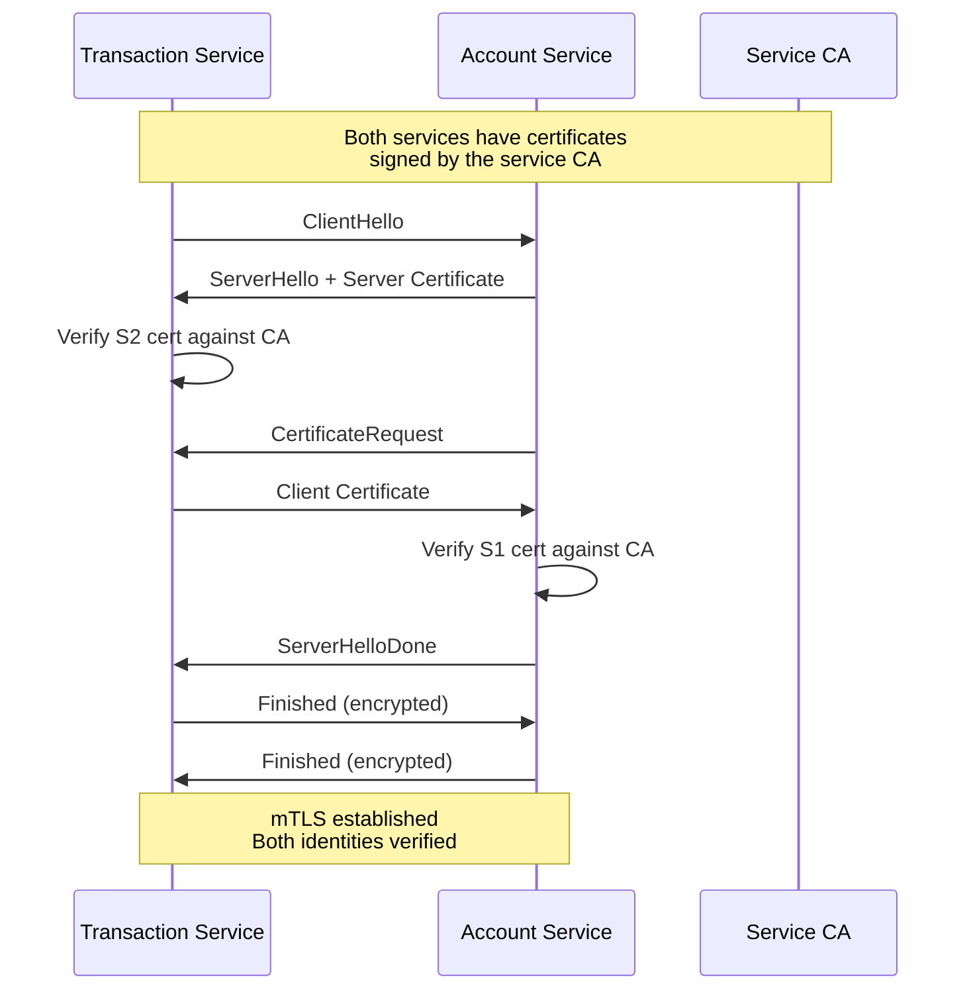
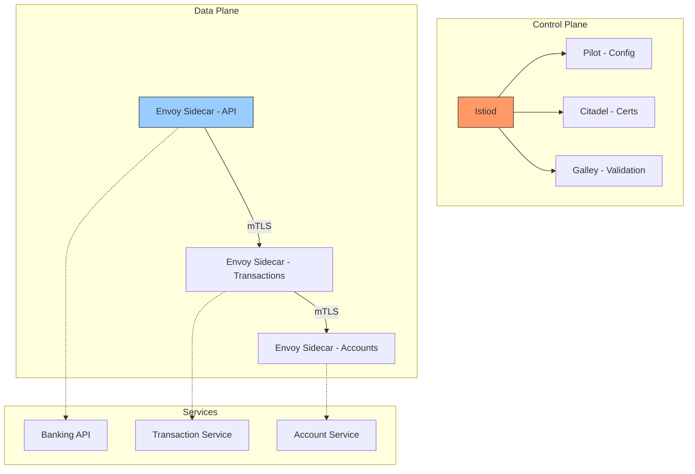
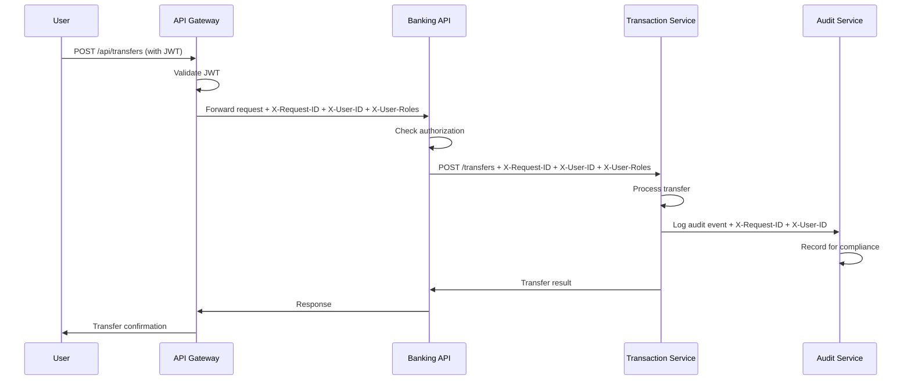

# Service-to-Service Security

## Overview

In a banking microservices architecture, service-to-service communication is the primary attack surface. With 50-200+ services making thousands of requests per second, every connection must be authenticated, authorized, and encrypted. This guide covers mutual TLS, service mesh architecture, identity propagation, and production patterns for securing service communication.

## Threat Landscape

### Service-to-Service Attack Vectors

| Attack | Description | Impact |
|---|---|---|
| Unauthorized Service Access | Compromised service calls other services | Lateral movement |
| Credential Theft | Stolen service account tokens | Impersonation |
| Man-in-the-Middle | Intercepting unencrypted traffic | Data exfiltration |
| Replay Attack | Captured and replayed valid requests | Duplicate transactions |
| Request Tampering | Modifying requests in transit | Data corruption |
| Privilege Escalation | Service with limited scope accessing admin functions | Full system compromise |

### Real-World Examples

- **Capital One (2019)**: SSRF vulnerability allowed a compromised WAF to make requests to the instance metadata service, obtaining IAM credentials that provided access to S3 buckets with 100M customer records.
- **Uber (2022)**: Attacker used stolen service credentials to access internal Slack, Jira, and GitHub.
- **LastPass (2022)**: Attacker exploited a third-party cloud storage service and used stolen developer credentials to access the source code repository.

## Mutual TLS (mTLS) Between Services

### How mTLS Works



### mTLS Implementation with Go

```go
// Server-side: Require and verify client certificates
func createMTLSServer(handler http.Handler, caCertPool *x509.CertPool) *http.Server {
    return &http.Server{
        Addr:    ":8443",
        Handler: handler,
        TLSConfig: &tls.Config{
            ClientCAs:  caCertPool,
            ClientAuth: tls.RequireAndVerifyClientCert, // Require client cert
            MinVersion: tls.VersionTLS12,
            CipherSuites: []uint16{
                tls.TLS_ECDHE_RSA_WITH_AES_256_GCM_SHA384,
                tls.TLS_ECDHE_RSA_WITH_AES_128_GCM_SHA256,
            },
        },
    }
}

// Client-side: Present client certificate and verify server
func createMTLSClient(clientCert, clientKey, caCert []byte) (*http.Client, error) {
    cert, err := tls.X509KeyPair(clientCert, clientKey)
    if err != nil {
        return nil, err
    }

    caCertPool := x509.NewCertPool()
    caCertPool.AppendCertsFromPEM(caCert)

    transport := &http.Transport{
        TLSClientConfig: &tls.Config{
            Certificates: []tls.Certificate{cert},
            RootCAs:      caCertPool,
            MinVersion:   tls.VersionTLS12,
        },
    }

    return &http.Client{Transport: transport, Timeout: 10 * time.Second}, nil
}

// Usage: Transaction service calls Account service
func (ts *TransactionService) GetAccount(accountID string) (*Account, error) {
    req, err := http.NewRequest("GET",
        fmt.Sprintf("https://account-service:8443/api/accounts/%s", accountID),
        nil,
    )
    if err != nil {
        return nil, err
    }

    resp, err := ts.mtlsClient.Do(req)
    if err != nil {
        return nil, fmt.Errorf("mTLS request failed: %w", err)
    }
    defer resp.Body.Close()

    if resp.StatusCode != http.StatusOK {
        return nil, fmt.Errorf("account service returned %d", resp.StatusCode)
    }

    var account Account
    if err := json.NewDecoder(resp.Body).Decode(&account); err != nil {
        return nil, err
    }
    return &account, nil
}
```

## Service Mesh Architecture

### Istio Service Mesh



### Istio Configuration for Banking

```yaml
# PeerAuthentication: Enforce mTLS mesh-wide
apiVersion: security.istio.io/v1beta1
kind: PeerAuthentication
metadata:
  name: default
  namespace: istio-system
spec:
  mtls:
    mode: STRICT

---
# Per-namespace override for migration
apiVersion: security.istio.io/v1beta1
kind: PeerAuthentication
metadata:
  name: production-mtls
  namespace: production
spec:
  mtls:
    mode: STRICT

---
# AuthorizationPolicy: Service-level access control
apiVersion: security.istio.io/v1beta1
kind: AuthorizationPolicy
metadata:
  name: transaction-service-policy
  namespace: production
spec:
  selector:
    matchLabels:
      app: transaction-service
  action: ALLOW
  rules:
  - from:
    - source:
        principals:
        - "cluster.local/ns/production/sa/banking-api"
    to:
    - operation:
        methods: ["GET", "POST"]
        paths: ["/api/transactions/*", "/api/transfers/*"]

---
# Deny policy: Block everything else by default
apiVersion: security.istio.io/v1beta1
kind: AuthorizationPolicy
metadata:
  name: transaction-service-deny
  namespace: production
spec:
  selector:
    matchLabels:
      app: transaction-service
  action: DENY
  rules:
  - {}  # Deny all that doesn't match an ALLOW rule
```

### Envoy Sidecar Configuration

```yaml
# Envoy automatically handles:
# - mTLS certificate rotation
# - Request routing and load balancing
# - Retry logic and circuit breaking
# - Rate limiting
# - Request/response transformation
# - Observability (metrics, traces, access logs)

apiVersion: networking.istio.io/v1beta1
kind: DestinationRule
metadata:
  name: account-service-dr
  namespace: production
spec:
  host: account-service
  trafficPolicy:
    tls:
      mode: ISTIO_MUTUAL  # Use Istio-managed mTLS
    connectionPool:
      tcp:
        maxConnections: 100
      http:
        h2UpgradePolicy: DEFAULT
        http1MaxPendingRequests: 100
        http2MaxRequests: 1000
    outlierDetection:
      consecutive5xxErrors: 5
      interval: 30s
      baseEjectionTime: 30s
      maxEjectionPercent: 50
    loadBalancer:
      simple: ROUND_ROBIN
```

## Identity Propagation

### Propagating User Identity Across Services



### Identity Headers

```python
# API Gateway extracts identity from JWT and propagates as headers
class IdentityPropagationMiddleware:
    """
    Extract user identity from JWT and add standardized headers
    for downstream services.
    """

    IDENTITY_HEADERS = {
        "X-Request-ID": "correlation_id",
        "X-User-ID": "sub",
        "X-User-Roles": "roles",
        "X-User-Scopes": "scope",
        "X-User-MFA-Level": "mfa_level",
        "X-Auth-Token": "jti",  # JWT ID for audit
    }

    def __call__(self, request: Request, call_next):
        # JWT already validated by auth middleware
        payload = request.state.jwt_payload

        # Create new request with identity headers
        headers = dict(request.headers)
        headers["X-Request-ID"] = str(uuid.uuid4())
        headers["X-User-ID"] = payload["sub"]
        headers["X-User-Roles"] = ",".join(payload.get("roles", []))
        headers["X-User-Scopes"] = payload.get("scope", "")
        headers["X-User-MFA-Level"] = payload.get("mfa_level", "none")
        headers["X-Auth-Token"] = payload["jti"]

        # Remove original Authorization header (don't propagate JWT downstream)
        headers.pop("Authorization", None)

        modified_request = request.scope.copy()
        modified_request["headers"] = list(headers.items())

        return call_next(modified_request)
```

### Service-Side Identity Validation

```go
// Each service validates identity headers and enforces its own authorization
func (s *TransactionService) CreateTransfer(w http.ResponseWriter, r *http.Request) {
    // Extract propagated identity
    userID := r.Header.Get("X-User-ID")
    userRoles := strings.Split(r.Header.Get("X-User-Roles"), ",")
    mfaLevel := r.Header.Get("X-User-MFA-Level")

    if userID == "" {
        http.Error(w, "Missing user identity", http.StatusUnauthorized)
        return
    }

    // Verify the request came through the service mesh (mTLS)
    // The peer certificate confirms the calling service identity
    peerCert, err := getPeerCertificate(r)
    if err != nil {
        http.Error(w, "mTLS required", http.StatusUnauthorized)
        return
    }

    callingService := extractSAN(peerCert)
    if callingService != "banking-api" {
        log.Warn("Unauthorized service calling",
            "caller", callingService,
            "expected", "banking-api",
        )
        http.Error(w, "Forbidden", http.StatusForbidden)
        return
    }

    // Service-level authorization
    if r.URL.Path == "/api/transfers" && !contains(userRoles, "customer") {
        http.Error(w, "Forbidden", http.StatusForbidden)
        return
    }

    // Step-up auth check for large transfers
    var req TransferRequest
    json.NewDecoder(r.Body).Decode(&req)
    if req.Amount > 10000 && mfaLevel != "hardware" {
        http.Error(w, "Hardware MFA required for large transfers", http.StatusUnauthorized)
        return
    }

    // Process the transfer
    transfer, err := s.processor.Process(userID, req)
    if err != nil {
        http.Error(w, err.Error(), http.StatusBadRequest)
        return
    }

    json.NewEncoder(w).Encode(transfer)
}
```

## Service Identity and SPIFFE/SPIRE

### SPIFFE IDs for Services

```
SPIFFE ID format: spiffe://<trust-domain>/<workload-identity>

Examples:
  spiffe://bank.internal/production/banking-api
  spiffe://bank.internal/production/transaction-service
  spiffe://bank.internal/production/postgresql
```

### SPIRE Server Configuration

```yaml
# SPIRE server configuration
server:
  bind_address: "0.0.0.0"
  bind_port: "8081"
  trust_domain: "bank.internal"
  log_level: "INFO"

  # Registration entries map workloads to SPIFFE IDs
  registration:
    - ParentID: "spiffe://bank.internal/spire/agent/k8s_psat/cluster1/node1"
      SPIFFEID: "spiffe://bank.internal/production/banking-api"
      Selectors:
        - "k8s:ns:production"
        - "k8s:sa:banking-api-sa"
        - "k8s:pod-label:app:banking-api"

    - ParentID: "spiffe://bank.internal/spire/agent/k8s_psat/cluster1/node1"
      SPIFFEID: "spiffe://bank.internal/production/transaction-service"
      Selectors:
        - "k8s:ns:production"
        - "k8s:sa:transaction-service-sa"
```

## Request Signing

### HMAC Request Signing for Service-to-Service

```python
import hashlib
import hmac
import time

class RequestSigner:
    """
    Sign requests with HMAC-SHA256 for additional security
    beyond mTLS. Useful when service mesh is not available.
    """

    def __init__(self, access_key: str, secret_key: bytes):
        self.access_key = access_key
        self.secret_key = secret_key

    def sign_request(self, method: str, path: str, body: bytes, timestamp: int = None) -> dict:
        """Generate signature headers for a request"""
        if timestamp is None:
            timestamp = int(time.time())

        # String to sign
        string_to_sign = f"{method}\n{path}\n{timestamp}\n{hashlib.sha256(body).hexdigest()}"

        # Compute HMAC
        signature = hmac.new(
            self.secret_key,
            string_to_sign.encode(),
            hashlib.sha256
        ).hexdigest()

        return {
            "X-Access-Key": self.access_key,
            "X-Timestamp": str(timestamp),
            "X-Signature": signature,
        }

    def verify_request(self, method: str, path: str, body: bytes, headers: dict) -> bool:
        """Verify a signed request"""
        access_key = headers.get("X-Access-Key")
        timestamp = int(headers.get("X-Timestamp", "0"))
        signature = headers.get("X-Signature")

        # Check timestamp freshness (prevent replay)
        if abs(time.time() - timestamp) > 300:  # 5-minute window
            return False

        # Recompute expected signature
        expected = self.sign_request(method, path, body, timestamp)

        # Constant-time comparison
        return hmac.compare_digest(signature, expected["X-Signature"])
```

## Banking-Specific Service Security

### Financial Transaction Integrity

```python
class TransactionIntegrityMiddleware:
    """
    Ensure transaction requests cannot be replayed or modified in transit.
    """

    def __init__(self, redis_client):
        self.redis = redis_client
        self.idempotency_window = 3600  # 1 hour

    async def __call__(self, request: Request, call_next):
        # Extract idempotency key
        idempotency_key = request.headers.get("X-Idempotency-Key")
        if not idempotency_key:
            return JSONResponse(400, {"error": "X-Idempotency-Key required"})

        # Check if request already processed
        existing = await self.redis.get(f"idem:{idempotency_key}")
        if existing:
            return JSONResponse(200, json.loads(existing))

        # Compute request hash for integrity
        body = await request.body()
        request_hash = hashlib.sha256(body).hexdigest()

        # Process request
        response = await call_next(request)

        # Store result for idempotency
        if response.status_code == 200:
            response_body = b""
            async for chunk in response.body_iterator:
                response_body += chunk
            await self.redis.setex(
                f"idem:{idempotency_key}",
                self.idempotency_window,
                json.dumps({"status": 200, "body": response_body.decode()})
            )

        return response
```

## Security Testing

### Service Mesh Security Testing

```bash
# Test mTLS enforcement
# From outside the mesh (should fail)
curl -k https://transaction-service:8443/api/transactions
# Expected: connection refused or TLS handshake failure

# From inside the mesh (should succeed)
kubectl exec -it banking-api-pod -- curl -k https://transaction-service:8443/api/transactions
# Expected: success (mTLS handled by Envoy)

# Test authorization policies
kubectl exec -it unauthorized-pod -- curl -k https://transaction-service:8443/api/transactions
# Expected: 403 Forbidden (AuthorizationPolicy blocks unauthorized services)

# Test certificate rotation
# Check that Envoy sidecars are rotating certificates
kubectl logs -l app=istiod -n istio-system | grep "certificate rotation"
```

## Interview Questions

### Junior Level

1. What is mTLS and how does it differ from regular TLS?
2. What is a service mesh and why is it useful?
3. Why should you propagate user identity across services?
4. What is an idempotency key?

### Senior Level

1. How does Istio handle mTLS certificate rotation?
2. Design an identity propagation pattern for a 100-service banking platform.
3. How do you detect and prevent replay attacks between services?
4. What happens when a service's mTLS certificate expires?

### Staff Level

1. How would you implement service-to-service zero trust without a service mesh?
2. Design a cross-cluster service communication pattern with SPIFFE/SPIRE.
3. What is your strategy for managing service credentials across multi-cloud environments?

## Cross-References

- [TLS and Certificates](./tls-and-certificates.md) - mTLS fundamentals
- [Network Security](./network-security.md) - Network segmentation
- [Kubernetes Security](./kubernetes-security.md) - K8s service identity
- [API Security](./api-security.md) - API-level service security
