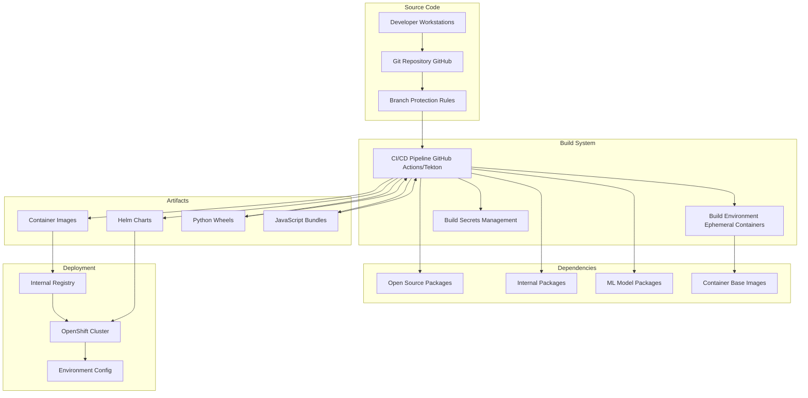
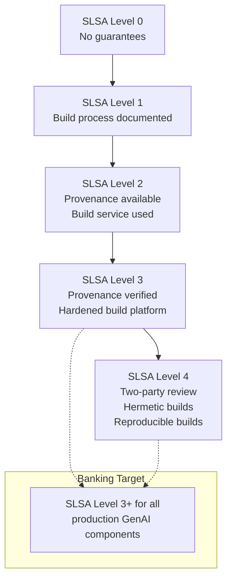
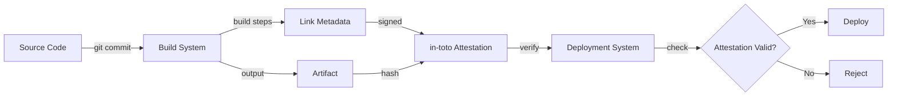

# Supply Chain Security

## Overview

Supply chain security encompasses the practices, tools, and controls that ensure the integrity and authenticity of every component that enters your software -- from source code and dependencies to build systems, CI/CD pipelines, container images, and deployed artifacts. While dependency scanning focuses on known vulnerabilities in third-party libraries, supply chain security addresses the broader question: **Can I trust that every piece of software in my pipeline is what it claims to be, and has not been tampered with?**

In banking GenAI systems, the supply chain is particularly complex, spanning traditional software dependencies, ML model packages, prompt templates, vector embeddings, container base images, and third-party AI API integrations. Each link in this chain is a potential attack vector.

## The Software Supply Chain Attack Surface



### Notable Supply Chain Attacks

| Attack | Vector | Lesson |
|--------|--------|--------|
| SolarWinds (2020) | Compromised build system, backdoored signed update | Build systems are high-value targets |
| Codecov (2021) | Modified CI uploader script, credential theft | CI/CD pipelines must be secured |
| XZ Utils (2024) | Social engineering, multi-year backdoor in compression library | Maintainer trust is attackable |
| 3CX Desktop App (2023) | Compromised third-party dependency (ffmpeg) | Transitive supply chain risk |
| MOVEit (2023) | Zero-day in file transfer software, mass exploitation | Vendor software is in your supply chain |

## SLSA Framework

### Supply chain Levels for Software Artifacts (SLSA)

SLSA (pronounced "salsa") is a security framework developed by Google that provides a graduated set of requirements for supply chain security. Each level builds on the previous one.



### SLSA Requirements by Level

| Requirement | L0 | L1 | L2 | L3 | L4 |
|------------|----|----|----|----|-----|
| Provenance available | No | Yes | Yes, authenticated | Yes, verified | Yes, verified |
| Build service | Any | Any | Hosted | Hardened | Hardened |
| Provenance generation | Optional | Yes | Yes | Yes, service-generated | Yes, service-generated |
| Provenance verification | None | None | Signature verification | Verified authenticity + integrity | Verified + non-falsifiable |
| Hermetic builds | No | No | No | No | Yes |
| Reproducible builds | No | No | No | No | Yes |
| Source verification | None | None | Best effort | Verified | Verified + two-party review |

### Target for Banking: SLSA Level 3

All GenAI platform components should achieve SLSA Level 3 as a minimum.

## Provenance and Attestation

### What is Provenance?

Provenance is a signed statement about how a software artifact was built: what source code was used, what build system ran, what dependencies were included, and when it happened. It answers: "Where did this artifact come from, and can I trust it?"

### in-toto Attestation Framework



### GitHub Actions: Generating SLSA Provenance

```yaml
name: Build with SLSA Provenance
on:
  push:
    branches: [main]
  release:
    types: [published]

permissions:
  contents: read
  id-token: write  # Required for signing
  packages: write

jobs:
  build:
    runs-on: ubuntu-latest
    permissions:
      contents: read
      id-token: write
      packages: write
    outputs:
      hashes: ${{ steps.hash.outputs.hashes }}

    steps:
      - uses: actions/checkout@v4
        with:
          persist-credentials: false  # Security best practice

      - name: Build container image
        id: build
        run: |
          IMAGE_TAG="${{ github.sha }}"
          docker build -t nexus.bank.internal:5000/genai-assistant:${IMAGE_TAG} .
          docker push nexus.bank.internal:5000/genai-assistant:${IMAGE_TAG}
          echo "image=nexus.bank.internal:5000/genai-assistant:${IMAGE_TAG}" >> $GITHUB_OUTPUT

      - name: Generate SLSA provenance
        uses: slsa-framework/slsa-github-generator/.github/workflows/generator_container_slsa3.yml@v2.0.0
        with:
          image: nexus.bank.internal:5000/genai-assistant
          digest: ${{ steps.build.outputs.digest }}
          registry-username: ${{ secrets.REGISTRY_USERNAME }}
          registry-password: ${{ secrets.REGISTRY_PASSWORD }}
        permissions:
          id-token: write
          packages: write

      - name: Generate artifact attestation
        uses: actions/attest-build-provenance@v1
        with:
          subject-path: 'dist/genai-assistant'

      - name: Record build hashes
        id: hash
        run: |
          echo "hashes=$(sha256sum dist/* | base64 -w0)" >> $GITHUB_OUTPUT
```

### Cosign: Signing and Verifying Artifacts

```bash
#!/bin/bash
# sign-and-verify.sh -- Sign container images and verify before deployment

set -euo pipefail

REGISTRY="nexus.bank.internal:5000"
IMAGE="genai-assistant"
TAG="${1:-latest}"

# === SIGNING ===
sign_image() {
    local full_image="${REGISTRY}/${IMAGE}:${TAG}"
    echo "Signing ${full_image}..."

    # Sign with keyless mode (uses Fulcio certificate + Rekor transparency log)
    cosign sign \
        --yes \
        "${full_image}"

    # Also sign with a hardware-backed key for critical images
    cosign sign \
        --key /secrets/cosign.key \
        --password-env COSIGN_PASSWORD \
        "${full_image}"

    echo "Signed successfully"
}

# === VERIFICATION ===
verify_image() {
    local full_image="${REGISTRY}/${IMAGE}:${TAG}"
    echo "Verifying ${full_image}..."

    # Verify signature
    cosign verify \
        --certificate-identity="https://github.com/mybank/genai-assistant/.github/workflows/build.yml@refs/heads/main" \
        --certificate-oidc-issuer="https://token.actions.githubusercontent.com" \
        "${full_image}"

    # Verify SBOM is attached
    cosign download sbom "${full_image}" > /dev/null 2>&1
    if [ $? -eq 0 ]; then
        echo "SBOM verification: PASSED"
    else
        echo "SBOM verification: FAILED -- no SBOM attached"
        return 1
    fi

    echo "Verification passed"
}

# === GATE: Deploy only if verification passes ===
deploy_gate() {
    if verify_image; then
        echo "Deploying ${IMAGE}:${TAG} to OpenShift..."
        oc set image deployment/genai-assistant \
            genai-assistant="${REGISTRY}/${IMAGE}:${TAG}" \
            -n genai-platform
    else
        echo "DEPLOYMENT BLOCKED: Image verification failed"
        exit 1
    fi
}

case "${2:-deploy}" in
    sign)   sign_image ;;
    verify) verify_image ;;
    deploy) deploy_gate ;;
    *)      echo "Usage: $0 <tag> {sign|verify|deploy}" ;;
esac
```

## Build System Security

### Ephemeral Build Environments

```yaml
# Tekton Pipeline: Ephemeral build with no persistent state
apiVersion: tekton.dev/v1beta1
kind: PipelineRun
metadata:
  name: genai-assistant-build
  namespace: genai-platform
spec:
  pipelineSpec:
    workspaces:
      - name: source
    tasks:
      - name: fetch-source
        taskRef:
          name: git-clone
        workspaces:
          - name: output
            workspace: source
        params:
          - name: url
            value: https://github.com/mybank/genai-assistant
          - name: revision
            value: $(params.revision)

      - name: build
        runAfter: [fetch-source]
        taskRef:
          name: buildah   # Container build in ephemeral pod
        workspaces:
          - name: source
            workspace: source
        params:
          - name: IMAGE
            value: nexus.bank.internal:5000/genai-assistant:$(params.revision)
          - name: DOCKERFILE
            value: Dockerfile
          - name: TLSVERIFY
            value: "true"
          - name: FORMAT
            value: oci

      - name: scan-and-sign
        runAfter: [build]
        taskRef:
          name: cosign-sign
        params:
          - name: IMAGE
            value: nexus.bank.internal:5000/genai-assistant:$(params.revision)

  workspaces:
    - name: source
      volumeClaimTemplate:
        spec:
          accessModes:
            - ReadWriteOnce
          resources:
            requests:
              storage: 1Gi

  params:
    - name: revision
      value: main
```

### Build Environment Hardening

```yaml
# OpenShift: Restrict build pod capabilities
apiVersion: security.openshift.io/v1
kind: SecurityContextConstraints
metadata:
  name: build-restricted-scc
allowPrivilegedContainer: false
allowHostDirVolumePlugin: false
allowHostNetwork: false
allowHostPID: false
allowHostIPC: false
readOnlyRootFilesystem: false  # Builds need write access
runAsUser:
  type: MustRunAsRange
  uidRangeMin: 1000
  uidRangeMax: 2000
seLinuxContext:
  type: MustRunAs
  seLinuxOptions:
    level: "s0:c100,c200"
volumes:
  - configMap
  - emptyDir
  - projected
  - secret
# This SCC applies to build pods only
allowedUsers:
  - system:serviceaccount:genai-platform:builder
```

### Build Secret Protection

```yaml
# NEVER embed secrets in build definitions
# Use OpenShift Secrets mounted at build time

apiVersion: v1
kind: Secret
metadata:
  name: build-credentials
  namespace: genai-platform
  annotations:
    # Mark as build secret -- accessible only during builds
    build.openshift.io/source-secret-match-uri: "https://github.com/*"
type: kubernetes.io/basic-auth
data:
  username: <base64-encoded>
  password: <base64-encoded>
---
# Reference in BuildConfig
apiVersion: build.openshift.io/v1
kind: BuildConfig
metadata:
  name: genai-assistant-build
spec:
  source:
    git:
      uri: https://github.com/mybank/genai-assistant
      ref: main
    sourceSecret:
      name: build-credentials
  strategy:
    dockerStrategy:
      from:
        kind: ImageStreamTag
        name: python:3.12
      pullSecret:
        name: registry-pull-secret
```

## Image Security

### Minimal Base Images

```dockerfile
# BAD: Full OS with unnecessary packages
FROM ubuntu:24.04
RUN apt-get update && apt-get install -y \
    python3 python3-pip curl wget vim nano net-tools \
    gcc g++ make  # Build tools in production image!

# GOOD: Minimal distroless image
FROM gcr.io/distroless/python3-debian12:nonroot
# No shell, no package manager, minimal attack surface

# GOOD: Alternative -- Wolfi (designed for containers)
FROM cgr.dev/chainguard/python:latest-dev AS builder
RUN pip install -r requirements.txt --target /app

FROM cgr.dev/chainguard/python:latest
COPY --from=builder /app /app
WORKDIR /app
CMD ["python", "main.py"]
```

### Image Scanning in CI/CD

```yaml
# Tekton: Image vulnerability scanning task
apiVersion: tekton.dev/v1beta1
kind: Task
metadata:
  name: trivy-scan
  namespace: genai-platform
spec:
  params:
    - name: image-ref
      type: string
    - name: severity
      type: string
      default: "CRITICAL,HIGH"
    - name: exit-code
      type: string
      default: "1"
  steps:
    - name: scan
      image: aquasec/trivy:latest
      script: |
        #!/bin/sh
        set -e
        echo "Scanning image: $(params.image-ref)"

        trivy image \
          --severity $(params.severity) \
          --exit-code $(params.exit-code) \
          --format json \
          --output /workspace/scan-results.json \
          "$(params.image-ref)"

        echo "Scan complete. Results at /workspace/scan-results.json"
      volumeMounts:
        - name: scan-results
          mountPath: /workspace
  volumes:
    - name: scan-results
      emptyDir: {}
```

### OpenShift Image Policies

```yaml
# Restrict which images can run in the cluster
apiVersion: config.openshift.io/v1
kind: ClusterImagePolicy
metadata:
  name: genai-image-policy
spec:
  policies:
    # Only allow images from internal registry
    - name: internal-registry-only
      pattern: "nexus.bank.internal:5000/*"
      action: enforce

    # Require signed images
    - name: require-signed-images
      pattern: "nexus.bank.internal:5000/*"
      signatures:
        - name: cosign-signature
          key:
            # Public key for cosign verification
            data: |
              -----BEGIN PUBLIC KEY-----
              MFkwEwYHKoZIzj0CAQYIKoZIzj0DAQcDQgAE...
              -----END PUBLIC KEY-----

    # Block images with critical vulnerabilities
    - name: no-critical-vulns
      scanner: trivy
      severity: CRITICAL
      action: enforce
```

## Third-Party AI Service Supply Chain Risk

### AI API Provider Assessment

When using third-party AI APIs (OpenAI, Anthropic, Google), you are incorporating their infrastructure into your supply chain.

```python
from dataclasses import dataclass
from enum import Enum
from typing import Optional

class RiskRating(Enum):
    LOW = "low"
    MEDIUM = "medium"
    HIGH = "high"
    CRITICAL = "critical"

@dataclass
class AIProviderAssessment:
    """Assess third-party AI API provider supply chain risk."""
    provider: str
    data_processing_locations: list[str]
    data_retention_policy: str
    model_training_on_customer_data: bool
    soc2_certified: bool
    iso27001_certified: bool
    subprocessors_disclosed: bool
    breach_notification_sla: str
    data_processing_agreement: bool
    right_to_audit: bool
    overall_risk: RiskRating

    @classmethod
    def assess_openai(cls) -> "AIProviderAssessment":
        return cls(
            provider="OpenAI",
            data_processing_locations=["US", "EU"],
            data_retention_policy="30 days for API, opt-out available",
            model_training_on_customer_data=False,  # Enterprise tier
            soc2_certified=True,
            iso27001_certified=True,
            subprocessors_disclosed=True,
            breach_notification_sla="72 hours",
            data_processing_agreement=True,
            right_to_audit=False,
            overall_risk=RiskRating.MEDIUM,
        )

    @classmethod
    def assess_anthropic(cls) -> "AIProviderAssessment":
        return cls(
            provider="Anthropic",
            data_processing_locations=["US"],
            data_retention_policy="No retention by default",
            model_training_on_customer_data=False,
            soc2_certified=True,
            iso27001_certified=False,
            subprocessors_disclosed=True,
            breach_notification_sla="72 hours",
            data_processing_agreement=True,
            right_to_audit=False,
            overall_risk=RiskRating.MEDIUM,
        )

    def is_acceptable(self) -> bool:
        """Determine if provider meets bank's minimum requirements."""
        minimum_requirements = [
            self.model_training_on_customer_data == False,  # Must not train on our data
            self.data_processing_agreement == True,          # Must have DPA
            self.soc2_certified or self.iso27001_certified,  # Must have security certification
        ]
        return all(minimum_requirements)
```

### AI Provider Integration Controls

```yaml
# OpenShift: Network policy restricting AI API access
apiVersion: networking.k8s.io/v1
kind: NetworkPolicy
metadata:
  name: ai-api-egress
  namespace: genai-platform
spec:
  podSelector:
    matchLabels:
      app: ai-gateway
  policyTypes:
    - Egress
  egress:
    # Only allow egress to approved AI API endpoints
    - to:
        - ipBlock:
            cidr: 0.0.0.0/0
            # This would be more restrictive in production
            # using specific IP ranges for approved providers
      ports:
        - protocol: TCP
          port: 443
    # Allow DNS
    - to:
        - namespaceSelector:
            matchLabels:
              name: openshift-dns
      ports:
        - protocol: UDP
          port: 53
---
# AI Gateway: Request/response logging for audit
apiVersion: v1
kind: ConfigMap
metadata:
  name: ai-gateway-config
data:
  config.yaml: |
    provider: azure-openai
    endpoint: https://mybank.openai.azure.com
    model: gpt-4
    logging:
      log_requests: true
      log_responses: false  # Never log raw responses (may contain sensitive data)
      log_metadata: true    # Log model, tokens, latency
      log_errors: true
    rate_limiting:
      requests_per_minute: 100
      tokens_per_minute: 50000
    retry:
      max_retries: 3
      backoff: exponential
    timeout: 30s
```

## Secure Defaults and Hardening Checklist

### Must-Have Controls

- [ ] SLSA Level 3 provenance for all production artifacts
- [ ] SBOM generated and stored for every release
- [ ] Container images signed (cosign) and verified before deployment
- [ ] Build system uses ephemeral, isolated build environments
- [ ] No secrets in build definitions or Dockerfiles
- [ ] Internal registry only -- no pulling images from public registries in production
- [ ] Image vulnerability scanning (Trivy) blocking deployment on Critical/High
- [ ] Third-party AI provider security assessment completed and documented

### Should-Have Controls

- [ ] Hermetic builds (no network access during build)
- [ ] Reproducible builds (same source produces identical artifact)
- [ ] Cluster image policies enforcing signing requirements
- [ ] Automated SBOM vulnerability scanning
- [ ] Build pipeline tamper-evident (GitHub required reviewers, branch protection)
- [ ] CI/CD pipeline access restricted and audited
- [ ] Dependency review automation (auto-block PRs with risky new dependencies)
- [ ] Regular supply chain risk assessments for all AI service providers

### Interview Questions

1. **What is SLSA, and why is Level 3 the target for banking production systems?** What additional controls does Level 3 require over Level 2?

2. **Explain the concept of provenance in supply chain security.** How would you generate and verify provenance for a container image deployed to OpenShift?

3. **Your CI/CD pipeline is compromised. An attacker can now push container images to your internal registry. What controls would prevent those images from being deployed to production?**

4. **What is the difference between an SBOM and provenance?** When do you need each?

5. **A developer wants to use a new open-source LLM framework in production. What supply chain security steps should be taken before approval?**

6. **How does keyless signing (cosign + Fulcio + Rekor) work?** Why is it better than traditional key-based signing?

7. **You discover that a container base image has a critical vulnerability. Walk through your response process from detection to remediation.**

## Cross-References

- `dependency-scanning.md` -- SCA and vulnerability management
- `secure-software-development-lifecycle.md` -- Security gates in development process
- `secrets-management.md` -- Build secret protection
- `kubernetes-security.md` -- Image security and admission controllers
- `../cicd-devops/` -- CI/CD pipeline security
- `../regulations-and-compliance/vendor-risk-management.md` -- Third-party provider risk
- `../regulations-and-compliance/third-party-ai-risk.md` -- AI provider supply chain risk

## Further Reading

- SLSA Framework: https://slsa.dev
- in-toto Attestation Framework: https://in-toto.io
- Sigstore (cosign, Fulcio, Rekor): https://www.sigstore.dev
- NIST SSDF SP 800-218
- CNCF Supply Chain Security Best Practices
- "Supply Chain Security for AI Systems" -- ENISA 2024
