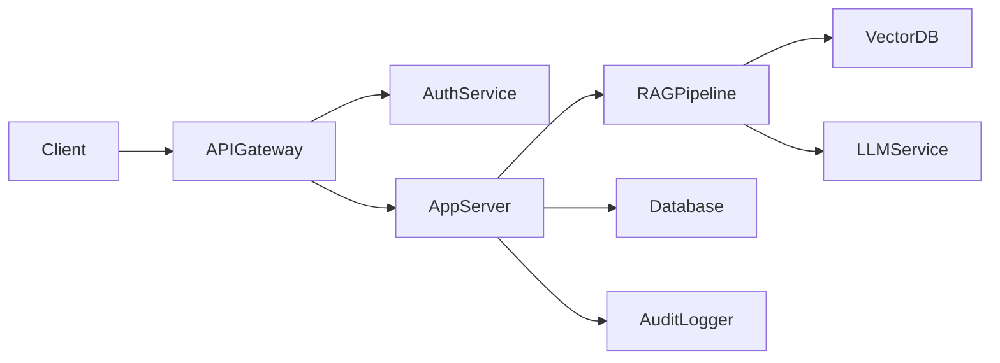
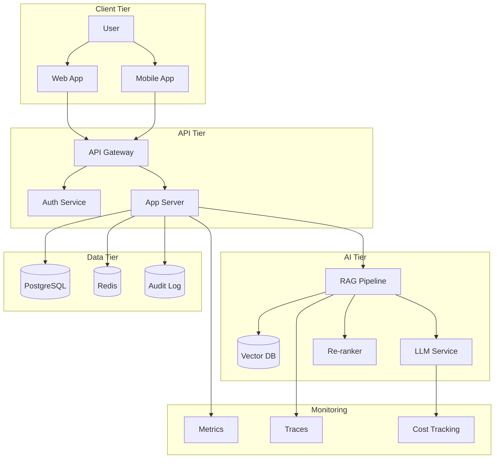
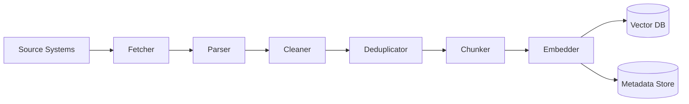

# System Design Interviews for GenAI Banking Roles

## Overview

System design interviews evaluate your ability to architect complex software systems. For GenAI banking roles, you will be asked to design systems that leverage AI while meeting banking requirements for security, compliance, reliability, and scalability.

## What Interviewers Evaluate

| Criterion | What They Look For | Weight |
|---|---|---|
| **Requirements clarification** | Do you ask the right questions? | 15% |
| **Architecture design** | Can you design a coherent, scalable system? | 25% |
| **Tradeoff analysis** | Do you understand pros/cons of each decision? | 20% |
| **Banking context** | Do you consider security, compliance, audit? | 20% |
| **Scalability** | Can the system handle growth? | 10% |
| **Failure handling** | What happens when things break? | 10% |

## Standard Interview Approach

### Phase 1: Requirements (5 minutes)

Ask clarifying questions:

```
1. Who are the users? (employees, customers, both?)
2. What is the primary use case?
3. What are the scale requirements? (users/day, queries/sec, data volume)
4. What are the latency requirements?
5. What security/compliance constraints apply?
6. Is this internal or customer-facing?
7. What existing systems does it need to integrate with?
```

### Phase 2: High-Level Design (10 minutes)

Draw the architecture:



### Phase 3: Deep Dive (15 minutes)

Discuss each component in detail:
- Data models
- API design
- Scaling strategy
- Failure modes
- Security considerations

### Phase 4: Tradeoffs and Alternatives (5 minutes)

```
"We could use Pinecone for vector storage, but since the bank already runs PostgreSQL,
pgvector is a better fit -- it reduces operational complexity and leverages existing
expertise. The tradeoff is that pgvector doesn't scale as well for billion-scale datasets,
but at our expected volume of 5M chunks, it is well within capacity."
```

## Banking-Specific Considerations

Every system design for banking must address:

### Security
- Authentication and authorization (OAuth2, SAML, MFA)
- Role-based access control (RBAC)
- Data encryption at rest and in transit
- PII handling and redaction
- Network isolation (VPC, subnets)

### Compliance
- Audit logging (every action logged)
- Data retention policies
- Regulatory requirements (SOC 2, PCI DSS, GDPR)
- Change management and approval workflows
- Access reviews and certification

### Reliability
- High availability (multi-AZ, multi-region)
- Disaster recovery (RPO, RTO targets)
- Circuit breakers for external API calls
- Graceful degradation
- Monitoring and alerting

### AI-Specific
- Model versioning and rollback
- Prompt versioning and management
- Output validation and grounding checks
- Cost monitoring and optimization
- Quality evaluation pipeline

## Evaluation Rubric

### Strong Candidate (Hire)
- Asks clarifying questions before designing
- Considers banking constraints from the start
- Proposes reasonable architecture with justified tradeoffs
- Discusses failure modes proactively
- Considers scaling beyond initial requirements
- Communicates clearly and structures approach logically

### Weak Candidate (No Hire)
- Jumps into solution without understanding requirements
- Ignores banking-specific constraints (security, compliance)
- Cannot justify technology choices
- No discussion of failure modes
- Over-engineers or under-engineers the solution
- Struggles to explain component interactions

## Common System Design Patterns for Banking GenAI

| Pattern | When to Use | Key Components |
|---|---|---|
| **RAG Pipeline** | Knowledge Q&A, policy lookup | Vector DB, embedding model, LLM, retriever |
| **Event-Driven Pipeline** | Async processing, document ingestion | Message queue, workers, storage |
| **API Gateway + Microservices** | Multi-tenant, multi-feature platform | Gateway, auth service, domain services |
| **Batch + Real-Time** | Data processing with low-latency queries | Batch processor, real-time API, cache |
| **Multi-Agent Orchestration** | Complex workflows requiring multiple AI steps | Agent framework, tool registry, state manager |

## Interview Questions You Should Be Ready For

1. "Design an enterprise chatbot for bank employees" -- [internal-enterprise-chatbot.md](internal-enterprise-chatbot.md)
2. "Design a policy search and Q&A system" -- [policy-assistant.md](policy-assistant.md)
3. "Design a regulatory compliance assistant" -- [compliance-assistant.md](compliance-assistant.md)
4. "Design a customer service AI assistant" -- [customer-support-assistant.md](customer-support-assistant.md)
5. "Design an AI model gateway with routing and monitoring" -- [ai-gateway-platform.md](ai-gateway-platform.md)
6. "Design a secure RAG platform with access controls" -- [secure-rag-platform.md](secure-rag-platform.md)
7. "Design a multi-agent orchestration platform" -- [multi-agent-workflow-platform.md](multi-agent-workflow-platform.md)
8. "Design an observability platform for GenAI" -- [observability-platform.md](observability-platform.md)

## Preparation Tips

1. **Practice with real constraints**: Banking systems have real SLAs (99.9% uptime, < 3s latency)
2. **Know your components**: Understand vector DBs, LLM APIs, message queues, caches
3. **Think about failure**: Every component can fail -- how does the system cope?
4. **Study existing systems**: Look at how LangChain, LlamaIndex, and enterprise RAG platforms are architected
5. **Practice drawing**: Be comfortable drawing architecture diagrams on a whiteboard
6. **Bank first, AI second**: Start with banking requirements, then layer AI on top

## Useful Architecture Diagrams

### Standard RAG Architecture



### Ingestion Pipeline Architecture



## Recommended Study Resources

1. **Designing Data-Intensive Applications** by Martin Kleppmann
2. **System Design Interview** by Alex Xu
3. **LangChain Architecture Documentation**
4. **AWS/GCP/Azure Reference Architectures for RAG**
5. **Banking technology blogs** from JPMorgan, Goldman Sachs, Capital One
