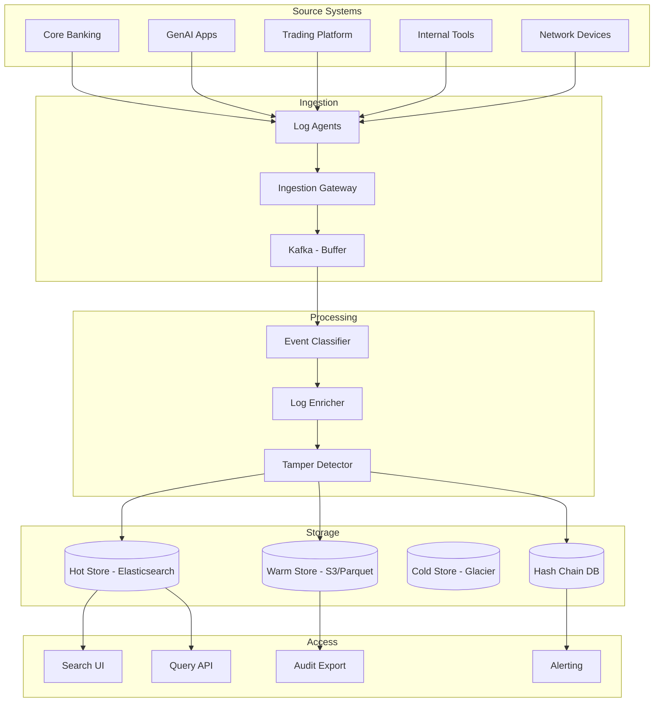

# System Design: Centralized Audit Logging Platform

## Problem Statement

Design a centralized audit logging platform that captures every significant action across all banking systems -- including GenAI applications, core banking, trading platforms, and internal tools. The platform must provide immutable logs for regulatory compliance (SOX, PCI DSS, GDPR), security incident investigation, and operational debugging.

## Requirements

### Functional Requirements
1. Ingest audit events from 50+ source systems
2. Immutable log storage (append-only, no deletes)
3. Real-time search and filtering across all logs
4. Retention: 7 years for compliance events, 1 year for operational events
5. Role-based access to logs (security team sees all, developers see their apps)
6. Alerting on suspicious patterns (unusual access, data exfiltration)
7. Export logs for regulatory audits
8. Log correlation across systems (trace a transaction end-to-end)
9. Tamper detection (detect if logs have been modified)
10. Automated log classification (PII, security, operational)

### Non-Functional Requirements
1. Ingestion: 1M+ events/minute
2. Search latency: < 2 seconds for typical queries
3. Storage: 100TB+ over 7 years
4. Availability: 99.99%
5. Write durability: zero log loss
6. Compliance: SOC 2, SOX, PCI DSS requirements for audit trails

## Architecture



## Detailed Design

### 1. Immutable Log Storage with Hash Chaining

```python
class ImmutableLogStore:
    """Append-only log store with tamper detection."""
    
    def __init__(self, db, hash_chain_db):
        self.db = db
        self.hash_chain = hash_chain_db
    
    def write_log(self, event: AuditEvent) -> str:
        """Write a log entry immutably."""
        
        log_id = str(uuid.uuid4())
        
        # Get previous hash for chaining
        previous_hash = self.hash_chain.get_latest_hash(event.source_system)
        
        # Compute hash of this entry (includes previous hash)
        content = json.dumps({
            "log_id": log_id,
            "timestamp": event.timestamp.isoformat(),
            "source": event.source_system,
            "user": event.user_id,
            "action": event.action,
            "resource": event.resource,
            "details": event.details,
            "previous_hash": previous_hash,
        }, sort_keys=True)
        
        current_hash = hashlib.sha256(content.encode()).hexdigest()
        
        # Write to database
        self.db.execute("""
            INSERT INTO audit_logs 
            (log_id, timestamp, source_system, user_id, action, 
             resource, details, content_hash, previous_hash, created_at)
            VALUES (%s, %s, %s, %s, %s, %s, %s, %s, %s, %s)
        """, (
            log_id, event.timestamp, event.source_system,
            event.user_id, event.action, event.resource,
            json.dumps(event.details), current_hash, previous_hash,
            datetime.utcnow()
        ))
        
        # Update hash chain
        self.hash_chain.update_hash(event.source_system, current_hash)
        
        return log_id
    
    def verify_integrity(self, source_system: str = None) -> bool:
        """Verify that no logs have been tampered with."""
        
        systems = [source_system] if source_system else self._all_systems()
        
        for system in systems:
            logs = self.db.query("""
                SELECT log_id, content_hash, previous_hash
                FROM audit_logs
                WHERE source_system = %s
                ORDER BY timestamp ASC
            """, (system,))
            
            previous_hash = "genesis"
            for log in logs:
                # Recompute expected hash
                expected_content = self._get_original_content(log["log_id"])
                expected_hash = hashlib.sha256(
                    expected_content.encode()
                ).hexdigest()
                
                if log["content_hash"] != expected_hash:
                    alert(f"Tamper detected in {system} at {log['log_id']}")
                    return False
                
                if log["previous_hash"] != previous_hash:
                    alert(f"Hash chain broken in {system} at {log['log_id']}")
                    return False
                
                previous_hash = log["content_hash"]
        
        return True
```

### 2. GenAI-Specific Audit Events

```python
class GenAIAuditLogger:
    """Specialized audit logging for GenAI applications."""
    
    def log_query_response(self, app_id: str, user: User, 
                           query: str, response: str,
                           sources: list, metadata: dict):
        """Log a complete GenAI query-response interaction."""
        
        event = AuditEvent(
            source_system=f"genai-{app_id}",
            event_type="ai_query_response",
            user_id=user.id,
            action="ai_query",
            resource=f"app:{app_id}",
            details={
                "query_hash": hashlib.sha256(query.encode()).hexdigest(),
                "response_length": len(response),
                "response_hash": hashlib.sha256(response.encode()).hexdigest(),
                "source_count": len(sources),
                "source_ids": [s.metadata.get("doc_id") for s in sources],
                "latency_ms": metadata.get("latency_ms"),
                "model": metadata.get("model"),
                "tokens": metadata.get("tokens"),
                "cost": metadata.get("cost"),
                "confidence": metadata.get("confidence"),
            },
            timestamp=datetime.utcnow()
        )
        
        self.log_store.write_log(event)
    
    def log_access_decision(self, user: User, doc_id: str, 
                            granted: bool, reason: str):
        """Log an access control decision."""
        
        event = AuditEvent(
            source_system="genai-access-control",
            event_type="access_decision",
            user_id=user.id,
            action="access_check" if granted else "access_denied",
            resource=f"document:{doc_id}",
            details={
                "user_roles": user.roles,
                "user_department": user.department,
                "user_clearance": user.clearance_level,
                "granted": granted,
                "reason": reason,
            },
            timestamp=datetime.utcnow()
        )
        
        self.log_store.write_log(event)
    
    def log_model_call(self, app_id: str, model: str, 
                       input_tokens: int, output_tokens: int,
                       cost: float, latency_ms: float):
        """Log an LLM API call."""
        
        event = AuditEvent(
            source_system=f"genai-{app_id}",
            event_type="model_api_call",
            user_id="system",
            action="llm_call",
            resource=f"model:{model}",
            details={
                "input_tokens": input_tokens,
                "output_tokens": output_tokens,
                "cost": cost,
                "latency_ms": latency_ms,
            },
            timestamp=datetime.utcnow()
        )
        
        self.log_store.write_log(event)
```

### 3. Log Retention and Tiering

```python
class LogRetentionManager:
    """Manage log lifecycle: hot -> warm -> cold -> expire."""
    
    def __init__(self, hot_store, warm_store, cold_store):
        self.hot = hot_store
        self.warm = warm_store
        self.cold = cold_store
    
    def run_retention_policy(self):
        """Apply retention policies."""
        
        now = datetime.utcnow()
        
        # Move logs older than 30 days from hot to warm
        self.hot.move_older_than(now - timedelta(days=30), self.warm)
        
        # Move logs older than 1 year from warm to cold
        self.warm.move_older_than(now - timedelta(days=365), self.cold)
        
        # Delete operational logs older than 1 year
        self.warm.delete_where(
            "event_category = 'operational' AND timestamp < %s",
            (now - timedelta(days=365),)
        )
        
        # Compliance logs: keep for 7 years, then archive
        self.cold.delete_where(
            "event_category = 'compliance' AND timestamp < %s",
            (now - timedelta(days=365 * 7),)
        )
```

## Interview Questions

### Q: How do you prove to a regulator that audit logs haven't been tampered with?

**Strong Answer**: "I use hash chaining (blockchain-like structure): each log entry includes the SHA-256 hash of the previous entry, creating an immutable chain. If any entry is modified, its hash changes, breaking the chain. Additionally, I periodically (daily) publish the latest chain hash to an external, tamper-proof system (e.g., a public blockchain or a notarized timestamp). To prove integrity to a regulator: (1) Show them the hash chain verification algorithm. (2) Run the verification across all logs -- any tampering would be detected. (3) Show the external hash publications and verify they match the internal chain. (4) Demonstrate that the writing process is append-only with no update or delete permissions, even for admins. (5) Show the access control logs proving that only the logging service can write, and no one (including DBAs) can modify or delete entries."
