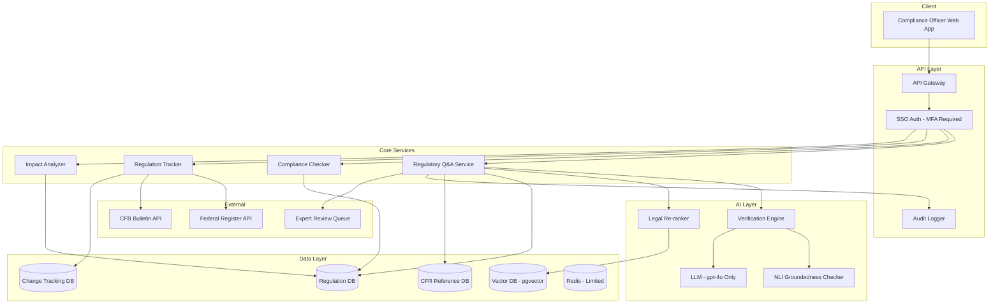

# System Design: Regulatory Compliance Assistant

## Problem Statement

Design an AI assistant that helps compliance officers navigate and interpret banking regulations (Regulation E, Z, B, DD, BSA, AML, Dodd-Frank, etc.). The assistant must provide highly accurate, well-cited regulatory guidance. Errors can result in regulatory penalties, making this the highest-stakes AI system in the bank.

## Requirements

### Functional Requirements
1. Natural language Q&A about banking regulations
2. Citation of specific regulation sections (CFR references)
3. Comparison of regulations across jurisdictions (US, UK, EU)
4. Regulatory change tracking (what changed in latest update)
5. Compliance checklist generation for specific scenarios
6. Historical regulation lookup (what did Reg E say in 2020?)
7. Regulatory impact analysis (how does a new rule affect our operations)
8. Export regulatory summaries for audit documentation

### Non-Functional Requirements
1. **Zero tolerance for factual errors** in regulatory citations
2. Response latency: P95 < 5 seconds (accuracy over speed)
3. Support 500 compliance officers, 5,000 queries/day
4. All responses must be citeable with exact CFR references
5. Full audit trail of every query and response
6. Human-in-the-loop review for all compliance-critical responses
7. Regulation database updated within 24 hours of regulatory change
8. Cost is secondary to accuracy

## Architecture



## Detailed Design

### 1. Regulatory Q&A Service

```python
class RegulatoryQAService:
    """Highest-accuracy Q&A for regulatory questions."""
    
    def __init__(self, retriever, reranker, llm, verifier, expert_queue):
        self.retriever = retriever
        self.reranker = reranker
        self.llm = llm  # gpt-4o only, no cost optimization
        self.verifier = verifier
        self.expert_queue = expert_queue
    
    def answer(self, query: str, user: User) -> RegulatoryAnswer:
        """Answer a regulatory question with maximum accuracy."""
        
        # Step 1: Retrieve regulatory text
        retrieved = self.retriever.retrieve(query, k=30)  # Broader retrieval
        
        # Step 2: Re-rank with legal-specific model
        doc_texts = [d.page_content for d in retrieved]
        reranked = self.reranker.rerank(query, doc_texts, top_k=10)
        
        # Step 3: Quality gate - must have high-scoring documents
        if not reranked or reranked[0]["score"] < 0.4:
            return self._escalate_to_expert(query, user, 
                reason="No sufficiently relevant regulatory text found")
        
        # Step 4: Generate answer with strict grounding
        context = self._assemble_regulatory_context(reranked)
        response = self.llm.generate(
            system=self._strict_regulatory_prompt(),
            context=context,
            question=query,
            temperature=0.0,  # Zero temperature for determinism
            max_tokens=800
        )
        
        # Step 5: Verification - MUST pass
        verification = self.verifier.verify(response.text, context)
        
        if not verification.passed:
            # Do NOT return unverified response
            return self._escalate_to_expert(query, user,
                reason=f"Verification failed: {verification.issues}")
        
        # Step 6: Additional human review for critical queries
        if self._is_critical_query(query):
            return self._queue_for_review(query, response, user)
        
        # Step 7: Return verified answer
        return RegulatoryAnswer(
            answer=response.text,
            confidence=verification.score,
            citations=self._extract_citations(response.text),
            regulation_versions=self._get_cited_versions(reranked),
            verified=True,
            reviewed_by="automated_verification"
        )
    
    def _strict_regulatory_prompt(self) -> str:
        return """You are a regulatory compliance analyst. Answer questions using EXACTLY the regulatory text provided.

ABSOLUTE RULES:
1. Use ONLY the regulatory text provided. Do not use your training knowledge.
2. Every regulatory citation must include the exact CFR reference (e.g., "12 CFR 1005.6(a)").
3. Never invent or approximate regulation numbers, section references, or dollar amounts.
4. If the exact CFR reference is not in the provided text, say: "The specific CFR reference is not available in my current documents."
5. Quote regulatory text verbatim when providing specific requirements.
6. If the regulation has been amended, note the effective date of the version you are citing.
7. If you are uncertain about any aspect of the answer, state your uncertainty explicitly."""
    
    def _is_critical_query(self, query: str) -> bool:
        """Determine if a query requires human review."""
        critical_keywords = [
            "penalty", "fine", "violation", "enforcement",
            "deadline", "reporting requirement", "criminal",
            "lawsuit", "litigation", "consent order"
        ]
        return any(kw in query.lower() for kw in critical_keywords)
```

### 2. Verification Engine

```python
class VerificationEngine:
    """Multi-layer verification for regulatory responses."""
    
    def __init__(self, nli_model, citation_validator, number_validator):
        self.nli = nli_model
        self.citation_validator = citation_validator
        self.number_validator = number_validator
    
    def verify(self, response: str, context: str) -> VerificationResult:
        """Comprehensive verification of a regulatory response."""
        
        issues = []
        scores = {}
        
        # Check 1: NLI-based claim verification
        claims = self._extract_claims(response)
        nli_results = []
        for claim in claims:
            entailment = self.nli.predict(context, claim)
            nli_results.append(entailment)
            if entailment != "entailment":
                issues.append(f"Claim not supported by context: {claim}")
        scores["nli"] = sum(1 for r in nli_results if r == "entailment") / max(len(nli_results), 1)
        
        # Check 2: Citation validation
        citations = self._extract_citations(response)
        citation_valid = 0
        for citation in citations:
            if self.citation_validator.is_valid(citation, context):
                citation_valid += 1
            else:
                issues.append(f"Invalid citation: {citation}")
        scores["citation"] = citation_valid / max(len(citations), 1)
        
        # Check 3: Number validation
        numbers_in_response = self._extract_numbers(response)
        numbers_in_context = self._extract_numbers(context)
        unverified_numbers = []
        for num in numbers_in_response:
            if num not in numbers_in_context and not self._is_approximate(num, numbers_in_context):
                unverified_numbers.append(num)
                issues.append(f"Unverified number: {num}")
        scores["numbers"] = 1.0 if not unverified_numbers else 0.0
        
        # Check 4: Citation coverage
        sentences = sent_tokenize(response)
        cited_sentences = sum(1 for s in sentences if re.search(r'\d+ CFR|Regulation', s))
        scores["citation_coverage"] = cited_sentences / max(len(sentences), 1)
        
        # Overall score (weighted)
        weights = {"nli": 0.3, "citation": 0.3, "numbers": 0.2, "citation_coverage": 0.2}
        overall = sum(scores[k] * weights[k] for k in weights)
        
        return VerificationResult(
            passed=overall >= 0.85 and scores["numbers"] == 1.0,
            score=overall,
            subscores=scores,
            issues=issues
        )
```

### 3. Regulation Change Tracking

```python
class RegulationTracker:
    """Track changes to banking regulations."""
    
    def __init__(self, fr_api, cfpg_api, regulation_db):
        self.federal_register = fr_api
        self.cfpb = cfpg_api
        self.db = regulation_db
    
    def check_for_updates(self) -> list[dict]:
        """Check for regulatory updates from official sources."""
        
        updates = []
        
        # Check Federal Register
        fr_updates = self.federal_register.get_recent_rules(
            agencies=["Consumer Financial Protection Bureau", "Federal Reserve"],
            since=self.db.get_last_check_date()
        )
        updates.extend(fr_updates)
        
        # Check CFPB bulletins
        cfpb_updates = self.cfpb.get_recent_bulletins(
            since=self.db.get_last_check_date()
        )
        updates.extend(cfpb_updates)
        
        # Process each update
        for update in updates:
            self._process_regulatory_update(update)
        
        return updates
    
    def _process_regulatory_update(self, update: dict):
        """Process a regulatory update and notify affected users."""
        
        # Parse the regulatory change
        affected_regulations = self._identify_affected_regulations(update)
        
        # Update regulation database
        for reg in affected_regulations:
            old_version = self.db.get_current_version(reg["regulation_id"])
            new_version = self._parse_new_version(update, reg)
            
            self.db.update_regulation(
                regulation_id=reg["regulation_id"],
                new_text=new_version["text"],
                effective_date=new_version["effective_date"],
                change_summary=new_version["summary"],
                source=update["source"],
                source_url=update["url"]
            )
            
            # Re-index updated regulation in vector DB
            self._reindex_regulation(reg["regulation_id"])
            
            # Notify compliance officers
            self._notify_affected_users(reg, old_version, new_version)
    
    def get_change_summary(self, regulation_id: str) -> list[dict]:
        """Get recent changes to a specific regulation."""
        
        return self.db.query("""
            SELECT version, effective_date, change_summary, source, source_url
            FROM regulation_changes
            WHERE regulation_id = %s
            ORDER BY effective_date DESC
            LIMIT 20
        """, (regulation_id,))
```

### 4. Compliance Checklist Generator

```python
class ComplianceChecklistGenerator:
    """Generate compliance checklists for specific scenarios."""
    
    def generate(self, scenario: str, jurisdiction: str = "US") -> Checklist:
        """Generate a compliance checklist for a scenario."""
        
        # Retrieve relevant regulations
        regulations = self._find_applicable_regulations(scenario, jurisdiction)
        
        # Extract requirements from each regulation
        requirements = []
        for reg in regulations:
            reqs = self._extract_requirements(reg.text)
            requirements.extend([
                ComplianceRequirement(
                    description=req["description"],
                    regulation=reg.name,
                    section=req["section"],
                    cfr_reference=req["cfr"],
                    mandatory=req.get("mandatory", True),
                    deadline=req.get("deadline"),
                )
                for req in reqs
            ])
        
        # Group by regulation and priority
        grouped = self._group_requirements(requirements)
        
        return Checklist(
            scenario=scenario,
            jurisdiction=jurisdiction,
            requirements=grouped,
            generated_at=datetime.utcnow(),
            regulation_versions=self._get_regulation_versions(regulations)
        )
```

## Tradeoffs

### Accuracy vs. Latency

For a compliance assistant, accuracy is paramount:
- Use gpt-4o (not mini) for all responses
- Broader retrieval (k=30 instead of k=10)
- Stricter verification thresholds (0.85 instead of 0.70)
- Human review for critical queries
- Limited caching (only for identical queries)

This results in higher latency (3-5 seconds) and higher cost, but is acceptable for the use case.

### Automation vs. Human Review

| Query Type | Automation Level | Review Required |
|---|---|---|
| General regulation lookup | Fully automated | None |
| Specific CFR reference question | Fully automated + verification | None if verified |
| Penalty/violation question | Automated + mandatory review | Human expert |
| Regulatory impact analysis | Draft by AI | Human expert must approve |
| New regulation interpretation | AI assists | Human expert leads |

## Security

1. **MFA required**: All compliance officers must use multi-factor authentication
2. **Session timeout**: 15-minute idle timeout
3. **IP restriction**: Access only from bank network or VPN
4. **Query logging**: Every query logged with user identity, timestamp, and response
5. **Export controls**: Regulatory summaries can only be exported by authorized users
6. **Data classification**: All responses classified as "Internal - Compliance"

## Monitoring

| Metric | Target | Alert |
|---|---|---|
| Verification pass rate | > 95% | < 90% |
| Expert escalation rate | 10-20% | > 30% |
| Regulation update latency | < 24 hours | > 48 hours |
| Response latency P95 | < 5000ms | > 8000ms |
| User satisfaction | > 90% | < 80% |

## Interview Questions

### Q: How do you handle a situation where the regulation text retrieved conflicts with the LLM's training knowledge?

**Strong Answer**: "The system prompt explicitly instructs the model to use ONLY the provided regulatory text. But to ensure this, I implement multiple safeguards: (1) The verification engine uses NLI to check every claim against the provided context -- claims based on training data that aren't in the context will fail NLI verification. (2) Citation validation ensures every cited CFR reference actually exists in the retrieved text. (3) Number validation catches fabricated dollar amounts or dates. (4) If verification fails, the response is NOT returned -- instead it goes to human expert review. The system would rather say 'I cannot answer this confidently' than provide an unverified answer."

### Q: A new regulation is published at 6 PM. How do you ensure compliance officers can query it by 9 AM the next day?

**Strong Answer**: "I implement an automated regulatory monitoring pipeline: (1) Poll the Federal Register API and CFPB bulletin every hour. (2) When a new regulation is detected, immediately parse and extract the regulatory text. (3) Chunk, embed, and index the new regulation in the vector database -- this automated pipeline should take < 30 minutes. (4) Send a notification to all compliance officers subscribed to the relevant regulation category. (5) Log the update with source, timestamp, and processing metadata. For edge cases where the regulation is in a non-standard format (scanned PDF, non-HTML), have a manual ingestion process with 4-hour SLA. The 24-hour target is conservative -- the automated pipeline should achieve < 2 hours."
