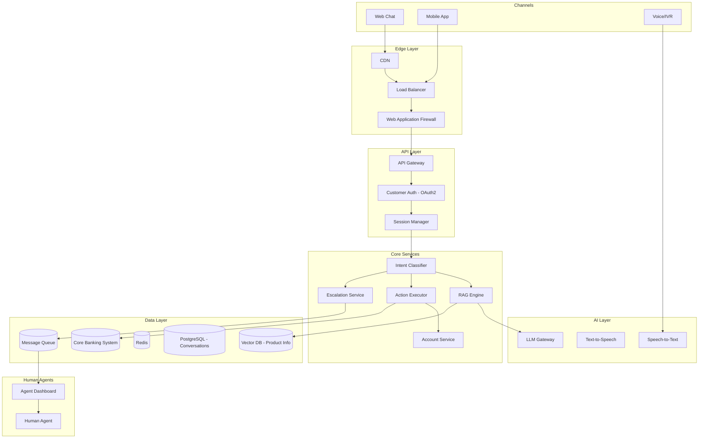

# System Design: Customer Support AI Assistant

## Problem Statement

Design an AI assistant that handles customer inquiries for a bank with 10 million customers. The assistant should handle common queries (balance, transaction history, product information), guide customers through processes (loan applications, dispute filing), and escalate complex issues to human agents. Target: deflect 40% of customer service calls to the AI assistant.

## Requirements

### Functional Requirements
1. Handle common banking queries: balance, transactions, fees, branch locations, product info
2. Guide customers through multi-step processes (apply for loan, file dispute)
3. Authenticate customers and access their account data (read-only)
4. Escalate to human agent with full context when needed
5. Multi-language support (English, Spanish, French, Mandarin)
6. Omnichannel: web chat, mobile app, phone (voice-to-text)
7. Transactional capabilities: initiate transfers, pay bills (with confirmation)
8. Proactive notifications: unusual activity alerts, payment reminders

### Non-Functional Requirements
1. Response latency: P95 < 2 seconds
2. Availability: 99.99% (customer-facing critical system)
3. Support 100,000 concurrent chat sessions, 2M queries/day
4. PCI DSS compliance for any payment-related interactions
5. SOC 2 Type II
6. Customer data must never be sent to external LLM APIs
7. Full conversation logging for dispute resolution
8. Cost: < $100,000/month at expected scale

## Architecture



## Detailed Design

### 1. Intent Classification

```python
class IntentClassifier:
    """Classify customer intent to route to appropriate handler."""
    
    def __init__(self, model, fallback_llm):
        self.model = model  # Fast classification model
        self.fallback = fallback_llm
    
    def classify(self, message: str, conversation_history: list) -> Intent:
        """Classify the customer's intent."""
        
        # Fast path: use classification model
        result = self.model.predict(message)
        
        if result.confidence > 0.85:
            return Intent(
                type=result.intent,
                confidence=result.confidence,
                entities=result.entities
            )
        
        # Fallback: use LLM for classification
        llm_result = self._llm_classify(message, conversation_history)
        return llm_result
    
    def _llm_classify(self, message: str, history: list) -> Intent:
        """Use LLM for low-confidence classification."""
        
        prompt = f"""Classify the customer's intent into one of these categories:
- balance_inquiry: checking balance, recent transactions
- transaction_dispute: disputing a charge, unauthorized transaction
- product_inquiry: asking about products (loans, cards, accounts)
- process_guidance: how to do something (apply, transfer, close)
- branch_locator: find branches/ATMs
- complaint: filing a complaint
- account_action: transfer money, pay bill, update info
- general: anything else

Message: {message}

Return: {{"intent": "category", "entities": {{"key": "value"}}, "confidence": 0.0-1.0}}"""
        
        result = json.loads(self.fallback.generate(prompt))
        return Intent(
            type=result["intent"],
            confidence=result["confidence"],
            entities=result.get("entities", {})
        )
```

### 2. RAG Engine for Product Knowledge

```python
class ProductRAGEngine:
    """Answer product-related questions using RAG."""
    
    def __init__(self, retriever, reranker, llm, cache):
        self.retriever = retriever
        self.reranker = reranker
        self.llm = llm
        self.cache = cache
    
    def answer(self, question: str) -> RAGResponse:
        """Answer a product question."""
        
        # Check cache
        cache_key = hashlib.md5(question.lower().encode()).hexdigest()
        cached = self.cache.get(f"product_qa:{cache_key}")
        if cached:
            return cached
        
        # Retrieve product information
        retrieved = self.retriever.retrieve(question, k=10)
        
        # Re-rank
        if retrieved:
            doc_texts = [d.page_content for d in retrieved]
            reranked = self.reranker.rerank(question, doc_texts, top_k=4)
        else:
            reranked = []
        
        if not reranked:
            return RAGResponse(
                answer="I don't have specific information about that. Let me connect you with a specialist who can help.",
                confidence=0.0,
                escalate=True
            )
        
        # Generate response
        context = "\n\n".join([r["document"] for r in reranked])
        response = self.llm.generate(
            system=self._product_assistant_prompt(),
            context=context,
            question=question
        )
        
        result = RAGResponse(
            answer=response.text,
            confidence=self._estimate_confidence(reranked),
            sources=self._format_sources(reranked)
        )
        
        # Cache
        self.cache.set(f"product_qa:{cache_key}", result, ttl=3600)
        
        return result
    
    def _product_assistant_prompt(self) -> str:
        return """You are a friendly, knowledgeable banking product specialist. 

Answer customer questions about banking products clearly and concisely.
Use the provided product information. If details are missing, say so and offer to connect the customer with a specialist.
Never make up specific numbers, rates, or terms.
Keep responses under 3 sentences when possible."""
```

### 3. Action Executor

```python
class ActionExecutor:
    """Execute customer-requested actions (transfers, payments, etc.)."""
    
    def __init__(self, core_banking_client, auth_service):
        self.core_banking = core_banking_client
        self.auth = auth_service
    
    def execute(self, intent: Intent, customer: Customer, params: dict) -> ActionResult:
        """Execute an action on behalf of the customer."""
        
        if intent.type == "account_action":
            action = params.get("action")
            
            if action == "transfer":
                return self._execute_transfer(customer, params)
            elif action == "pay_bill":
                return self._execute_bill_payment(customer, params)
            elif action == "update_info":
                return self._execute_info_update(customer, params)
        
        return ActionResult(success=False, error="Unknown action")
    
    def _execute_transfer(self, customer: Customer, params: dict) -> ActionResult:
        """Execute a money transfer with confirmation."""
        
        # Validate
        if params["amount"] > customer.daily_transfer_limit:
            return ActionResult(
                success=False,
                error=f"Transfer amount exceeds your daily limit of ${customer.daily_transfer_limit:,.2f}"
            )
        
        # Confirm with customer
        confirmation = f"Confirm transfer of ${params['amount']:,.2f} from {params['from_account']} to {params['to_account']}?"
        
        # Execute via core banking system
        try:
            result = self.core_banking.execute_transfer(
                customer_id=customer.id,
                from_account=params["from_account"],
                to_account=params["to_account"],
                amount=params["amount"],
                reference=params.get("reference", "")
            )
            
            return ActionResult(
                success=True,
                data={"transaction_id": result.transaction_id},
                confirmation=f"Transfer of ${params['amount']:,.2f} completed successfully. Reference: {result.transaction_id}"
            )
        except CoreBankingError as e:
            return ActionResult(success=False, error=str(e))
```

### 4. Escalation to Human Agent

```python
class EscalationService:
    """Escalate conversations to human agents."""
    
    def __init__(self, queue_manager, notification_service):
        self.queues = queue_manager
        self.notifier = notification_service
    
    def escalate(self, conversation: Conversation, reason: str, 
                 priority: str = "normal") -> str:
        """Escalate a conversation to a human agent."""
        
        # Build context summary for the agent
        summary = self._build_context_summary(conversation)
        
        # Determine queue based on issue type
        queue = self._select_queue(conversation.intent)
        
        # Create escalation ticket
        ticket_id = self.queues.create_ticket(
            queue=queue,
            customer_id=conversation.customer_id,
            conversation_id=conversation.id,
            summary=summary,
            reason=reason,
            priority=priority,
            chat_history=conversation.messages,
            attempted_solutions=conversation.attempted_actions
        )
        
        # Notify customer
        notification = (
            f"I'm connecting you with a specialist who can better assist you. "
            f"Your reference number is {ticket_id}. "
            f"Estimated wait time: {self.queues.estimate_wait_time(queue)} minutes."
        )
        
        # Notify agent
        self.notifier.notify_agent_queue(queue, ticket_id, summary)
        
        return ticket_id
    
    def _build_context_summary(self, conversation: Conversation) -> dict:
        """Build a concise summary for the human agent."""
        
        return {
            "customer_id": conversation.customer_id,
            "customer_name": conversation.customer.name,
            "account_type": conversation.customer.account_type,
            "issue": conversation.intent.type,
            "summary": self._summarize_conversation(conversation),
            "attempted_actions": [a.description for a in conversation.attempted_actions],
            "customer_sentiment": self._assess_sentiment(conversation),
            "urgency": self._assess_urgency(conversation),
        }
    
    def _summarize_conversation(self, conversation: Conversation) -> str:
        """Use LLM to generate a conversation summary."""
        
        messages = [f"Customer: {m.text}" for m in conversation.messages[-10:]]
        
        prompt = f"""Summarize this customer service conversation in 3-4 sentences.
        Focus on: what the customer wants, what was attempted, and what remains unresolved.

        Conversation:
        {'\n'.join(messages)}

        Summary:"""
        
        return self.llm.generate(prompt)
```

## Tradeoffs

### Self-Hosted vs. Cloud LLM

For customer-facing AI, data privacy is critical:

| Criteria | Cloud (OpenAI/Anthropic) | Self-Hosted (Llama/Mistral) |
|---|---|---|
| **Data privacy** | Customer data sent externally | Data stays in-house |
| **Quality** | Best | Good (improving) |
| **Latency** | 500-2000ms | 200-800ms (with GPU) |
| **Cost** | Per-token | Fixed GPU cost |
| **Compliance** | BAA available | Full control |
| **Decision** | Hybrid: cloud for general, self-hosted for account-specific |

**Rationale**: Product knowledge questions (no customer data) can use cloud LLMs. Account-specific questions (balance, transactions) must use self-hosted models or API-based responses from the core banking system.

### Deflection vs. Satisfaction Tradeoff

Pushing too hard for call deflection can hurt customer satisfaction. Set targets carefully:
- Deflection target: 40% (not 80%+)
- Satisfaction threshold: If CSAT drops below 3.5/5, reduce deflection aggressiveness
- Always offer easy escalation path

## Security

1. **Customer authentication**: OAuth2 via mobile/web, voice biometrics for phone
2. **Account data isolation**: Customer can only access their own data
3. **PII protection**: No customer PII sent to external LLM APIs
4. **Transaction confirmation**: All actions require explicit customer confirmation
5. **Fraud detection**: Monitor for suspicious patterns (rapid transfers, unusual requests)
6. **Session security**: Auto-logout after 5 minutes of inactivity

## Monitoring

| Metric | Target | Alert |
|---|---|---|
| Deflection rate | 35-45% | < 25% or > 55% |
| Customer satisfaction | > 4.0/5.0 | < 3.5/5.0 |
| Escalation rate | 55-65% | > 75% |
| Response latency P95 | < 2000ms | > 4000ms |
| Action success rate | > 95% | < 90% |
| Fraud detection rate | Track | Any missed fraud |

## Interview Questions

### Q: How do you ensure the AI doesn't give financial advice?

**Strong Answer**: "Three layers of protection: (1) The system prompt explicitly instructs the model to provide factual information, not advice -- e.g., 'Describe the features of our savings account' rather than 'You should open a savings account.' (2) Intent classification detects advice-seeking queries and routes them to a specialized handler that provides information disclaimers: 'I can share information about our products, but for personalized advice, please speak with a financial advisor.' (3) Output validation checks for advisory language ('should,' 'recommend,' 'best option for you') and either rewrites the response or escalates to a human. Additionally, all AI responses include a disclaimer that they are informational, not advice."

### Q: How would you handle a customer who is frustrated and using aggressive language?

**Strong Answer**: "The system should detect sentiment (negative, high intensity) and adjust its response strategy: (1) Acknowledge the customer's frustration empathetically: 'I understand this is frustrating, and I want to help.' (2) Avoid defensive or robotic responses -- use warmer, more personal language. (3) If the customer has already been through multiple unsuccessful interactions, proactively offer escalation: 'Let me connect you with someone who can resolve this for you right away.' (4) Skip the usual verification steps if the customer is already authenticated -- don't add friction. (5) Log the sentiment and escalation for quality review. The key is recognizing when AI is not the right solution and getting a human involved quickly."
