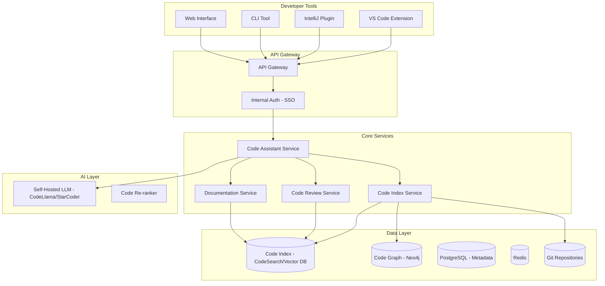

# System Design: Internal Developer Code Assistant (Developer Copilot)

## Problem Statement

Design an AI coding assistant for the bank's 2,000+ internal developers. The assistant should help with code generation, code review, documentation, debugging, and knowledge retrieval about the bank's internal codebase and APIs. It must not expose proprietary code to external AI providers.

## Requirements

### Functional Requirements
1. Code completion and generation in IDE (VS Code, IntelliJ)
2. Code explanation: "What does this function do?"
3. Code review suggestions: "Review this PR for issues"
4. Internal API documentation: "How do I call the payment service API?"
5. Debugging assistance: "Why is this test failing?"
6. Code migration: "Convert this from Java 8 to Java 17"
7. Test generation: "Write unit tests for this function"
8. Repository knowledge: "How does the loan approval flow work in our codebase?"
9. Security scanning: "Check this code for security vulnerabilities"

### Non-Functional Requirements
1. **No proprietary code sent to external APIs** (critical requirement)
2. Response latency: P95 < 3 seconds for code explanations, < 500ms for completions
3. Support 2,000 developers, 50,000 interactions/day
4. Integration with GitHub, Jira, Confluence, internal wikis
5. Code context window: at least 50K tokens (for large files)
6. Index the entire internal codebase (~50M lines of code)
7. Cost: < $75,000/month

## Architecture



## Detailed Design

### 1. Code Indexing Pipeline

```python
class CodeIndexer:
    """Index the entire codebase for semantic search."""
    
    def __init__(self, git_repos, vector_store, code_graph_db):
        self.repos = git_repos
        self.vector_store = vector_store
        self.graph = code_graph_db
    
    def index_all(self):
        """Full codebase indexing."""
        
        for repo in self.repos.list_repositories():
            for file_path in repo.list_files(extensions=[".py", ".java", ".ts", ".go"]):
                content = repo.get_file(file_path)
                
                # Parse code into functions/classes
                ast = self._parse_code(content, file_path.extension)
                
                # Index each function/class
                for node in ast.functions + ast.classes:
                    chunk = CodeChunk(
                        id=f"{repo.name}:{file_path}:{node.name}",
                        repository=repo.name,
                        file_path=str(file_path),
                        node_type=node.type,
                        name=node.name,
                        content=node.source_code,
                        signature=node.signature,
                        docstring=node.docstring,
                        metadata={
                            "language": file_path.extension,
                            "lines": node.line_count,
                            "last_modified": repo.get_last_modified(file_path),
                            "branch": repo.default_branch,
                        }
                    )
                    
                    # Embed code content
                    chunk.embedding = self._embed_code(chunk.content)
                    
                    # Store in vector DB
                    self.vector_store.add(chunk)
                    
                    # Add to code graph (call relationships)
                    self._add_to_graph(chunk, ast)
    
    def _embed_code(self, code: str) -> list[float]:
        """Embed code using code-specific embedding model."""
        # Use code-specific model like CodeBERT or Contriever
        return self.code_embedder.encode(code)
    
    def incremental_update(self):
        """Update index based on git commits."""
        
        for repo in self.repos.list_repositories():
            new_commits = repo.get_commits_since(self._last_indexed_commit(repo))
            
            for commit in new_commits:
                for file_change in commit.files:
                    if file_change.deleted:
                        self.vector_store.delete(filter={"file_path": str(file_change.path)})
                    else:
                        # Re-index changed file
                        self._index_file(repo, file_change.path)
```

### 2. Code Assistant Service

```python
class CodeAssistant:
    """Main code assistant service."""
    
    def __init__(self, llm, code_index, code_graph, cache):
        self.llm = llm  # Self-hosted CodeLlama or StarCoder
        self.index = code_index
        self.graph = code_graph
        self.cache = cache
    
    async def explain_code(self, code: str, context: str = None) -> str:
        """Explain what a piece of code does."""
        
        prompt = f"""Explain the following code clearly and concisely.
Focus on: what it does, key logic, and any potential issues.

{code}

Explanation:"""
        
        return await self.llm.generate(prompt, max_tokens=500)
    
    async def answer_question(self, question: str, user: Developer) -> str:
        """Answer a question about the internal codebase."""
        
        # Search code index for relevant code
        relevant_code = self.index.semantic_search(question, k=5)
        
        # Get context from code graph
        relationships = self.graph.get_related(relevant_code)
        
        # Build context
        context = self._build_context(relevant_code, relationships)
        
        prompt = f"""You are an expert developer familiar with this bank's codebase.
Answer the developer's question using the provided code context.

Code Context:
{context}

Question: {question}

Answer:"""
        
        return await self.llm.generate(prompt, max_tokens=800)
    
    async def review_code(self, code: str, language: str) -> CodeReview:
        """Review code for issues."""
        
        # Static analysis first
        static_issues = self._run_static_analysis(code, language)
        
        # LLM-based review
        prompt = f"""Review the following {language} code for:
1. Bugs and logic errors
2. Security vulnerabilities
3. Performance issues
4. Code style and best practices
5. Missing error handling

Code:
{code}

Provide specific findings with line numbers and suggested fixes."""
        
        llm_findings = await self.llm.generate(prompt, max_tokens=1000)
        
        return CodeReview(
            static_findings=static_issues,
            llm_findings=self._parse_findings(llm_findings),
            overall_rating=self._rate_code(code, static_issues, llm_findings)
        )
    
    async def generate_tests(self, code: str, language: str, 
                              framework: str) -> str:
        """Generate unit tests for code."""
        
        prompt = f"""Write comprehensive unit tests for the following {language} code.
Use {framework} testing framework. Include:
1. Happy path tests
2. Edge cases
3. Error handling tests
4. Mock external dependencies

Code:
{code}

Tests:"""
        
        return await self.llm.generate(prompt, max_tokens=1500)
```

### 3. Self-Hosted LLM Setup

```yaml
# Docker Compose for self-hosted code model
services:
  code-llm:
    image: vllm/vllm-openai
    deploy:
      resources:
        reservations:
          devices:
            - driver: nvidia
              count: 2
              capabilities: [gpu]
    environment:
      - MODEL=meta-llama/CodeLlama-34b-Instruct-hf
      - MAX_MODEL_LEN=8192
      - TENSOR_PARALLEL_SIZE=2
    ports:
      - "8000:8000"
    volumes:
      - /models:/models
    command: --model /models/CodeLlama-34b --tensor-parallel-size 2
```

## Tradeoffs

### Model Selection: Self-Hosted vs. Cloud

For a developer copilot in a bank:

| Criteria | Self-Hosted (CodeLlama) | Cloud (GitHub Copilot) |
|---|---|---|
| **Code privacy** | Full (no code leaves network) | Code sent to GitHub/Microsoft |
| **Code quality** | Good | Excellent (trained on more code) |
| **Internal codebase knowledge** | Yes (via RAG) | No (generic) |
| **Cost** | $10K/month (GPU) | $38/dev/month = $76K/month |
| **Customization** | Full control | None |
| **Decision** | **SELECTED** | Rejected (privacy + cost) |

## Security

1. **No external API calls with code**: All LLM inference is self-hosted
2. **Repository access control**: Developers only see code they have access to
3. **Audit logging**: All AI interactions logged
4. **Model isolation**: LLM runs in isolated container, no internet access

## Interview Questions

### Q: How do you ensure the code assistant doesn't suggest insecure code patterns?

**Strong Answer**: "Multiple safeguards: (1) The self-hosted model is fine-tuned on secure coding patterns and the bank's security guidelines. (2) Every code suggestion passes through static analysis (SAST) before being shown to the developer -- if the suggested code contains known vulnerability patterns (SQL injection, hardcoded secrets), it is flagged or suppressed. (3) The system prompt includes explicit security instructions. (4) Code review suggestions always include security considerations as a dedicated section. (5) For sensitive operations (authentication, encryption, payment processing), the assistant provides reference to the bank's approved security libraries rather than generating custom implementations."
