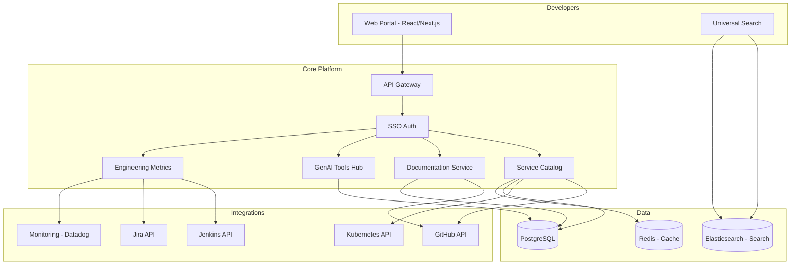

# System Design: Internal Developer Portal

## Problem Statement

Design an internal developer portal (IDP) that serves as the single pane of glass for the bank's engineering organization (2,000+ developers). The portal should provide service catalog, API documentation, infrastructure status, GenAI tool access, onboarding guides, and team management -- replacing the current fragmented landscape of Confluence pages, Slack channels, and tribal knowledge.

## Requirements

### Functional Requirements
1. Service catalog: all internal services with ownership, health, dependencies
2. API documentation with interactive testing
3. GenAI tools integration (code assistant, policy search, chatbot)
4. Infrastructure status dashboard
5. Developer onboarding checklist and guided setup
6. Team and project management
7. Incident history and post-mortems
8. Engineering metrics (deployment frequency, lead time, etc.)
9. Search across all documentation
10. Integration with GitHub, Jira, Jenkins, Kubernetes

### Non-Functional Requirements
1. 99.95% availability
2. Search latency: < 200ms
3. Support 2,000 developers, 10,000 page views/day
4. SSO authentication with bank's identity provider
5. Role-based access (developer, team lead, engineering manager)
6. Mobile-responsive

## Architecture



## Key Design Decisions

### Build vs. Buy (Backstage)

| Criteria | Build Custom | Backstage (Spotify) |
|---|---|---|
| **Time to value** | 6+ months | 2-3 months |
| **Customization** | Full control | Plugin-based |
| **Banking-specific features** | Built from day 1 | Requires plugins |
| **Maintenance burden** | High | Medium (Spotify community) |
| **Decision** | **Build custom** for banking-specific needs | Evaluated but rejected |

**Rationale**: Backstage is excellent for general-purpose developer portals, but the bank's specific needs (compliance tracking, GenAI tools integration, regulatory documentation) would require extensive customization. Building custom provides better long-term fit.

### GenAI Tools Hub

The portal serves as the unified entry point for all GenAI tools:

```python
class GenAIToolsHub:
    """Unified access to all GenAI tools from the developer portal."""
    
    def __init__(self, tool_registry, auth_service):
        self.tools = tool_registry
        self.auth = auth_service
    
    def get_available_tools(self, user: User) -> list[dict]:
        """Get GenAI tools available to this user."""
        
        all_tools = self.tools.list_tools()
        
        return [
            {
                "id": tool.id,
                "name": tool.name,
                "description": tool.description,
                "icon": tool.icon,
                "url": f"/genai/{tool.id}",
                "status": tool.status,  # active, maintenance
                "usage_stats": self._get_usage_stats(tool.id, user.team),
            }
            for tool in all_tools
            if self._user_has_access(user, tool)
        ]
    
    def _user_has_access(self, user: User, tool: Tool) -> bool:
        """Check if user can access a GenAI tool."""
        # Check team access, clearance level, and usage quota
        return (
            user.team in tool.allowed_teams and
            user.clearance_level >= tool.min_clearance and
            self._within_quota(user, tool)
        )
```

## Interview Questions

### Q: How do you keep the service catalog up-to-date without relying on manual updates?

**Strong Answer**: "Automated discovery plus lightweight manual override: (1) Integrate with Kubernetes -- services are automatically discovered when they're deployed with the correct labels (owner, team, description). (2) Integrate with GitHub -- service ownership is inferred from CODEOWNERS files. (3) Integrate with the CI/CD pipeline -- new services are registered when their first deployment succeeds. (4) For services not on Kubernetes (legacy systems), provide a simple registration API that teams can call. (5) Periodically scan for services in the catalog that haven't been deployed in 90 days and mark them as potentially stale, notifying the owner for confirmation. The goal is 95%+ automation with manual confirmation for edge cases."
