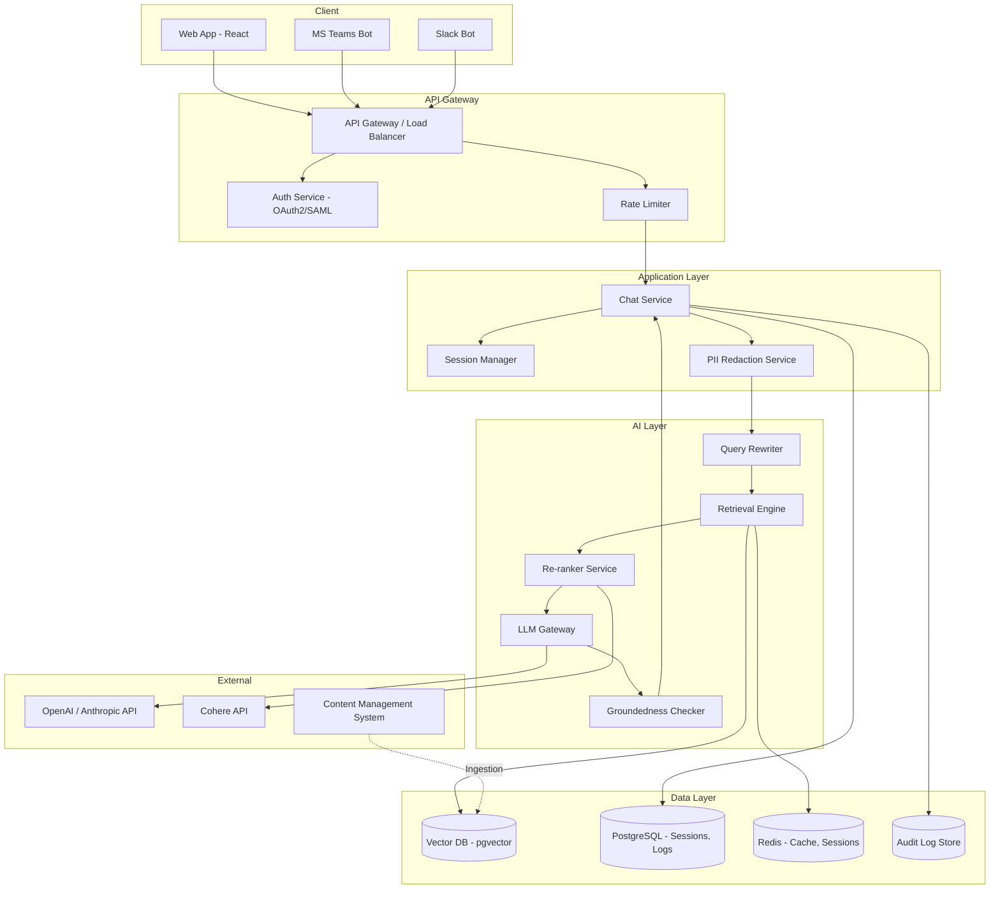

# System Design: Internal Enterprise Chatbot for Bank Employees

## Problem Statement

Design an internal chatbot that bank employees (50,000+ users across 200+ branches) can use to quickly find information about banking policies, procedures, products, and compliance requirements. The chatbot should reduce time spent searching through documents and calling other departments for information.

## Requirements

### Functional Requirements
1. Employees can ask questions in natural language about banking policies, procedures, products, and processes
2. Responses must cite source documents with version numbers
3. Support for follow-up questions in a conversation
4. Document search capability (find documents by topic, title, keyword)
5. Multi-language support (English, Spanish, French for global operations)
6. Ability to escalate to human expert when AI cannot answer
7. Feedback mechanism (thumbs up/down) for response quality
8. Integration with existing document management systems (SharePoint, policy DB)

### Non-Functional Requirements
1. Response latency: P95 < 3 seconds
2. Availability: 99.9% during business hours (7 AM - 8 PM, Mon-Sat)
3. Support 10,000 concurrent users, 500,000 queries/day
4. All queries and responses must be logged for audit
5. PII in queries must be redacted before processing
6. Access control: employees only see documents for their department/clearance level
7. SOC 2 Type II compliance
8. Cost: < $50,000/month at expected scale

## Architecture



## Detailed Component Design

### 1. Authentication and Authorization

```python
class AuthService:
    def authenticate(self, token: str) -> User:
        """Authenticate via OAuth2/SAML SSO (bank's identity provider)."""
        user = self.sso_provider.validate(token)
        return User(
            id=user.id,
            name=user.name,
            department=user.department,
            roles=user.roles,
            clearance_level=user.clearance_level,
            allowed_departments=user.allowed_departments,
        )
    
    def check_access(self, user: User, document: Document) -> bool:
        """Check if user can access this document."""
        if document.department not in user.allowed_departments:
            return False
        if document.min_clearance > user.clearance_level:
            return False
        return True
```

### 2. PII Redaction Service

```python
class PIIRedactor:
    def __init__(self):
        self.patterns = {
            "ssn": r"\b\d{3}-\d{2}-\d{4}\b",
            "account_number": r"\b\d{10,17}\b",
            "email": r"\b[A-Za-z0-9._%+-]+@[A-Za-z0-9.-]+\.[A-Z|a-z]{2,}\b",
            "phone": r"\b\d{3}[-.]?\d{3}[-.]?\d{4}\b",
            "credit_card": r"\b\d{4}[- ]?\d{4}[- ]?\d{4}[- ]?\d{4}\b",
        }
        self.ner_model = load_ner_model("deberta-v3-base-finetuned-pii")
    
    def redact(self, text: str) -> tuple[str, list[dict]]:
        """Redact PII from text, returning cleaned text and redaction log."""
        redacted = text
        redactions = []
        
        # Pattern-based redaction
        for pii_type, pattern in self.patterns.items():
            matches = list(re.finditer(pattern, redacted))
            for match in matches:
                redactions.append({
                    "type": pii_type,
                    "position": match.start(),
                    "original_length": len(match.group())
                })
            redacted = re.sub(pattern, f"[{pii_type.upper()}_REDACTED]", redacted)
        
        # NER-based redaction
        entities = self.ner_model.predict(text)
        for entity in entities:
            if entity.type in ("PERSON", "LOCATION", "ORG"):
                redacted = redacted.replace(entity.text, f"[{entity.type}_REDACTED]")
                redactions.append({"type": entity.type, "text": entity.text})
        
        return redacted, redactions
```

### 3. Query Processing Pipeline

```python
class QueryPipeline:
    def __init__(self, retriever, reranker, llm, cache, session_manager):
        self.retriever = retriever
        self.reranker = reranker
        self.llm = llm
        self.cache = cache
        self.session_manager = session_manager
    
    def process(self, query: str, user: User, session_id: str) -> Response:
        """Full query processing pipeline."""
        
        # Check cache for identical query
        cache_key = self._cache_key(query, user.department)
        cached = self.cache.get(cache_key)
        if cached:
            return cached
        
        # Get conversation context
        conversation_history = self.session_manager.get_history(session_id, k=3)
        
        # Retrieve documents (with access control)
        retrieved = self.retriever.retrieve(
            query=query,
            user=user,
            k=20,  # Initial retrieval
            conversation_context=conversation_history
        )
        
        # Re-rank
        doc_texts = [d.page_content for d in retrieved]
        reranked = self.reranker.rerank(query, doc_texts, top_k=4)
        
        # Assemble context
        context = self._assemble_context(reranked, retrieved)
        
        # Generate response
        response = self.llm.generate(
            system=self._build_system_prompt(user),
            context=context,
            query=query,
            conversation_history=conversation_history
        )
        
        # Groundedness check
        groundedness = self._check_groundedness(response, context)
        if groundedness.score < 0.7:
            response = self._handle_low_groundedness(response, query, user)
        
        # Build response
        result = Response(
            text=response.text,
            sources=self._format_sources(reranked, retrieved),
            confidence=groundedness.score,
            conversation_id=session_id
        )
        
        # Cache successful responses
        if groundedness.score > 0.8:
            self.cache.set(cache_key, result, ttl=3600)
        
        # Log for audit
        self._log_interaction(user, query, result, groundedness)
        
        return result
```

### 4. Vector Database Design

```sql
-- pgvector schema
CREATE TABLE document_chunks (
    id uuid PRIMARY KEY DEFAULT gen_random_uuid(),
    doc_id varchar(255) NOT NULL,
    doc_title varchar(500),
    content text NOT NULL,
    metadata jsonb NOT NULL DEFAULT '{}',
    embedding vector(1536),
    created_at timestamptz DEFAULT now()
);

-- HNSW index for vector similarity
CREATE INDEX ON document_chunks USING hnsw (embedding vector_cosine_ops)
    WITH (m = 16, ef_construction = 256);

-- Metadata indexes for filtering
CREATE INDEX idx_doc_id ON document_chunks(doc_id);
CREATE INDEX idx_metadata_dept ON document_chunks((metadata->>'department'));
CREATE INDEX idx_metadata_status ON document_chunks((metadata->>'status'));
CREATE INDEX idx_metadata_clearance ON document_chunks((metadata->>'min_clearance'));

-- GIN index for JSONB queries
CREATE INDEX idx_metadata_gin ON document_chunks USING gin(metadata);
```

### 5. Caching Strategy

```python
class CacheStrategy:
    """Multi-level caching for the chatbot."""
    
    def __init__(self, redis_client):
        self.redis = redis_client
        self.response_ttl = 3600       # 1 hour for responses
        self.retrieval_ttl = 7200      # 2 hours for retrieval results
        self.session_ttl = 1800        # 30 minutes for sessions
    
    def cache_response(self, query: str, department: str, response: Response):
        """Cache a successful response."""
        key = f"response:{hashlib.md5((query + department).encode()).hexdigest()}"
        self.redis.setex(key, self.response_ttl, json.dumps(response.to_dict()))
    
    def cache_retrieval(self, query: str, department: str, doc_ids: list):
        """Cache retrieval results."""
        key = f"retrieval:{hashlib.md5((query + department).encode()).hexdigest()}"
        self.redis.setex(key, self.retrieval_ttl, json.dumps(doc_ids))
    
    def get_cached_response(self, query: str, department: str) -> Response | None:
        key = f"response:{hashlib.md5((query + department).encode()).hexdigest()}"
        data = self.redis.get(key)
        return Response.from_dict(json.loads(data)) if data else None
```

## Tradeoffs and Alternatives

### Vector Database: pgvector vs. Pinecone vs. Milvus

| Criteria | pgvector | Pinecone | Milvus |
|---|---|---|---|
| **Infrastructure** | Uses existing PostgreSQL | New SaaS dependency | New infrastructure |
| **Access control** | SQL-level (mature) | API-level | API-level |
| **Audit** | PostgreSQL audit log | Limited | Limited |
| **Scale** | Up to 10M vectors | Billions | Billions |
| **Cost** | Low (existing infra) | Medium | Medium-High |
| **Decision** | **SELECTED** | Rejected | Rejected |

**Rationale**: The bank already runs PostgreSQL at scale. pgvector provides sufficient scale (5M expected chunks), mature access control via SQL, and integrates with existing audit/monitoring infrastructure.

### LLM: gpt-4o vs. gpt-4o-mini vs. Claude

| Criteria | gpt-4o | gpt-4o-mini | Claude Sonnet |
|---|---|---|---|
| **Quality** | Best | Very Good | Best |
| **Cost/query** | $0.015 | $0.003 | $0.012 |
| **Latency P95** | 2.5s | 1.2s | 2.0s |
| **Data privacy** | API (encrypted) | API (encrypted) | API (encrypted) |
| **Decision** | For complex queries | **Default** | Alternative |

**Rationale**: gpt-4o-mini provides the best cost/performance ratio for the majority of queries. gpt-4o is used as a fallback for complex, compliance-critical queries.

### Multi-Language Support

- **Option A**: Single multilingual model (Cohere embed-v3, BGE-M3)
- **Option B**: Translate queries to English, process, translate back
- **Decision**: Option A -- translates add latency and can introduce errors. Modern multilingual embedding models perform well enough for banking terminology.

## Bottlenecks and Scaling Strategy

### Identified Bottlenecks

| Component | Current Capacity | Bottleneck Point | Scaling Strategy |
|---|---|---|---|
| LLM API | 1000 RPM (rate limit) | 500 concurrent queries | Use multiple providers, queue requests |
| Vector DB (pgvector) | 5M vectors, 200 QPS | 500 QPS | Read replicas, partition by department |
| Redis Cache | 100K ops/sec | 200K ops/sec | Redis Cluster |
| Re-ranker (self-hosted) | 50 QPS per GPU | 200 QPS | Add GPU instances, load balance |

### Scaling Plan

```
Phase 1 (< 100K queries/day): Single instance of each service
Phase 2 (100K-500K/day): Read replicas for DB, multiple LLM API keys
Phase 3 (> 500K/day): Microservice decomposition, Kubernetes deployment
Phase 4 (> 1M/day): Multi-region deployment with regional vector DB shards
```

## Security Considerations

1. **Authentication**: OAuth2/SAML SSO via bank's identity provider
2. **Authorization**: RBAC with department and clearance-level filtering
3. **Data encryption**: TLS 1.3 in transit, AES-256 at rest
4. **PII handling**: Automatic redaction before any external API call
5. **Network isolation**: All AI services in private VPC subnets
6. **Audit logging**: Every query, response, and access decision logged
7. **Prompt injection defense**: Input sanitization, output validation
8. **Rate limiting**: Per-user and per-IP rate limits
9. **Secret management**: AWS Secrets Manager or HashiCorp Vault
10. **Regular security audits**: Quarterly penetration testing

## Reliability and Failure Modes

| Failure Mode | Impact | Mitigation |
|---|---|---|
| LLM API outage | Cannot generate responses | Fallback to cached responses, display "under maintenance" |
| Vector DB down | Cannot retrieve documents | Read replica, degraded mode with full-text search only |
| Redis down | Higher latency, more API calls | Direct DB queries, acceptable degradation |
| Re-ranker down | Lower retrieval quality | Skip re-ranking, use raw retrieval scores |
| Auth service down | No one can log in | Cache auth tokens, 5-minute grace period |

### Circuit Breaker Pattern

```python
class CircuitBreaker:
    def __init__(self, failure_threshold=5, recovery_timeout=60):
        self.failures = 0
        self.threshold = failure_threshold
        self.recovery_timeout = recovery_timeout
        self.state = "closed"  # closed, open, half-open
        self.last_failure_time = None
    
    def call(self, func, *args, **kwargs):
        if self.state == "open":
            if time.time() - self.last_failure_time > self.recovery_timeout:
                self.state = "half-open"
            else:
                raise CircuitOpenError("Circuit breaker is open")
        
        try:
            result = func(*args, **kwargs)
            if self.state == "half-open":
                self.state = "closed"
                self.failures = 0
            return result
        except Exception as e:
            self.failures += 1
            self.last_failure_time = time.time()
            if self.failures >= self.threshold:
                self.state = "open"
                alert(f"Circuit breaker opened for {func.__name__}")
            raise e
```

## Monitoring and Alerting

### Key Metrics

| Metric | Target | Alert Threshold |
|---|---|---|
| Response latency P95 | < 3000ms | > 5000ms |
| Query success rate | > 99% | < 95% |
| User satisfaction rate | > 80% | < 70% |
| Groundedness score | > 0.85 | < 0.70 |
| Cache hit rate | > 30% | < 15% |
| Hallucination rate | < 5% | > 10% |
| Daily cost | < $1,500 | > $2,500 |

### Dashboard Components

1. **Real-time query volume**: Queries/minute, active users
2. **Response quality**: Satisfaction rate, groundedness distribution
3. **Latency breakdown**: Per-component latency (retrieval, re-rank, generation)
4. **Cost tracking**: Daily/monthly cost, cost per query
5. **Error rates**: By component, by error type
6. **Top queries**: Most frequent queries, most failed queries
7. **Access patterns**: By department, by document type

## Interview Questions

### Q1: How would you handle a spike in query volume during a policy change announcement?

**Strong Answer**: "I would implement several strategies. First, increase caching aggressively -- cache responses for common queries about the new policy with a shorter TTL (5 minutes instead of 1 hour) since the content is time-sensitive. Second, implement request queuing with priority -- employees in customer-facing roles get higher priority. Third, consider scaling the LLM endpoint by using a faster model (gpt-4o-mini) for these queries. Fourth, proactively create a FAQ document for the policy change and serve it as a cached response to any related query, bypassing the full RAG pipeline for peak load."

### Q2: How do you ensure the chatbot doesn't leak confidential information between departments?

**Strong Answer**: "Defense in depth: First, the retrieval layer enforces access control at the database level -- metadata filters ensure only authorized documents are retrieved. Second, the response layer verifies that every cited source is accessible by the user before including it. Third, the PII redaction service scans all outputs. Fourth, all interactions are logged and periodically audited. Fifth, regular access control testing is included in the golden dataset evaluation. The key is that access control is applied at multiple layers, not just one."

### Q3: What would you do if users complain the chatbot gives outdated information?

**Strong Answer**: "First, I would investigate the document freshness -- check when the source documents were last updated and when they were last indexed. The most likely cause is a failed incremental indexing job. I would set up freshness monitoring that alerts when any document category hasn't been updated in the index within the expected SLA (e.g., 1 hour for critical policies). I would also add a 'document last updated' indicator to responses so users can see how current the information is. Finally, I would implement a webhook-based indexing system where document updates in the CMS immediately trigger re-indexing, rather than relying on scheduled polling."
